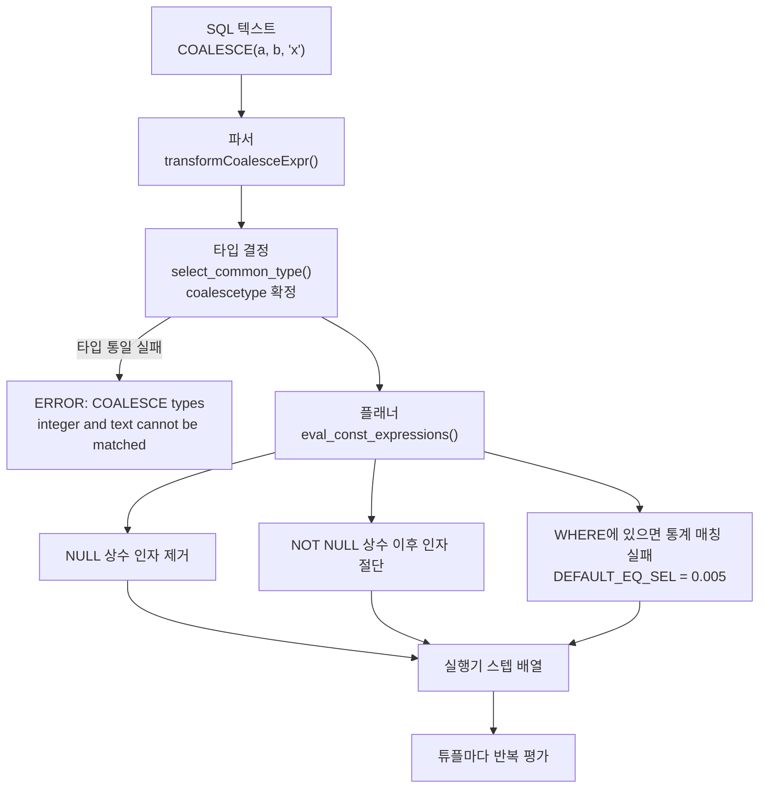
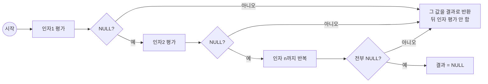

# COALESCE() — 이론

관련 문서: [실습](./COALESCE함수-실습.md)

> 전제: PostgreSQL 16, OLTP 조회 쿼리(수십만~수백만 행 테이블) 기준. 버전에 따라 달라지는 부분은 7장에 따로 적었다.
>
> 질문의 `COLEASE()`는 표준 SQL에도 PostgreSQL에도 없는 이름이다. `COALESCE()`의 오타로 보고 작성했다. (Oracle의 `NVL`, MySQL의 `IFNULL`, SQL Server의 `ISNULL`이 같은 자리를 차지하는 벤더 함수이며, 6장에서 비교한다.)

---

## 1. 한 줄 요약

`COALESCE(v1, v2, ..., vn)`은 인자를 왼쪽부터 평가해 **처음으로 NULL이 아닌 값**을 반환하고 필요 없는 뒤쪽 인자는 평가하지 않는 SQL 표준 조건 표현식(conditional expression)이며, 함수가 아니라 파서가 전용 노드(`CoalesceExpr`)로 변환하는 구문 구조다.

---

## 2. 왜 필요한가

### NULL은 값이 아니라 "알 수 없음"이다

SQL의 NULL은 3값 논리(three-valued logic)를 따른다. `NULL = NULL`은 참이 아니라 `UNKNOWN`이고, `NULL + 1`도 NULL이며, `'점수: ' || NULL`도 NULL이다. 즉 **NULL 하나가 표현식 전체를 오염시킨다**.

```sql
SELECT '안녕하세요 ' || nickname || '님' FROM lab_member WHERE id = 1;
-- nickname이 NULL이면 결과는 '안녕하세요 NULL님'이 아니라 통째로 NULL
```

이 오염을 끊으려면 "NULL이면 다른 값으로 갈아끼운다"는 분기가 필요하다. `CASE`로도 쓸 수 있다.

```sql
CASE WHEN nickname IS NOT NULL THEN nickname
     WHEN name     IS NOT NULL THEN name
     ELSE '익명' END
```

문제는 두 가지다.

1. **인자를 두 번 쓴다.** 위 `CASE`에서 `nickname`이 조건과 결과에 각각 등장한다. 인자가 서브쿼리나 무거운 함수 호출이면 소스에 두 번 적히고, 실수로 한쪽만 고치는 버그가 생긴다.
2. **길다.** 후보를 순서대로 시도하는 폴백 체인은 SQL에서 매우 흔한 패턴이다.

`COALESCE(nickname, name, '익명')`은 같은 의미를 한 줄로 쓴다.

### 다른 DB의 해법과 무엇이 다른가

| 관점 | PostgreSQL `COALESCE` | Oracle `NVL` |
|---|---|---|
| 인자 개수 | 가변(2개 이상) | 정확히 2개 |
| 평가 방식 | 단축 평가(short-circuit). 앞이 NOT NULL이면 뒤를 평가하지 않음 | 두 인자를 **모두** 평가 (일반 함수처럼 처리) |
| 빈 문자열 | `''`과 `NULL`은 **다른 값** | `''`이 곧 `NULL` |
| 타입 결정 | 인자들의 공통 타입으로 승격, 불가능하면 에러 | 첫 인자 타입 기준으로 두 번째를 암묵 변환 |

세 번째 줄이 Oracle → PostgreSQL 마이그레이션에서 가장 많이 터지는 지점이다. Oracle에서 `NVL(col, '없음')`은 `col`이 빈 문자열이어도 `'없음'`을 주지만, PostgreSQL에서 `COALESCE(col, '없음')`은 빈 문자열 `''`을 그대로 반환한다. 8장 함정 6에서 다시 다룬다.

### "그냥 NOT NULL DEFAULT를 걸면 되지 않나"

맞다. 그리고 그게 대체로 더 나은 해법이다. `COALESCE`는 **이미 NULL이 들어 있는 데이터를 읽는 쪽에서 수습하는 도구**이고, 읽을 때마다 비용과 플래너 손해(8장)를 낸다. 스키마를 고칠 수 있다면 `SET DEFAULT` → `UPDATE` → `SET NOT NULL`이 정답에 가깝다. 판단 기준은 6.3절 표에 정리했다.

---

## 3. 핵심 개념

| 개념 | 영문 | 정의 |
|---|---|---|
| 조건 표현식 | Conditional Expression | `CASE`, `COALESCE`, `NULLIF`, `GREATEST`/`LEAST`처럼 함수 호출이 아니라 파서가 전용 노드로 바꾸는 SQL 구문. 공식 문서 9.18절 |
| 단축 평가 | Short-circuit Evaluation | 결과가 확정되면 남은 인자를 평가하지 않는 것. `COALESCE`는 첫 NOT NULL 인자에서 멈춘다 |
| strict 함수 | Strict Function | 인자 중 하나라도 NULL이면 호출 없이 NULL을 반환하도록 선언된 함수(`pg_proc.proisstrict = true`). **`COALESCE`는 이 성질이 없다** — 8장 함정 3의 원인 |
| 공통 타입 결정 | Common Type Resolution | 여러 인자의 타입을 하나로 모으는 규칙. `UNION`/`CASE`/`COALESCE`가 같은 규칙을 공유한다 |
| 사양성 조건 | Sargable Predicate | 인덱스 탐색 조건(`Index Cond`)으로 내려갈 수 있는 술어. 컬럼이 표현식으로 감싸이면 사양성을 잃는다 |
| 선택도 | Selectivity | 술어가 통과시킬 행의 비율에 대한 플래너의 추정치. 통계가 없으면 상수 기본값으로 떨어진다 |
| 표현식 인덱스 | Expression Index | 컬럼이 아니라 표현식의 결과에 만드는 인덱스. `CREATE INDEX ... ON t ((COALESCE(a,b)))` |

---

## 4. 동작 원리와 흐름

### 4.1 한 건의 쿼리가 거치는 계층

```sql
SELECT id, COALESCE(nickname, name, '익명') AS display_name
FROM   lab_member
WHERE  id = 42;
```

1. **파서(Parser)** — `COALESCE`를 함수 목록에서 찾지 않는다. 문법 정의(`gram.y`)에서 키워드로 인식해 `transformCoalesceExpr()`이 `CoalesceExpr` 노드를 만든다. 인자 리스트는 그대로 보존된다.
2. **타입 결정** — `select_common_type()`이 세 인자(`varchar`, `varchar`, `unknown` 리터럴)의 공통 타입을 하나 고르고 필요한 캐스트를 삽입한다. 결과 타입은 노드의 `coalescetype` 필드에 박힌다. 여기서 타입을 못 고르면 실행 전에 에러다.
3. **재작성기(Rewriter)** — 뷰/룰 치환만 한다. `COALESCE` 자체는 건드리지 않는다.
4. **플래너(Planner)** — `eval_const_expressions()`가 상수 접힘(constant folding)을 시도한다. NULL 상수 인자는 제거하고, NOT NULL 상수를 만나면 거기서 리스트를 자른다. `WHERE` 절에 `COALESCE`가 있다면 이 단계에서 **선택도 추정 실패**가 일어난다(8장 함정 1).
5. **실행기(Executor)** — 표현식 트리를 스텝 배열로 펼쳐(`ExecInitExprRec()`) 인자마다 "평가 → NOT NULL이면 끝으로 점프"를 반복한다. 튜플 한 건마다 이 스텝이 돈다.
6. **버퍼 캐시 / 스토리지** — `COALESCE`는 힙 페이지를 추가로 읽지 않는다. 인자가 이미 읽은 튜플의 컬럼이면 디스크 I/O가 없다. **단, 인자가 스칼라 서브쿼리면 그 서브플랜이 여기서 실행되며 버퍼를 읽는다**(8장 함정 5).



### 4.2 튜플 한 건에 대한 평가 순서



핵심은 **"인자 전부가 NULL일 때만 결과가 NULL"**이라는 점이다. 그래서 `COALESCE(col, 0)`은 결코 NULL을 반환하지 않고, 이 사실이 플래너가 외부 조인을 축소하지 못하는 이유가 된다(8장 함정 3).

### 4.3 실행기 스텝 배열의 모양

PostgreSQL 10부터 표현식은 트리를 재귀 호출하지 않고 **선형 스텝 배열**로 평가된다. `COALESCE(a, b, 'x')`는 대략 아래처럼 펼쳐진다.

```
step 0 : EEOP_SCAN_FETCHSOME           -- 필요한 컬럼 deform
step 1 : EEOP_SCAN_VAR    a       -> resvalue / resnull
step 2 : EEOP_JUMP_IF_NOT_NULL -> step 7
step 3 : EEOP_SCAN_VAR    b       -> resvalue / resnull
step 4 : EEOP_JUMP_IF_NOT_NULL -> step 7
step 5 : EEOP_CONST      'x'      -> resvalue / resnull
step 6 : EEOP_JUMP_IF_NOT_NULL -> step 7
step 7 : EEOP_DONE
```

- 인자가 늘수록 스텝이 선형으로 늘어난다. `COALESCE`의 CPU 비용은 **인자 개수가 아니라 "몇 번째에서 멈추느냐"**에 비례한다. 앞쪽 인자가 대부분 NOT NULL이면 사실상 컬럼 참조 한 번 값이다.
- 스텝 opcode 이름은 버전에 따라 달라질 수 있다. `확인 필요` — PostgreSQL 16 기준 `src/backend/executor/execExpr.c`의 `T_CoalesceExpr` 분기를 직접 볼 것.

---

## 5. 내부 구현

### 5.1 노드 정의

`CoalesceExpr`는 `src/include/nodes/primnodes.h`에 정의돼 있다.

| 필드 | 의미 |
|---|---|
| `coalescetype` | 결과 타입 OID. `select_common_type()`이 결정 |
| `coalescecollid` | 결과 콜레이션 OID. 문자열 비교·정렬에 영향 |
| `args` | 인자 표현식 리스트(`List *`) |
| `location` | 에러 메시지에 찍을 원문 위치 |

`pg_proc`에 `coalesce`라는 엔트리는 **없다**. psql에서 `\df coalesce`를 쳐도 아무것도 안 나오는 이유다. 따라서 `COALESCE`는 오버로딩할 수도, `CREATE FUNCTION`으로 재정의할 수도 없다.

```sql
SELECT proname FROM pg_proc WHERE proname = 'coalesce';   -- 0 rows
```

### 5.2 파싱과 타입 결정

- `src/backend/parser/parse_expr.c` → `transformCoalesceExpr()`
- `src/backend/parser/parse_coerce.c` → `select_common_type()`, `coerce_to_common_type()`

`select_common_type()`의 규칙은 `UNION`/`CASE`와 공유된다(공식 문서 10.5절 "UNION, CASE, and Related Constructs").

1. `unknown` 타입 인자(따옴표 리터럴)는 후보에서 제외하고 나머지로 결정한다.
2. 전부 `unknown`이면 `text`로 결정한다.
3. 남은 후보 중 선호 타입(preferred type)과 암묵 캐스트 가능성으로 하나를 고른다.
4. 못 고르면 `ERROR: COALESCE types X and Y cannot be matched`.

```sql
SELECT pg_typeof(COALESCE(1::int, 2::bigint));      -- bigint  (int → bigint 암묵 캐스트)
SELECT pg_typeof(COALESCE(1::int, 2.5::numeric));   -- numeric
SELECT pg_typeof(COALESCE(NULL, NULL));             -- text    (전부 unknown)
SELECT COALESCE(1::int, 'N/A');                     -- ERROR: invalid input syntax for type integer
```

마지막 줄이 중요하다. `'N/A'`는 `unknown`이라 타입 결정에서 빠지고, 결과 타입이 `integer`로 정해진 뒤 `'N/A'`를 integer로 캐스트하려다 **실행 시점이 아니라 파싱/플래닝 시점에** 터진다. 즉 조건에 걸려 한 행도 안 나오는 쿼리여도 에러가 난다.

### 5.3 플래너의 상수 접힘

`src/backend/optimizer/util/clauses.c` → `eval_const_expressions_mutator()`의 `T_CoalesceExpr` 분기가 다음을 한다.

- 인자를 앞에서부터 순회하며 **NULL 상수는 리스트에서 버린다.**
- **NOT NULL 상수를 만나면** 그 인자를 마지막으로 삼고 뒤를 전부 버린다.
- 남은 인자가 1개면 `CoalesceExpr`를 벗겨 그 인자 자체로 치환한다.
- 남은 인자가 0개면 결과 타입의 NULL 상수로 치환한다.

```sql
EXPLAIN VERBOSE SELECT COALESCE(NULL, 7, id) FROM lab_member;
--   Output: 7        ← CoalesceExpr 노드가 통째로 사라진다
```

이 최적화 때문에 **같은 SQL 문자열이 상황에 따라 다른 계획을 낳는다.** `COALESCE(:param, col)` 형태에서 `:param`이 리터럴로 치환돼 들어오면 접혀서 사라지지만, 바인드 파라미터(`$1`)로 들어오면 상수가 아니므로 접히지 않는다. psql에서 손으로 테스트할 때는 빠르고 애플리케이션에서는 느린 전형적 원인이다(8장 함정 2).

### 5.4 선택도 추정 경로

`WHERE COALESCE(a, b) = '값'`의 선택도는 이렇게 계산된다.

1. `clause_selectivity()` → 연산자 술어이므로 `eqsel()` 호출.
2. `eqsel()`은 좌변에서 통계를 찾을 "변수"를 뽑으려 `examine_variable()`을 호출한다.
3. 좌변이 `Var`가 아니라 `CoalesceExpr`다. **컬럼 통계(`pg_statistic`)는 컬럼 단위로만 존재**하므로 매칭 실패.
4. 단, 그 표현식과 **정확히 같은 표현식에 대한 인덱스나 확장 통계가 있으면** 거기 붙은 통계를 쓴다(`examine_variable()`이 인덱스 표현식 목록과 확장 통계를 뒤진다).
5. 아무것도 없으면 `src/include/utils/selfuncs.h`의 `DEFAULT_EQ_SEL`(= 0.005, 0.5%)로 떨어진다.

100만 행 테이블이면 실제 분포와 무관하게 **추정 5,000행**이 찍힌다. 이 숫자가 조인 순서와 Nested Loop/Hash Join 선택을 좌우하므로, 단일 테이블 조회보다 **조인이 끼었을 때 훨씬 큰 사고**가 된다.

주요 기본 선택도 상수:

| 상수 | 값 | 쓰이는 곳 |
|---|---|---|
| `DEFAULT_EQ_SEL` | 0.005 | 통계 없는 `=` |
| `DEFAULT_INEQ_SEL` | 0.3333333333333333 | 통계 없는 `<`, `>` |
| `DEFAULT_RANGE_INEQ_SEL` | 0.005 | 통계 없는 범위 조건 |

### 5.5 strict가 아니라는 사실의 파급

플래너는 "이 절이 참이면 이 컬럼은 NULL이 아니다"를 판정하려고 `find_nonnullable_vars()` / `find_nonnullable_rels()`(`clauses.c`)를 쓴다. 이 판정이 `LEFT JOIN` → `INNER JOIN` 축소(outer join reduction)의 근거다.

`CoalesceExpr`는 **모든 인자가 NULL일 때만 NULL**이므로, 단일 컬럼에 대해 "NOT NULL을 강제한다"고 결론 낼 수 없다. 결과:

- `WHERE b.col = 0` → `=`가 strict라 NULL 확장 행이 탈락 → **외부 조인이 내부 조인으로 축소된다.**
- `WHERE COALESCE(b.col, 0) = 0` → NULL 확장 행도 `0 = 0`으로 통과 → **축소되지 않는다.**

`확인 필요` — `find_nonnullable_vars()`가 `T_CoalesceExpr`를 어떤 규칙으로 처리하는지는 버전별 코드 확인 권장. 다만 **관측되는 동작**(조인 노드에 `Left`가 남는 것)은 실습 4-5에서 `EXPLAIN` 노드명으로 직접 확인할 수 있다.

---

## 6. 유사 개념과의 비교

### 6.1 NULL 대체 표현식

| 구문 | 표준 여부 | 인자 | 평가 | 언제 쓰나 / 비고 |
|---|---|---|---|---|
| `COALESCE(a, b, ...)` | SQL 표준 | 가변 | 단축 평가 | **기본 선택.** 후보가 2개 이상일 때 유일하게 깔끔한 답 |
| `CASE WHEN a IS NOT NULL THEN a ELSE b END` | SQL 표준 | — | 단축 평가 | NULL 외의 조건(`= 0`, `= ''`)까지 함께 볼 때 |
| `NULLIF(a, b)` | SQL 표준 | 2 | — | `COALESCE`의 반대. `a = b`면 NULL. `COALESCE(NULLIF(s,''), '없음')`이 "빈 문자열도 없음 처리" 관용구 |
| `NVL(a, b)` | Oracle | 2 | 둘 다 평가 | PostgreSQL에 **없다**. `orafce` 확장 설치 시 사용 가능 |
| `NVL2(a, b, c)` | Oracle | 3 | — | PostgreSQL에서는 `CASE WHEN a IS NOT NULL THEN b ELSE c END` |
| `IFNULL(a, b)` | MySQL | 2 | — | PostgreSQL에 없다 |
| `ISNULL(a, b)` | SQL Server | 2 | — | PostgreSQL에 없다 |
| `GREATEST` / `LEAST` | 표준 아님 | 가변 | 전부 평가 | **PostgreSQL은 NULL 인자를 무시**하고 전부 NULL일 때만 NULL. Oracle은 하나라도 NULL이면 NULL — 마이그레이션 함정 |
| `a IS NOT DISTINCT FROM b` | SQL 표준 | 2 | — | "NULL도 같은 값으로 취급하는 `=`". **인덱스 탐색 조건으로 내려가지 않는다** |

### 6.2 집계에서 위치에 따른 차이

| 표현 | 의미 | 판정 |
|---|---|---|
| `SUM(COALESCE(amount, 0))` | NULL을 0으로 바꾼 뒤 합산 | `SUM`은 어차피 NULL을 무시한다. **의미 없는 중복**이고 표현식 평가 비용만 추가 |
| `COALESCE(SUM(amount), 0)` | 합산 결과가 NULL이면 0 | **이쪽이 필요한 형태.** 대상 행이 0건이면 `SUM`이 NULL을 반환하기 때문 |
| `COUNT(amount)` | NULL 아닌 값의 개수 | `COUNT`는 NULL을 반환하지 않는다. `COALESCE` 불필요 |

단, `COALESCE(SUM(...), 0)`도 **`GROUP BY`가 붙으면 무력하다.** 행이 0건인 그룹은 애초에 만들어지지 않아 결과 행 자체가 없다. "모든 등급에 0이라도 찍히게" 하려면 기준 목록과 `LEFT JOIN`해야 하고, 그때 비로소 `COALESCE`가 일한다(실습 4-4).

### 6.3 COALESCE로 덮을 것인가, 스키마를 고칠 것인가

| 상황 | 선택 |
|---|---|
| "값이 없음"이 의미론적으로 필요함 (미입력 vs 0은 다른 뜻) | NULL 유지 + 읽는 쪽 `COALESCE` |
| NULL이 그냥 방치된 결과이고 기본값이 명확함 | `SET DEFAULT` + `UPDATE` + `SET NOT NULL`. 읽기 쿼리에서 `COALESCE` 제거 |
| 조회 조건·정렬 키로 자주 쓰임 | 표현식 인덱스, 또는 생성 컬럼(PG12+) + 일반 인덱스 |
| 폴백 체인 자체가 비즈니스 규칙임 (별명→이름→'익명') | `GENERATED ALWAYS AS (COALESCE(...)) STORED` 생성 컬럼. 규칙이 한 곳에서만 정의된다 |

---

## 7. 버전별 차이

`COALESCE` 자체의 의미론은 오래 바뀌지 않았다. 실무에 영향을 주는 변화는 **주변 최적화 기능** 쪽이다.

| 버전 | 변화 | 실무 영향 |
|---|---|---|
| 12 | 생성 컬럼(`GENERATED ALWAYS AS ... STORED`) 도입 | `COALESCE` 결과를 컬럼으로 물질화해 일반 인덱스를 걸 수 있게 됨 |
| 13 | B-tree 중복 항목 압축(deduplication) 기본 활성 | `COALESCE(col, '고정값')`처럼 **중복 키가 많은** 표현식 인덱스의 크기가 줄어듦 |
| 14 | **표현식 확장 통계** 지원: `CREATE STATISTICS s ON (COALESCE(a,b)) FROM t` | 인덱스를 만들지 않고도 선택도 추정을 고칠 수 있게 됨. 8장 함정 1의 해법이 두 갈래로 나뉜 분기점 |
| 14 | `pg_stats_ext_exprs` 뷰 추가 | 표현식 통계 내용을 눈으로 확인 가능 |
| 15 | `MERGE` 도입 | `INSERT ... ON CONFLICT DO UPDATE SET c = COALESCE(EXCLUDED.c, t.c)` 관용구의 대안이 생김 |
| 16 | 외부 조인 플래너 구조 개편 | `LEFT JOIN` + `COALESCE` 조합의 계획 표기가 달라 보일 수 있음. 의미는 동일 |
| 17 | `확인 필요` — `COALESCE`에 직접 연관된 변경은 확인하지 못했다 | — |

`COALESCE`와 직접 얽히는 GUC는 없다. 다만 표현식 평가가 문제되는 대량 스캔에서는 다음이 영향을 준다.

- `jit = on` (기본값 `on`, PG11+ / 세션·DB·서버 단위 변경 가능, 재시작 불필요) — 표현식을 기계어로 컴파일. 짧은 쿼리에서는 컴파일 비용이 더 크다.
- `jit_above_cost = 100000` (기본값, 단위: 플래너 비용, 세션 단위) — 계획 비용이 이 값을 넘을 때만 JIT.
- `work_mem = 4MB` (기본값, 세션 단위) — `ORDER BY COALESCE(...)`가 만드는 정렬이 디스크로 넘어가는 경계.

측정할 때는 `SET jit = off; SET max_parallel_workers_per_gather = 0;`으로 변수를 줄이는 편이 계획 비교에 유리하다.

---

## 8. 함정과 안티패턴

### 함정 1 — `WHERE COALESCE(col, x) = y` 가 인덱스도 통계도 못 쓴다

**증상**
`nickname`에 인덱스가 있는데도 `WHERE COALESCE(nickname, name) = '길동'`이 Seq Scan으로 돈다. 추가로 `EXPLAIN ANALYZE`의 추정 행수가 실제와 수백 배 차이 난다.

**원인**
두 가지가 동시에 일어난다.
1. 컬럼이 표현식으로 감싸여 사양성(sargable)을 잃는다 → `Index Cond`로 못 내려가고 `Filter`가 된다.
2. 그 표현식에 대응하는 통계가 없다 → `DEFAULT_EQ_SEL = 0.005`로 추정(5.4절).

**진단**

```sql
EXPLAIN (ANALYZE, BUFFERS)
SELECT * FROM lab_member WHERE COALESCE(nickname, name) = '길동';
-- 볼 것: Seq Scan 여부, "Filter: (COALESCE(...) = ...)",
--        rows=(추정) vs actual rows, Rows Removed by Filter
```

```sql
-- 표현식 통계가 존재하는지 (PG14+)
SELECT statistics_name, expr, n_distinct
FROM   pg_stats_ext_exprs
WHERE  tablename = 'lab_member';

-- 표현식 인덱스가 있는지
SELECT indexname, indexdef FROM pg_indexes
WHERE  tablename = 'lab_member' AND indexdef LIKE '%COALESCE%';
```

**해결** (위에서부터 우선순위)

```sql
-- (a) 조건을 컬럼 쪽으로 되돌린다 — 가능하면 이게 최선
SELECT * FROM lab_member
WHERE  nickname = '길동'
   OR (nickname IS NULL AND name = '길동');
--     → BitmapOr로 두 인덱스를 각각 탐색할 수 있다

-- (b) 표현식 인덱스 — 조회식이 정확히 이 형태로 고정돼 있을 때
CREATE INDEX lab_member_display_idx ON lab_member ((COALESCE(nickname, name)));
ANALYZE lab_member;   -- 인덱스 생성만으로는 통계가 안 붙는다. 반드시 ANALYZE

-- (c) 인덱스는 필요 없고 추정만 고치고 싶을 때 (PG14+)
CREATE STATISTICS lab_member_display_stat ON (COALESCE(nickname, name)) FROM lab_member;
ANALYZE lab_member;
```

(a)가 가능하면 (a)를 쓴다. 표현식 인덱스는 쓰기마다 갱신 비용이 붙고, 조회식이 **글자 하나라도 다르면**(인자 순서를 `COALESCE(name, nickname)`으로 바꾸는 등) 쓰이지 않는다.

---

### 함정 2 — `WHERE col = COALESCE(:param, col)` (선택적 파라미터 관용구)

**증상**
"파라미터가 null이면 전체 조회"를 한 줄로 처리하려고 쓴 조건이, 파라미터를 줘도 Seq Scan이 된다. psql에서 리터럴로 테스트하면 인덱스를 잘 타서 재현되지 않는다.

**원인**
- 우변 `COALESCE(:param, col)`이 **컬럼을 포함**하므로 상수가 아니다. 플래너 입장에서는 "컬럼 = 컬럼이 낀 표현식"이라 인덱스 탐색 키를 만들 수 없다.
- psql에 리터럴로 치면 5.3절의 상수 접힘이 `COALESCE('VIP', grade)` → `'VIP'`로 접어버려 **완전히 다른 계획**이 나온다. 그래서 재현이 안 된다.
- `:param`이 NULL일 때는 `col = col`이 되는데, 이건 `col`이 NULL인 행을 **탈락시킨다**(3값 논리). "전체 조회"라는 의도와 결과가 다르다. 성능만이 아니라 **정확성 버그**다.

**진단**

```sql
-- 바인드 파라미터 상태를 그대로 재현해서 비교한다 (psql)
PREPARE p1(text) AS SELECT * FROM lab_member WHERE grade = COALESCE($1, grade);
EXPLAIN (ANALYZE, BUFFERS) EXECUTE p1('VIP');
DEALLOCATE p1;
```

```sql
-- 이 관용구가 프로덕션에 얼마나 퍼져 있는지
SELECT calls, mean_exec_time, rows, left(query, 120) AS q
FROM   pg_stat_statements
WHERE  query ILIKE '%COALESCE(%'
ORDER  BY total_exec_time DESC
LIMIT  20;
```

**해결**
동적 SQL로 조건 자체를 빼는 것이 정답이다. MyBatis `<if>`, JPA Specification, QueryDSL `BooleanBuilder`가 모두 이 용도다(실습 10장에 코드).

```xml
<where>
  <if test="grade != null"> AND grade = #{grade} </if>
</where>
```

---

### 함정 3 — `LEFT JOIN` 결과를 `WHERE COALESCE(...)`로 거르면 외부 조인이 남는다

**증상**
`LEFT JOIN` 뒤 `WHERE COALESCE(o.status, 'NONE') <> 'CANCELED'`를 걸었는데 주문이 없는 회원까지 결과에 남아 "왜 필터가 안 먹지"가 된다. 반대로 `WHERE o.status <> 'CANCELED'`로 쓰면 주문 없는 회원이 통째로 사라진다.

**원인**
`COALESCE`는 인자 전부가 NULL일 때만 NULL이다. NULL 확장된 행에서도 `COALESCE(o.status, 'NONE')`은 `'NONE'`이라는 **참/거짓이 확정되는 값**을 내놓는다. 따라서 플래너는 이 절로 "`o.status`는 NULL이 아니다"를 유도할 수 없고, 외부 조인을 내부 조인으로 축소하지 않는다(5.5절).

버그가 아니라 정의된 동작이다. 함정인 이유는 두 표현이 비슷해 보이는데 결과 집합이 다르기 때문이다.

**진단**

```sql
EXPLAIN (ANALYZE, BUFFERS)
SELECT m.id FROM lab_member m
LEFT JOIN lab_order o ON o.member_id = m.id
WHERE COALESCE(o.status, 'NONE') <> 'CANCELED';
-- 볼 것: 조인 노드명이 "Hash Left Join"인가 "Hash Join"인가
--        Left가 남아 있으면 외부 조인이 유지된 것
```

**해결**
의도를 먼저 정한다.

```sql
-- 의도 A: 주문 없는 회원도 포함 → COALESCE가 맞다. 그대로 둔다.
-- 의도 B: 주문이 있고 취소가 아닌 것만 → 조건을 ON으로 올리거나 INNER JOIN
SELECT m.id FROM lab_member m
JOIN lab_order o ON o.member_id = m.id AND o.status <> 'CANCELED';
```

외부 조인 축소 규칙 자체는 [LEFT JOIN 이론](../LEFT조인/LEFT조인-이론.md) 참고.

---

### 함정 4 — `ORDER BY COALESCE(a, b)` 가 정렬 인덱스를 무력화한다

**증상**
`last_login_at` 인덱스가 있는데 `ORDER BY COALESCE(last_login_at, created_at) DESC LIMIT 20`이 전체 행을 읽고 `Sort`를 돈다. 페이징 첫 페이지가 수 초 걸린다.

**원인**
B-tree 인덱스는 **저장된 키 순서**로만 정렬을 제공한다. 정렬 키가 표현식이면 인덱스 순서와 무관하므로 전체 정렬이 필요하다. `LIMIT`이 있어도 top-N heapsort일 뿐 **입력 행 수는 줄지 않는다.**

**진단**

```sql
EXPLAIN (ANALYZE, BUFFERS)
SELECT id FROM lab_member
ORDER BY COALESCE(last_login_at, created_at) DESC LIMIT 20;
-- 볼 것: Sort Method (top-N heapsort / external merge Disk),
--        Sort 노드의 actual rows, Buffers: shared read
SHOW work_mem;   -- 기본 4MB. 초과하면 디스크 정렬로 떨어진다
```

**해결**

```sql
-- 표현식 인덱스의 정렬 순서를 쿼리와 정확히 일치시킨다
CREATE INDEX lab_member_lastseen_idx
    ON lab_member ((COALESCE(last_login_at, created_at)) DESC);
ANALYZE lab_member;
-- → Sort 노드가 사라지고 Index Scan이 LIMIT 20에서 멈춘다
```

`DESC` / `NULLS FIRST|LAST`까지 쿼리와 맞춰야 한다. 어긋나면 인덱스를 못 쓰거나 역방향 스캔 비용이 붙는다.

---

### 함정 5 — 인자에 스칼라 서브쿼리를 넣어 행마다 실행시킨다

**증상**
`SELECT COALESCE(m.nickname, (SELECT ... WHERE ...)) FROM lab_member m` 형태가 행 수에 비례해 느려진다. 계획에 `SubPlan`과 `loops=N`이 찍힌다.

**원인**
`COALESCE`는 단축 평가를 하지만, **첫 인자가 NULL인 행에서는 서브쿼리가 반드시 실행된다.** NULL 비율이 10%면 10만 번 실행된다. 플래너는 이 `SubPlan`을 조인으로 끌어올리지(pull-up) 못한다.

**진단**

```sql
EXPLAIN (ANALYZE, BUFFERS)
SELECT COALESCE(m.nickname, (SELECT p.alias FROM lab_profile p WHERE p.member_id = m.id))
FROM lab_member m;
-- 볼 것: SubPlan 블록의 "loops=" 값, 그 아래 노드의 actual time × loops
```

**해결**
`LEFT JOIN`으로 펴고 `COALESCE`는 컬럼끼리만 쓴다.

```sql
SELECT COALESCE(m.nickname, p.alias)
FROM   lab_member m
LEFT JOIN lab_profile p ON p.member_id = m.id;
-- → SubPlan이 사라지고 Hash Left Join 한 번으로 끝난다
```

**주의**: 집계 함수는 단축 평가의 예외다. `COALESCE(a, MAX(b))`에서 `a`가 NOT NULL이어도 `MAX(b)`는 집계 단계에서 이미 계산된다(공식 문서 9.18절 `CASE` 항목의 주석과 같은 이유).

---

### 함정 6 — 빈 문자열과 NULL을 같은 것으로 착각한다 (Oracle 이관)

**증상**
Oracle에서 넘어온 `COALESCE(memo, '없음')`이 화면에 빈칸을 그대로 출력한다. `WHERE memo IS NULL`로 세면 0건인데 화면에는 빈 값이 가득하다.

**원인**
Oracle은 빈 문자열을 NULL로 저장하지만 PostgreSQL은 `''`과 `NULL`을 구분한다. 이관 과정에서 `''`이 그대로 들어왔다면 `COALESCE`가 잡지 못한다.

**진단**

```sql
SELECT count(*) FILTER (WHERE memo IS NULL) AS null_cnt,
       count(*) FILTER (WHERE memo = '')    AS empty_cnt,
       count(*)                             AS total
FROM   lab_member;
```

**해결**

```sql
-- 읽는 쪽 임시 대응
SELECT COALESCE(NULLIF(memo, ''), '없음') FROM lab_member;

-- 근본 대응: 데이터 정리 + 제약
UPDATE lab_member SET memo = NULL WHERE memo = '';
-- 주의: ADD CONSTRAINT는 ACCESS EXCLUSIVE 락 + 전체 검증 스캔.
--       운영에서는 NOT VALID로 추가한 뒤 VALIDATE CONSTRAINT로 분리한다
ALTER TABLE lab_member ADD CONSTRAINT lab_member_memo_not_empty
      CHECK (memo <> '') NOT VALID;
ALTER TABLE lab_member VALIDATE CONSTRAINT lab_member_memo_not_empty;
```

---

### 함정 7 — NOT NULL 컬럼에 습관적으로 `COALESCE`를 씌운다

**증상**
`WHERE COALESCE(status, 'X') = 'A'`처럼 `status`가 이미 `NOT NULL`인데 감싸 놓은 코드. 인덱스가 안 잡히고 추정도 망가진다.

**원인**
플래너는 컬럼의 `NOT NULL` 제약을 알고 있지만, **그 이유로 `CoalesceExpr`를 벗겨내지는 않는다.** 공짜로 정리해 주지 않는다.

**진단**

```sql
SELECT a.attname, a.attnotnull
FROM   pg_attribute a
WHERE  a.attrelid = 'lab_member'::regclass
  AND  a.attnum > 0 AND NOT a.attisdropped;
```

`attnotnull = true`인 컬럼을 감싼 `COALESCE`는 전부 제거 대상이다.

**해결**
표현식을 걷어낸다. 함정 1~4를 한 번에 없애는 가장 싼 조치다.

---

## 9. 실행계획에서 이 개념이 드러나는 지점

| 볼 곳 | 의미 |
|---|---|
| `Filter: (COALESCE(a, b) = 'x')` | 사양성을 잃고 **행을 읽은 뒤** 걸러내고 있다. `Index Cond:`에 있어야 정상 |
| `Rows Removed by Filter: N` | 헛읽은 행 수. 반환 행수보다 훨씬 크면 인덱스/술어 재설계 대상 |
| 추정 `rows`가 전체 행수의 정확히 0.5% | **통계를 못 찾아 `DEFAULT_EQ_SEL`로 떨어진 신호**(5.4절) |
| `Index Cond: (COALESCE(a, b) = 'x')` | 표현식 인덱스가 실제로 쓰였다. 인덱스 정의와 쿼리 표현식이 완전히 일치한 상태 |
| 조인 노드명의 `Left` 유무 | `Hash Left Join`이 남아 있으면 `COALESCE` 때문에 외부 조인이 축소되지 않은 것(함정 3) |
| `Sort` / `Sort Method: external merge Disk` | `ORDER BY COALESCE(...)`가 정렬을 강제했고 `work_mem`을 넘겼다(함정 4) |
| `SubPlan` + `loops=N` | `COALESCE` 인자의 스칼라 서브쿼리가 행마다 실행 중(함정 5) |
| `Buffers: shared hit / read` | 표현식 자체는 버퍼를 안 쓴다. 수치가 크면 원인은 스캔 방식이지 `COALESCE`가 아니다 |
| `Heap Fetches` | 표현식 인덱스로 Index Only Scan을 노렸다면 0에 가까워야 한다 |
| `Output: 7` 처럼 표현식이 사라짐 | 상수 접힘이 일어났다(5.3절). 바인드 파라미터 환경에서는 안 일어난다는 점에 주의 |

---

## 10. 관측 지표

| 뷰 / 카탈로그 | 보는 값 | 무엇과 비교해 판단하나 |
|---|---|---|
| `pg_stat_user_tables` | `seq_scan`, `seq_tup_read`, `idx_scan` | 인덱스가 있는 테이블인데 `seq_scan`이 계속 늘면 사양성을 잃은 술어 의심. `seq_tup_read / seq_scan`(스캔당 읽은 행)을 테이블 행 수와 비교 |
| `pg_stat_all_indexes` | `idx_scan` | 표현식 인덱스를 만들었는데 `idx_scan = 0`이면 **쿼리 표현식과 인덱스 정의가 불일치**한 것 |
| `pg_stat_statements` | `calls`, `mean_exec_time`, `rows` | 같은 쿼리의 `rows / calls`를 계획의 추정 행수와 비교. 괴리가 크면 통계 문제 |
| `pg_stats` (`tablename` = 인덱스명) | `n_distinct`, `most_common_vals` | 표현식 인덱스에 통계가 붙었는지. **`ANALYZE` 전에는 비어 있다** |
| `pg_stats_ext_exprs` (PG14+) | `expr`, `n_distinct`, `most_common_vals` | 확장 통계의 표현식이 쿼리에 쓰인 표현식과 문자열까지 일치하는지 |
| `pg_indexes.indexdef` | 인덱스 정의 문자열 | 쿼리 표현식과 **글자 단위로** 대조 |
| `pg_attribute.attnotnull` | 컬럼의 NULL 허용 여부 | `COALESCE`가 애초에 필요한 컬럼인지 판단(함정 7) |
| `pg_proc` | `proname = 'coalesce'` 조회 | 0행이 정상. `COALESCE`가 함수가 아님을 확인하는 용도 |

---

## 11. 실무 적용 시나리오

1. **선택적 검색 조건(관리자 목록 화면)** — 가장 흔한 사고 지점. `WHERE grade = COALESCE(:grade, grade)` 한 줄이 목록 조회를 전부 Seq Scan으로 만들고, 파라미터가 NULL일 때 `grade`가 NULL인 행을 조용히 누락시킨다. 동적 SQL로 대체한다(함정 2).
2. **최근 활동순 페이징** — `ORDER BY COALESCE(last_login_at, created_at) DESC`. 신규 가입자는 로그인 이력이 없어 자연스럽게 나오는 요구사항인데, 표현식 인덱스 없이는 매 페이지마다 전체 정렬이다(함정 4).
3. **통계·대시보드 집계** — `COALESCE(SUM(amount), 0)`. 단일 행 집계에서는 맞지만 `GROUP BY`가 붙는 순간 "0건인 그룹"은 사라진다. 기준 목록과의 `LEFT JOIN`이 함께 필요하다(6.2절).
4. **UPSERT 부분 갱신** — `ON CONFLICT DO UPDATE SET memo = COALESCE(EXCLUDED.memo, lab_member.memo)`. "들어온 값이 NULL이면 기존 값 유지". 여기서는 `COALESCE`가 정확히 옳은 도구다.
5. **NULL 메우기 마이그레이션 배치** — 100만 행 `UPDATE`는 같은 수의 데드 튜플을 만든다. 배치를 쪼개고 autovacuum 동작을 함께 봐야 한다.
6. **RAG / pgvector 검색** — 임베딩이 아직 없는 행이 섞이는 경우. 조건을 `COALESCE`로 감싸면 HNSW/IVFFlat 인덱스를 못 탄다. `WHERE embedding IS NOT NULL` + 같은 조건의 부분 인덱스가 맞다.
7. **Oracle 레거시 이관** — `NVL` → `COALESCE` 일괄 치환 후 빈 문자열 처리가 어긋나는 문제(함정 6). `orafce` 확장으로 `NVL`을 그대로 쓰는 선택지도 있으나 장기적으로는 표준 구문으로 정리하는 편이 낫다.
8. **JPA 엔티티 설계와의 연결** — `@Column(nullable = false)`로 선언한 필드에 읽는 쪽에서 `COALESCE`를 씌우고 있다면 함정 7이다. 엔티티 정의와 쿼리 사이의 인식 불일치 신호로 본다.

---

## 12. 락·동시성 영향

`COALESCE` 표현식 자체는 읽기 전용 평가라 락을 잡지 않는다. **해법으로 제시한 조치들이 락을 잡는다.**

| 작업 | 락 레벨 | 막히는 것 |
|---|---|---|
| `CREATE INDEX ... ((COALESCE(...)))` | `SHARE` | **모든 `INSERT`/`UPDATE`/`DELETE`가 멈춘다.** 운영 시간대 금지 |
| `CREATE INDEX CONCURRENTLY ...` | `SHARE UPDATE EXCLUSIVE` | 쓰기는 통과. 테이블을 두 번 스캔하고, 실패 시 `INVALID` 인덱스가 남는다(`pg_index.indisvalid = false` 확인 후 `DROP INDEX CONCURRENTLY`) |
| `CREATE STATISTICS ...` (PG14+) | `SHARE UPDATE EXCLUSIVE` | 쓰기 통과. VACUUM/ANALYZE와 상호 배제 |
| `ANALYZE` | `SHARE UPDATE EXCLUSIVE` | 쓰기 통과. 같은 테이블의 다른 `ANALYZE`/`VACUUM`과 배타 |
| `ALTER TABLE ... SET NOT NULL` | `ACCESS EXCLUSIVE` | **읽기까지 전부 차단 + 전체 검증 스캔.** PG12+는 유효한 `CHECK (col IS NOT NULL)` 제약이 이미 있으면 스캔을 건너뛴다 |
| `ALTER TABLE ... ADD CHECK ... NOT VALID` | `ACCESS EXCLUSIVE` (순간적) | 카탈로그만 수정. 이후 `VALIDATE CONSTRAINT`는 `SHARE UPDATE EXCLUSIVE` |
| NULL 메우기 대량 `UPDATE` | 행 단위 배타 락 | 같은 행을 건드리는 트랜잭션이 대기. 데드 튜플 대량 발생 → autovacuum 부하 |

운영 반영 권장 순서: `NOT VALID` CHECK 추가 → 배치 `UPDATE` → `VALIDATE CONSTRAINT` → (짧은 점검 창에서) `SET NOT NULL`.

---

## 13. 자가 점검 질문

<details>
<summary>1. <code>COALESCE(a, b, c)</code>에서 <code>a</code>가 NOT NULL일 때 <code>c</code>가 무거운 함수 호출이면 실행될까?</summary>

실행되지 않는다. 단축 평가이므로 첫 NOT NULL 인자에서 멈춘다(4.2절). 단 **집계 함수는 예외**로, 집계 단계에서 이미 계산되므로 `COALESCE(a, MAX(b))`의 `MAX(b)`는 항상 계산된다(함정 5).
</details>

<details>
<summary>2. <code>SELECT COALESCE(1::int, 'N/A')</code>은 왜 에러인가? 어느 단계에서 터지나?</summary>

`'N/A'`는 `unknown` 타입이라 공통 타입 결정에서 제외되고 결과 타입이 `integer`로 확정된다. 그 뒤 `'N/A'`를 integer로 캐스트하려다 실패한다. 실행이 아니라 **파싱/플래닝 단계**에서 터지므로, 조건에 걸려 한 행도 안 나오는 쿼리여도 에러가 난다(5.2절).
</details>

<details>
<summary>3. <code>LEFT JOIN</code> 뒤 <code>WHERE COALESCE(b.col, 0) = 0</code>과 <code>WHERE b.col = 0</code>의 결과 집합은 왜 다른가?</summary>

`=`는 strict라 NULL 확장 행에서 `UNKNOWN`이 되어 탈락하고, 플래너는 외부 조인을 내부 조인으로 축소한다. `COALESCE`는 인자 전부가 NULL일 때만 NULL이므로 NULL 확장 행에서도 `0 = 0`이 참이 되어 살아남고, 조인 축소도 일어나지 않는다(함정 3, 5.5절).
</details>

<details>
<summary>4. 표현식 인덱스를 만들었는데 <code>pg_stat_all_indexes.idx_scan</code>이 0이다. 무엇부터 확인하나?</summary>

`pg_indexes.indexdef`의 표현식과 쿼리의 표현식이 **완전히 같은지** 대조한다. 인자 순서·캐스트·리터럴이 하나라도 다르면 매칭되지 않는다. 그다음 `ANALYZE`를 돌렸는지, `ORDER BY`용이라면 `DESC`/`NULLS` 순서가 일치하는지 본다(함정 1, 4).
</details>

<details>
<summary>5. <code>EXPLAIN</code>의 추정 행수가 정확히 전체 행수의 0.5%다. 무슨 뜻인가?</summary>

`DEFAULT_EQ_SEL = 0.005`로 떨어졌다는 뜻이다. 플래너가 그 술어에 쓸 통계를 전혀 찾지 못했다. 표현식 인덱스나 `CREATE STATISTICS`(PG14+)로 통계를 붙이거나, 술어를 컬럼 기준으로 재작성해야 한다(5.4절).
</details>

---

## 14. 참고 자료

- PostgreSQL 공식 문서 **9.18. Conditional Expressions** — 9.18.2 `COALESCE`, 9.18.3 `NULLIF`, 9.18.4 `GREATEST`/`LEAST`. 단축 평가와 집계 예외에 대한 주석 포함
- PostgreSQL 공식 문서 **10.5. UNION, CASE, and Related Constructs** — 공통 타입 결정 규칙
- PostgreSQL 공식 문서 **11.7. Indexes on Expressions**
- PostgreSQL 공식 문서 **14.2. Statistics Used by the Planner**
- PostgreSQL 공식 문서 **SQL Commands — CREATE STATISTICS** (표현식 통계는 14부터)
- 소스: `src/include/nodes/primnodes.h` (`CoalesceExpr`)
- 소스: `src/backend/parser/parse_expr.c` (`transformCoalesceExpr`), `src/backend/parser/parse_coerce.c` (`select_common_type`)
- 소스: `src/backend/optimizer/util/clauses.c` (`eval_const_expressions_mutator`, `find_nonnullable_vars`)
- 소스: `src/backend/utils/adt/selfuncs.c` (`eqsel`, `examine_variable`), `src/include/utils/selfuncs.h` (`DEFAULT_EQ_SEL`)
- 소스: `src/backend/executor/execExpr.c`, `execExprInterp.c` (표현식 스텝 배열)
- 릴리스 노트: PostgreSQL 14 — "Allow extended statistics on expressions"
- 관련 문서: [LEFT JOIN 이론](../LEFT조인/LEFT조인-이론.md) — 외부 조인 축소 규칙

---

## 부록: 용어 정리

| 용어 | 영문 | 설명 |
|---|---|---|
| 3값 논리 | Three-Valued Logic | 참·거짓에 더해 `UNKNOWN`을 갖는 SQL의 논리 체계. NULL 비교 결과가 `UNKNOWN`이 된다 |
| 조건 표현식 | Conditional Expression | 함수가 아니라 파서가 전용 노드로 바꾸는 `CASE`/`COALESCE`/`NULLIF` 등의 구문 (문서 9.18절) |
| 단축 평가 | Short-circuit Evaluation | 결과가 확정되면 남은 인자를 평가하지 않는 것 |
| NVL | NVL | Oracle의 2인자 NULL 대체 함수. 인자를 모두 평가하며 PostgreSQL에는 없다 |
| `CoalesceExpr` | CoalesceExpr | `COALESCE`를 표현하는 PostgreSQL 파스/플랜 노드 (`primnodes.h`) |
| `coalescetype` | coalescetype | `CoalesceExpr`가 반환할 타입의 OID 필드 |
| `select_common_type()` | select_common_type | 여러 인자의 공통 타입을 고르는 파서 함수 (`parse_coerce.c`) |
| `unknown` 타입 | unknown type | 타입이 아직 정해지지 않은 따옴표 리터럴의 임시 타입. 공통 타입 결정에서 제외된다 |
| 상수 접힘 | Constant Folding | 플래닝 시점에 상수 표현식을 미리 계산해 노드를 줄이는 최적화 |
| `eval_const_expressions()` | eval_const_expressions | 상수 접힘을 수행하는 플래너 함수 (`clauses.c`) |
| strict 함수 | Strict Function | 인자가 NULL이면 호출 없이 NULL을 반환하는 함수. `pg_proc.proisstrict` |
| 사양성 조건 | Sargable Predicate | 인덱스 탐색 조건(`Index Cond`)으로 내려갈 수 있는 술어 |
| 선택도 | Selectivity | 술어가 통과시킬 행 비율에 대한 플래너의 추정치 |
| `DEFAULT_EQ_SEL` | DEFAULT_EQ_SEL | 통계가 없을 때 `=` 술어에 쓰는 기본 선택도 0.005 (`selfuncs.h`) |
| `examine_variable()` | examine_variable | 술어에서 통계를 찾을 대상을 뽑는 선택도 계산 함수 (`selfuncs.c`) |
| 표현식 인덱스 | Expression Index | 컬럼이 아닌 표현식 결과에 만드는 인덱스. `ANALYZE` 후 통계가 붙는다 |
| 확장 통계 | Extended Statistics | `CREATE STATISTICS`로 만드는 추가 통계. PG14부터 표현식 지원 |
| `pg_stats_ext_exprs` | pg_stats_ext_exprs | 표현식 확장 통계 내용을 보는 뷰 (PG14+) |
| 생성 컬럼 | Generated Column | 다른 컬럼으로부터 계산돼 저장되는 컬럼. `GENERATED ALWAYS AS (...) STORED` (PG12+) |
| 외부 조인 축소 | Outer Join Reduction | strict한 `WHERE` 절 때문에 `LEFT JOIN`이 `INNER JOIN`으로 바뀌는 플래너 최적화 |
| `find_nonnullable_vars()` | find_nonnullable_vars | 절이 참일 때 NULL일 수 없는 컬럼을 판정하는 플래너 함수 (`clauses.c`) |
| `SubPlan` | SubPlan | 상위 행마다 실행되는 하위 계획. `loops` 값으로 실행 횟수를 본다 |
| `work_mem` | work_mem | 정렬·해시 한 건이 쓸 수 있는 메모리. 기본 4MB, 세션 단위 변경 가능 |
| `jit_above_cost` | jit_above_cost | 이 비용을 넘는 계획에만 JIT을 적용. 기본 100000, 세션 단위 |
| `NOT VALID` 제약 | NOT VALID Constraint | 기존 행 검증을 미루고 추가하는 제약. 긴 `ACCESS EXCLUSIVE` 락을 피한다 |
| `orafce` | orafce | Oracle 호환 함수(`NVL`, `NVL2` 등)를 제공하는 PostgreSQL 확장 |
