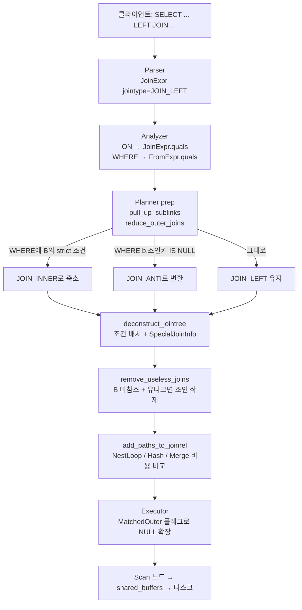
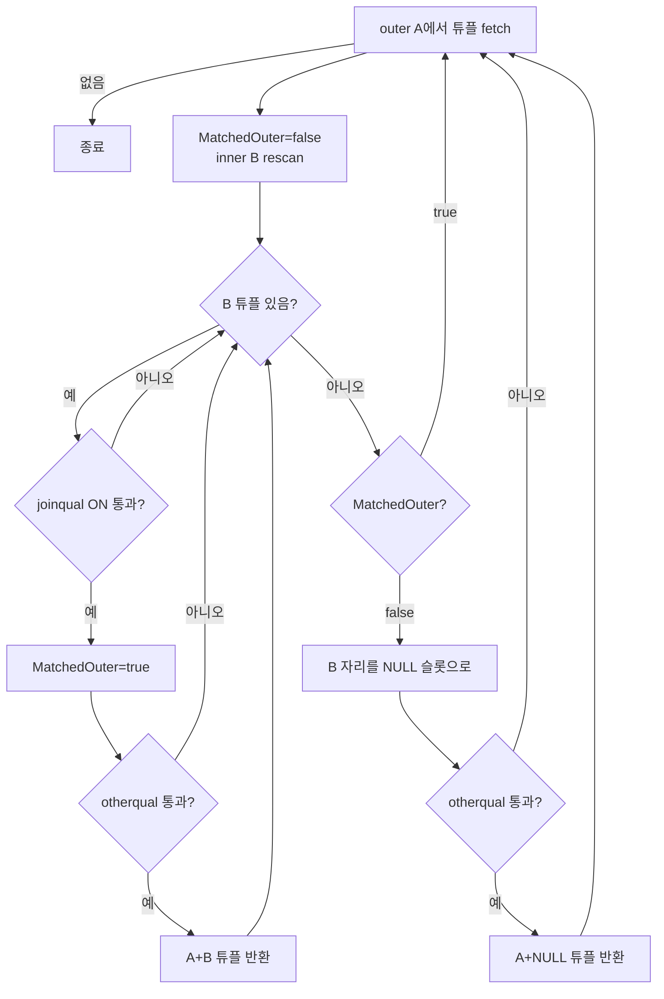
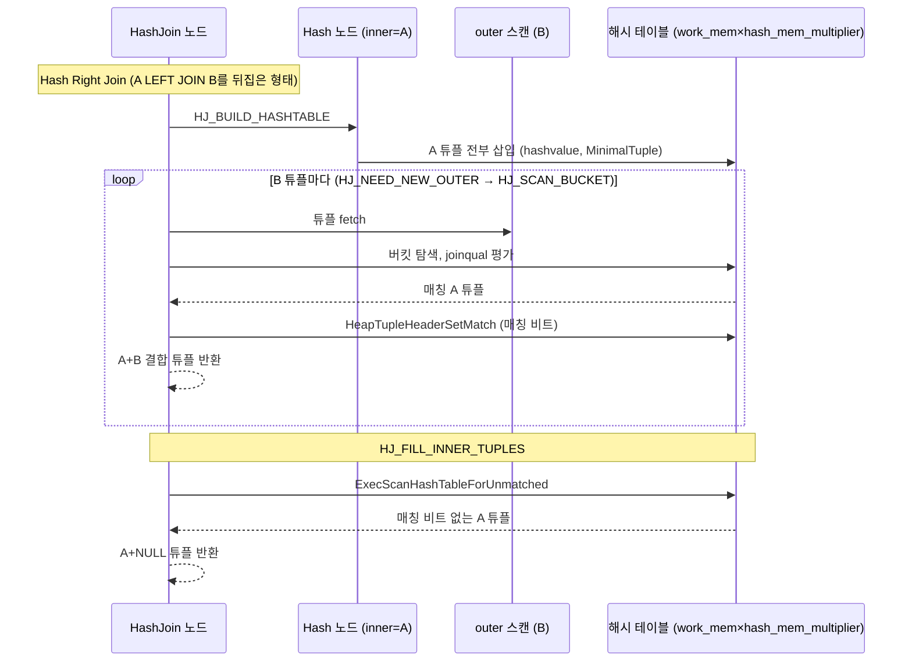

# LEFT JOIN — 이론

관련 문서: [실습](./LEFT조인-실습.md)

> 전제: PostgreSQL 16, OLTP 조회 쿼리(1:N 관계, 수십만~수백만 행) 기준. 버전별로 달라지는 부분은 7장에 따로 적었다.

---

## 1. 한 줄 요약

`A LEFT JOIN B ON 조건`은 A의 모든 행을 결과에 남기고, 각 A 행에 대해 ON 조건을 만족하는 B 행이 있으면 A×B 조합을, 하나도 없으면 B 컬럼을 전부 NULL로 채운 행 하나를 내보내는 외부 조인이다.

---

## 2. 왜 필요한가

### LEFT JOIN이 없다면

"회원 목록과 각 회원의 주문 수(주문 없는 회원 포함)"를 INNER JOIN만으로 만들려면 아래처럼 두 번 조회해서 합쳐야 한다.

```sql
SELECT m.id, o.id AS order_id
FROM   lab_member m JOIN lab_order o ON o.member_id = m.id
UNION ALL
SELECT m.id, NULL
FROM   lab_member m
WHERE  NOT EXISTS (SELECT 1 FROM lab_order o WHERE o.member_id = m.id);
```

- A 테이블을 두 번 읽고 B 테이블도 두 번 탐색한다.
- 매칭 여부 판정을 두 쿼리가 따로 하므로, 조건을 바꿀 때 한쪽만 고치는 실수가 생긴다.

LEFT JOIN은 **"매칭 여부 추적(matched flag)"을 조인 알고리즘 한 번의 실행 안에 넣은 것**이다. 조인 노드가 A 행마다 "이 행이 B와 한 번이라도 매칭됐는가"를 기억해 두었다가, 매칭이 없으면 NULL 확장(null-extended) 행을 추가로 내보낸다. 스캔은 한 번이면 된다.

### 다른 DB와의 차이

| 항목 | PostgreSQL | Oracle | MySQL |
|---|---|---|---|
| 문법 | ANSI `LEFT [OUTER] JOIN` | ANSI + 레거시 `(+)` 표기 (`WHERE a.id = b.a_id(+)`) | ANSI |
| FULL OUTER JOIN | 지원 (Hash/Merge만) | 지원 | **미지원** — `LEFT ∪ RIGHT`로 우회 |
| 보존 쪽을 해시 테이블로 뒤집기 | `Hash Right Join` | `HASH JOIN RIGHT OUTER` (10g+) | 8.0.20+에서 외부 조인에 해시 조인 사용 (확인 필요) |
| 외부→내부 조인 자동 변환 | `reduce_outer_joins` | Outer Join Elimination/변환 있음 | 있음 |
| 빈 문자열과 NULL | 다름 (`'' IS NULL` 은 false) | `''`를 NULL로 취급 → `ON b.code = ''` 결과가 달라짐 | 다름 |

Oracle의 `(+)`는 조건마다 `(+)`를 붙여야 하고 하나라도 빠뜨리면 조용히 INNER JOIN이 된다. PostgreSQL로 이관할 때 `(+)`가 붙은 조건은 ON으로, 안 붙은 조건은 WHERE로 옮겨야 의미가 보존된다.

---

## 3. 핵심 개념

| 개념 | 설명 |
|---|---|
| 보존 쪽 (Preserved side) | 매칭 여부와 상관없이 모든 행이 결과에 남는 쪽. `A LEFT JOIN B`에서 A. |
| 널 허용 쪽 (Nullable side) | 매칭이 없으면 NULL로 채워지는 쪽. `A LEFT JOIN B`에서 B. |
| NULL 확장 행 (Null-extended row) | 보존 쪽 행 + 널 허용 쪽 컬럼 전부 NULL로 구성된 결과 행. |
| 조인 조건 (Join qual) | ON 절에서 온 조건. **매칭 여부를 판정**하는 데 쓴다. 실패해도 A 행은 사라지지 않는다. |
| 필터 조건 (Other qual / pushed-down qual) | WHERE 절에서 온 조건. **NULL 확장까지 끝난 결과**에 적용된다. 실패하면 행이 사라진다. |
| 엄격한 조건 (Strict qual) | 입력 중 하나라도 NULL이면 결과가 NULL/false인 조건. `b.x = 1`, `b.x > 0`은 strict, `b.x IS NULL`, `COALESCE(b.x,0)=0`은 strict가 아니다. |
| 외부 조인 축소 (Outer join reduction) | WHERE에 널 허용 쪽 strict 조건이 있으면 NULL 확장 행이 어차피 걸러지므로 LEFT JOIN을 INNER JOIN으로 바꾸는 플래너 최적화. |
| 조인 제거 (Join removal) | 널 허용 쪽 컬럼을 아무도 참조하지 않고, 조인 키가 유니크해 행 수가 늘지 않으면 LEFT JOIN 자체를 없애는 최적화. |
| 안티 조인 (Anti join) | "매칭이 없는 A 행만" 반환하는 조인. `LEFT JOIN ... WHERE b.key IS NULL`, `NOT EXISTS`가 이것으로 변환된다. |

> **`LEFT JOIN` = `LEFT OUTER JOIN`**: `OUTER`는 SQL 표준에서 생략 가능한 키워드(noise word)다. PostgreSQL 문법(`gram.y`의 `join_type: LEFT opt_outer`)에서 둘 다 `JOIN_LEFT`가 되므로 파스 트리부터 실행계획까지 완전히 같다. `RIGHT [OUTER] JOIN`, `FULL [OUTER] JOIN`도 마찬가지이고, `JOIN`만 쓰면 `INNER JOIN`이다. `OUTER JOIN`처럼 방향 없이 `OUTER`만 쓰는 것은 문법 오류다.

**ON과 WHERE의 차이가 LEFT JOIN 이해의 전부라고 봐도 된다.** INNER JOIN에서는 두 위치가 결과상 동일하지만, LEFT JOIN에서는 평가 시점이 다르다.

```
ON 조건    : 조인 "도중"에 평가 → 매칭 판정용 → 실패해도 A 행은 NULL 확장으로 살아남음
WHERE 조건 : 조인 "이후"에 평가 → 결과 행 필터 → 실패하면 행 삭제 (NULL 확장 행 포함)
```

---

## 4. 동작 원리와 흐름

### 4.1 쿼리 한 건의 전체 흐름

```sql
SELECT m.id, m.name, o.id, o.amount
FROM   lab_member m
LEFT JOIN lab_order o ON o.member_id = m.id AND o.status = 'PAID'
WHERE  m.status = 'ACTIVE';
```

1. **클라이언트 → 백엔드 프로세스**: 파서(`raw_parser`)가 `JoinExpr` 노드를 만들고 `jointype = JOIN_LEFT`로 표시한다.
2. **분석기(Analyzer)**: `transformFromClauseItem`이 ON 절을 `JoinExpr.quals`에, WHERE 절을 `FromExpr.quals`에 따로 저장한다. **이 시점에 ON/WHERE 구분이 트리 구조로 고정된다.**
3. **플래너 전처리(prep)**:
   - `pull_up_sublinks`: `NOT EXISTS` 같은 서브쿼리를 세미/안티 조인으로 끌어올림
   - `reduce_outer_joins`: WHERE에 `o.xxx = 상수` 같은 strict 조건이 있으면 JOIN_LEFT → JOIN_INNER, `o.조인키 IS NULL`이면 JOIN_LEFT → JOIN_ANTI로 바꿈. RIGHT JOIN은 여기서 좌우를 뒤집어 LEFT JOIN으로 정규화한다.
4. **조인 트리 분해(deconstruct_jointree)**: 각 조건을 `RestrictInfo`로 만들고 어디서 평가할지 배치한다.
   - `m.status = 'ACTIVE'`(WHERE, 보존 쪽만 참조) → `lab_member` 스캔 노드로 **push down**
   - `o.status = 'PAID'`(ON, 널 허용 쪽만 참조) → `lab_order` 스캔 노드로 push down 가능 (B에서 미리 걸러도 매칭 판정 결과가 같음)
   - `o.member_id = m.id`(ON, 양쪽 참조) → 조인 노드의 조인 조건
   - 외부 조인 정보는 `SpecialJoinInfo`로 기록되어 **조인 순서 탐색 시 합법성 검사**에 쓰인다.
5. **경로 생성(path generation)**: `add_paths_to_joinrel`이 Nested Loop / Hash / Merge 경로를 만들고 비용을 비교한다. 이때 LEFT JOIN 고유의 제약이 붙는다 (4.3 참고).
6. **실행기(Executor)**: 선택된 조인 노드가 A 행마다 `MatchedOuter` 플래그를 관리하며 튜플을 만든다.
7. **버퍼 캐시 / 스토리지**: 스캔 노드가 `shared_buffers`에서 페이지를 찾고(hit), 없으면 OS를 통해 디스크에서 읽는다(read). 조인 노드 자체는 페이지를 직접 읽지 않고, 해시 조인의 해시 테이블은 **백엔드 로컬 메모리**(`work_mem × hash_mem_multiplier`)에 올라가며 넘치면 임시 파일(batch)로 나간다.



### 4.2 실행기에서 A 행 하나가 처리되는 사이클 (Nested Loop Left Join 기준)

1. 외부(outer, A) 노드에서 튜플 하나를 가져온다. `MatchedOuter = false`.
2. 내부(inner, B) 노드를 A 행의 키로 재스캔(rescan)한다. (파라미터화된 Index Scan이면 `member_id = $m.id`로 인덱스 탐색)
3. B 튜플마다 **조인 조건(joinqual, ON)** 을 평가한다.
   - 통과 → `MatchedOuter = true`. 이어서 **필터 조건(otherqual, WHERE 쪽)** 평가 → 통과하면 결합 튜플 반환.
   - 실패 → 다음 B 튜플.
   - B가 유니크하다고 증명된 경우(`Inner Unique`) 첫 매칭 후 바로 다음 A 행으로 넘어간다.
4. B를 다 소진했는데 `MatchedOuter = false`면, B 자리를 **미리 만들어 둔 전부-NULL 슬롯**(`nl_NullInnerTupleSlot`)으로 채우고 otherqual 평가 → 통과하면 NULL 확장 튜플 반환.
5. 1로 돌아간다.



핵심: **joinqual이 통과하면 otherqual이 실패해도 "매칭됨"으로 기록된다.** 그래서 WHERE 조건이 조인 노드의 `Filter`로 붙은 경우, 매칭된 B 행이 WHERE에서 걸러지면 그 A 행은 NULL 확장 행도 만들지 않고 통째로 사라진다.

### 4.3 해시 조인에서의 LEFT JOIN — 방향이 두 가지

해시 조인은 **inner 쪽으로 해시 테이블을 만들고(build), outer 쪽으로 탐색(probe)** 한다. LEFT JOIN을 해시로 처리하는 방법은 두 가지다.

| EXPLAIN 노드 | 해시 테이블(build) | 탐색(probe) | 매칭 없는 A 행 처리 |
|---|---|---|---|
| `Hash Left Join` | B | A | probe 도중 A 행마다 `hj_MatchedOuter` 확인 → 즉시 NULL 확장 |
| `Hash Right Join` | **A** | B | 해시 테이블 튜플에 매칭 비트를 찍고, B 탐색이 끝난 뒤 해시 테이블을 한 번 더 훑어 비트가 없는 A 튜플을 NULL 확장 |

`A LEFT JOIN B` 를 썼는데 EXPLAIN에 `Hash Right Join`이 뜨면, 플래너가 **A가 더 작아서 A로 해시 테이블을 만드는 게 싸다**고 판단한 것이다. 의미는 같다. (내부적으로 좌우가 바뀌어 `B RIGHT JOIN A`가 된 것)



### 4.4 해시 테이블 메모리 레이아웃 (매칭 비트 위치)

해시 테이블은 디스크 페이지가 아니라 백엔드 로컬 메모리 청크(`HashMemoryChunk`)에 저장된다.

```
HashJoinTable
├─ buckets[]  (nbuckets 개, 2의 거듭제곱)
│    └─ 각 버킷 → HashJoinTuple 연결 리스트
└─ batch 파일 (nbatch > 1이면 임시 파일로 분할)

HashJoinTupleData (1개 튜플)
┌───────────────────────────┬──────────────┬─────────────────────────────────────────────┐
│ next (포인터 / dsa_pointer) │ hashvalue    │ MinimalTuple (MAXALIGN 경계부터)             │
│ 같은 버킷의 다음 튜플        │ uint32       │ ┌ t_len ┬ mt_padding ┬ t_infomask2 ┬ t_infomask ┬ t_hoff ┬ null bitmap ┬ data ┐ │
└───────────────────────────┴──────────────┴─────────────────────────────────────────────┘
                                                              ↑
                                  t_infomask2의 HEAP_TUPLE_HAS_MATCH 비트(= HEAP_ONLY_TUPLE, 0x8000 재사용)
                                  Hash Right/Full Join에서만 사용
```

- 힙 페이지의 튜플에서 `HEAP_ONLY_TUPLE`은 HOT 체인 표시지만, 해시 테이블 안의 MinimalTuple에서는 HOT이 의미가 없으므로 같은 비트를 "매칭됨" 표시로 재사용한다.
- `Hash Left Join`은 이 비트를 쓰지 않는다. 매칭 여부가 probe 중인 A 튜플 하나에만 걸리므로 노드 상태 변수 하나(`hj_MatchedOuter`)로 충분하다.

### 4.5 머지 조인

`Merge Left Join`은 양쪽을 조인 키로 정렬한 뒤 두 커서를 전진시킨다. A 커서의 키가 B 커서의 키보다 작아 B에 대응 키가 없다고 판단되는 순간(`mj_FillOuter`가 true) A 행을 NULL 확장해서 내보낸다. ON 조건에 머지 가능한 등호(mergejoinable `=`)가 최소 하나 있어야 한다.

### 4.6 알고리즘별 LEFT JOIN 제약

| 알고리즘 | 지원 조인 타입 | LEFT JOIN 시 방향 |
|---|---|---|
| Nested Loop | INNER, LEFT, SEMI, ANTI | **A가 반드시 outer**. `B`를 드라이빙 테이블로 쓰는 계획(= Right Join)은 불가 |
| Hash Join | 전부 (INNER, LEFT, RIGHT, FULL, SEMI, ANTI, 16+: RIGHT ANTI) | Hash Left Join / Hash Right Join 둘 다 가능 |
| Merge Join | 전부 (FULL 포함) | Merge Left Join / Merge Right Join 둘 다 가능 |

Nested Loop이 Right Join을 못 하는 이유: 매칭 안 된 inner 튜플을 찾으려면 모든 outer 루프가 끝난 뒤 inner 전체를 다시 훑어 "한 번도 매칭 안 된 것"을 알아야 하는데, inner는 루프마다 재스캔되는 구조라 튜플별 매칭 상태를 보관할 곳이 없다.

→ 실무 결과: **A가 수백만 행이고 B가 몇 행인 LEFT JOIN**은 Nested Loop으로 B를 드라이빙할 수 없어서, Hash Right Join(A로 해시 테이블 생성)이나 A 전체를 outer로 도는 Nested Loop 중에서 골라야 한다.

### 4.7 조인 키에 NULL이 있을 때 (`ON a.k = b.k`, 양쪽 모두 NULL 존재)

**규칙은 하나다: `NULL = 무엇이든`(NULL 포함)은 `true`가 아니라 `NULL`(unknown)이고, 조인 조건은 `true`일 때만 매칭이다.** 따라서 NULL 키 행은 **어느 쪽에 있든 절대 매칭되지 않는다.** `NULL = NULL`도 매칭이 아니다.

예시 데이터:

| lab_null_a (id, k) | lab_null_b (id, k) |
|---|---|
| (1, 1) | (10, 1) |
| (2, 2) | (20, NULL) |
| (3, NULL) | (30, NULL) |
| (4, NULL) | (40, 5) |

| 작성법 | 결과 행 | 설명 |
|---|---|---|
| `a JOIN b ON a.k = b.k` | 1 — (1,10) | NULL 키 행은 양쪽 모두 사라짐 |
| `a LEFT JOIN b ON a.k = b.k` | 4 — (1,10), (2,∅), **(3,∅), (4,∅)** | a의 NULL 키 행은 매칭 실패 → **NULL 확장으로 남음**. b의 NULL 키 행은 사라짐 |
| `a RIGHT JOIN b ON a.k = b.k` | 4 — (1,10), (∅,20), (∅,30), (∅,40) | LEFT의 좌우 반전 |
| `a FULL JOIN b ON a.k = b.k` | 7 — (1,10), (2,∅), (3,∅), (4,∅), (∅,20), (∅,30), (∅,40) | NULL 키 행이 **양쪽에서 각자 따로** 나옴 |
| `a LEFT JOIN b ON a.k IS NOT DISTINCT FROM b.k` | 6 — (1,10), (2,∅), **(3,20), (3,30), (4,20), (4,30)** | NULL끼리 매칭 → NULL 행 2×2 **곱집합**으로 증식 |

주의할 점:

- LEFT JOIN 결과의 `(3, ∅)`에서 B 컬럼이 NULL인 이유는 "B에 k가 NULL인 행과 매칭돼서"가 아니라 "**매칭된 B 행이 없어서**"다. 결과만 보고 둘을 구분할 수 없으므로, 매칭 여부는 B의 NOT NULL 컬럼(PK)으로 판단한다 (`b.id IS NULL`).
- `GROUP BY`, `DISTINCT`, `UNION`, `IS NOT DISTINCT FROM`은 NULL을 **같은 값으로 취급**하지만, 조인의 `=`는 그렇지 않다. "GROUP BY에서 한 그룹으로 묶였으니 조인도 되겠지"는 틀린 추론이다.

**실행기가 NULL 키를 다루는 방식** — 매칭이 불가능하다는 것을 알기 때문에 **탐색 자체를 건너뛴다.** 조인 연산자가 strict(`pg_proc.proisstrict = true`)라서 가능한 최적화다.

| 노드 | inner(build) 쪽 NULL 키 | outer(probe) 쪽 NULL 키 |
|---|---|---|
| Hash Left Join | 해시 테이블에 **넣지 않음** (어차피 매칭 불가, 보존 대상도 아님) | 버킷 탐색 없이 즉시 NULL 확장 행 출력 |
| Hash Right Join (inner = 보존 쪽 A) | 매칭은 불가능하지만 나중에 NULL 확장해야 하므로 **보관** (보관 위치는 버전별 구현 차이 확인 필요) | 탐색 없이 버림 |
| Merge Left Join | 정렬 시 NULL이 끝(`NULLS LAST`)에 모이므로, NULL에 도달하면 "더 이상 매칭 없음"으로 판단 | 매칭 불가(`MJEVAL_NONMATCHABLE`)로 판정 → NULL 확장 |
| Nested Loop + Index Scan | — | `b.k = $1`에 `$1 = NULL`이 들어오면 B-tree 스캔 키 전처리 단계에서 "만족 불가"로 판정되어 **인덱스 페이지를 읽지 않음** |

관련 소스: `nodeHashjoin.c`(`ExecHashGetHashValue`의 `keep_nulls` 인자 — PG18 전후로 해시값 계산이 ExprState 방식으로 바뀌었을 수 있어 함수명 확인 필요), `nodeMergejoin.c`(`MJEvalOuterValues`, `MJEVAL_MATCHABLE / NONMATCHABLE / ENDOFJOIN`), `nbtree/nbtutils.c`(`_bt_preprocess_keys`, `SK_ISNULL`).

**플래너 추정**: `eqjoinsel`(`utils/adt/selfuncs.c`)은 조인 선택도에 양쪽의 `(1 - null_frac)`을 곱한다. `pg_stats.null_frac`이 크면 INNER JOIN 결과 추정치가 그만큼 줄고, LEFT JOIN은 A 행 수 하한(5.7) 때문에 줄지 않는다.

**NULL끼리도 매칭시키고 싶다면** — 작성법마다 쓸 수 있는 조인 알고리즘이 달라진다.

| 작성법 | 해시/머지 가능? | B 인덱스 사용 | 위험 |
|---|---|---|---|
| `ON a.k IS NOT DISTINCT FROM b.k` | **불가** (등호 연산자가 아니라 hashable/mergejoinable 아님) → Nested Loop만 | 불가 | 대량 데이터에서 N×M 비교 |
| `ON a.k = b.k OR (a.k IS NULL AND b.k IS NULL)` | **불가** (OR 조건) | 제한적 | 위와 동일 |
| `ON COALESCE(a.k, -1) = COALESCE(b.k, -1)` | 가능 (`Hash Cond`에 표현식) | 표현식 인덱스 `(COALESCE(k,-1))`가 있어야 | `-1`이 실제 값으로 존재하면 오매칭 |
| `ON a.k = b.k` 결과 `UNION ALL` NULL 키끼리 따로 조인 | 각각 가능 | 가능 | 쿼리 복잡도, NULL 행 곱집합 크기 |

그 전에 **"NULL끼리 매칭"이 업무적으로 맞는지**부터 확인한다. 대부분은 "값을 모름"끼리 같다고 볼 근거가 없고, 곱집합 증식을 일으킨다.

---

## 5. 내부 구현

### 5.1 파서·분석기

| 위치 | 역할 |
|---|---|
| `src/backend/parser/gram.y` | `joined_table` 규칙 → `JoinExpr` 생성, `jointype = JOIN_LEFT` |
| `src/backend/parser/parse_clause.c` `transformFromClauseItem` | ON 절을 `JoinExpr.quals`로 변환, `USING`/`NATURAL`이면 조인 컬럼 병합 |
| `src/include/nodes/nodes.h` `JoinType` enum | `JOIN_INNER, JOIN_LEFT, JOIN_FULL, JOIN_RIGHT, JOIN_SEMI, JOIN_ANTI, JOIN_RIGHT_ANTI(16+), JOIN_UNIQUE_OUTER, JOIN_UNIQUE_INNER` |

### 5.2 플래너 전처리 — `src/backend/optimizer/prep/prepjointree.c`

**`reduce_outer_joins`** (2-pass)

- pass1: 조인 트리를 돌며 각 서브트리가 포함하는 relid를 수집
- pass2: 상위에서 내려오는 **nonnullable_rels** (위쪽 WHERE/ON의 strict 조건이 "NULL이 아님"을 강제하는 릴레이션)와 **forced_null_vars** (위쪽 `IS NULL`이 NULL을 강제하는 변수)를 계산
  - `JOIN_LEFT`인데 오른쪽 relid가 nonnullable_rels에 포함 → `JOIN_INNER`
  - `JOIN_LEFT`인데 조인 조건이 strict하게 참조하는 오른쪽 변수가 forced_null_vars에 포함 → `JOIN_ANTI`
  - `JOIN_RIGHT` → 좌우 교환 후 `JOIN_LEFT`
- strict 여부는 `find_nonnullable_rels`, `find_nonnullable_vars`, `find_forced_null_vars`(`optimizer/util/clauses.c`)가 판정한다. 연산자의 기반 함수가 `pg_proc.proisstrict = true`인지를 본다.

```sql
-- 연산자가 strict인지 확인: text = text 의 기반 함수 texteq
SELECT o.oprname, p.proname, p.proisstrict
FROM pg_operator o JOIN pg_proc p ON p.oid = o.oprcode
WHERE o.oprname = '=' AND o.oprleft = 'text'::regtype AND o.oprright = 'text'::regtype;
```

**`pull_up_sublinks`** → `convert_EXISTS_sublink_to_join` (`optimizer/plan/subselect.c`): `NOT EXISTS`를 `JOIN_ANTI`로. `NOT IN`은 NULL 의미가 달라서 안티 조인으로 변환하지 않고 `hashed SubPlan` 또는 일반 SubPlan으로 남는다.

### 5.3 조건 배치 — `src/backend/optimizer/plan/initsplan.c`

- `deconstruct_jointree` → `make_outerjoininfo`: 외부 조인마다 `SpecialJoinInfo`를 만든다.
  - `min_lefthand`, `min_righthand`: 이 외부 조인을 합법적으로 수행하려면 최소한 양쪽에 있어야 하는 relid 집합
  - `lhs_strict`: 조인 조건이 왼쪽에 대해 strict한지 (조인 순서 재배치 규칙에 사용)
- `distribute_qual_to_rels`: 각 조건을 `RestrictInfo`로 만들고 `is_pushed_down` 플래그를 설정한다.
  - WHERE에서 온 조건 → `is_pushed_down = true`
  - ON에서 온 조건 → 해당 외부 조인 레벨에서는 `is_pushed_down = false`
- 플랜 생성 시 `createplan.c`의 `extract_actual_join_clauses`가 `RINFO_IS_PUSHED_DOWN` 여부로 조건을 **joinqual(ON) / otherqual(WHERE)** 로 나눈다. 이것이 EXPLAIN의 `Join Filter`와 `Filter`로 그대로 드러난다.
- **PostgreSQL 16**: "outer-join-aware Var" 도입. `Var.varnullingrels` 필드가 "이 변수가 어떤 외부 조인에 의해 NULL이 될 수 있는가"를 비트셋으로 들고 다닌다. 그 전에는 `outerjoin_delayed` 등의 플래그로 조건 평가 시점을 늦추는 방식이었다(구 명칭 확인 필요). 이 변경 덕에 PG17의 "`NOT NULL` 컬럼의 `IS NULL` 조건을 상수 false로 치환" 같은 최적화가 외부 조인 위에서 잘못 적용되지 않는다.

### 5.4 조인 제거 — `src/backend/optimizer/plan/analyzejoins.c`

`remove_useless_joins` → `join_is_removable`의 조건:

1. `JOIN_LEFT`이고, 오른쪽이 단일 베이스 릴레이션(또는 `DISTINCT`/`GROUP BY`로 유일성이 보장된 서브쿼리)
2. 오른쪽 릴레이션의 어떤 컬럼도 조인 위(SELECT 목록, WHERE, 다른 조인 조건, ORDER BY)에서 참조되지 않음
3. 조인 조건 기준으로 오른쪽이 **유니크함이 증명됨** (`rel_is_distinct_for` → `relation_has_unique_index_for`)
   - 조인 컬럼에 대한 **유니크 인덱스**가 있어야 한다. 부분 인덱스는 predicate가 증명될 때만 인정.
   - `DEFERRABLE` 유니크 제약(`pg_index.indimmediate = false`)은 인정되지 않는다.
   - FK 제약만으로는 부족하다. FK는 "A→B 존재"를 보장할 뿐 B 쪽 유일성과 무관하다 (B 쪽 PK/UNIQUE가 필요).

같은 파일의 `innerrel_is_unique`는 조인을 없애지는 못해도 "inner가 유니크"함을 표시해 실행기가 첫 매칭 뒤 바로 다음 outer로 넘어가게 한다. `EXPLAIN VERBOSE`에서 `Inner Unique: true`로 보인다 (PG10+).

### 5.5 조인 순서 합법성 — `src/backend/optimizer/path/joinrels.c`, `src/backend/optimizer/README`

`join_is_legal`이 `SpecialJoinInfo`를 보고 조인 순서를 검사한다. README에 정리된 외부 조인 항등식(outer join identities):

```
1. (A leftjoin B on (Pab)) innerjoin C on (Pac)  =  (A innerjoin C on (Pac)) leftjoin B on (Pab)
2. (A leftjoin B on (Pab)) leftjoin C on (Pac)   =  (A leftjoin C on (Pac)) leftjoin B on (Pab)
3. (A leftjoin B on (Pab)) leftjoin C on (Pbc)   =  A leftjoin (B leftjoin C on (Pbc)) on (Pab)
   — 3은 Pbc가 B에 대해 strict할 때만 성립
```

반대로 `A leftjoin (B innerjoin C)`는 `(A leftjoin B) innerjoin C`로 바꿀 수 **없다**. 그래서 LEFT JOIN이 섞인 쿼리는 INNER JOIN만 있는 쿼리보다 탐색 가능한 조인 순서가 적고, 플래너가 좋은 순서를 못 고르는 원인이 된다.

### 5.6 실행기

| 파일 | 상태 구조체 필드 | LEFT JOIN 처리 |
|---|---|---|
| `src/backend/executor/nodeNestloop.c` `ExecNestLoop` | `nl_NeedNewOuter`, `nl_MatchedOuter`, `nl_NullInnerTupleSlot` | inner 소진 시 `!nl_MatchedOuter && (jointype == JOIN_LEFT \|\| JOIN_ANTI)`면 NULL 슬롯으로 otherqual 평가 후 반환 |
| `src/backend/executor/nodeHashjoin.c` `ExecHashJoinImpl` | `hj_JoinState`(`HJ_BUILD_HASHTABLE`, `HJ_NEED_NEW_OUTER`, `HJ_SCAN_BUCKET`, `HJ_FILL_OUTER_TUPLE`, `HJ_FILL_INNER_TUPLES`, `HJ_NEED_NEW_BATCH`), `hj_MatchedOuter`, `hj_NullInnerTupleSlot`, `hj_NullOuterTupleSlot` | `HJ_FILL_OUTER(hjstate)`가 참이면 Left 처리, `HJ_FILL_INNER`면 Right 처리 |
| `src/backend/executor/nodeHash.c` `ExecScanHashTableForUnmatched` | — | Right/Full Join에서 매칭 비트 없는 inner 튜플 순회 |
| `src/backend/executor/nodeMergejoin.c` `ExecMergeJoin` | `mj_FillOuter`, `mj_MatchedOuter`, `mj_NullInnerTupleSlot` | 키가 앞서 나간 outer 튜플을 NULL 확장 |

해시 조인 최적화 한 가지: inner 해시 테이블이 비어 있으면, INNER JOIN은 outer를 읽지도 않고 종료하지만 **LEFT JOIN(`HJ_FILL_OUTER`)은 outer를 끝까지 읽어 전부 NULL 확장해야** 한다. B가 비어도 A 전체 스캔 비용은 그대로다.

### 5.7 행 수 추정 — `src/backend/optimizer/path/costsize.c` `calc_joinrel_size_estimate`

```
JOIN_INNER : nrows = outer_rows * inner_rows * fkselec * jselec
JOIN_LEFT  : nrows = outer_rows * inner_rows * fkselec * jselec
             if (nrows < outer_rows) nrows = outer_rows      ← 보존 쪽 행 수 하한
             nrows *= pselec                                  ← WHERE에서 온 조건(pushed-down)의 선택도
```

LEFT JOIN 추정치는 조인 조건 선택도가 과소 추정돼도 **A 행 수 아래로 내려가지 않는다.** 대신 WHERE 조건(`pselec`)이 NULL 확장 행에 대해 어떻게 동작할지는 정교하게 모델링되지 않으므로, `WHERE b.x IS NULL OR ...` 같은 조건에서 추정이 크게 틀어질 수 있다.

### 5.8 관련 파라미터

| 파라미터 | 기본값 | 적용 범위 | LEFT JOIN과의 관계 |
|---|---|---|---|
| `enable_nestloop` | `on` | 세션 `SET` 가능 | off는 금지가 아니라 비용 페널티(`disable_cost`) |
| `enable_hashjoin` | `on` | 세션 | 〃 |
| `enable_mergejoin` | `on` | 세션 | 〃 |
| `enable_memoize` | `on` (PG14+) | 세션 | Nested Loop inner 결과를 파라미터 값별로 캐시 |
| `work_mem` | `4MB` | 세션 | 해시 테이블 메모리 기준값 |
| `hash_mem_multiplier` | PG13~14: `1.0` / PG15+: `2.0` | 세션 | 해시 테이블 한도 = `work_mem × hash_mem_multiplier` |
| `join_collapse_limit` | `8` | 세션 | 명시적 JOIN 구문을 몇 개까지 재배치 대상으로 합칠지. 넘으면 **작성한 순서대로** 조인 |
| `from_collapse_limit` | `8` | 세션 | 서브쿼리를 상위 FROM으로 합칠 한도 |
| `geqo_threshold` | `12` | 세션 | FROM 항목이 이 수 이상이면 유전 알고리즘(GEQO)으로 순서 탐색 |
| `enable_parallel_hash` | `on` | 세션 | 병렬 해시 조인 |

---

## 6. 유사 개념과의 비교

### 6.1 조인 타입

| 구문 | 결과 | 매칭 없는 A | 매칭 없는 B | 행 수 하한 |
|---|---|---|---|---|
| `A JOIN B` | 매칭 쌍만 | 제거 | 제거 | 0 |
| `A LEFT JOIN B` | 매칭 쌍 + A의 NULL 확장 | 유지 | 제거 | `count(A)` |
| `A RIGHT JOIN B` | = `B LEFT JOIN A` | 제거 | 유지 | `count(B)` |
| `A FULL JOIN B` | 양쪽 NULL 확장 | 유지 | 유지 | `max(count(A), count(B))` |
| `WHERE EXISTS (B)` (세미) | A 행만, 중복 없음 | 제거 | — | 0 |
| `WHERE NOT EXISTS (B)` (안티) | 매칭 없는 A만 | 유지 | — | 0 |

### 6.2 "B에 없는 A 찾기" 3가지 작성법

| 작성법 | 변환 결과 | B 조인 키에 NULL이 있을 때 | 권장 |
|---|---|---|---|
| `LEFT JOIN B ON ... WHERE B.조인키 IS NULL` | `Anti Join` (reduce_outer_joins) | 정상 | 가능. 단 `IS NULL` 대상이 **조인 조건에 쓰인 컬럼**이어야 변환됨 |
| `WHERE NOT EXISTS (SELECT 1 FROM B WHERE ...)` | `Anti Join` (pull_up_sublinks) | 정상 | **권장.** 의도가 가장 명확 |
| `WHERE A.id NOT IN (SELECT B.a_id FROM B)` | `hashed SubPlan` / `SubPlan` | **B.a_id에 NULL이 하나라도 있으면 결과 0행** | 비권장 |

### 6.3 알고리즘 선택 기준 (LEFT JOIN 관점)

| 상황 | 대체로 선택되는 노드 | 판단 기준 |
|---|---|---|
| A가 소량(단건~수백 행) + B 조인 컬럼에 인덱스 | `Nested Loop Left Join` + Index Scan | A 행 수(= loops) × inner 1회 비용 |
| A, B 모두 대량 + 등호 조건 | `Hash Left Join` 또는 `Hash Right Join` | 작은 쪽으로 해시 테이블 생성, `Batches` > 1이면 메모리 부족 |
| 양쪽이 이미 조인 키로 정렬됨 (인덱스 순서, ORDER BY 동일 키) | `Merge Left Join` | 정렬 비용이 없거나 결과에도 정렬이 필요할 때 |
| 조인 조건이 부등호/범위만 | `Nested Loop Left Join` (Hash/Merge 불가) | 등호 조건을 추가할 수 있는지 먼저 검토 |
| A 대량 + B 소량, Nested Loop만 가능한 조건 | A 전체를 outer로 도는 `Nested Loop Left Join` | B를 드라이빙할 수 없으므로 느려짐 → 조건 재작성 검토 |

"어느 쪽이 더 빠르다"는 행 수, 캐시 적중률, `work_mem`에 따라 바뀐다. 실습 문서에서 같은 쿼리를 노드별로 측정해 비교한다.

### 6.4 조건 위치(ON vs WHERE) — 조인 타입별 비교

**논리적 처리 순서**: `FROM`(조인 + `ON`, 외부 조인이면 NULL 확장까지) → `WHERE` → `GROUP BY` → `HAVING` → `SELECT` → `ORDER BY` → `LIMIT`.
이 순서는 **결과의 의미**를 정의할 뿐 물리적 실행 순서가 아니다. 플래너는 의미가 보존되는 한 WHERE 조건을 스캔 노드까지 내리고(push down), ON 조건도 한쪽만 참조하면 스캔으로 내린다. 그래서 "ON이 WHERE보다 먼저 실행되니 빠르다"는 말은 틀리다. 차이는 **결과가 달라지는지**와 **어디로 push down될 수 있는지**에서 생긴다.

| 조인 타입 | 조건이 참조하는 쪽 | `ON`에 둘 때 | `WHERE`에 둘 때 | 결과 동일? |
|---|---|---|---|---|
| `INNER JOIN` | 어느 쪽이든 | 스캔으로 push down / 조인 조건 | 동일 | **동일.** `deconstruct_jointree`가 INNER JOIN의 ON 조건을 WHERE 조건과 같은 방식으로 배치하므로 계획도 같다 |
| `LEFT JOIN` | 널 허용 쪽(B)만 | B 스캔으로 push down. 매칭 판정에만 영향 → **A 행 유지** | strict면 INNER로 축소 → **A 행 제거**. non-strict면 조인 노드 `Filter` | 다름 |
| `LEFT JOIN` | 보존 쪽(A)만 | push down 불가 → 조인 노드 `Join Filter`. **A 행은 NULL 확장으로 유지** | A 스캔으로 push down → **A 행 제거** | 다름 |
| `LEFT JOIN` | 양쪽 | 조인 조건(`Hash Cond`/`Join Filter`) | 조인 노드 `Filter`, strict면 INNER로 축소 | 다름 |
| `RIGHT JOIN` | — | LEFT JOIN의 좌우 반전 (플래너가 LEFT로 정규화) | 〃 | 다름 |
| `FULL JOIN` | 한쪽만 | 양쪽 다 보존 쪽이므로 **어느 스캔으로도 push down 불가** → `Join Filter` | 참조한 쪽이 strict면 FULL → LEFT/RIGHT로 축소 후 push down | 다름 |

**판단 기준**

- INNER JOIN: 의미·성능 차이가 없으므로 **가독성 규칙**으로 정한다. 관례는 "두 테이블을 잇는 조건은 ON, 결과를 거르는 조건은 WHERE".
- 외부 조인: "이 조건이 거짓일 때 **보존 쪽 행을 없애야** 하는가?"
  - 없애야 한다 → `WHERE`
  - 행은 남기고 **붙일 상대만 고른다** → `ON`
- 외부 조인 위에 INNER JOIN이 섞인 경우 `A LEFT JOIN (B JOIN C ON ... AND c.x = 1) ON ...`의 `c.x = 1`은 괄호 안 INNER JOIN의 ON이므로 A 행을 제거하지 않는다. 같은 조건을 최상위 WHERE로 올리면 LEFT JOIN이 INNER로 축소된다. 조건이 **어느 조인 레벨의 ON에 속하는지**가 의미를 결정한다.

---

## 7. 버전별 차이

LEFT JOIN의 **SQL 의미**는 모든 버전에서 동일하다. 달라진 것은 플래너·실행기 최적화다.

| 버전 | 변경 지점 |
|---|---|
| 10 (참고) | `innerrel_is_unique` — inner 유니크 증명 시 첫 매칭 후 다음 outer로 이동 (`Inner Unique: true`) |
| 12 | LEFT JOIN 관련 동작 변경 없음으로 파악 (확인 필요). CTE가 기본 인라인되어 `WITH` 안의 LEFT JOIN도 상위 쿼리와 함께 최적화 대상이 됨 |
| 13 | `hash_mem_multiplier` 신설, 기본값 `1.0` |
| 14 | `Memoize` 노드 (`enable_memoize = on`) 신설. Nested Loop(Left Join 포함)의 inner 결과를 파라미터별로 캐시 (세미/안티 조인 적용 범위는 확인 필요) |
| 15 | `hash_mem_multiplier` 기본값 `1.0` → `2.0` |
| 16 | 외부 조인 인식 Var(`varnullingrels`) 도입 — 외부 조인 조건 배치·재배치 로직 재작성. `Hash Right Anti Join`(`JOIN_RIGHT_ANTI`) 신설. 병렬 `Hash Right Join` / `Hash Full Join` 지원 |
| 17 | `NOT NULL` 컬럼에 대한 `IS NOT NULL`/`IS NULL` 조건 단순화 (외부 조인 위에서는 nullingrels로 인해 적용되지 않음) |
| 18 (참고, 범위 밖) | Self-Join Elimination(`enable_self_join_elimination`), `Right Semi Join` 추가 (확인 필요) |

16의 재작성은 내부 구조 변경이라 **같은 쿼리의 계획이 15 → 16 업그레이드 후 달라질 수 있다.** 외부 조인이 여러 겹 중첩된 쿼리는 업그레이드 전후 `EXPLAIN`을 비교해 두는 것이 안전하다.

---

## 8. 함정과 안티패턴

### 8.1 WHERE에 B 조건을 써서 LEFT JOIN이 INNER JOIN으로 변함

- **증상**: "주문 없는 회원도 나와야 하는데" 결과에서 사라진다. 쿼리에는 분명 `LEFT JOIN`이라고 적혀 있다.
- **원인**: `WHERE o.status = 'PAID'`는 NULL 확장 행(`o.status = NULL`)에서 NULL → false. 플래너가 `reduce_outer_joins`에서 이를 알아채고 JOIN_INNER로 바꾼다. 결과상 INNER JOIN과 동일하다.
- **진단**: EXPLAIN 노드 이름에 `Left`/`Right`가 없으면 축소된 것이다.
  ```sql
  EXPLAIN SELECT m.id, o.id
  FROM lab_member m LEFT JOIN lab_order o ON o.member_id = m.id
  WHERE o.status = 'PAID';
  -- "Hash Join" (Left/Right 없음) → INNER로 축소됨
  ```
- **해결**: 매칭 판정에 쓸 조건이면 ON으로 옮긴다. 정말 "PAID 주문이 있는 회원만"이 의도라면 INNER JOIN으로 명시해 읽는 사람을 속이지 않는다.
  ```sql
  SELECT m.id, o.id
  FROM lab_member m LEFT JOIN lab_order o ON o.member_id = m.id AND o.status = 'PAID';
  ```

### 8.2 ON에 A(보존 쪽) 조건을 써서 필터가 안 됨

- **증상**: `ON o.member_id = m.id AND m.status = 'ACTIVE'`인데 DORMANT 회원이 결과에 나온다(B 컬럼은 NULL).
- **원인**: ON 조건은 매칭 판정용이다. DORMANT 회원은 "매칭 실패"로 판정될 뿐 보존 쪽이므로 NULL 확장되어 남는다. 보존 쪽만 참조하는 ON 조건은 스캔으로 push down할 수 없어 조인 노드의 `Join Filter`로 붙고, B 행마다 평가되어 비용만 든다.
- **진단**:
  ```sql
  EXPLAIN (ANALYZE, BUFFERS)
  SELECT m.id, o.id
  FROM lab_member m LEFT JOIN lab_order o ON o.member_id = m.id AND m.status = 'ACTIVE'
  WHERE m.id BETWEEN 1 AND 1000;
  -- 조인 노드 아래 "Join Filter: (m.status = 'ACTIVE'::text)" 와 "Rows Removed by Join Filter" 확인
  ```
- **해결**: A 행을 걸러내는 것이 의도면 WHERE로 옮긴다. "ACTIVE 회원만 주문을 붙이고 나머지는 NULL"이 의도라면 현재 쿼리가 맞으며, 주석으로 의도를 적어 둔다.

### 8.3 1:N LEFT JOIN 후 집계에서 COUNT(*) 사용

- **증상**: 주문이 0건인 회원의 주문 수가 1로 나온다.
- **원인**: NULL 확장 행도 행이다. `COUNT(*)`는 행 수를 세므로 1. `COUNT(o.id)`는 NULL을 세지 않으므로 0.
- **진단**:
  ```sql
  SELECT m.id, COUNT(*) AS cnt_star, COUNT(o.id) AS cnt_col
  FROM lab_member m LEFT JOIN lab_order o ON o.member_id = m.id
  GROUP BY m.id HAVING COUNT(*) <> COUNT(o.id) LIMIT 10;
  ```
- **해결**: 널 허용 쪽의 **NOT NULL 컬럼**(보통 PK)을 `COUNT(o.id)`로 센다. `SUM(o.amount)`도 매칭이 없으면 0이 아니라 NULL이므로 `COALESCE(SUM(o.amount), 0)`.

### 8.4 1:N LEFT JOIN 결과에 LIMIT/OFFSET 페이징

- **증상**: "회원 20명씩" 페이지인데 한 페이지에 회원이 3명만 나오거나, 다음 페이지에 같은 회원이 이어서 나온다.
- **원인**: LIMIT은 조인 **결과 행**에 적용된다. 주문 7건인 회원은 7행을 차지한다. JPA에서 컬렉션 `left join fetch` + `Pageable`이면 Hibernate가 SQL에 LIMIT을 붙이지 못하고 전체를 읽어 메모리에서 자른다 (`HHH90003004` 경고).
- **진단**:
  ```sql
  SELECT COUNT(DISTINCT m.id) AS members_in_page
  FROM (SELECT m.id FROM lab_member m LEFT JOIN lab_order o ON o.member_id = m.id
        ORDER BY m.id LIMIT 20) m;
  -- 20보다 작으면 행 증식으로 페이지가 깨진 것
  ```
- **해결**: 보존 쪽을 먼저 페이징한 뒤 LEFT JOIN한다.
  ```sql
  SELECT p.id, o.id AS order_id
  FROM (SELECT id FROM lab_member ORDER BY id LIMIT 20) p
  LEFT JOIN lab_order o ON o.member_id = p.id
  ORDER BY p.id, o.id;
  ```

### 8.5 쓰지도 않는 LEFT JOIN이 제거되지 않음

- **증상**: 공통 조회 SQL(MyBatis `<sql>` 조각, 뷰)에 `LEFT JOIN profile`이 늘 붙어 있는데, 프로필 컬럼을 안 쓰는 화면에서도 조인 비용이 발생한다.
- **원인**: 조인 제거는 **B 조인 컬럼에 유니크 인덱스**가 있어야 한다. 논리적으로 1:1이어도 인덱스가 없거나 일반 인덱스면 행이 늘어날 가능성을 배제할 수 없어 조인을 유지한다.
- **진단**:
  ```sql
  EXPLAIN SELECT m.id, m.name FROM lab_member m LEFT JOIN lab_member_profile p ON p.member_id = m.id;
  -- 조인 노드가 보이면 제거 실패. 유니크 인덱스 존재 여부:
  SELECT indexrelid::regclass, indisunique, indimmediate, pg_get_indexdef(indexrelid)
  FROM pg_index WHERE indrelid = 'lab_member_profile'::regclass;
  ```
- **해결**: 1:1이 맞다면 `UNIQUE` 제약/인덱스를 만든다 (운영에서는 `CREATE UNIQUE INDEX CONCURRENTLY`). 조인 제거가 되면 EXPLAIN에 `lab_member_profile`이 아예 나타나지 않는다. 그 뷰가 SELECT 목록에서 `p.*`를 쓰고 있으면 여전히 제거되지 않는다.

### 8.6 `LEFT JOIN ... IS NULL`인데 Anti Join으로 변환되지 않음

- **증상**: "주문 없는 회원" 쿼리가 `Hash Left Join` + `Filter: (o.xxx IS NULL)`로 실행되어, 매칭된 수백만 행을 만든 뒤 버린다.
- **원인**: Anti Join 변환은 `IS NULL` 대상 컬럼을 **조인 조건이 strict하게 참조**할 때만 일어난다. `o.status IS NULL`처럼 조인 조건에 없는 컬럼을 쓰면(NOT NULL 컬럼이라도) 변환되지 않는다.
- **진단**:
  ```sql
  EXPLAIN (ANALYZE, BUFFERS)
  SELECT m.id FROM lab_member m LEFT JOIN lab_order o ON o.member_id = m.id WHERE o.status IS NULL;
  -- "Rows Removed by Filter" 가 크고 노드명이 Anti가 아니면 해당
  ```
- **해결**: `WHERE o.member_id IS NULL`(조인 키) 또는 `NOT EXISTS`로 바꾼다.

### 8.7 LEFT JOIN 결과에 `FOR UPDATE`

- **증상**: `ERROR: FOR UPDATE cannot be applied to the nullable side of an outer join`
- **원인**: NULL 확장 행에는 잠글 B 튜플이 존재하지 않는다.
- **진단**: 에러 메시지 자체. JPA에서 `@Lock(PESSIMISTIC_WRITE)` + `@EntityGraph`/`left join fetch` 조합에서 발생 가능 (Hibernate가 `for update of 별칭`으로 범위를 좁히는지는 버전별 확인 필요).
  ```sql
  BEGIN;
  SELECT m.id, o.id FROM lab_member m LEFT JOIN lab_order o ON o.member_id = m.id WHERE m.id = 1 FOR UPDATE;
  ROLLBACK;
  ```
- **해결**: 잠글 테이블을 명시한다. `FOR UPDATE OF m`. B도 잠가야 하면 별도 쿼리로 B를 잠근다.

### 8.8 LEFT JOIN을 여러 겹 쌓아 `join_collapse_limit` 초과

- **증상**: 레거시 화면 조회 SQL에 LEFT JOIN이 10개 이상. 테이블 하나만 추가했는데 실행 시간이 급변한다.
- **원인**: 명시적 JOIN이 `join_collapse_limit = 8`을 넘으면 그 이상은 **작성 순서대로** 조인한다. 외부 조인 항등식상 재배치 가능한 경우에도 탐색하지 않는다.
- **진단**:
  ```sql
  SHOW join_collapse_limit;
  -- 세션에서 올려보고 계획이 바뀌는지 확인
  SET join_collapse_limit = 16; EXPLAIN ...; RESET join_collapse_limit;
  ```
- **해결**: 선택도가 좋은(행을 많이 줄이는) 조인을 앞에 배치하거나, 필요 없는 LEFT JOIN을 제거(8.5)하거나, 해당 쿼리에만 세션 파라미터를 올린다. 올리면 계획 수립 시간이 늘어나므로 `Planning Time`을 함께 본다.

### 8.9 조인 키 NULL — 매칭 안 되는 행과 `IS NOT DISTINCT FROM` 성능 붕괴

- **증상 ①**: `LEFT JOIN code c ON c.code = o.code`에서 `o.code`가 NULL인 주문의 코드명이 항상 NULL. "코드 테이블에 code가 NULL인 '미분류' 행을 넣었는데도" 매칭이 안 된다.
- **증상 ②**: 이를 고치려고 `IS NOT DISTINCT FROM`으로 바꿨더니, 수십 ms였던 쿼리가 수 분으로 늘었다.
- **원인**: ① `NULL = NULL`은 unknown이라 매칭 실패(4.7). ② `IS NOT DISTINCT FROM`은 해시·머지 조인 조건이 될 수 없어 Nested Loop로 떨어지고, B 인덱스도 못 쓴다.
- **진단**:
  ```sql
  -- 조인 키 NULL 비율
  SELECT tablename, attname, null_frac FROM pg_stats
  WHERE tablename IN ('lab_null_a', 'lab_null_b') AND attname = 'k';
  -- 조인 알고리즘이 강제로 막혔는지: enable_nestloop=off 인데도 Nested Loop 이 남으면 대안이 없는 조건
  SET enable_nestloop = off;
  EXPLAIN SELECT * FROM lab_null_a a LEFT JOIN lab_null_b b ON a.k IS NOT DISTINCT FROM b.k;
  RESET enable_nestloop;
  ```
  `Join Filter: (NOT (a.k IS DISTINCT FROM b.k))`가 보이고 조인 노드 비용이 비정상적으로 크면(PG18은 `Disabled: true` 표기, 확인 필요) 해당.
- **해결**: 업무상 "미분류"를 표현해야 한다면 NULL 대신 **실제 코드값(`'UNKNOWN'`)을 저장**하고 `NOT NULL DEFAULT`로 스키마를 바꾸는 것이 근본 해결. 스키마 변경이 불가하면 `COALESCE(o.code, 'UNKNOWN') = c.code`로 해시 조인이 가능한 형태를 유지하고, 반대편이 대량이면 표현식 인덱스를 둔다. Oracle 이관 코드라면 Oracle은 `''`도 NULL이라 **빈 문자열 키도 매칭되지 않았다**는 점을 함께 확인한다 (PostgreSQL에서는 `'' = ''`가 매칭됨 → 이관 후 결과 행 수가 늘 수 있음).

---

## 9. 실행계획에서 이 개념이 드러나는 지점

```
Hash Right Join  (cost=... rows=... width=...) (actual time=... rows=... loops=1)
  Hash Cond: (o.member_id = m.id)            ← 해시/머지 가능한 등호 조인 조건
  Join Filter: (m.status = 'ACTIVE'::text)   ← ON에서 온 나머지 조건 (매칭 판정용)
  Rows Removed by Join Filter: ...           ← 매칭 판정에서 탈락한 조합 수 (행이 사라진 게 아님)
  Filter: (COALESCE(o.amount, 0) < 100)      ← WHERE에서 온 non-strict 조건 (결과 행 제거)
                                                (strict 조건이었다면 INNER로 축소되어 Left/Right가 사라짐)
  Rows Removed by Filter: ...                ← 실제로 결과에서 삭제된 행 수
  Buffers: shared hit=... read=...
  ->  Seq Scan on lab_order o ...
  ->  Hash  (actual rows=100000 loops=1)
        Buckets: ...  Batches: 1  Memory Usage: ...kB   ← Batches > 1 이면 work_mem 부족
        ->  Seq Scan on lab_member m ...
```

(위는 노드 구성을 설명하기 위한 형태 예시이며 측정값이 아니다.)

| 봐야 할 곳 | 의미 |
|---|---|
| 노드 이름의 `Left` / `Right` / `Anti` 유무 | 작성한 LEFT JOIN이 유지·반전·축소·안티 변환 중 무엇이 됐는지 |
| `Join Filter` vs `Filter` | ON 조건과 WHERE 조건이 어디에 붙었는지. LEFT JOIN에서만 결과가 달라지는 구분 |
| `Rows Removed by Join Filter` | 크면 보존 쪽 조건이 ON에 있거나 조인 조건이 비효율적 |
| 조인 노드 `rows`(추정) < outer 자식 `rows` | LEFT JOIN에서는 나오면 안 되는 모양. 나오면 WHERE 조건이 있거나 축소됨 |
| 추정 rows vs actual rows | 1:N 증식을 플래너가 과소 추정하면 상위 노드(정렬, 집계) 선택이 틀어짐 |
| inner 노드 `loops` | Nested Loop Left Join에서 = A 행 수. 이 값 × inner 1회 시간 = 조인 비용 |
| `Hash` 노드 `Batches` | 1 초과면 임시 파일 사용. `temp read/written` 버퍼와 함께 확인 |
| `Memoize` 노드 `Hits` / `Misses` | 14+. A의 조인 키 중복도가 높을수록 Hits 증가 |
| `EXPLAIN VERBOSE`의 `Inner Unique: true` | inner 유니크 증명 → 조인 제거 직전 단계 |
| 조인 노드 자체가 없음 | 조인 제거 성공 |

---

## 10. 관측 지표

| 지표 | 뷰 / 쿼리 | 무엇과 비교해서 판단하는가 |
|---|---|---|
| 호출당 반환 행수 | `pg_stat_statements.rows / calls` | 같은 쿼리의 보존 쪽 테이블(A) 행 수 조건. A 조건이 20행인데 호출당 수천 행이면 1:N 증식 |
| 호출당 버퍼 | `(shared_blks_hit + shared_blks_read) / calls` | 동일 쿼리의 과거 값, 또는 LEFT JOIN을 뺀 버전의 값 |
| B 테이블 순차 스캔 | `pg_stat_user_tables.seq_scan`, `seq_tup_read` | 조회 API 호출 횟수 증가분과 비교. 호출마다 `seq_scan`이 1씩 오르면 inner가 인덱스를 못 탐 |
| B 조인 컬럼 인덱스 사용 | `pg_stat_user_indexes.idx_scan`, `idx_tup_read` | 같은 기간 `seq_scan` 증가분 |
| 해시 조인 임시 파일 | `pg_stat_database.temp_files`, `temp_bytes` / `log_temp_files` | 배포 전후 증가량. EXPLAIN의 `Batches`와 교차 확인 |
| 조인 컬럼 통계 | `pg_stats.n_distinct`, `null_frac`, `most_common_vals` (B의 조인 키) | `SELECT count(DISTINCT member_id)` 실측과 비교. 틀리면 1:N 증식 추정이 틀어짐 |
| 조인 제거 가능성 | `pg_index.indisunique`, `indimmediate` | B 조인 컬럼 조합과 인덱스 컬럼이 정확히 일치하는지 |

```sql
-- B 테이블 스캔 방식 스냅숏 (전후 차이를 본다)
SELECT relname, seq_scan, seq_tup_read, idx_scan, idx_tup_fetch
FROM pg_stat_user_tables WHERE relname IN ('lab_member', 'lab_order', 'lab_member_profile');

-- 호출당 행수가 큰 LEFT JOIN 쿼리
SELECT calls, rows, rows / NULLIF(calls, 0) AS rows_per_call,
       (shared_blks_hit + shared_blks_read) / NULLIF(calls, 0) AS blks_per_call,
       left(query, 120)
FROM pg_stat_statements
WHERE query ILIKE '%left join%'
ORDER BY rows_per_call DESC NULLS LAST LIMIT 20;
```

---

## 11. 실무 적용 시나리오

| 시나리오 | 문제가 되는 지점 | 대응 |
|---|---|---|
| 목록 화면 "회원 + 최근 주문" | 1:N LEFT JOIN + LIMIT → 페이지 깨짐, JPA 메모리 페이징 | 보존 쪽 먼저 페이징 → 2차 조회 (`IN`/`@BatchSize`), 또는 `LEFT JOIN LATERAL (... LIMIT 1)` |
| 통계 "회원별 주문 금액 합계" | `COUNT(*)`, `SUM` NULL 처리 | `COUNT(o.id)`, `COALESCE(SUM(...),0)`, 또는 B를 먼저 `GROUP BY`한 서브쿼리와 LEFT JOIN (증식 방지) |
| 검색 조건 동적 추가 (MyBatis `<if>`) | 조건 하나가 WHERE에 붙으면서 LEFT가 INNER로 축소 | 널 허용 쪽 조건은 ON 절 안의 `<if>`로 넣는다 |
| 공통 조회 뷰에 LEFT JOIN 다수 | 조인 제거 안 됨 + `join_collapse_limit` 초과 | 1:1 테이블에 UNIQUE 제약, 뷰 분리 |
| 데이터 정합성 점검 "고아 행 찾기" | `NOT IN` + NULL로 0행 | `NOT EXISTS` |
| 배치 "대상 없는 A만 처리" | 수백만 A × 매칭 행 생성 후 Filter | Anti Join 변환되는 형태로 작성 |
| RAG 문서 조회 "청크 + 메타데이터(선택)" | pgvector ANN 검색 결과에 LEFT JOIN을 먼저 붙이면 `ORDER BY embedding <=> $1 LIMIT k`의 인덱스 사용이 방해받을 수 있음 (확인 필요 — 계획 확인) | 벡터 검색을 서브쿼리/CTE로 k건 먼저 뽑고 LEFT JOIN |

---

## 12. 락·동시성 영향

| 작업 | 잡는 락 | 막히는 작업 |
|---|---|---|
| `SELECT ... LEFT JOIN ...` | A, B 모두 `AccessShareLock` | `ACCESS EXCLUSIVE`를 요구하는 DDL(`DROP TABLE`, 대부분의 `ALTER TABLE`, `VACUUM FULL`)만 대기. DML과는 충돌 없음 |
| `SELECT ... LEFT JOIN ... FOR UPDATE` | 불가 (8.7 에러) | — |
| `SELECT ... LEFT JOIN ... FOR UPDATE OF m` | A `RowShareLock` + 반환된 A 행의 행 락, B는 `AccessShareLock` | 해당 A 행에 대한 `UPDATE`/`DELETE`/`FOR UPDATE` |
| 조인 제거를 위한 `CREATE UNIQUE INDEX` | B에 `ShareLock` | B에 대한 INSERT/UPDATE/DELETE 전부 대기 → 운영에서는 `CONCURRENTLY` (`ShareUpdateExclusiveLock`) |
| 조인 컬럼 인덱스 `CREATE INDEX` | B에 `ShareLock` | 〃 |

주의: 락 대기 중인 DDL(`ACCESS EXCLUSIVE` 대기)은 **그 뒤에 들어오는 `AccessShareLock` 요청까지 줄 세운다.** 긴 LEFT JOIN 리포트 쿼리 하나가 실행 중일 때 B에 `ALTER TABLE`을 걸면, 이후 B를 읽는 모든 조회가 멈춘다. `lock_timeout`을 걸고 DDL을 실행한다.

---

## 13. 자가 점검 질문

**Q1.** `FROM m LEFT JOIN o ON o.member_id = m.id WHERE o.status = 'PAID'`의 결과가 INNER JOIN과 같은 이유를, 플래너 함수 이름과 EXPLAIN 노드 이름을 들어 설명하라.

<details><summary>답</summary>

`o.status = 'PAID'`는 strict 조건이라 NULL 확장 행(o.status = NULL)에서 false가 된다. 따라서 NULL 확장 행은 모두 WHERE에서 제거되고 결과는 INNER JOIN과 같다. `prepjointree.c`의 `reduce_outer_joins`가 WHERE 조건이 o를 nonnullable로 만든다는 것을 감지해 `JOIN_LEFT`를 `JOIN_INNER`로 바꾼다. EXPLAIN에는 `Hash Join`/`Nested Loop`/`Merge Join`처럼 `Left`가 빠진 노드가 나온다.
</details>

**Q2.** `ON o.member_id = m.id AND m.status = 'ACTIVE'`가 DORMANT 회원을 결과에서 제거하지 못하는 이유와, 이 조건이 EXPLAIN 어디에 붙는지 답하라.

<details><summary>답</summary>

ON 조건은 매칭 판정용이다. DORMANT 회원은 모든 o와 매칭 실패로 판정되지만 m은 보존 쪽이라 NULL 확장 행으로 남는다. 보존 쪽만 참조하는 ON 조건은 m 스캔으로 push down할 수 없으므로(내리면 m 행이 사라져 의미가 바뀜) 조인 노드의 `Join Filter`로 붙고, `Rows Removed by Join Filter`에 탈락 수가 집계된다.
</details>

**Q3.** `A LEFT JOIN B`로 작성했는데 EXPLAIN에 `Hash Right Join`이 나왔다. 해시 테이블은 어느 쪽으로 만들어졌고, 매칭 안 된 A 행은 언제 어떻게 출력되는가?

<details><summary>답</summary>

해시 테이블은 A로 만들어졌다(A가 inner, B가 outer). B 튜플로 probe하면서 매칭된 A 해시 튜플의 `t_infomask2`에 `HEAP_TUPLE_HAS_MATCH` 비트를 찍는다. B 탐색이 끝나면 `HJ_FILL_INNER_TUPLES` 상태에서 `ExecScanHashTableForUnmatched`로 해시 테이블 전체를 훑어 비트가 없는 A 튜플을 NULL 확장해 출력한다. 따라서 매칭 없는 A 행은 결과의 **맨 마지막**에 몰려 나온다(ORDER BY 없이 순서에 의존하면 안 되는 이유 중 하나).
</details>

**Q4.** Nested Loop이 LEFT JOIN은 되는데 RIGHT/FULL JOIN을 지원하지 않는 이유는? 이것이 실무에서 어떤 계획 제약으로 이어지는가?

<details><summary>답</summary>

Nested Loop은 outer 행마다 inner를 재스캔하므로 "outer 행이 매칭됐는지"는 루프 변수 하나(`nl_MatchedOuter`)로 추적되지만, "inner 튜플 각각이 전체 루프를 통틀어 한 번이라도 매칭됐는지"를 저장할 곳이 없다. 따라서 LEFT JOIN의 보존 쪽은 항상 Nested Loop의 outer여야 한다. A가 크고 B가 작아 B를 드라이빙하는 게 유리해 보여도 Nested Loop으로는 불가능하고, Hash Right Join(A로 해시 생성) 또는 A 전체를 outer로 도는 Nested Loop 중에서 선택된다.
</details>

**Q5.** `SELECT m.* FROM lab_member m LEFT JOIN lab_member_profile p ON p.member_id = m.id`에서 조인이 제거되기 위한 조건을 모두 들고, FK 제약만 있을 때 제거되지 않는 이유를 설명하라.

<details><summary>답</summary>

(1) LEFT JOIN이고 오른쪽이 단일 릴레이션, (2) p의 컬럼이 조인 위 어디에서도 참조되지 않음, (3) `p.member_id`에 대한 유니크 인덱스(즉시 검사, 부분 인덱스라면 predicate 증명 가능)로 p가 조인 조건에 대해 유니크함이 증명됨. 이 셋이 성립하면 결과 행 수와 값이 조인 유무와 무관하므로 `remove_useless_joins`가 조인을 제거한다. `p.member_id → m.id` FK는 "p 행의 member_id가 m에 존재함"만 보장할 뿐 "한 m에 p가 최대 1행"을 보장하지 않으므로, 행 증식 가능성을 배제할 수 없어 제거되지 않는다.
</details>

---

## 14. 참고 자료

- PostgreSQL 공식 문서 (17 기준 장 번호, 버전별로 번호가 다를 수 있음)
  - 7.2.1.1 Joined Tables — LEFT/RIGHT/FULL JOIN 의미, ON과 WHERE의 차이 예시
  - 14.1 Using EXPLAIN
  - 14.3 Controlling the Planner with Explicit JOIN Clauses — `join_collapse_limit`, 외부 조인 순서 제약
  - 19.7.1 Planner Method Configuration — `enable_*` 파라미터
  - 19.4.1 Memory — `work_mem`, `hash_mem_multiplier`
  - SELECT 레퍼런스 "The Locking Clause" — 외부 조인 널 허용 쪽 잠금 제한
- 소스 (`src/backend/` 기준)
  - `optimizer/README` — 외부 조인 항등식, 조건 배치 설명
  - `optimizer/prep/prepjointree.c` — `reduce_outer_joins`, `pull_up_sublinks`
  - `optimizer/plan/initsplan.c` — `deconstruct_jointree`, `make_outerjoininfo`, `distribute_qual_to_rels`
  - `optimizer/plan/analyzejoins.c` — `remove_useless_joins`, `join_is_removable`, `innerrel_is_unique`
  - `optimizer/path/joinrels.c` — `join_is_legal`
  - `optimizer/path/joinpath.c` — `add_paths_to_joinrel`
  - `optimizer/path/costsize.c` — `calc_joinrel_size_estimate`
  - `optimizer/util/clauses.c` — `find_nonnullable_rels`, `find_forced_null_vars`
  - `executor/nodeNestloop.c`, `executor/nodeHashjoin.c`, `executor/nodeHash.c`, `executor/nodeMergejoin.c`
  - `include/executor/hashjoin.h` — `HashJoinTupleData`
  - `include/access/htup_details.h` — `HEAP_TUPLE_HAS_MATCH`
- 릴리스 노트: PostgreSQL 14 (Memoize), 15 (`hash_mem_multiplier` 기본값), 16 (outer-join-aware Vars, Right Anti Join, parallel right/full hash join), 17 (NOT NULL 조건 단순화)
- 서적: Hironobu Suzuki, *The Internals of PostgreSQL* — Chapter 3 "Query Processing" (3.5 Join Operations)

---

## 부록: 용어 정리

| 용어 | 영문 | 설명 |
|---|---|---|
| 외부 조인 | Outer Join | 매칭이 없는 행도 NULL로 채워 결과에 남기는 조인 (LEFT/RIGHT/FULL) |
| NULL 확장 행 | Null-extended Row | 보존 쪽 행에 널 허용 쪽 컬럼을 전부 NULL로 붙인 결과 행 |
| 매칭 플래그 | Matched Flag (`nl_MatchedOuter`, `hj_MatchedOuter`, `mj_MatchedOuter`) | 현재 outer 행이 inner와 한 번이라도 조인 조건을 통과했는지 기록하는 실행기 상태 변수 |
| 드라이빙 테이블 | Driving Table | 조인 루프의 바깥쪽에서 먼저 읽히는 테이블 (Nested Loop의 outer) |
| 보존 쪽 | Preserved Side | 매칭 여부와 무관하게 모든 행이 결과에 남는 쪽, LEFT JOIN의 왼쪽 |
| 널 허용 쪽 | Nullable Side | 매칭이 없을 때 NULL로 채워지는 쪽, LEFT JOIN의 오른쪽 |
| 조인 조건 | Join Qual | ON 절에서 온 조건, 매칭 판정에 사용되며 EXPLAIN의 `Join Filter`/`Hash Cond`로 표시 |
| 필터 조건 | Other Qual / Pushed-down Qual | WHERE에서 온 조건, NULL 확장 이후 결과 행에 적용되며 EXPLAIN의 `Filter`로 표시 |
| 엄격한 조건 | Strict Qual | 입력 중 NULL이 있으면 결과가 NULL/false가 되는 조건 (`pg_proc.proisstrict`) |
| 외부 조인 축소 | Outer Join Reduction (`reduce_outer_joins`) | WHERE의 strict 조건을 근거로 LEFT JOIN을 INNER/ANTI JOIN으로 바꾸는 플래너 전처리 |
| 조인 제거 | Join Removal (`remove_useless_joins`) | 널 허용 쪽이 미참조이고 유니크가 증명되면 LEFT JOIN을 계획에서 삭제하는 최적화 |
| 안티 조인 | Anti Join (`JOIN_ANTI`) | 매칭이 없는 outer 행만 반환하는 조인 |
| 세미 조인 | Semi Join (`JOIN_SEMI`) | 매칭이 있는 outer 행을 중복 없이 한 번만 반환하는 조인 |
| 파서 조인 노드 | JoinExpr | 파스 트리에서 조인 타입과 ON 조건(`quals`)을 담는 노드 |
| FROM 표현식 | FromExpr | 조인 트리 최상위에서 WHERE 조건(`quals`)을 담는 노드 |
| 서브링크 끌어올리기 | pull_up_sublinks | EXISTS/NOT EXISTS 서브쿼리를 세미/안티 조인으로 변환하는 전처리 함수 |
| 조인 트리 분해 | deconstruct_jointree | 조인 트리를 평탄화하며 조건 배치와 외부 조인 정보를 만드는 함수 |
| 특수 조인 정보 | SpecialJoinInfo | 외부/세미/안티 조인의 최소 좌우 relid 집합 등 순서 제약을 담는 플래너 구조체 |
| 제약 정보 | RestrictInfo | 조건 하나와 평가 위치·선택도 캐시·`is_pushed_down` 플래그를 담는 플래너 구조체 |
| 조건 푸시다운 | Qual Push-down | 조건을 조인 노드보다 아래(스캔 노드)에서 평가하도록 내리는 것 |
| 외부 조인 인식 Var | Outer-join-aware Var (`varnullingrels`) | PG16+에서 변수가 어떤 외부 조인에 의해 NULL이 될 수 있는지 기록하는 비트셋 |
| 내부 유니크 | Inner Unique | inner가 조인 조건에 대해 유니크하다고 증명된 상태, 첫 매칭 후 다음 outer로 이동 |
| 유니크 인덱스 | Unique Index (`pg_index.indisunique`) | 키 중복을 허용하지 않는 인덱스, 조인 제거의 유일성 증명 근거 |
| 즉시 검사 여부 | `pg_index.indimmediate` | 유니크 검사가 즉시 수행되는지 여부, false(DEFERRABLE)면 조인 제거에 쓰이지 않음 |
| 외부 조인 항등식 | Outer Join Identities | 결과를 바꾸지 않고 외부 조인 순서를 재배치할 수 있는 규칙 |
| 해시 조인 | Hash Join | inner로 해시 테이블을 만들고 outer로 탐색하는 등호 조인 알고리즘 |
| Hash Right Join | Hash Right Join | LEFT JOIN을 좌우 반전해 보존 쪽으로 해시 테이블을 만든 해시 조인 형태 |
| 매칭 비트 | `HEAP_TUPLE_HAS_MATCH` | 해시 테이블 MinimalTuple의 `t_infomask2`에 매칭 여부를 표시하는 비트(`HEAP_ONLY_TUPLE` 재사용) |
| 최소 튜플 | MinimalTuple | 시스템 컬럼 헤더를 뺀 경량 튜플 형식, 해시 테이블·정렬에 사용 |
| 배치 | Batch | 해시 테이블이 메모리 한도를 넘을 때 분할되어 임시 파일로 나가는 단위 |
| 머지 조인 | Merge Join | 양쪽을 조인 키로 정렬해 두 커서를 전진시키는 조인 알고리즘 |
| 중첩 루프 조인 | Nested Loop Join | outer 행마다 inner를 재스캔하는 조인 알고리즘, Right/Full Join 미지원 |
| NULL 비교 결과 | Unknown (3-valued logic) | `NULL = NULL`을 포함해 NULL과의 비교는 true가 아닌 NULL이며, 조인 매칭으로 인정되지 않음 |
| NULL 안전 비교 | `IS NOT DISTINCT FROM` | NULL끼리를 같다고 보는 비교, 해시·머지 조인 조건이 될 수 없어 Nested Loop만 가능 |
| 머지 조인 키 평가 결과 | `MJEVAL_MATCHABLE` / `MJEVAL_NONMATCHABLE` / `MJEVAL_ENDOFJOIN` | 머지 조인이 NULL 키 등으로 매칭 가능 여부를 판정하는 실행기 상태값 |
| 동등 조인 선택도 함수 | eqjoinsel | 등호 조인 선택도 추정 함수, 양쪽 `null_frac`을 반영 |
| NULL 비율 | `pg_stats.null_frac` | 컬럼 값 중 NULL의 비율 통계 |
| 메모이즈 | Memoize | PG14+에서 Nested Loop inner 결과를 파라미터 값별로 캐시하는 노드 |
| 행 수 추정 | calc_joinrel_size_estimate | 조인 결과 행 수를 추정하는 함수, LEFT JOIN은 outer 행 수를 하한으로 둠 |
| 조인 순서 합법성 검사 | join_is_legal | 외부 조인 제약을 어기지 않는 조인 순서인지 판정하는 함수 |
| `enable_nestloop` / `enable_hashjoin` / `enable_mergejoin` | Planner Method Parameters | 조인 알고리즘 사용 여부 파라미터, off는 금지가 아닌 비용 페널티 |
| `enable_memoize` | enable_memoize | Memoize 노드 사용 여부 (PG14+, 기본 on) |
| `work_mem` | work_mem | 정렬·해시 작업 하나당 메모리 기준값, 기본 4MB |
| `hash_mem_multiplier` | hash_mem_multiplier | 해시 작업 메모리 = work_mem × 이 값, PG15에서 1.0 → 2.0 |
| `join_collapse_limit` | join_collapse_limit | 명시적 JOIN을 재배치 대상으로 합치는 최대 개수, 기본 8 |
| `from_collapse_limit` | from_collapse_limit | 서브쿼리를 상위 FROM으로 합치는 최대 개수, 기본 8 |
| `geqo_threshold` | GEQO (Genetic Query Optimizer) threshold | 이 개수 이상 FROM 항목이면 유전 알고리즘으로 조인 순서 탐색, 기본 12 |
| `enable_parallel_hash` | enable_parallel_hash | 병렬 해시 조인 사용 여부 |
| 논리적 처리 순서 | Logical Query Processing Order | FROM/ON → WHERE → GROUP BY → HAVING → SELECT → ORDER BY → LIMIT로 결과 의미를 정의하는 순서, 물리 실행 순서와 다름 |
| 잠금 절 | Locking Clause (`FOR UPDATE OF`) | SELECT 결과 행을 잠그는 절, 외부 조인 널 허용 쪽에는 적용 불가 |
| `pg_stat_statements` | pg_stat_statements | 정규화된 쿼리별 호출 수·반환 행수·버퍼 사용량 누적 확장 |
| `pg_stat_user_tables` | pg_stat_user_tables | 테이블별 순차/인덱스 스캔 횟수 통계 뷰 |
| `pg_stat_user_indexes` | pg_stat_user_indexes | 인덱스별 사용 횟수 통계 뷰 |
| `pg_stats` | pg_stats | 컬럼별 `n_distinct`, `null_frac` 등 플래너 통계 뷰 |
| `pg_stat_database.temp_files` | temp_files / temp_bytes | DB별 임시 파일 생성 수·크기, 해시 배치 분할 흔적 |
| 액세스 공유 락 | AccessShareLock | SELECT가 잡는 가장 약한 테이블 락, ACCESS EXCLUSIVE와만 충돌 |
| 공유 락 | ShareLock | CREATE INDEX가 잡는 테이블 락, 쓰기 작업과 충돌 |
| LATERAL 조인 | LEFT JOIN LATERAL | 오른쪽 서브쿼리가 왼쪽 행의 컬럼을 참조할 수 있는 조인, 행별 LIMIT에 사용 |
