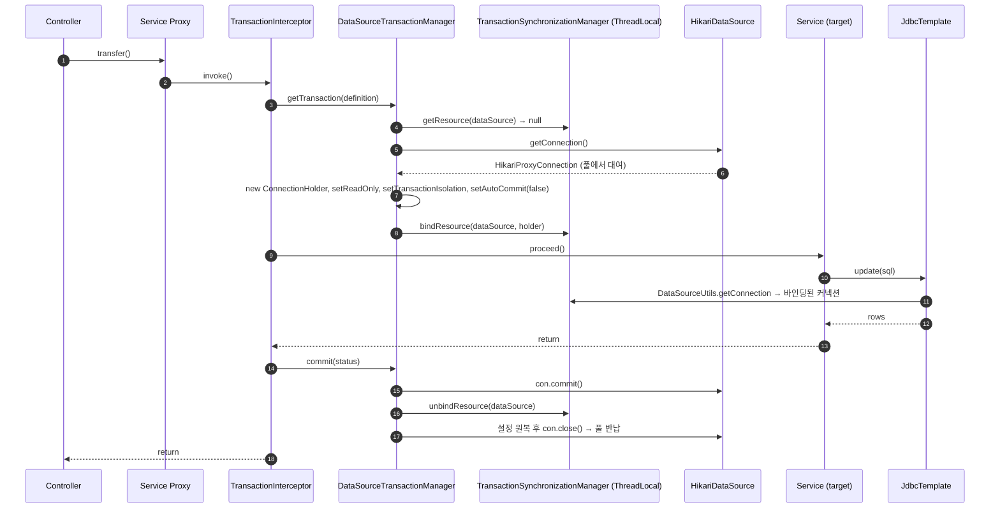
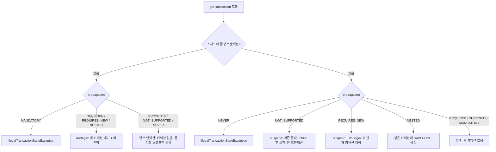
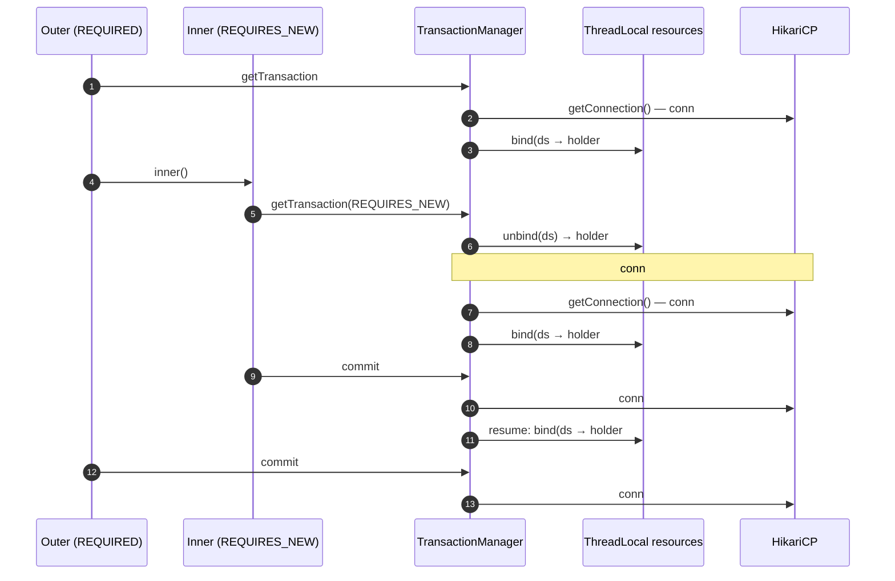

# @Transactional — 동작 원리와 DB 커넥션의 관계

관련 문서: [예제](./트랜잭셔널-예제.md)

> 연결되는 기존 학습 주제
> - **JPA 엔티티 설계**: 영속성 컨텍스트의 생존 범위 = 트랜잭션 범위(OSIV 제외). 지연 로딩(Lazy Loading) 예외가 왜 트랜잭션 밖에서 터지는지가 4.7·8.6과 연결된다.
> - **가상 스레드**: 트랜잭션 리소스는 `ThreadLocal`에 묶인다. 가상 스레드 환경에서는 스레드가 아니라 **커넥션 풀이 동시성 상한**이 된다 (10장).
> - **JWT + Spring Security**: `SecurityContextHolder`의 기본 전략도 `ThreadLocal`이다. `TransactionSynchronizationManager`와 같은 구조이며 같은 이유로 `@Async`에서 전파되지 않는다.

---

## 1. 한 줄 요약

`@Transactional`은 Spring AOP 프록시가 메서드 호출 전후에 `PlatformTransactionManager`를 통해 JDBC `Connection`을 획득해 현재 스레드에 바인딩하고, 메서드 종료 시 커밋 또는 롤백한 뒤 커넥션을 반납하도록 지시하는 선언적 트랜잭션 경계(declarative transaction boundary) 메타데이터다.

---

## 2. 왜 필요한가

### 2.1 순수 JDBC 시절

JDBC에서 "트랜잭션"은 **`Connection` 객체 하나에 붙은 상태**다. `setAutoCommit(false)` 이후 같은 커넥션으로 실행한 SQL만 같은 트랜잭션에 묶인다.

```java
Connection con = dataSource.getConnection();
try {
    con.setAutoCommit(false);
    accountDao.withdraw(con, from, amount);   // 같은 트랜잭션에 넣으려면 con을 넘겨야 한다
    accountDao.deposit(con, to, amount);
    con.commit();
} catch (SQLException e) {
    con.rollback();
    throw e;
} finally {
    con.setAutoCommit(true);
    con.close();                               // 누락하면 커넥션 누수
}
```

문제점:

1. **커넥션 전달(connection passing)** — 두 DAO가 같은 트랜잭션에 참여하려면 같은 `Connection`을 인자로 받아야 한다. 서비스 계층 시그니처가 JDBC API로 오염된다.
2. **기술 종속** — JDBC → Hibernate `Session` → JTA `UserTransaction`으로 바뀌면 경계 코드 전체를 다시 써야 한다.
3. **경계 코드 중복과 누수** — try/catch/finally가 모든 서비스 메서드에 반복되고, 하나만 빠져도 커넥션이 풀로 돌아가지 않는다.
4. EJB의 CMT(Container-Managed Transaction)는 선언적 트랜잭션을 제공했지만 애플리케이션 서버와 EJB 컴포넌트 모델에 묶였다.

### 2.2 Spring의 해법 — 세 겹의 추상화

| 계층 | 해결하는 문제 | 핵심 타입 |
|---|---|---|
| 트랜잭션 동기화 | 커넥션 전달 제거 | `TransactionSynchronizationManager`, `DataSourceUtils` |
| 트랜잭션 추상화 | 기술 종속 제거 | `PlatformTransactionManager` |
| 선언적 트랜잭션 | 경계 코드 중복 제거 | `@Transactional`, `TransactionInterceptor` |

`@Transactional`은 가장 바깥 껍데기일 뿐이고, **"DB 커넥션과의 관계"의 본체는 첫 번째 계층인 트랜잭션 동기화**다. 이 문서의 대부분은 그 계층을 설명한다.

---

## 3. 핵심 개념

| 용어 | 정의 |
|---|---|
| 트랜잭션 경계 (Transaction Boundary) | 트랜잭션이 시작되고 커밋/롤백으로 끝나는 코드 범위. `@Transactional` 메서드 1회 호출이 경계 1개다. |
| 트랜잭션 매니저 (`PlatformTransactionManager`) | `getTransaction` / `commit` / `rollback` 3개 메서드로 기술별 트랜잭션을 추상화한 SPI. 구현체: `DataSourceTransactionManager`, `JdbcTransactionManager`, `JpaTransactionManager`, `JtaTransactionManager`. |
| 트랜잭션 정의 (`TransactionDefinition`) | 전파·격리 수준·타임아웃·읽기 전용·이름을 담은 값. `@Transactional`의 속성이 이것으로 파싱된다. |
| 트랜잭션 속성 (`TransactionAttribute`) | `TransactionDefinition` + 롤백 규칙(`rollbackOn(Throwable)`) + 매니저 식별자(qualifier). |
| 트랜잭션 상태 (`TransactionStatus`) | 진행 중인 트랜잭션 1개의 핸들. 새 트랜잭션인지, 세이브포인트가 있는지, rollback-only인지 보관한다. |
| 트랜잭션 동기화 (Transaction Synchronization) | 트랜잭션용 리소스(커넥션 등)를 `ThreadLocal`에 바인딩해 같은 스레드의 데이터 접근 코드가 그 리소스를 재사용하게 하는 메커니즘. |
| 리소스 홀더 (Resource Holder) | 스레드에 바인딩되는 래퍼. JDBC는 `ConnectionHolder`, JPA는 `EntityManagerHolder`. rollback-only 플래그와 타임아웃 데드라인도 여기에 저장된다. |
| 물리 트랜잭션 (Physical Transaction) | 실제 DB 커넥션 위에서 `BEGIN`~`COMMIT/ROLLBACK`으로 이루어지는 트랜잭션. |
| 논리 트랜잭션 (Logical Transaction) | `@Transactional` 경계 하나. 여러 논리 트랜잭션이 물리 트랜잭션 하나에 참여할 수 있다. |
| 전파 (Propagation) | 이미 트랜잭션이 있는/없는 상태에서 새 경계를 만났을 때의 행동 규칙. 7종. |
| 참여 (Participating) | 새 물리 트랜잭션을 만들지 않고 기존 물리 트랜잭션(=기존 커넥션)을 그대로 쓰는 것. |
| 일시 중단 / 재개 (Suspend / Resume) | 현재 스레드에 바인딩된 리소스를 떼어 보관했다가 나중에 다시 붙이는 것. **커넥션을 풀에 반납하지 않는다.** |
| 세이브포인트 (Savepoint) | 하나의 물리 트랜잭션 안에서 부분 롤백 지점을 만드는 JDBC 3.0 기능. `NESTED` 전파가 사용한다. |
| rollback-only | "이 물리 트랜잭션은 커밋될 수 없다"는 표시. 참여 중인 논리 트랜잭션이 실패하면 설정된다. |
| 빈 트랜잭션 (Empty Transaction) | 물리 트랜잭션은 없지만 동기화 스코프만 존재하는 상태. `SUPPORTS`/`NOT_SUPPORTED`/`NEVER`에서 발생한다. |

핵심 관계: **물리 트랜잭션 1개 = 커넥션 1개**. 논리 트랜잭션은 N개일 수 있다. "모든 논리 트랜잭션이 커밋되어야 물리 트랜잭션이 커밋되고, 하나라도 롤백되면 물리 트랜잭션은 롤백된다"는 규칙이 여기서 나온다.

---

## 4. 동작 원리와 흐름

### 4.1 기동 시 — 프록시 생성

1. `@EnableTransactionManagement`(Boot는 `TransactionAutoConfiguration`이 대신 붙인다)가 `TransactionManagementConfigurationSelector`를 import한다.
2. `mode = PROXY`(기본)이면 `AutoProxyRegistrar`와 `ProxyTransactionManagementConfiguration`이 등록된다.
3. `ProxyTransactionManagementConfiguration`이 인프라 빈 3개를 만든다.
   - `AnnotationTransactionAttributeSource` — 메서드/클래스에서 `@Transactional`을 찾아 `TransactionAttribute`로 변환
   - `TransactionInterceptor` — 실제 트랜잭션 경계를 실행하는 `MethodInterceptor`
   - `BeanFactoryTransactionAttributeSourceAdvisor` — 위 둘을 묶은 Advisor(포인트컷 = "트랜잭션 속성이 있는 메서드")
4. `AutoProxyRegistrar`가 등록한 오토 프록시 크리에이터(`InfrastructureAdvisorAutoProxyCreator`, Boot처럼 `@EnableAspectJAutoProxy`가 함께 있으면 `AnnotationAwareAspectJAutoProxyCreator`로 승격)가 `postProcessAfterInitialization` → `AbstractAutoProxyCreator#wrapIfNecessary`에서 Advisor가 적용되는 빈을 프록시로 교체한다.
5. 컨테이너에는 **원본 빈 대신 프록시**가 등록된다. 다른 빈이 주입받는 것도 프록시다.

### 4.2 호출 시 — 새 트랜잭션 (`REQUIRED`, 기존 트랜잭션 없음, JDBC)

1. 컨트롤러가 프록시의 `transfer()`를 호출한다.
2. 프록시(CGLIB 서브클래스 또는 JDK 동적 프록시)가 `TransactionInterceptor#invoke`로 진입한다.
3. `TransactionAspectSupport#invokeWithinTransaction`이 `TransactionAttributeSource`에서 속성을 조회하고(캐시됨), 사용할 `TransactionManager` 빈을 결정한다.
4. `createTransactionIfNecessary` → `PlatformTransactionManager#getTransaction(definition)` 호출.
5. `DataSourceTransactionManager#doGetTransaction`이 **트랜잭션 객체(`DataSourceTransactionObject`)를 새로 생성**하고, `TransactionSynchronizationManager.getResource(dataSource)`로 스레드에 이미 바인딩된 `ConnectionHolder`가 있는지 본다. 없다.
6. `startTransaction` → `doBegin`:
   1. `dataSource.getConnection()` — **이 시점에 HikariCP에서 커넥션을 빌린다.** SQL은 아직 하나도 실행되지 않았다.
   2. **`ConnectionHolder` 생성**, `readOnly`·격리 수준 적용, `setAutoCommit(false)`.
   3. `TransactionSynchronizationManager.bindResource(dataSource, holder)` — `ThreadLocal<Map>`에 `DataSource → ConnectionHolder`로 저장.
7. `prepareSynchronization` — 현재 트랜잭션 이름·readOnly·격리 수준·활성 여부를 `ThreadLocal`에 기록, 동기화 콜백 목록 초기화.
8. **`TransactionInfo` 생성**, `TransactionAspectSupport`의 `ThreadLocal`에 push.
9. 실제 비즈니스 메서드 실행. 내부에서 `JdbcTemplate`이 `DataSourceUtils.getConnection(dataSource)`를 부르면 풀에서 새로 빌리지 않고 **스레드에 바인딩된 커넥션을 받는다.**
10. 정상 반환 → `commitTransactionAfterReturning` → `commit` → `doCommit`(`con.commit()`).
    예외 → `completeTransactionAfterThrowing` → 롤백 규칙 판단 → `rollback` 또는 `commit`.
11. `triggerAfterCommit`/`triggerAfterCompletion` — 등록된 `TransactionSynchronization` 콜백 실행.
12. `doCleanupAfterCompletion` — `unbindResource`, autocommit·readOnly·격리 수준 원복, `con.close()` → **Hikari 풀로 반납**. `ConnectionHolder`와 트랜잭션 객체는 참조가 끊겨 GC 대상이 된다.
13. `cleanupTransactionInfo` — `TransactionInfo`를 이전 값으로 복원.



### 4.3 이미 트랜잭션이 있을 때 — 전파 결정

`getTransaction`은 먼저 "현재 스레드에 활성 트랜잭션이 있는가"(`isExistingTransaction` = 바인딩된 `ConnectionHolder`가 있고 `isTransactionActive()`)로 분기한 뒤 전파 속성을 본다.



### 4.4 전파 옵션별 커넥션 점유 (DataSource/JDBC 기준)

| 전파 | 기존 트랜잭션 없음 | 기존 트랜잭션 있음 | 한 스레드가 동시에 쥐는 커넥션 수 |
|---|---|---|---|
| `REQUIRED` (기본) | 새 물리 트랜잭션, `doBegin`에서 1개 대여 | 참여. 추가 대여 없음 | 1 |
| `REQUIRES_NEW` | 새 물리 트랜잭션 | 기존 홀더를 **떼어서 보관만** 하고 새 커넥션 대여 | **2** (중첩 깊이 n이면 n+1) |
| `NESTED` | 새 물리 트랜잭션 | 같은 커넥션에서 `Connection#setSavepoint` | 1 |
| `SUPPORTS` | 빈 트랜잭션. 첫 SQL에서 대여해 **스코프 끝까지 보유**(autocommit=true) | 참여 | 1 |
| `NOT_SUPPORTED` | `SUPPORTS`의 "없음"과 같음 | 기존 홀더 보관 + 첫 SQL에서 새 커넥션 대여(autocommit) | **2** |
| `MANDATORY` | 예외 | 참여 | 1 |
| `NEVER` | `SUPPORTS`의 "없음"과 같음 | 예외 | 1 |

두 가지가 직관과 다르다.

- **suspend는 반납이 아니다.** `REQUIRES_NEW`/`NOT_SUPPORTED`는 바깥 커넥션을 풀에 돌려주지 않은 채 커넥션을 하나 더 빌린다. 커넥션 풀 데드락(8.4)의 원인이다.
- **`SUPPORTS`(트랜잭션 없음)는 "아무것도 안 함"이 아니다.** 기본 설정(`SYNCHRONIZATION_ALWAYS`)에서는 동기화 스코프가 열리므로, 스코프 안의 JDBC 호출들이 **같은 커넥션을 공유**하고 스코프 종료 시 반납된다. `TransactionDefinition#PROPAGATION_SUPPORTS` Javadoc에 명시된 동작이다.



### 4.5 옵션별로 커넥션에 실제로 일어나는 일

| 옵션 | JDBC 커넥션에 가해지는 조작 | 적용 조건 |
|---|---|---|
| `readOnly = true` | `Connection#setReadOnly(true)` (`DataSourceUtils#prepareConnectionForTransaction`). `enforceReadOnly=true`면 추가로 `SET TRANSACTION READ ONLY` 실행. JPA/Hibernate는 `FlushMode.MANUAL` + 세션 기본 read-only(스냅샷 미보관). 종료 시 `setReadOnly(false)`로 원복. | **새 물리 트랜잭션을 시작할 때만**. 참여 시 무시. |
| `isolation` | 시작 전 `Connection#setTransactionIsolation(level)`, 이전 값을 저장했다가 종료 시 복원. `DEFAULT`면 아무것도 안 함(= DB 기본값, PostgreSQL은 READ COMMITTED). | 새 물리 트랜잭션만. 참여 시 무시. |
| `timeout` | `ConnectionHolder`에 데드라인 저장 → `JdbcTemplate`이 `Statement` 생성 시 `DataSourceUtils#applyTransactionTimeout` → `Statement#setQueryTimeout(남은 초)`. 데드라인이 지났으면 `TransactionTimedOutException`. | 새 물리 트랜잭션만. Java 코드 실행 자체를 끊지 않는다. |
| `rollbackFor` / `noRollbackFor` | 커넥션 조작 없음. 예외 발생 시 `con.rollback()`과 `con.commit()` 중 무엇을 부를지 결정. | 모든 경계. 참여 트랜잭션에서 롤백 판정이면 rollback-only 표시. |
| `propagation` | 커넥션을 새로 빌릴지 / 공유할지 / 보관할지 / 세이브포인트를 만들지 결정 (4.4). | 모든 경계. |
| `transactionManager` / `value` | 어떤 `PlatformTransactionManager` → 어떤 `DataSource` → **어떤 커넥션 풀**을 쓸지 결정. | 모든 경계. 다른 매니저의 트랜잭션에는 참여하지 않는다. |
| `label` (5.3+) | 커넥션 조작 없음. `TransactionDefinition#getLabels`로 전달되는 메타데이터. | — |

PostgreSQL 관점의 보충:

- `readOnly`: PgJDBC는 `readOnlyMode` 속성(기본 `transaction`)에 따라 autocommit=false인 커넥션의 트랜잭션을 `BEGIN READ ONLY`로 시작한다. 쓰기 SQL은 `ERROR: cannot execute INSERT in a read-only transaction`(SQLState `25006`)으로 실패한다. 드라이버 버전별 세부 동작은 확인 필요 — `enforceReadOnly`를 켜면 드라이버와 무관하게 SQL로 강제된다.
- `isolation`: PostgreSQL의 `READ UNCOMMITTED`는 `READ COMMITTED`로 동작한다. `REPEATABLE READ`는 스냅샷 격리라 동시 갱신 시 `40001 could not serialize access`로 실패하고, `SERIALIZABLE`은 SSI(Serializable Snapshot Isolation)로 역시 `40001`을 던진다. 둘 다 **재시도 로직이 필수**다. Oracle은 `READ COMMITTED`/`SERIALIZABLE`만 지원하므로 `REPEATABLE_READ` 지정 시 드라이버가 예외를 던진다.
- autocommit 전환: PgJDBC는 `setAutoCommit(false)` 자체로 네트워크 왕복을 하지 않고, 다음 SQL 앞에 `BEGIN`을 붙여 보낸다.

### 4.6 트랜잭션 없는 호출과의 차이

`@Transactional`이 없는 서비스에서 `JdbcTemplate`을 두 번 호출하면:

1. 첫 호출: `DataSourceUtils.getConnection` → 바인딩된 홀더 없음, 동기화 비활성 → 풀에서 대여 → autocommit=true로 SQL 실행 → 즉시 `close()`(반납).
2. 두 번째 호출: 다시 대여 → 실행 → 반납. **물리 커넥션이 같을 수도 다를 수도 있다.** 두 SQL은 원자적이지 않다.

Spring Data JPA의 `SimpleJpaRepository`는 클래스 레벨 `@Transactional(readOnly = true)`, `save`/`delete` 계열에 `@Transactional`이 붙어 있다. 서비스에 `@Transactional`이 없으면 **리포지토리 메서드마다 트랜잭션과 커넥션 대여·반납이 따로** 일어난다.

### 4.7 커넥션 대여·반납 시점 정리

| 구성 | 대여 시점 | 반납 시점 |
|---|---|---|
| `JdbcTemplate`, 트랜잭션 없음 | SQL 실행 직전 | SQL 실행 직후 |
| `@Transactional` + `DataSourceTransactionManager`/`JdbcTransactionManager` | `doBegin` — 메서드 본문 진입 **전** | 커밋/롤백 후 `doCleanupAfterCompletion` |
| 빈 트랜잭션(`SUPPORTS` 등) | 스코프 내 첫 SQL | 스코프 종료(`DataSourceUtils.ConnectionSynchronization#afterCompletion`) |
| `LazyConnectionDataSourceProxy`로 감싼 경우 | 첫 `Statement` 생성 시 | 위와 동일 |
| `JpaTransactionManager` + Hibernate 기본 | `EntityTransaction#begin` — autocommit 확인·해제를 위해 물리 커넥션 획득 | 트랜잭션 종료 시 `EntityManager#close` |
| JPA + `hibernate.connection.provider_disables_autocommit=true` + Hikari `auto-commit=false` | 첫 SQL까지 지연. 단 `readOnly`/`isolation` 지정 시 `HibernateJpaDialect#beginTransaction`이 커넥션을 준비하므로 begin 시점 | 위와 동일 |
| JPA + OSIV(`spring.jpa.open-in-view=true`, Boot 기본값) | 위와 동일 | **HTTP 요청 종료 시**. `EntityManager`가 요청 범위로 살아 있고 `HibernateJpaVendorAdapter`가 `DELAYED_ACQUISITION_AND_HOLD`를 설정하기 때문 (내부 해제 경로의 버전별 세부는 확인 필요) |

---

## 5. 내부 구현

> 아래 코드는 Spring Framework 6.1~6.2 소스를 **발췌·단순화**한 것이다. 로깅·리액티브 분기·예외 세부는 생략했다. 메서드 시그니처는 버전마다 조금씩 다르다(예: `startTransaction`은 5.2에서 추출되었고 6.x에서 파라미터가 추가됨).

### 5.1 `TransactionAspectSupport#invokeWithinTransaction` — 경계의 골격

```java
protected Object invokeWithinTransaction(Method method, @Nullable Class<?> targetClass,
        final InvocationCallback invocation) throws Throwable {

    TransactionAttributeSource tas = getTransactionAttributeSource();
    final TransactionAttribute txAttr = (tas != null ? tas.getTransactionAttribute(method, targetClass) : null);
    final TransactionManager tm = determineTransactionManager(txAttr);   // qualifier → 기본 빈 순으로 조회, 캐시
    PlatformTransactionManager ptm = asPlatformTransactionManager(tm);
    final String joinpointIdentification = methodIdentification(method, targetClass, txAttr); // "패키지.클래스.메서드" = 트랜잭션 이름

    TransactionInfo txInfo = createTransactionIfNecessary(ptm, txAttr, joinpointIdentification);
    Object retVal;
    try {
        retVal = invocation.proceedWithInvocation();          // 다음 인터셉터 또는 타깃 메서드
    }
    catch (Throwable ex) {
        completeTransactionAfterThrowing(txInfo, ex);         // 롤백 규칙 판단
        throw ex;                                             // 예외는 항상 다시 던진다
    }
    finally {
        cleanupTransactionInfo(txInfo);                       // ThreadLocal<TransactionInfo> 복원
    }
    commitTransactionAfterReturning(txInfo);
    return retVal;
}

protected void completeTransactionAfterThrowing(@Nullable TransactionInfo txInfo, Throwable ex) {
    if (txInfo != null && txInfo.getTransactionStatus() != null) {
        if (txInfo.transactionAttribute != null && txInfo.transactionAttribute.rollbackOn(ex)) {
            txInfo.getTransactionManager().rollback(txInfo.getTransactionStatus());
        }
        else {
            // 롤백 대상이 아닌 예외(기본: checked exception)는 "커밋"한다. 예외는 호출자에게 그대로 전달된다.
            txInfo.getTransactionManager().commit(txInfo.getTransactionStatus());
        }
    }
}
```

- `TransactionInfo`도 `ThreadLocal`(`transactionInfoHolder`)에 쌓인다. `TransactionAspectSupport.currentTransactionStatus().setRollbackOnly()`가 동작하는 이유다.
- 속성 조회 결과는 `AbstractFallbackTransactionAttributeSource`의 `attributeCache`에 `(Method, targetClass)` 키로 캐시된다. 탐색 순서는 **타깃 클래스의 구체 메서드 → 타깃 클래스 → 인터페이스 메서드 → 인터페이스**다. 메서드 레벨이 클래스 레벨보다 우선한다.
- 롤백 규칙: `DefaultTransactionAttribute#rollbackOn`은 `ex instanceof RuntimeException || ex instanceof Error`. `rollbackFor`가 있으면 `RuleBasedTransactionAttribute#rollbackOn`이 등록된 `RollbackRuleAttribute`들 중 **상속 깊이(`getDepth`)가 가장 가까운 규칙**을 채택하고, 매칭되는 규칙이 없으면 기본 규칙으로 돌아간다.

### 5.2 `AbstractPlatformTransactionManager#getTransaction` — 템플릿 메서드

전파 로직은 모두 추상 클래스에 있고, 기술별 구현체는 `doGetTransaction`/`isExistingTransaction`/`doBegin`/`doSuspend`/`doResume`/`doCommit`/`doRollback`/`doSetRollbackOnly`/`doCleanupAfterCompletion`만 구현한다(Template Method 패턴).

```java
public final TransactionStatus getTransaction(@Nullable TransactionDefinition definition) {
    TransactionDefinition def = (definition != null ? definition : TransactionDefinition.withDefaults());
    Object transaction = doGetTransaction();                      // 매 호출마다 새 트랜잭션 객체

    if (isExistingTransaction(transaction)) {
        return handleExistingTransaction(def, transaction, debugEnabled);
    }
    if (def.getPropagationBehavior() == TransactionDefinition.PROPAGATION_MANDATORY) {
        throw new IllegalTransactionStateException(
                "No existing transaction found for transaction marked with propagation 'mandatory'");
    }
    else if (def.getPropagationBehavior() == TransactionDefinition.PROPAGATION_REQUIRED ||
            def.getPropagationBehavior() == TransactionDefinition.PROPAGATION_REQUIRES_NEW ||
            def.getPropagationBehavior() == TransactionDefinition.PROPAGATION_NESTED) {
        SuspendedResourcesHolder suspendedResources = suspend(null);   // 빈 트랜잭션의 동기화만 보관
        try {
            return startTransaction(def, transaction, false, debugEnabled, suspendedResources);
        }
        catch (RuntimeException | Error ex) {
            resume(null, suspendedResources);
            throw ex;
        }
    }
    else {
        // SUPPORTS / NOT_SUPPORTED / NEVER: 물리 트랜잭션 없음. 동기화 스코프만 연다.
        boolean newSynchronization = (getTransactionSynchronization() == SYNCHRONIZATION_ALWAYS);
        return prepareTransactionStatus(def, null, true, newSynchronization, debugEnabled, null);
    }
}

private TransactionStatus startTransaction(TransactionDefinition definition, Object transaction,
        boolean nested, boolean debugEnabled, @Nullable SuspendedResourcesHolder suspendedResources) {
    boolean newSynchronization = (getTransactionSynchronization() != SYNCHRONIZATION_NEVER);
    DefaultTransactionStatus status = newTransactionStatus(
            definition, transaction, true, newSynchronization, nested, debugEnabled, suspendedResources);
    doBegin(transaction, definition);             // ① 커넥션 대여
    prepareSynchronization(status, definition);   // ② ThreadLocal에 readOnly/isolation/name 기록
    return status;
}
```

`doBegin`(①)이 `prepareSynchronization`(②)보다 먼저 실행된다는 순서가 8.7(읽기 전용 라우팅 함정)의 원인이다.

`handleExistingTransaction` 요약:

```java
if (NEVER)          throw new IllegalTransactionStateException("Existing transaction found for transaction marked with propagation 'never'");
if (NOT_SUPPORTED)  { Object suspended = suspend(transaction);
                      return prepareTransactionStatus(definition, null, false, newSynchronization, debugEnabled, suspended); }
if (REQUIRES_NEW)   { SuspendedResourcesHolder suspended = suspend(transaction);
                      try { return startTransaction(definition, transaction, false, debugEnabled, suspended); }
                      catch (RuntimeException | Error beginEx) { resumeAfterBeginException(transaction, suspended, beginEx); throw beginEx; } }
if (NESTED)         { if (!isNestedTransactionAllowed()) throw new NestedTransactionNotSupportedException(...);
                      if (useSavepointForNestedTransaction()) {
                          DefaultTransactionStatus status = newTransactionStatus(definition, transaction, false, false, true, debugEnabled, null);
                          status.createAndHoldSavepoint();            // Connection#setSavepoint
                          return status; }
                      else { return startTransaction(definition, transaction, true, debugEnabled, null); } } // JTA 등
// SUPPORTS / REQUIRED / MANDATORY: 참여
if (isValidateExistingTransaction()) { /* 격리 수준·readOnly 불일치 시 IllegalTransactionStateException */ }
return prepareTransactionStatus(definition, transaction, false, newSynchronization, debugEnabled, null);
```

- 참여 시 `newTransaction=false`인 `TransactionStatus`가 만들어진다. 이 status로 `commit`을 불러도 **`doCommit`은 호출되지 않는다**(`processCommit`이 `status.isNewTransaction()`을 확인).
- `validateExistingTransaction`은 기본 `false`다. 그래서 참여하는 쪽의 `readOnly`/`isolation`은 **조용히 무시**된다.

### 5.3 `DataSourceTransactionManager` — 커넥션을 직접 다루는 곳

```java
@Override
protected Object doGetTransaction() {
    DataSourceTransactionObject txObject = new DataSourceTransactionObject();
    txObject.setSavepointAllowed(isNestedTransactionAllowed());
    ConnectionHolder conHolder = (ConnectionHolder) TransactionSynchronizationManager.getResource(obtainDataSource());
    txObject.setConnectionHolder(conHolder, false);        // false = 내가 만든 홀더가 아님
    return txObject;
}

@Override
protected boolean isExistingTransaction(Object transaction) {
    DataSourceTransactionObject txObject = (DataSourceTransactionObject) transaction;
    return (txObject.hasConnectionHolder() && txObject.getConnectionHolder().isTransactionActive());
}

@Override
protected void doBegin(Object transaction, TransactionDefinition definition) {
    DataSourceTransactionObject txObject = (DataSourceTransactionObject) transaction;
    Connection con = null;
    try {
        if (!txObject.hasConnectionHolder() ||
                txObject.getConnectionHolder().isSynchronizedWithTransaction()) {
            Connection newCon = obtainDataSource().getConnection();          // 풀에서 대여
            txObject.setConnectionHolder(new ConnectionHolder(newCon), true);
        }
        txObject.getConnectionHolder().setSynchronizedWithTransaction(true);
        con = txObject.getConnectionHolder().getConnection();

        Integer previousIsolationLevel = DataSourceUtils.prepareConnectionForTransaction(con, definition); // readOnly, isolation
        txObject.setPreviousIsolationLevel(previousIsolationLevel);
        txObject.setReadOnly(definition.isReadOnly());

        if (con.getAutoCommit()) {
            txObject.setMustRestoreAutoCommit(true);
            con.setAutoCommit(false);
        }
        prepareTransactionalConnection(con, definition);   // enforceReadOnly면 "SET TRANSACTION READ ONLY"
        txObject.getConnectionHolder().setTransactionActive(true);

        int timeout = determineTimeout(definition);
        if (timeout != TransactionDefinition.TIMEOUT_DEFAULT) {
            txObject.getConnectionHolder().setTimeoutInSeconds(timeout);
        }
        if (txObject.isNewConnectionHolder()) {
            TransactionSynchronizationManager.bindResource(obtainDataSource(), txObject.getConnectionHolder());
        }
    }
    catch (Throwable ex) {
        if (txObject.isNewConnectionHolder()) {
            DataSourceUtils.releaseConnection(con, obtainDataSource());
            txObject.setConnectionHolder(null, false);
        }
        throw new CannotCreateTransactionException("Could not open JDBC Connection for transaction", ex);
    }
}

@Override
protected Object doSuspend(Object transaction) {
    DataSourceTransactionObject txObject = (DataSourceTransactionObject) transaction;
    txObject.setConnectionHolder(null);
    return TransactionSynchronizationManager.unbindResource(obtainDataSource()); // close() 없음 → 대여 상태 유지
}

@Override
protected void doResume(@Nullable Object transaction, Object suspendedResources) {
    TransactionSynchronizationManager.bindResource(obtainDataSource(), suspendedResources);
}

@Override
protected void doSetRollbackOnly(DefaultTransactionStatus status) {
    DataSourceTransactionObject txObject = (DataSourceTransactionObject) status.getTransaction();
    txObject.setRollbackOnly();              // → ConnectionHolder#setRollbackOnly: 모든 참여자가 공유
}

@Override
protected void doCleanupAfterCompletion(Object transaction) {
    DataSourceTransactionObject txObject = (DataSourceTransactionObject) transaction;
    if (txObject.isNewConnectionHolder()) {
        TransactionSynchronizationManager.unbindResource(obtainDataSource());
    }
    Connection con = txObject.getConnectionHolder().getConnection();
    try {
        if (txObject.isMustRestoreAutoCommit()) {
            con.setAutoCommit(true);
        }
        DataSourceUtils.resetConnectionAfterTransaction(con, txObject.getPreviousIsolationLevel(), txObject.isReadOnly());
    }
    catch (Throwable ex) {
        logger.debug("Could not reset JDBC Connection after transaction", ex);
    }
    if (txObject.isNewConnectionHolder()) {
        DataSourceUtils.releaseConnection(con, this.dataSource);   // HikariProxyConnection#close → 풀 반납
    }
    txObject.getConnectionHolder().clear();
}
```

- `isNewConnectionHolder`가 핵심 플래그다. 참여 트랜잭션은 이 값이 `false`라서 **바인딩 해제도, 반납도 하지 않는다.** 커넥션의 소유권은 그것을 대여한 가장 바깥 경계에만 있다.
- `DataSourceTransactionManager`는 생성자에서 `setNestedTransactionAllowed(true)`를 호출한다. 그래서 JDBC에서는 `NESTED`가 바로 동작한다.
- `JdbcTransactionManager`(5.3+)는 이 클래스의 하위 클래스로, 커밋/롤백 시 발생한 `SQLException`을 `SQLExceptionTranslator`로 `DataAccessException` 계층으로 번역한다는 점만 다르다.

### 5.4 `TransactionSynchronizationManager` — 스레드 바인딩의 실체

```java
public abstract class TransactionSynchronizationManager {
    private static final ThreadLocal<Map<Object, Object>> resources =
            new NamedThreadLocal<>("Transactional resources");                 // DataSource → ConnectionHolder
    private static final ThreadLocal<Set<TransactionSynchronization>> synchronizations =
            new NamedThreadLocal<>("Transaction synchronizations");            // afterCommit 콜백 등
    private static final ThreadLocal<String> currentTransactionName =
            new NamedThreadLocal<>("Current transaction name");
    private static final ThreadLocal<Boolean> currentTransactionReadOnly =
            new NamedThreadLocal<>("Current transaction read-only status");
    private static final ThreadLocal<Integer> currentTransactionIsolationLevel =
            new NamedThreadLocal<>("Current transaction isolation level");
    private static final ThreadLocal<Boolean> actualTransactionActive =
            new NamedThreadLocal<>("Actual transaction active");
}
```

- `NamedThreadLocal`은 `InheritableThreadLocal`이 아니다. **자식 스레드로 전파되지 않는다** → `@Async`, `CompletableFuture.supplyAsync`, `parallelStream` 내부는 트랜잭션 밖이다.
- 리소스 맵의 **키는 `DataSource` 인스턴스**다(`InfrastructureProxy`면 `unwrapResourceIfNecessary`로 벗겨냄). 트랜잭션 매니저와 `JdbcTemplate`이 **서로 다른 `DataSource` 객체**를 보고 있으면 키가 달라 트랜잭션에 참여하지 못한다(8.12).
- JPA는 `EntityManagerFactory`를 키로 `EntityManagerHolder`를 저장한다.

### 5.5 `DataSourceUtils#doGetConnection` — `JdbcTemplate`·MyBatis가 같은 커넥션을 받는 이유

```java
public static Connection doGetConnection(DataSource dataSource) throws SQLException {
    ConnectionHolder conHolder = (ConnectionHolder) TransactionSynchronizationManager.getResource(dataSource);
    if (conHolder != null && (conHolder.hasConnection() || conHolder.isSynchronizedWithTransaction())) {
        conHolder.requested();                                // 참조 카운트 +1
        if (!conHolder.hasConnection()) {
            conHolder.setConnection(fetchConnection(dataSource));
        }
        return conHolder.getConnection();                     // 스레드에 바인딩된 커넥션 재사용
    }
    Connection con = fetchConnection(dataSource);             // 풀에서 대여
    if (TransactionSynchronizationManager.isSynchronizationActive()) {
        // 빈 트랜잭션(SUPPORTS 등) 스코프: 이 커넥션을 스코프 끝까지 바인딩해 재사용
        ConnectionHolder holderToUse = conHolder;
        if (holderToUse == null) {
            holderToUse = new ConnectionHolder(con);
        } else {
            holderToUse.setConnection(con);
        }
        holderToUse.requested();
        TransactionSynchronizationManager.registerSynchronization(new ConnectionSynchronization(holderToUse, dataSource));
        holderToUse.setSynchronizedWithTransaction(true);
        if (holderToUse != conHolder) {
            TransactionSynchronizationManager.bindResource(dataSource, holderToUse);
        }
    }
    return con;
}
```

- `JdbcTemplate#execute`는 끝에서 `DataSourceUtils.releaseConnection`을 부르지만, 바인딩된 커넥션이면 **`close()` 대신 참조 카운트만 내린다**(`ConnectionHolder#released`).
- mybatis-spring의 `SpringManagedTransaction`도 `DataSourceUtils.getConnection`을 사용한다. 그래서 JPA 없이 MyBatis만 써도 `DataSourceTransactionManager` 트랜잭션에 참여한다.
- 반대로 `dataSource.getConnection()`을 **직접** 호출하는 코드는 이 경로를 우회하므로 트랜잭션 밖의 별도 커넥션을 받는다.

### 5.6 rollback-only 전파와 `UnexpectedRollbackException`

```java
private void processRollback(DefaultTransactionStatus status, boolean unexpected) {
    if (status.hasSavepoint()) {
        status.rollbackToHeldSavepoint();                // NESTED: 세이브포인트까지만
    }
    else if (status.isNewTransaction()) {
        doRollback(status);                               // 바깥 경계: con.rollback()
    }
    else {
        if (status.hasTransaction() &&
                (status.isLocalRollbackOnly() || isGlobalRollbackOnParticipationFailure())) {
            doSetRollbackOnly(status);                    // 참여 경계: ConnectionHolder에 표시만
        }
    }
    // unexpected가 true면 afterCompletion 후 UnexpectedRollbackException
}

public final void commit(TransactionStatus status) {
    DefaultTransactionStatus defStatus = (DefaultTransactionStatus) status;
    if (defStatus.isLocalRollbackOnly()) {
        processRollback(defStatus, false);
        return;
    }
    if (!shouldCommitOnGlobalRollbackOnly() && defStatus.isGlobalRollbackOnly()) {
        processRollback(defStatus, true);   // "Transaction silently rolled back because it has been marked as rollback-only"
        return;
    }
    processCommit(defStatus);
}
```

`globalRollbackOnParticipationFailure`는 기본 `true`다. 안쪽 `REQUIRED` 경계에서 롤백 대상 예외가 한 번이라도 인터셉터를 통과하면, 바깥에서 `catch`로 삼켜도 물리 트랜잭션은 이미 rollback-only다.

### 5.7 `JpaTransactionManager` + `HibernateJpaDialect`

1. `doGetTransaction` — `EntityManagerFactory` 키로 `EntityManagerHolder`, `DataSource` 키로 `ConnectionHolder`를 조회한다.
2. `doBegin`
   1. 바인딩된 `EntityManager`가 없으면 `createEntityManagerForTransaction()`으로 **새 `EntityManager`(= 새 영속성 컨텍스트) 생성**.
   2. `getJpaDialect().beginTransaction(em, definition)` → `HibernateJpaDialect#beginTransaction`
      - `isolation`이 기본값이 아니거나 `readOnly`면, Hibernate 논리 커넥션에서 **물리 커넥션을 꺼내** `DataSourceUtils.prepareConnectionForTransaction` 적용. 이 조건에서 격리 수준을 적용할 수 없으면 `InvalidIsolationLevelException`.
      - `entityManager.getTransaction().begin()` — Hibernate가 물리 커넥션을 획득하고 autocommit을 끈다.
      - `readOnly`면 `FlushMode.MANUAL`, 그리고 새로 만든 `EntityManager`에 한해 `Session#setDefaultReadOnly(true)`(엔티티 스냅샷 미보관 → 더티 체킹 없음, 메모리 절감). OSIV로 기존 `EntityManager`에 참여할 때 적용 범위는 확인 필요.
   3. `JpaTransactionManager`에 `DataSource`가 설정되어 있으면(Boot는 `EntityManagerFactoryInfo`에서 자동 감지) `getJpaDialect().getJdbcConnection(em, readOnly)` 핸들을 `ConnectionHolder`로 감싸 **`DataSource` 키로도 바인딩**한다. 같은 트랜잭션 안의 `JdbcTemplate`/MyBatis가 JPA와 같은 커넥션을 쓰는 이유다.
3. `HibernateJpaVendorAdapter`는 `hibernate.connection.handling_mode=DELAYED_ACQUISITION_AND_HOLD`를 설정한다. 물리 커넥션은 **처음 필요할 때 획득해 `Session`이 닫힐 때까지 보유**한다.
4. `NESTED` — `JpaTransactionManager`는 세이브포인트를 `JpaDialect`에 위임하는데, `HibernateJpaDialect`는 JPA 세이브포인트를 지원하지 않아 `NestedTransactionNotSupportedException`이 발생한다(Spring 6.x 기준 동작 확인 필요). 지원되더라도 세이브포인트 롤백은 영속성 컨텍스트를 되돌리지 않으므로 JPA와 섞어 쓰는 것은 위험하다.

---

## 6. 유사 개념과의 비교

### 6.1 트랜잭션 경계를 정하는 방법

| 방식 | 경계 단위 | 장점 | 한계 | 선택 기준 |
|---|---|---|---|---|
| `@Transactional` (프록시) | public/protected 메서드 | 선언적, 비즈니스 코드 무오염 | 자기 호출·final·private 미적용, 경계가 메서드 단위로 고정 | 기본 선택 |
| `TransactionTemplate` | 람다/콜백 블록 | 메서드 일부만 트랜잭션, 자기 호출 문제 없음, 경계가 코드에 보임 | 코드에 트랜잭션 API 노출 | 외부 호출과 DB 작업이 한 메서드에 섞일 때, 루프 안 청크 단위 커밋 |
| `PlatformTransactionManager` 직접 | 임의 | 가장 세밀함 | try/catch/finally 직접 작성 | 프레임워크·인프라 코드 |
| AspectJ 모드 (`mode = AdviceMode.ASPECTJ`) | 모든 메서드(바이트코드 위빙) | 자기 호출·private에도 적용 | 컴파일/로드타임 위빙 설정 필요 | 레거시에서 자기 호출이 광범위할 때 |
| `jakarta.transaction.Transactional` | 메서드 | 표준 어노테이션(JTA 1.2) | `readOnly`/`isolation`/`timeout` 없음, 기본 롤백 규칙은 동일(Unchecked) | Jakarta EE 호환성이 필요할 때 |
| `TransactionalOperator` (5.2+) | `Mono`/`Flux` 체인 | 리액티브 컨텍스트 전파 | R2DBC 등 리액티브 드라이버 전용 | WebFlux + R2DBC |

### 6.2 트랜잭션 매니저

| 구현체 | 리소스 키 | 커넥션 획득 | `NESTED` | 선택 기준 |
|---|---|---|---|---|
| `DataSourceTransactionManager` | `DataSource` | `doBegin`에서 즉시 | 세이브포인트로 지원 | JDBC/MyBatis, 레거시 Spring |
| `JdbcTransactionManager` (5.3+) | `DataSource` | 동일 | 동일 | 위와 같되 커밋 예외도 `DataAccessException`으로 받고 싶을 때 (Boot 3.x JDBC 전용 구성의 기본) |
| `JpaTransactionManager` | `EntityManagerFactory` (+`DataSource`) | Hibernate `begin` 시점(설정에 따라 지연) | Hibernate 조합에서 미지원 | JPA 사용 시. JDBC 코드도 함께 참여 |
| `JtaTransactionManager` | JTA `UserTransaction` | XA 리소스 참여 시 | JTA 구현에 따름 | 여러 DB/MQ를 2PC로 묶어야 할 때 (성능 비용 큼) |

### 6.3 `REQUIRES_NEW` vs `NESTED` vs 경계 분리

| 목적 | `REQUIRES_NEW` | `NESTED` | 호출자에서 경계 분리 |
|---|---|---|---|
| 바깥이 롤백돼도 안쪽 결과 유지 (감사 로그) | O | X (같은 물리 트랜잭션) | O |
| 안쪽 실패만 되돌리고 바깥 계속 | O | O | O |
| 스레드당 커넥션 | 2 | 1 | 1 |
| 안쪽이 바깥의 미커밋 데이터를 봄 | X (다른 트랜잭션, 락 대기 가능) | O | 해당 없음 |
| JPA 호환 | O | X | O |

판단 기준: **커넥션 풀 고갈 위험이 있는 동시성 높은 경로에서는 `REQUIRES_NEW`보다 경계 분리를 먼저 검토**한다. JDBC 전용 경로에서 "실패해도 계속"이 필요하면 `NESTED`가 가장 싸다.

---

## 7. 버전별 차이

### 7.1 Spring Framework

| 버전 | 변화 |
|---|---|
| 1.2 | `@Transactional` 도입 (Java 5 어노테이션) |
| 2.0 | `<tx:annotation-driven/>` XML 네임스페이스 |
| 3.0 | `@Transactional("txManagerName")` — `value`로 매니저 한정자 지정 |
| 3.1 | `@EnableTransactionManagement`, `TransactionManagementConfigurer` (Java Config) |
| 3.x 공통 | `proxyTargetClass=false` 기본 → 인터페이스가 있으면 **JDK 동적 프록시**. 구현 클래스 타입으로 주입받으면 실패. non-public 메서드의 `@Transactional`은 **경고 없이 무시** |
| 4.0 | JTA 1.2 `javax.transaction.Transactional` 인식 |
| 4.2 | `@TransactionalEventListener`, `transactionManager` 속성(= `value` 별칭) |
| 4.3.7 | `DataSourceTransactionManager#setEnforceReadOnly` (도입 버전 확인 필요) |
| 5.1 | `HibernateJpaVendorAdapter`가 `DELAYED_ACQUISITION_AND_HOLD` 설정 (도입 버전 확인 필요) |
| 5.2 | 리액티브 트랜잭션: `ReactiveTransactionManager`, `TransactionalOperator`, `Mono`/`Flux` 반환 메서드에 `@Transactional` |
| 5.3 | `JdbcTransactionManager`, `@Transactional`의 `label`·`timeoutString` 속성 |
| 6.0 | `jakarta.*` 네임스페이스, Java 17 기준선. 클래스 기반 프록시에서 **protected·package-private 메서드에도 적용**(private은 여전히 불가) |
| 6.1 | `TransactionExecutionListener`. `@TransactionalEventListener` 메서드에 `REQUIRES_NEW`/`NOT_SUPPORTED`가 아닌 `@Transactional`을 붙이면 기동 시 예외 (`RestrictedTransactionalEventListenerFactory`, 확인 필요) |
| 6.2 | `@EnableTransactionManagement(rollbackOn = RollbackOn.ALL_EXCEPTIONS)` — checked 예외도 기본 롤백 (확인 필요) |

### 7.2 Spring Boot 3.x (Spring 6.x)

- `TransactionAutoConfiguration`이 `@EnableTransactionManagement`를 자동 적용하고 `TransactionTemplate` 빈을 등록한다.
- `spring.aop.proxy-target-class=true`(Boot 2.0+ 기본) → **CGLIB 프록시**. 구현 클래스로 주입해도 된다.
- JDBC만 있으면 `DataSourceTransactionManagerAutoConfiguration`이 `JdbcTransactionManager`를, JPA가 있으면 `HibernateJpaConfiguration`(`JpaBaseConfiguration#transactionManager`)이 `JpaTransactionManager`를 등록한다. 사용자가 `TransactionManager` 빈을 정의하면 물러난다(`@ConditionalOnMissingBean`).
- `spring.transaction.default-timeout`, `spring.transaction.rollback-on-commit-failure` — Boot가 만든 매니저에 `TransactionManagerCustomizers`로 적용.
- `spring.jpa.open-in-view` 기본값 `true` + 기동 시 WARN 로그. 커넥션 보유 시간에 직접 영향(8.6).
- HikariCP 기본: `maximum-pool-size=10`, `connection-timeout=30000ms`, `auto-commit=true`.
- Boot 3.2+ `spring.threads.virtual.enabled=true` — 요청 스레드가 가상 스레드가 되어도 트랜잭션 리소스는 여전히 `ThreadLocal`에 바인딩되므로 동작 자체는 같다.

### 7.3 Java

| Java | 트랜잭션 코드에 미치는 영향 |
|---|---|
| 7 | `TransactionTemplate`에 익명 클래스(`TransactionCallback`) 사용. Spring 3.x/4.x 조합 |
| 8 | 람다로 `transactionTemplate.execute(status -> ...)`. Spring 5.x 기준선 |
| 17 | Spring 6 / Boot 3 최소 요구 버전 |
| 21 | 가상 스레드(JEP 444). JDK 21~23에서는 `synchronized` 블록 안의 블로킹 I/O가 캐리어 스레드를 피닝(pinning)한다 — 드라이버·풀 내부 구현에 따라 영향. PgJDBC는 42.6.0 전후로 `synchronized`를 `ReentrantLock`으로 교체(버전 확인 필요) |
| 24 | JEP 491로 `synchronized`에 의한 피닝 해소 |

---

## 8. 함정과 안티패턴

### 8.1 자기 호출(Self-invocation)에는 트랜잭션이 걸리지 않는다

- **증상**: `@Transactional` 메서드인데 롤백이 안 되고, 로그에 `Creating new transaction`이 없다.
- **원인**: 같은 클래스의 `this.save()` 호출은 프록시를 거치지 않고 타깃 객체의 메서드를 직접 부른다. `TransactionInterceptor`가 끼어들 지점이 없다. `final` 메서드(CGLIB가 오버라이드 불가), `private` 메서드, `new`로 만든 객체도 같은 이유로 적용되지 않는다.
- **해결**: 트랜잭션 메서드를 별도 빈으로 분리(권장), `TransactionTemplate`으로 블록 경계 지정, 불가피하면 `ObjectProvider<Self>` 주입 또는 AspectJ 모드. Kotlin은 클래스가 기본 `final`이므로 `kotlin-spring`(all-open) 플러그인이 필요하다.

### 8.2 checked 예외는 커밋된다

- **증상**: `throws IOException` 메서드에서 예외가 났는데 앞서 INSERT한 데이터가 DB에 남는다.
- **원인**: `DefaultTransactionAttribute#rollbackOn`은 `RuntimeException`과 `Error`만 롤백한다. EJB 관례를 따른 설계로, checked 예외를 "복구 가능한 비즈니스 결과"로 본다. `completeTransactionAfterThrowing`은 이 경우 **`commit`을 호출**하고 예외만 다시 던진다.
- **해결**: `rollbackFor = Exception.class` 명시, 도메인 예외를 unchecked로 설계, 또는 Spring 6.2+의 `rollbackOn = RollbackOn.ALL_EXCEPTIONS`(확인 필요) 전역 설정.

### 8.3 안쪽 예외를 `catch`로 삼키면 `UnexpectedRollbackException`

- **증상**: 바깥 메서드에서 `try { inner.process(); } catch (RuntimeException e) { log }` 했는데, 바깥 메서드가 끝날 때 `UnexpectedRollbackException: Transaction silently rolled back because it has been marked as rollback-only`가 터지고 모든 데이터가 롤백된다.
- **원인**: 안쪽 `REQUIRED` 경계의 인터셉터가 예외를 먼저 보고 `processRollback` → 참여 트랜잭션이므로 `doSetRollbackOnly` → 공유 `ConnectionHolder`에 rollback-only 표시. 바깥이 예외를 삼켜도 표시는 지워지지 않고, `commit` 시 `isGlobalRollbackOnly()`가 `true`라 롤백 후 예외를 던진다.
- **해결**: 실패를 허용할 작업이면 (a) 안쪽을 트랜잭션 없는 일반 메서드로 두고 예외 처리, (b) JDBC라면 `NESTED`, (c) 결과를 독립 커밋해야 하면 `REQUIRES_NEW`(8.4 주의), (d) 안쪽에서 예외를 던지지 말고 결과 객체로 반환. `setGlobalRollbackOnParticipationFailure(false)`는 부분 커밋을 허용하므로 권장하지 않는다.

### 8.4 `REQUIRES_NEW`로 인한 커넥션 풀 데드락

- **증상**: 트래픽이 몰리면 모든 요청이 멈췄다가 30초 뒤 `SQLTransientConnectionException: HikariPool-1 - Connection is not available, request timed out after 30000ms`가 쏟아진다. DB에는 idle 커넥션만 보이고 쿼리 부하는 없다.
- **원인**: 요청 스레드마다 바깥 트랜잭션이 커넥션 1개를 쥔 상태에서 `REQUIRES_NEW`가 1개를 더 요청한다(suspend는 반납이 아니다). 풀 크기 10에 동시 요청 10개면 10개 스레드가 모두 1개씩 쥐고 두 번째를 기다린다. 아무도 반납하지 않으므로 `connection-timeout`까지 전원 대기한다. `NOT_SUPPORTED` 안에서 DB에 접근해도 같은 구조다.
- **해결**:
  1. 경계 분리 — 바깥 트랜잭션이 끝난 **뒤** 호출자(트랜잭션 없는 파사드)에서 로그용 트랜잭션을 실행.
  2. 풀 크기 산정 — HikariCP 위키 공식 `pool size = Tn × (Cm − 1) + 1` (Tn: 최대 동시 스레드, Cm: 한 스레드가 동시에 쥐는 최대 커넥션 수).
  3. 로그를 `TransactionSynchronization#afterCompletion` 또는 비동기 큐로 이동.
  4. Hikari `leakDetectionThreshold`로 장기 보유 탐지.

### 8.5 트랜잭션 안의 외부 I/O가 커넥션을 붙잡는다

- **증상**: DB CPU는 한가한데 커넥션 풀이 고갈된다. 결제·메일·파일 업로드 API가 느려질 때마다 전체 API 응답이 같이 느려진다.
- **원인**: `DataSourceTransactionManager`는 메서드 진입 시(`doBegin`) 커넥션을 빌려 메서드 종료까지 쥔다. 중간의 HTTP 호출 3초 동안 커넥션은 아무 일도 하지 않으면서 풀을 점유한다. `SELECT ... FOR UPDATE`로 잡은 행 락도 그 시간 동안 유지된다.
- **해결**: 외부 호출을 트랜잭션 경계 밖으로 이동 — "트랜잭션 1(주문 생성) → 커밋 → 외부 호출 → 트랜잭션 2(결제 결과 반영)". 원자성이 깨지는 부분은 상태 머신(`PENDING` → `PAID`/`FAILED`)과 보상 트랜잭션으로 처리한다. 커밋 후 전송이 필요한 메시지는 Outbox 패턴이나 `@TransactionalEventListener(phase = AFTER_COMMIT)`.

### 8.6 OSIV가 요청 전체 동안 커넥션을 보유한다

- **증상**: JPA 프로젝트에서 트랜잭션을 짧게 줄였는데도 커넥션 풀 사용량이 줄지 않는다. 컨트롤러에서 외부 API를 호출하는 엔드포인트가 느려지면 풀이 고갈된다.
- **원인**: Boot의 `spring.jpa.open-in-view=true`는 `OpenEntityManagerInViewInterceptor`로 요청 시작 시 `EntityManager`를 바인딩한다. 서비스 트랜잭션은 이 `EntityManager`에 참여하고, 트랜잭션이 끝나도 `EntityManager`는 닫히지 않는다. 커넥션 처리 모드가 `DELAYED_ACQUISITION_AND_HOLD`이므로 한 번 획득한 물리 커넥션을 **뷰 렌더링·응답 직렬화가 끝날 때까지** 보유한다.
- **해결**: `spring.jpa.open-in-view=false`. 지연 로딩이 필요한 데이터는 서비스 트랜잭션 안에서 DTO로 변환하거나 fetch join. 이 설정을 끄면 컨트롤러에서 `LazyInitializationException`이 드러나는데, 이것이 원래 드러났어야 할 경계 문제다(JPA 엔티티 설계 학습 내용과 연결).

### 8.7 `readOnly` 기반 레플리카 라우팅이 항상 primary로 간다

- **증상**: `AbstractRoutingDataSource#determineCurrentLookupKey`에서 `TransactionSynchronizationManager.isCurrentTransactionReadOnly()`로 replica를 고르게 했는데, `@Transactional(readOnly = true)`인데도 primary로 붙는다.
- **원인**: 5.2절에서 본 `startTransaction`의 호출 순서 — `doBegin`에서 `dataSource.getConnection()`이 먼저 호출되고, `currentTransactionReadOnly` `ThreadLocal`은 그 **뒤** `prepareSynchronization`에서 설정된다. 라우팅 시점에 플래그는 아직 `false`다.
- **해결**: 라우팅 DataSource를 `LazyConnectionDataSourceProxy`로 감싸 트랜잭션 매니저에 전달한다. 물리 커넥션 획득이 첫 `Statement` 생성 시점으로 미뤄져 플래그가 설정된 뒤 라우팅된다. Spring 6.1.2+의 `LazyConnectionDataSourceProxy#setReadOnlyDataSource`로 라우팅 DataSource 없이 구성하는 방법도 있다(도입 버전 확인 필요). 이 경우 `JdbcTemplate`/`EntityManagerFactory`도 **같은 프록시 인스턴스**를 봐야 한다(8.12).

### 8.8 참여 트랜잭션의 옵션은 무시된다

- **증상**: 안쪽 메서드에 `@Transactional(isolation = SERIALIZABLE)`이나 `timeout = 3`을 줬는데 효과가 없다. 반대로 바깥이 `readOnly = true`인데 안쪽 쓰기 메서드(`REQUIRED`)가 `25006 read-only transaction` 오류를 낸다.
- **원인**: `readOnly`/`isolation`/`timeout`은 `doBegin`에서 **물리 트랜잭션을 시작할 때** 커넥션에 적용된다. 참여(`handleExistingTransaction`의 마지막 분기)는 `doBegin`을 부르지 않으며, `validateExistingTransaction`이 기본 `false`라 불일치도 검사하지 않는다.
- **해결**: 옵션은 **가장 바깥 경계**에 둔다. 클래스 레벨 `@Transactional(readOnly = true)` + 쓰기 메서드만 `@Transactional` 오버라이드 구성에서, 읽기 메서드가 쓰기 메서드를 호출하지 않도록 한다. 개발 환경에서 `setValidateExistingTransaction(true)`로 불일치를 예외로 만들어 조기 발견.

### 8.9 PostgreSQL: 예외를 잡고 계속 진행하면 트랜잭션 전체가 죽는다

- **증상**: `try { insert } catch (DuplicateKeyException e) { /* 무시 */ }` 다음 SQL에서 `ERROR: current transaction is aborted, commands ignored until end of transaction block`(SQLState `25P02`). Oracle에서 이관한 코드에서 자주 발생한다.
- **원인**: PostgreSQL은 트랜잭션 안에서 SQL 하나가 실패하면 **트랜잭션 전체를 aborted 상태**로 만든다. Oracle/MySQL은 실패한 문장만 롤백(statement-level rollback)하고 트랜잭션을 계속 쓸 수 있다. 이 동작은 Spring과 무관한 DB 동작이다.
- **해결**: `INSERT ... ON CONFLICT DO NOTHING`처럼 예외 없이 처리(Oracle은 `MERGE`), 실패 가능 구간을 `NESTED`(세이브포인트)로 감싸기, 또는 PgJDBC `autosave=conservative`(문장마다 세이브포인트 비용 발생).

### 8.10 `@TransactionalEventListener(AFTER_COMMIT)`에서의 쓰기가 사라진다

- **증상**: 커밋 후 리스너에서 `repository.save()`를 호출했는데 예외도 없이 DB에 반영되지 않는다.
- **원인**: `afterCommit` 콜백 시점에 물리 트랜잭션은 이미 커밋되었지만 리소스는 아직 스레드에 바인딩되어 있다. 리스너 안의 `REQUIRED` 경계는 **이미 커밋된 트랜잭션에 참여**하고, 다시 커밋이 일어나지 않는다. `TransactionSynchronization#afterCommit` Javadoc이 이 점을 명시한다.
- **해결**: 리스너의 DB 쓰기는 `@Transactional(propagation = REQUIRES_NEW)`. Spring 6.1+는 잘못된 조합을 기동 시 거부한다(확인 필요).

### 8.11 다른 스레드로 넘어가면 트랜잭션이 없다

- **증상**: `@Transactional` 메서드 안에서 `CompletableFuture.runAsync`/`@Async`/`parallelStream`으로 저장했는데 바깥이 롤백돼도 데이터가 남는다. 또는 JPA에서 `LazyInitializationException`.
- **원인**: 리소스가 `NamedThreadLocal`에 있으므로 새 스레드에는 바인딩된 커넥션이 없다. 새 스레드는 자기 커넥션을 따로 빌린다(풀 점유 증가).
- **해결**: 트랜잭션 경계 안에서 스레드를 넘기지 않는다. 비동기 작업은 커밋 이후(`AFTER_COMMIT`)에 필요한 식별자만 넘겨 새 트랜잭션에서 수행한다. 가상 스레드도 스레드이므로 동일하다.

### 8.12 트랜잭션 매니저와 데이터 접근 코드가 다른 `DataSource`를 본다

- **증상**: `@Transactional` 로그는 정상인데 `JdbcTemplate` INSERT가 롤백되지 않는다. Hikari active 커넥션이 2개로 보인다.
- **원인**: 리소스 맵 키가 `DataSource` 인스턴스다. 매니저는 `LazyConnectionDataSourceProxy`/라우팅 DataSource를, `JdbcTemplate`은 원본 `HikariDataSource`를 받도록 잘못 구성하면 `getResource(dataSource)`가 `null`을 반환해 별도 커넥션(autocommit)을 쓴다. 멀티 DataSource 환경에서 `@Transactional`의 한정자 없이 기본(`@Primary`) 매니저가 선택되는 경우도 같다.
- **해결**: 매니저·`JdbcTemplate`·`EntityManagerFactory`에 **같은 빈**을 주입한다. 멀티 DataSource면 `@Transactional("orderTxManager")`처럼 한정자를 명시하고, 두 DB에 걸친 원자성은 JTA 또는 설계(Outbox, 보상)로 해결한다. `ChainedTransactionManager`는 Spring Data 2.5에서 deprecated되었고 2PC가 아니다.

### 8.13 `timeout`이 긴 작업을 멈추지 않는다

- **증상**: `@Transactional(timeout = 5)`인데 20초 걸린 메서드가 정상 커밋된다.
- **원인**: JDBC 트랜잭션 타임아웃은 `Statement#setQueryTimeout`으로 **SQL 단위**로 적용되고, 데드라인 초과 여부는 다음 `Statement`를 준비할 때(`ResourceHolderSupport#getTimeToLiveInMillis`) 검사된다. SQL 사이의 Java 코드나 외부 호출 시간은 끊지 않고, 마지막 SQL 이후에는 검사할 지점이 없다.
- **해결**: 외부 호출 타임아웃은 HTTP 클라이언트에, 락 대기는 PostgreSQL `lock_timeout`/`statement_timeout`에 설정한다. 트랜잭션 전체 시간 제한이 필요하면 `idle_in_transaction_session_timeout`으로 DB가 방치된 트랜잭션을 끊게 한다.

### 8.14 테스트의 `@Transactional`이 버그를 숨긴다

- **증상**: 테스트는 통과하는데 운영에서 `LazyInitializationException`, 유니크 제약 위반, 커밋 시점 오류가 발생한다.
- **원인**: `TransactionalTestExecutionListener`가 테스트 메서드 전체를 트랜잭션으로 감싸고 끝에 롤백한다. 서비스 트랜잭션이 테스트 트랜잭션에 **참여**하므로 서비스 경계가 사라지고, JPA는 flush조차 하지 않아 제약 위반이 드러나지 않는다. `REQUIRES_NEW` 경로는 테스트 롤백과 무관하게 커밋되어 데이터가 남는다.
- **해결**: 트랜잭션 경계 자체를 검증하는 테스트에는 `@Transactional`을 붙이지 않고 `@BeforeEach`에서 데이터를 정리한다. JPA 테스트는 단언 전 `em.flush()`.

---

## 9. 실무 적용 시나리오

| 시나리오 | 경계 설계 | 커넥션 관점 주의점 |
|---|---|---|
| REST API 서비스 계층 | 유스케이스(애플리케이션 서비스) 메서드 1개 = 트랜잭션 1개. 컨트롤러·리포지토리에는 두지 않음 | OSIV 끄기, 응답 DTO 변환은 트랜잭션 안에서 |
| 조회 API | 클래스 레벨 `@Transactional(readOnly = true)` | JPA 스냅샷 생략으로 메모리 절감, replica 라우팅 시 `LazyConnectionDataSourceProxy` |
| 외부 결제·메일 연동 | 트랜잭션 분리 + 상태 머신 + 보상 | 외부 호출 중 커넥션 0개 유지 |
| 감사/실패 로그 | 바깥 롤백 후 파사드에서 별도 트랜잭션 | `REQUIRES_NEW` 사용 시 풀 크기 공식 적용 |
| 대량 배치 | 청크 단위 커밋(Spring Batch는 스텝이 청크별 트랜잭션을 관리) | 전체를 하나의 트랜잭션으로 묶으면 WAL·락·undo 누적, 커넥션 장기 보유 |
| 중복 허용 적재 | `ON CONFLICT DO NOTHING` 또는 `NESTED` | PostgreSQL aborted 상태(8.9) |
| 도메인 이벤트 발행 | `@TransactionalEventListener(AFTER_COMMIT)` 또는 Outbox 테이블 | 리스너 쓰기는 `REQUIRES_NEW` |
| 동시 수정 제어 | `SELECT ... FOR UPDATE` 또는 `SERIALIZABLE` + 재시도 | 재시도는 **트랜잭션 경계 바깥**에서(`@Retryable`을 `@Transactional`보다 바깥 프록시에) — 같은 트랜잭션 안에서 재시도하면 aborted 상태 |

---

## 10. 성능·스레드 안전성 고려사항

- **스레드 안전성**: 트랜잭션 상태는 모두 `ThreadLocal`에 있으므로 싱글톤 서비스 빈을 여러 스레드가 동시에 호출해도 트랜잭션끼리 섞이지 않는다. 반대로 스레드를 넘으면 전파되지 않는다.
- **처리량 상한**: 트랜잭션 처리량 ≈ `풀 크기 / 평균 트랜잭션 보유 시간`. 트랜잭션 길이를 줄이는 것이 풀 크기를 늘리는 것보다 효과가 크다. 풀을 무작정 키우면 PostgreSQL 백엔드 프로세스(커넥션당 1 프로세스)와 컨텍스트 스위칭 비용이 늘어난다.
- **가상 스레드**: 요청 스레드 수 제한이 사라지므로 **커넥션 풀이 사실상의 세마포어**가 된다. `connection-timeout` 대기가 늘고, 트랜잭션 안의 블로킹 I/O 비용이 더 크게 드러난다. 가상 스레드 학습에서 다룬 피닝 이슈는 JDK 21~23 + `synchronized` 사용 드라이버 조합에서 확인한다.
- **프록시 오버헤드**: 인터셉터 체인·속성 캐시 조회 비용은 DB 왕복에 비해 무시할 수준이다. 비용의 대부분은 `setAutoCommit`/`setReadOnly`/`setTransactionIsolation` 호출과 `BEGIN`/`COMMIT` 왕복이다. PgJDBC는 `BEGIN`을 첫 쿼리에 붙여 보내 왕복을 줄인다.
- **readOnly의 실제 이득**: JDBC 단독에서는 DB 수준 쓰기 방지 정도다. JPA에서는 flush 생략·스냅샷 미보관으로 대량 조회 시 메모리·CPU 이득이 있다.
- **락 보유 시간**: 행 락은 커밋까지 유지된다. 트랜잭션 경계가 곧 락 경계다.
- **Hikari 상태 원복**: Spring이 커넥션 설정을 원복하지만, Hikari도 반납 시 변경된 속성(`autoCommit`, `readOnly`, `isolation`, `catalog`, `schema`, `networkTimeout`)을 감지해 원복한다. 원복 호출은 반납 비용에 포함된다.

---

## 11. 자가 점검 질문

1. `REQUIRED` 메서드 A가 `REQUIRES_NEW` 메서드 B를 호출하고, B가 다시 `REQUIRES_NEW` 메서드 C를 호출한다. C 실행 중 이 스레드는 풀에서 커넥션을 몇 개 빌리고 있는가? 그 이유는?

<details>
<summary>답</summary>

3개. `REQUIRES_NEW`의 `suspend`는 `DataSourceTransactionManager#doSuspend`에서 `unbindResource`만 하고 `close()`하지 않는다. A의 커넥션과 B의 커넥션이 각각 `SuspendedResourcesHolder`에 보관된 채 대여 상태를 유지하고, C가 세 번째를 빌린다.
</details>

2. `@Transactional` 클래스의 `public void a()`가 같은 클래스의 `@Transactional(propagation = REQUIRES_NEW) public void b()`를 호출한다. `b()`는 새 트랜잭션으로 실행되는가?

<details>
<summary>답</summary>

아니다. `this.b()`는 프록시를 거치지 않으므로 `TransactionInterceptor`가 호출되지 않는다. `b()`는 `a()`의 트랜잭션 안에서 일반 메서드로 실행되며 `REQUIRES_NEW` 속성은 읽히지도 않는다.
</details>

3. 안쪽 `REQUIRED` 메서드가 `IllegalStateException`을 던지고 바깥이 이를 `catch`했다. 바깥 메서드가 정상 반환했는데 호출자가 받는 것은 무엇이며, 그 판단은 어느 메서드에서 이루어지는가?

<details>
<summary>답</summary>

`UnexpectedRollbackException`. 안쪽 경계의 `AbstractPlatformTransactionManager#processRollback`이 참여 트랜잭션에 `doSetRollbackOnly`로 표시하고, 바깥의 `commit`에서 `defStatus.isGlobalRollbackOnly()`가 `true`라 `processRollback(defStatus, true)`로 롤백한 뒤 예외를 던진다.
</details>

4. `@Transactional(readOnly = true)`로 replica 라우팅을 구현했는데 primary로만 붙는다. `AbstractPlatformTransactionManager` 내부의 어떤 호출 순서 때문인가? 해결책은?

<details>
<summary>답</summary>

`startTransaction`에서 `doBegin`(커넥션 획득 → 라우팅 결정)이 `prepareSynchronization`(`currentTransactionReadOnly` 설정)보다 먼저 실행된다. 라우팅 DataSource를 `LazyConnectionDataSourceProxy`로 감싸 물리 커넥션 획득을 첫 SQL 시점으로 미룬다.
</details>

5. 트랜잭션이 없는 상태에서 `@Transactional(propagation = SUPPORTS)` 메서드가 `JdbcTemplate`으로 SQL을 두 번 실행한다. 두 SQL은 같은 물리 커넥션을 쓰는가? 원자적인가?

<details>
<summary>답</summary>

같은 커넥션을 쓴다. 기본 `SYNCHRONIZATION_ALWAYS` 설정에서 빈 트랜잭션도 동기화 스코프를 열고, `DataSourceUtils#doGetConnection`이 첫 커넥션을 `ConnectionSynchronization`과 함께 스레드에 바인딩해 스코프 끝까지 재사용하기 때문이다. 하지만 autocommit=true 상태이므로 각 SQL은 개별 커밋되어 원자적이지 않다.
</details>

---

## 12. 참고 자료

- Spring Framework Reference — Data Access › Transaction Management: <https://docs.spring.io/spring-framework/reference/data-access/transaction.html>
  - "Understanding Transaction Propagation", "Using @Transactional", "Transaction-bound Events" 절
- Spring Framework Javadoc — `TransactionDefinition`(각 `PROPAGATION_*` 상수 설명), `AbstractPlatformTransactionManager`, `DataSourceTransactionManager`, `TransactionSynchronization#afterCommit`, `LazyConnectionDataSourceProxy`
- Spring Framework 소스 — `spring-tx`: `TransactionAspectSupport`, `AbstractPlatformTransactionManager`, `TransactionSynchronizationManager` / `spring-jdbc`: `DataSourceTransactionManager`, `DataSourceUtils` / `spring-orm`: `JpaTransactionManager`, `HibernateJpaDialect`
- Spring Boot Reference — Data › SQL Databases, Application Properties(`spring.transaction.*`, `spring.jpa.open-in-view`, `spring.datasource.hikari.*`)
- HikariCP Wiki — "About Pool Sizing" (풀 데드락 공식), "Down the Rabbit Hole"
- PostgreSQL Documentation — 13.2 Transaction Isolation, `SET TRANSACTION`, Appendix A. Error Codes(`25006`, `25P02`, `40001`), `idle_in_transaction_session_timeout`
- PgJDBC Documentation — Connection Properties(`readOnlyMode`, `autosave`)
- JEP 444 (Virtual Threads), JEP 491 (Synchronize Virtual Threads without Pinning)
- JTA 1.2 (JSR 907) — `javax.transaction.Transactional`
- 이일민, 『토비의 스프링 3.1』 Vol.1 — 5장 서비스 추상화(트랜잭션 동기화), 6장 AOP(트랜잭션 속성) (장 번호 확인 필요)
- Vlad Mihalcea, 『High-Performance Java Persistence』 — Transactions, Connection Management 파트 (장 번호 확인 필요)

---

## 부록: 용어 정리

| 용어 | 영문 | 설명 |
|---|---|---|
| 선언적 트랜잭션 경계 | Declarative Transaction Boundary | 코드 대신 메타데이터로 트랜잭션 시작·종료 범위를 지정하는 방식 |
| 영속성 컨텍스트 | Persistence Context | JPA `EntityManager`가 관리하는 엔티티 1차 캐시이자 변경 감지 단위 |
| 지연 로딩 | Lazy Loading | 연관 엔티티를 실제 접근 시점에 조회하는 JPA 로딩 전략 |
| 자동 커밋 | Autocommit | JDBC 커넥션이 SQL 하나마다 즉시 커밋하는 기본 모드 |
| 커넥션 전달 | Connection Passing | 같은 트랜잭션을 위해 `Connection`을 메서드 인자로 넘기는 방식 |
| CMT | Container-Managed Transaction | EJB 컨테이너가 선언에 따라 트랜잭션을 관리하는 방식 |
| 트랜잭션 동기화 | Transaction Synchronization | 트랜잭션 리소스를 `ThreadLocal`에 바인딩해 같은 스레드에서 재사용하는 메커니즘 |
| 트랜잭션 매니저 | PlatformTransactionManager | 기술별 트랜잭션을 `getTransaction/commit/rollback`으로 추상화한 SPI |
| 트랜잭션 정의 | TransactionDefinition | 전파·격리·타임아웃·읽기 전용·이름을 담은 트랜잭션 설정 값 |
| 트랜잭션 속성 | TransactionAttribute | 트랜잭션 정의에 롤백 규칙과 매니저 한정자를 더한 것 |
| 트랜잭션 상태 | TransactionStatus | 진행 중인 트랜잭션 1개의 핸들(신규 여부·세이브포인트·rollback-only) |
| 리소스 홀더 | Resource Holder (`ConnectionHolder`) | 스레드에 바인딩되는 커넥션 래퍼, rollback-only·데드라인 보관 |
| 물리 트랜잭션 | Physical Transaction | 실제 DB 커넥션 위의 `BEGIN`~`COMMIT/ROLLBACK` |
| 논리 트랜잭션 | Logical Transaction | `@Transactional` 경계 하나, 물리 트랜잭션에 N:1로 참여 |
| 전파 | Propagation | 기존 트랜잭션 유무에 따른 새 경계의 행동 규칙 |
| 참여 | Participating | 새 커넥션 없이 기존 물리 트랜잭션을 공유하는 것 |
| 일시 중단 / 재개 | Suspend / Resume | 바인딩된 리소스를 떼어 보관했다 다시 붙이는 것, 커넥션은 반납되지 않음 |
| 세이브포인트 | Savepoint | 한 트랜잭션 안의 부분 롤백 지점 (`Connection#setSavepoint`) |
| rollback-only | Rollback-only | 물리 트랜잭션을 커밋 불가로 표시한 상태 |
| 빈 트랜잭션 | Empty Transaction | 물리 트랜잭션 없이 동기화 스코프만 있는 상태 |
| 어드바이저 | Advisor | 포인트컷과 어드바이스(인터셉터)를 묶은 Spring AOP 단위 |
| 오토 프록시 크리에이터 | Auto Proxy Creator | 빈 초기화 후 Advisor 적용 대상을 프록시로 교체하는 `BeanPostProcessor` |
| CGLIB 프록시 | CGLIB (Code Generation Library) Proxy | 타깃 클래스를 상속한 서브클래스로 만든 프록시 |
| JDK 동적 프록시 | JDK Dynamic Proxy | 인터페이스를 구현하는 `java.lang.reflect.Proxy` 기반 프록시 |
| 동기화 콜백 | TransactionSynchronization | `beforeCommit`/`afterCommit`/`afterCompletion` 시점 콜백 |
| 격리 수준 | Isolation Level | 동시 트랜잭션 간 데이터 가시성 규칙 (`READ COMMITTED` 등) |
| 스냅샷 격리 | Snapshot Isolation | 트랜잭션 시작 시점 스냅샷을 읽는 방식, PostgreSQL `REPEATABLE READ` |
| SSI | Serializable Snapshot Isolation | 스냅샷 격리에 충돌 탐지를 더한 PostgreSQL `SERIALIZABLE` 구현 |
| 템플릿 메서드 패턴 | Template Method Pattern | 알고리즘 골격은 상위 클래스, 단계 구현은 하위 클래스에 두는 패턴 |
| 네임드 스레드로컬 | NamedThreadLocal | 이름을 가진 `ThreadLocal`, 자식 스레드로 상속되지 않음 |
| 예외 번역 | Exception Translation | `SQLException`을 `DataAccessException` 계층으로 변환하는 것 |
| 커넥션 처리 모드 | Connection Handling Mode | Hibernate의 물리 커넥션 획득·해제 시점 전략 |
| OSIV | Open Session In View | 요청 전체 동안 `EntityManager`를 열어두는 패턴 |
| XA / 2PC | eXtended Architecture / Two-Phase Commit | 여러 리소스를 한 트랜잭션으로 묶는 분산 커밋 프로토콜 |
| 피닝 | Pinning | 가상 스레드가 캐리어 스레드에서 분리되지 못하고 묶이는 현상 |
| JEP | JDK Enhancement Proposal | JDK 기능 제안 문서 번호 체계 |
| 커넥션 풀 데드락 | Connection Pool Deadlock | 모든 스레드가 커넥션을 쥔 채 추가 커넥션을 기다려 진행 불가한 상태 |
| 행 락 | Row Lock | `UPDATE`/`SELECT FOR UPDATE`가 커밋까지 보유하는 행 단위 잠금 |
| Outbox 패턴 | Transactional Outbox | 발행할 메시지를 같은 트랜잭션으로 테이블에 저장 후 별도 전송하는 패턴 |
| 보상 트랜잭션 | Compensating Transaction | 이미 커밋된 작업을 되돌리는 역방향 작업 |
| 문장 단위 롤백 | Statement-level Rollback | 실패한 SQL만 되돌리고 트랜잭션은 유지하는 동작 (Oracle/MySQL) |
| 라우팅 데이터소스 | AbstractRoutingDataSource | 키에 따라 실제 DataSource를 골라주는 DataSource |
| 지연 커넥션 프록시 | LazyConnectionDataSourceProxy | 첫 `Statement` 생성 시점까지 물리 커넥션 획득을 미루는 DataSource 프록시 |
