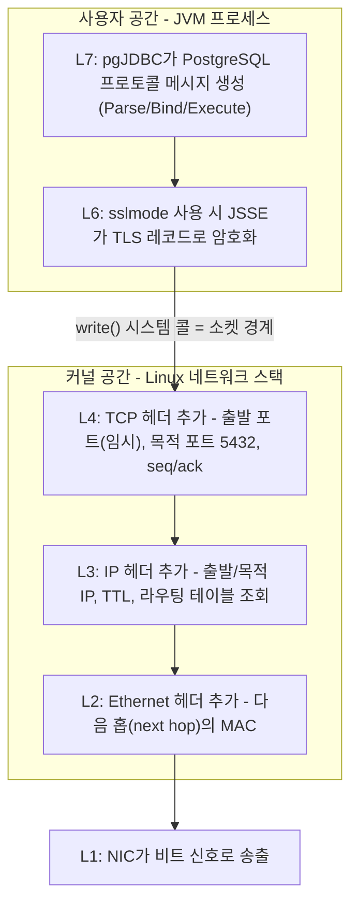
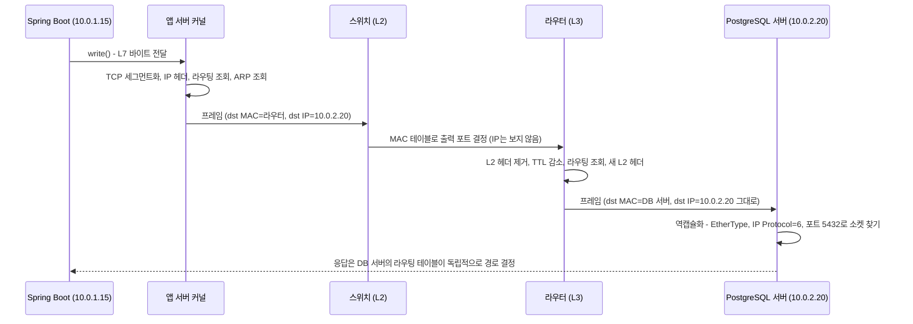

# 01. OSI 7계층과 TCP/IP 모델

> 관련 문서: 다음 장 [02. IP 주소, 서브넷, CIDR](./02-IP-서브넷-CIDR-이론.md)

## 1. 한 줄 요약

OSI 7계층과 TCP/IP 모델은 통신 기능을 계층(Layer)으로 나누고, 각 계층이 자기 헤더만 붙이고 해석하도록 역할을 정의한 참조 모델이다.

## 2. 왜 필요한가

1970년대 네트워크는 벤더별로 닫혀 있었다. IBM SNA, DEC DECnet 장비는 서로 통신할 수 없었고, 케이블·주소 체계·재전송 방식·애플리케이션 규약이 한 덩어리로 묶여 있어서 하나를 바꾸면 전부를 바꿔야 했다.

계층화는 이 결합을 끊는다.

- **교체 가능성**: 물리 매체를 구리선에서 Wi-Fi로 바꿔도 TCP와 HTTP는 그대로다. Spring Boot 앱이 유선 서버에서든 AWS 가상 NIC 위에서든 똑같이 동작하는 이유다.
- **책임 분리**: 재전송은 TCP(L4)의 책임, 경로 선택은 IP(L3)의 책임이다. 애플리케이션은 "바이트를 보낸다"만 알면 된다.
- **장애 격리 언어**: "L4까지는 붙는데 L7에서 502가 난다"처럼 문제가 어느 구간인지를 한 문장으로 말할 수 있게 된다. 실무에서 이 모델이 살아남은 진짜 이유는 이것이다.

두 모델의 운명은 갈렸다. ISO가 1984년 OSI를 표준화했지만, 실제 인터넷은 ARPANET이 1983년 1월 1일 전환한 TCP/IP로 굴러갔다. 결과적으로 **구현은 TCP/IP, 용어는 OSI**가 되었다. "L4 로드밸런서", "L7 방화벽"의 숫자는 OSI 번호다.

## 3. 핵심 개념

| 용어 | 정의 |
|---|---|
| 계층 (Layer) | 하나의 책임만 가지는 기능 단위. 아래 계층의 서비스를 사용하고 위 계층에 서비스를 제공한다. |
| 프로토콜 (Protocol) | **같은 계층끼리**(내 TCP ↔ 상대 TCP) 주고받는 메시지 형식과 규칙. |
| 인터페이스 (Interface) | **위아래 계층 사이**의 경계. L7↔L4 경계의 대표가 소켓 API(`socket()`, `write()`, `read()`)다. |
| 캡슐화 (Encapsulation) | 송신 시 각 계층이 위 계층 데이터 앞에 자기 헤더를 붙이는 것. 수신 시 역순으로 벗긴다(역캡슐화, Decapsulation). |
| PDU (Protocol Data Unit) | 계층별 데이터 단위의 이름. L2 프레임(Frame), L3 패킷(Packet), L4 세그먼트(Segment, TCP)/데이터그램(Datagram, UDP), L7 메시지(Message). |
| 다중화/역다중화 (Multiplexing/Demultiplexing) | 여러 상위 흐름을 하나의 하위 채널로 묶고, 수신 측에서 헤더 필드(EtherType, IP Protocol, 포트)로 다시 나누는 것. |
| MTU (Maximum Transmission Unit) | L2가 한 프레임에 실을 수 있는 최대 L3 패킷 크기. 이더넷 기본 1500바이트. |
| MSS (Maximum Segment Size) | TCP 세그먼트 하나에 실을 수 있는 최대 페이로드. MTU − IP 헤더 − TCP 헤더. |

### 계층 대응표

| OSI | 이름 | TCP/IP (RFC 1122) | 대표 프로토콜 | 주소/식별자 | 처리 주체 |
|---|---|---|---|---|---|
| L7 | 응용 (Application) | 응용 (Application) | HTTP, PostgreSQL 프로토콜, DNS | URL, 호스트명 | 애플리케이션(Tomcat, pgJDBC) |
| L6 | 표현 (Presentation) | 〃 | TLS(관행상), JSON/직렬화 | – | 라이브러리(JSSE, Jackson) |
| L5 | 세션 (Session) | 〃 | (TLS 세션, HTTP/2 스트림 관리 등이 사실상 이 역할) | – | 라이브러리 |
| L4 | 전송 (Transport) | 전송 (Transport) | TCP, UDP | 포트 번호 | **커널** |
| L3 | 네트워크 (Network) | 인터넷 (Internet) | IPv4, IPv6, ICMP | IP 주소 | **커널**, 라우터 |
| L2 | 데이터링크 (Data Link) | 링크 (Link) | Ethernet, ARP, Wi-Fi | MAC 주소 | NIC 드라이버, 스위치 |
| L1 | 물리 (Physical) | 〃 | 전기/광 신호 | – | NIC, 케이블 |

**핵심 관찰**: L5·L6는 TCP/IP에서 별도 계층이 아니다. 그 기능(암호화, 직렬화, 세션 관리)은 애플리케이션이나 라이브러리가 알아서 한다. 그래서 "TLS는 몇 계층인가?"는 정답이 없는 질문이다. TLS는 TCP 위, HTTP 아래에서 동작하므로 실무에서는 "L4와 L7 사이" 또는 관행상 L6로 부른다. 중요한 건 번호가 아니라 **TLS가 사용자 공간(JVM, OpenSSL)에서 처리된다**는 사실이다.

더 실용적인 경계는 따로 있다. **L4 이하는 커널, L7은 프로세스**다. 이 경계가 소켓 API이고, 장애 분석에서 "커널 문제냐 앱 문제냐"를 가르는 선이다.

## 4. 동작 원리와 흐름

Spring Boot 앱(10.0.1.15)이 HikariCP 커넥션으로 다른 서브넷의 PostgreSQL(10.0.2.20:5432)에 쿼리를 보내는 경우를 따라간다.

### 송신 측 캡슐화



1. **[L7, JVM]** `jdbcTemplate.query()` → pgJDBC가 SQL을 PostgreSQL 확장 쿼리 프로토콜 메시지로 직렬화한다.
2. **[L6, JVM]** TLS를 쓰면 JSSE가 메시지를 TLS 레코드로 암호화한다. 이 시점까지 모두 사용자 공간이다.
3. **[L7→L4 경계, 커널]** `SocketOutputStream.write()` → `write()` 시스템 콜. 데이터가 커널의 **소켓 송신 버퍼**로 복사되면 `write()`는 반환된다. 즉 `write()` 성공은 "상대가 받았다"가 아니라 "커널 버퍼에 들어갔다"는 뜻이다.
4. **[L4, 커널]** TCP가 버퍼의 바이트를 MSS 크기로 잘라 세그먼트를 만든다. 출발 포트는 커넥션 생성 시 커널이 임시 포트(Ephemeral Port) 범위에서 골라둔 값이다.
5. **[L3, 커널]** IP 헤더를 붙이고 라우팅 테이블을 조회한다. 10.0.2.20은 내 서브넷이 아니므로 **다음 홉 = 기본 게이트웨이**로 결정된다. (서브넷 판단은 [2장](./02-IP-서브넷-CIDR-이론.md))
6. **[L2, 커널]** 이웃 테이블(ARP 캐시)에서 **게이트웨이의 MAC**을 찾아 Ethernet 헤더에 넣는다. 목적지 IP는 DB지만, 목적지 MAC은 라우터다.
7. **[L1, NIC]** 프레임이 전기/광 신호로 나간다.

### 중간 장비와 수신 측



8. **[L2, 스위치]** 스위치는 목적지 MAC만 보고 출력 포트를 고른다. IP 헤더는 열어보지 않는다.
9. **[L3, 라우터]** 라우터는 L2 헤더를 벗기고 IP 헤더를 본다. TTL을 1 줄이고 헤더 체크섬을 다시 계산한 뒤, 다음 구간용 **새 L2 헤더**를 붙인다. **IP 주소는 끝까지 그대로, MAC은 구간마다 바뀐다.**
10. **[L2→L7, DB 서버 커널]** 수신 측은 역캡슐화하며 헤더 필드로 위 계층을 찾는다. EtherType `0x0800` → IPv4, IP Protocol `6` → TCP, 목적 포트 `5432` → PostgreSQL의 소켓. 커널이 수신 버퍼에 넣으면 PostgreSQL 백엔드 프로세스가 `read()`로 가져간다.

### 상태는 어디에 생기는가

| 상태 | 위치 | 생성 | 소멸 |
|---|---|---|---|
| TCP 커넥션 (seq/ack, 버퍼, 상태머신) | **양 끝 커널** | 3-way handshake | FIN/RST, TIME_WAIT 경과 ([3장](./03-TCP-이론.md)) |
| 이웃 캐시 (IP→MAC) | 각 호스트·라우터 커널 | ARP 요청/응답 | 일정 시간 미사용 시 STALE → 삭제 |
| 라우팅 테이블 | 각 호스트·라우터 커널 | 설정/DHCP/라우팅 프로토콜 | 설정 변경 시 |
| TLS 세션 | 양 끝 **사용자 공간** (JSSE, OpenSSL) | TLS 핸드셰이크 | 커넥션 종료, 세션 캐시 만료 |
| DB 세션 | PostgreSQL 백엔드 프로세스 | 인증 성공 | 커넥션 종료 |
| 커넥션 객체 | HikariCP 풀 (JVM 힙) | 풀 채우기 | `maxLifetime`, 검증 실패 |

**스위치와 라우터는 TCP 상태를 모른다.** 반면 NAT, 방화벽, L4 로드밸런서는 L4 헤더를 보고 커넥션별 상태(conntrack 테이블 등)를 만든다. 이 "중간 장비가 가진 상태"가 타임아웃 불일치 장애의 근원이다. (13장, 19장에서 다룬다)

## 5. 구현 레벨 들여다보기

### 헤더 구조 — 수신 측이 위 계층을 찾는 필드

| 계층 | 헤더 | 최소 크기 | 위 계층을 가리키는 필드 | 표준 |
|---|---|---|---|---|
| L2 | Ethernet II: dst MAC(6) + src MAC(6) + EtherType(2), 끝에 FCS(4) | 14 + 4 | **EtherType**: `0x0800` IPv4, `0x86DD` IPv6, `0x0806` ARP | IEEE 802.3 |
| L3 | IPv4: Version, IHL, DSCP/ECN, Total Length, Identification, Flags(DF/MF), Fragment Offset, **TTL**, **Protocol**, Checksum, Src IP, Dst IP | 20 | **Protocol**: `1` ICMP, `6` TCP, `17` UDP | RFC 791 |
| L3 | IPv6: 고정 헤더 | 40 | **Next Header** | RFC 8200 |
| L4 | TCP: Src Port, Dst Port, Seq, Ack, Data Offset, Flags(SYN/ACK/FIN/RST/PSH/URG/ECE/CWR), Window, Checksum, Urgent Ptr | 20 | **Dst Port** | RFC 9293 |
| L6 | TLS 레코드: Content Type(1) + Legacy Version(2) + Length(2) | 5 | Content Type: `22` Handshake, `23` Application Data | RFC 8446 |

**크기 계산**: 이더넷 MTU 1500 − IPv4 20 − TCP 20 = **MSS 1460**. Linux는 TCP 타임스탬프 옵션(12바이트)을 기본으로 켜므로 세그먼트당 실제 페이로드는 보통 1448바이트다. VPN·오버레이(VXLAN은 약 50바이트 추가)를 거치면 이 여유가 줄어든다. 9절의 MTU 함정으로 이어진다.

### Linux에서 계층별로 보는 곳

| 계층 | 명령 | 커널 인터페이스 |
|---|---|---|
| L2 | `ip link` (MTU, MAC), `ip neigh` (ARP 캐시) | `/proc/net/arp` |
| L3 | `ip addr`, `ip route`, `ip route get <IP>` | `/proc/net/route`, `net.ipv4.ip_forward` |
| L4 | `ss -tanp` (커넥션), `ss -ltn` (리슨 소켓) | `/proc/net/tcp`, `/proc/net/tcp6` |
| L7 | 애플리케이션 로그, `curl -v` | – |

관련 커널 파라미터:

- `net.ipv4.ip_default_ttl` — 송신 패킷의 초기 TTL. Linux 기본 **64**, Windows 기본 **128**. `ping` 응답의 TTL로 상대 OS와 홉 수를 대략 추정할 수 있다.
- `net.ipv4.ip_forward` — `1`이면 이 호스트가 L3 라우터처럼 남의 패킷을 전달한다. Docker·쿠버네티스 노드는 `1`이어야 한다.
- `net.core.somaxconn` — 리슨 소켓의 accept 대기열 상한. 커널 5.4부터 기본 4096(이전 128).

### 오프로딩 (Offloading) — tcpdump가 거짓말하는 것처럼 보이는 이유

현대 NIC는 TSO(TCP Segmentation Offload), GSO(Generic Segmentation Offload), GRO(Generic Receive Offload)로 세그먼트 분할/병합을 NIC나 드라이버 직전에 한다. 그래서 호스트에서 `tcpdump`를 뜨면 **MTU보다 큰 수십 KB짜리 TCP 세그먼트**가 보인다. 실제 선로에는 1500바이트 이하로 나가므로 정상이다. `ethtool -k eth0 | grep offload`로 켜짐 여부를 확인한다. 이 사실을 모르면 "점보 패킷 때문에 장애"라는 잘못된 결론을 내린다.

### TLS는 어디서 처리되나

TLS는 기본적으로 **사용자 공간**에서 처리된다. JVM은 JSSE(`SSLSocket`, `SSLEngine`), Nginx는 OpenSSL. 그래서 TLS 핸드셰이크 CPU 비용은 애플리케이션 프로세스의 CPU 사용률에 잡힌다. Linux 4.13부터 kTLS(Kernel TLS)로 암호화 데이터 경로를 커널에 넘길 수 있지만, 핸드셰이크는 여전히 사용자 공간에서 한다.

### Java 소켓과 커널의 경계

- `java.net.Socket`/`SocketChannel`의 `connect()`, `read()`, `write()`는 각각 커널 시스템 콜로 이어진다.
- Tomcat의 기본 커넥터 `Http11NioProtocol`은 NIO `Selector`(Linux에서는 epoll)로 다수 소켓을 소수 스레드가 감시한다.
- `connect()`가 반환됐다 = 커널이 3-way handshake를 끝냈다(L4 완료). HTTP 요청이 처리됐다는 뜻은 아니다.

## 6. 백엔드 코드와 만나는 지점

### 예외 메시지로 계층 판별하기

장애 로그의 예외는 **어느 계층에서 실패했는지**를 거의 정확히 알려준다. HikariCP나 RestClient 예외는 겉포장이므로 반드시 `Caused by:` 체인의 가장 안쪽을 본다.

| 계층 | 예외 / 메시지 | 커널에서 일어난 일 | 의미 |
|---|---|---|---|
| L7 (DNS) | `java.net.UnknownHostException: db.internal` | – | 이름 해석 실패. 패킷은 목적지로 나가지도 않았다. ([4장](./04-DNS-이론.md)) |
| L3 | `java.net.NoRouteToHostException: No route to host` | `EHOSTUNREACH` | 라우팅 불가 또는 ICMP Host Unreachable 수신, 같은 서브넷이면 ARP 실패 |
| L3 | `...Exception: Network is unreachable` | `ENETUNREACH` | 해당 목적지로 가는 라우트 자체가 없음. JDK 버전에 따라 `SocketException` 또는 `ConnectException`으로 나온다 (확인 필요) |
| L4 | `java.net.ConnectException: Connection refused` | SYN에 **RST** 응답 | 호스트까지는 도달했다. 그 포트에서 리슨 중인 프로세스가 없다. |
| L4 | `java.net.SocketTimeoutException: Connect timed out` | SYN에 **무응답** | 중간에서 패킷이 버려졌다(방화벽 DROP, 보안 그룹, 라우팅 블랙홀). |
| L4 | `java.net.SocketException: Connection reset` | 연결 중 **RST** 수신 | 상대 또는 중간 장비(LB, NAT)가 커넥션을 강제 종료했다. |
| L4 | `java.io.IOException: Broken pipe` | 닫힌 소켓에 `write()` → `EPIPE` | 상대가 이미 닫은 커넥션에 썼다. |
| L4↑ | `java.net.SocketTimeoutException: Read timed out` | 연결 성공, 데이터 무응답 | L4는 정상. 상대 앱이 느리거나 응답이 중간에서 유실. |
| L6 | `javax.net.ssl.SSLHandshakeException: PKIX path building failed` | – | TCP는 정상, 인증서 체인 검증 실패. ([6장](./06-TLS-이론.md)) |
| L7 | HTTP 502/503/504, `PSQLException: FATAL: password authentication failed` | – | 전송은 정상, 애플리케이션 규약 수준 거부 |

**pgJDBC 실제 메시지 예**:

```text
org.postgresql.util.PSQLException: Connection to 10.0.2.20:5432 refused. Check that the hostname and port are correct and that the postmaster is accepting TCP/IP connections.
Caused by: java.net.ConnectException: Connection refused
```

```text
java.sql.SQLTransientConnectionException: HikariPool-1 - Connection is not available, request timed out after 30000ms.
```

두 번째는 **L4 문제가 아니다**. 풀 안에서 빌려줄 커넥션을 30초(`connectionTimeout` 기본값) 동안 못 얻었다는 풀 레벨 메시지다. 여기에 `Caused by`로 `SocketTimeoutException`이 붙어 있으면 새 커넥션 생성이 L4에서 실패하는 중이고, 없으면 대개 모든 커넥션이 사용 중이다(느린 쿼리, 커넥션 누수 — 13장).

### 계층별 타임아웃 설정

타임아웃도 계층별로 따로 있다. 하나만 설정하면 나머지 계층에서 무한 대기가 생긴다.

```yaml
spring:
  datasource:
    # connectTimeout: L4 연결 수립 대기(초). pgJDBC 기본 10
    # socketTimeout: 연결 후 read() 대기(초). pgJDBC 기본 0 = 무한 대기 → 반드시 설정
    url: jdbc:postgresql://10.0.2.20:5432/app?connectTimeout=5&socketTimeout=30
    hikari:
      connection-timeout: 30000   # 풀에서 커넥션을 빌리는 대기(ms). 기본 30000. L4가 아니라 풀 레벨
server:
  address: 0.0.0.0                # L3: 어느 IP에 바인드할지. 미설정 시 모든 인터페이스
  port: 8080                      # L4: 리슨 포트
  tomcat:
    accept-count: 100             # L4: 커널 accept 대기열 요청 크기. 기본 100 (실제 값은 somaxconn과의 최솟값)
```

### L7 프록시 뒤에서는 클라이언트 IP가 바뀐다

Nginx나 AWS ALB 같은 L7 프록시는 클라이언트의 TCP 커넥션을 **끝내고(terminate)** 백엔드로 **새 TCP 커넥션**을 연다. 그래서 Spring의 `HttpServletRequest.getRemoteAddr()`는 프록시의 IP를 반환한다. 원래 클라이언트 IP는 L7 헤더(`X-Forwarded-For`, RFC 7239의 `Forwarded`)로만 전달된다.

```yaml
server:
  forward-headers-strategy: native   # Tomcat RemoteIpValve가 X-Forwarded-* 해석. 기본 none (클라우드 플랫폼 감지 시 native — 확인 필요)
  tomcat:
    remoteip:
      internal-proxies: "10\\.0\\.0\\.\\d{1,3}"   # 신뢰할 프록시 IP 정규식. 기본은 사설/루프백 대역 전체
```

반면 L4 로드밸런서는 커넥션을 끝내지 않고 패킷을 전달하므로 설정에 따라 원래 클라이언트 IP가 보존될 수 있다. AWS NLB는 대상 유형과 설정에 따라 보존 여부가 달라진다(확인 필요 — 12장에서 다룬다).

## 7. 유사 개념과의 비교

### OSI vs TCP/IP

| 항목 | OSI 7계층 | TCP/IP 4계층 |
|---|---|---|
| 출발점 | 표준 먼저, 구현은 나중 (ISO) | 구현 먼저, 문서화는 나중 (DARPA, IETF) |
| 계층 수 | 7 | 4 (교과서에 따라 링크를 물리/데이터링크로 나눠 5) |
| L5·L6 | 독립 계층 | 응용 계층에 흡수 |
| 현재 쓰임 | **용어와 사고 틀** ("L4 LB", "L7 라우팅") | **실제 구현** (Linux 커널, 모든 OS) |

### 계층별 장비가 볼 수 있는 것 / 할 수 있는 것

| 장비 | 동작 계층 | 볼 수 있는 것 | 할 수 없는 것 | 예시 |
|---|---|---|---|---|
| 스위치 | L2 | MAC | IP 기반 판단 | 사내 L2 스위치, Docker bridge |
| 라우터 | L3 | IP, TTL | 포트 기반 판단(순수 라우터) | 기본 게이트웨이, VPC 라우터 |
| 방화벽/보안 그룹 | L3~L4 | IP, 포트, TCP 플래그 | URL·헤더 기반 차단 | iptables, AWS 보안 그룹 |
| L4 로드밸런서/NAT | L4 | IP, 포트 (커넥션 단위 분배) | 요청 단위 분배, 경로 기반 라우팅 | AWS NLB, kube-proxy(iptables 모드) |
| L7 프록시/LB | L7 | URL, 헤더, 쿠키, 바디 | – (TLS 종료 필요) | Nginx, AWS ALB, Spring Cloud Gateway |
| WAF | L7 | 요청 내용 (SQLi, XSS 패턴) | – | AWS WAF, ModSecurity |

**판단 기준**: 필요한 결정이 IP/포트만으로 가능하면 L4(빠르고, TLS를 몰라도 되고, 프로토콜 무관). URL 경로별 라우팅, 헤더 기반 분기, HTTP 헬스체크, 요청 단위 재시도가 필요하면 L7. L7은 TLS를 풀어야 하므로 인증서를 LB가 가져야 하고, 커넥션이 두 개로 쪼개진다는 점을 설계에 반영해야 한다.

## 8. 표준·버전별 변천

| 시기 | 사건 | 실무 영향 |
|---|---|---|
| 1981 | IPv4(RFC 791), TCP(RFC 793) | 지금도 쓰는 헤더 구조의 출발점 |
| 1983 | ARPANET TCP/IP 전환 | TCP/IP가 사실상 표준이 됨 |
| 1984 / 1994 | OSI 참조 모델 ISO 7498 / 7498-1 개정판 | "L1~L7" 용어의 출처 |
| 1989 | RFC 1122/1123 호스트 요구사항 | TCP/IP 4계층 구분의 공식 근거 |
| 2017 | Linux 4.13 kTLS | TLS 처리 일부를 커널로 이동 가능 |
| 2018 | TLS 1.3 (RFC 8446) | 핸드셰이크 1-RTT로 단축 ([6장](./06-TLS-이론.md)) |
| 2021~2022 | QUIC(RFC 9000), HTTP/3(RFC 9114), TCP 재정리(RFC 9293) | **전송 계층 기능(재전송, 혼잡 제어)이 UDP 위 사용자 공간으로 이동**. "L4 = 커널"이라는 공식이 깨지기 시작 ([5장](./05-HTTP-이론.md)) |

QUIC은 계층 모델이 "법칙"이 아니라 "관례"임을 보여준다. QUIC은 UDP 위에서 TCP의 역할(L4)과 TLS(L6)를 한 프로토콜로 합쳐 사용자 공간에서 구현한다. 그래서 L4 장비(방화벽, NLB)는 QUIC 트래픽을 그냥 UDP로만 보고, 커넥션 상태를 추적하지 못한다.

## 9. 함정과 장애 패턴

### 9-1. `Connection refused`와 `Connect timed out`을 같은 문제로 취급

- **증상**: 배포 후 앱 기동 실패. 로그에 `HikariPool-1 - Exception during pool initialization.` 담당자는 "DB 연결 안 됨"이라고만 보고한다.
- **원인**: 두 예외는 전혀 다른 곳을 가리킨다.
  - `Connection refused` = SYN이 **목적지 호스트 커널까지 도달**했고, 커널이 "그 포트에 리슨 소켓 없음"이라고 RST를 보냈다. → DB 프로세스가 죽었거나, 다른 포트거나, 다른 IP에 바인드됨.
  - `Connect timed out` = SYN이 **어딘가에서 버려졌다**. → 보안 그룹/방화벽 DROP, 잘못된 라우팅, 호스트 다운.
- **확인 방법**:
  - 앱 서버에서: `nc -vz 10.0.2.20 5432` (또는 `timeout 3 bash -c '</dev/tcp/10.0.2.20/5432'`)
  - DB 서버에서: `ss -ltnp | grep 5432` → 리슨 여부와 **바인드 주소** 확인
  - DB 서버에서: `tcpdump -nn -i any port 5432` → SYN이 도착하는지. 도착 안 하면 중간 경로 문제, 도착하는데 RST가 나가면 리슨 문제.
- **해결**: refused면 DB 쪽 프로세스·바인드 주소·포트를, timeout이면 보안 그룹·방화벽·라우팅을 본다. 원인 범위가 완전히 다르므로 예외 이름부터 확정한다.

### 9-2. 127.0.0.1에 바인드된 서버 — "로컬에선 되는데 컨테이너에서 안 돼요"

- **증상**: 호스트에서 `curl localhost:8080`은 되는데 다른 컨테이너나 다른 서버에서는 `Connection refused`.
- **원인**: 서버가 루프백 주소 `127.0.0.1`에만 바인드되어 있다. 루프백은 그 네트워크 네임스페이스 안에서만 유효하다. 컨테이너마다 네임스페이스가 따로이므로 컨테이너 A의 127.0.0.1은 컨테이너 B의 127.0.0.1과 다른 주소다. PostgreSQL의 `listen_addresses` 기본값이 `'localhost'`인 것이 대표적이다(공식 Docker 이미지는 `'*'`로 바꿔둔다).
- **확인 방법**: 서버 측에서 `ss -ltn`.
  ```text
  State   Recv-Q  Send-Q  Local Address:Port
  LISTEN  0       244     127.0.0.1:5432      ← 외부에서 접근 불가
  LISTEN  0       100     0.0.0.0:8080        ← 모든 인터페이스
  ```
- **해결**: `server.address`를 지우거나 `0.0.0.0`으로, PostgreSQL은 `listen_addresses = '*'` 또는 특정 인터페이스 IP. 단 외부 노출 범위는 방화벽·보안 그룹·`pg_hba.conf`로 따로 통제한다.

### 9-3. L4 헬스체크는 통과하는데 서비스는 죽어 있다

- **증상**: 로드밸런서 대시보드에는 모든 인스턴스가 Healthy. 그런데 사용자는 타임아웃. 앱 로그에는 아무것도 없다.
- **원인**: 3-way handshake는 **커널이 처리**한다. 애플리케이션이 `accept()`를 호출하기 전에 커널이 SYN-ACK를 보내고 커넥션을 accept 대기열에 넣는다. Tomcat 워커 스레드(`server.tomcat.threads.max`, 기본 200)가 전부 DB 대기로 막혀 있어도 TCP 연결은 성공한다. TCP 포트 체크(L4 헬스체크)는 "커널이 살아 있다"만 증명한다.
- **확인 방법**:
  - `ss -ltn sport = :8080` → 리슨 소켓의 `Recv-Q`가 accept 대기열에 쌓인 커넥션 수다. 0이 아니고 계속 늘면 앱이 accept를 못 따라간다.
  - `jcmd <pid> Thread.print` 또는 Actuator `/actuator/threaddump` → `http-nio-8080-exec-*` 스레드가 모두 `HikariPool.getConnection` 등에서 대기 중인지.
- **해결**: 헬스체크를 L7로 바꾼다(`/actuator/health`). 헬스체크가 DB 의존성까지 볼지는 신중하게 결정한다. DB 장애 시 전 인스턴스가 동시에 Unhealthy가 되어 LB가 모두 빼버리는 문제가 있다. (24장 Probe에서 liveness/readiness 분리로 다룬다)

### 9-4. 작은 요청은 되는데 큰 응답만 멈춘다 (MTU 블랙홀)

- **증상**: VPN이나 오버레이 네트워크를 거칠 때 `SELECT 1`은 되는데 큰 결과셋 조회는 `Read timed out`. HTTPS 연결이 TLS 핸드셰이크 도중(인증서 체인이 큰 서버 응답 구간)에 멈춘다. `curl`로 작은 API는 되는데 큰 JSON 응답은 안 온다.
- **원인**: 경로 중간의 MTU가 1500보다 작다(VPN, VXLAN, GRE 터널). TCP는 DF(Don't Fragment) 비트를 켜고 보내므로, 작은 MTU 구간의 라우터는 패킷을 버리고 ICMP "Fragmentation Needed"(Type 3 Code 4)를 돌려보내야 한다. 그런데 방화벽이 ICMP를 전부 막아두면 송신자는 그 사실을 모르고 같은 크기로 계속 재전송한다(PMTUD 블랙홀, RFC 1191/4821). 작은 패킷은 MTU 이하라 문제가 없다.
- **확인 방법**:
  - Linux: `ping -M do -s 1472 10.0.2.20` (1472 + ICMP 8 + IP 20 = 1500). 실패하면 크기를 줄여가며 통과하는 최대값을 찾는다.
  - Windows: `ping -f -l 1472 10.0.2.20`
  - `ip link show` → 각 인터페이스 MTU 확인.
  - `tcpdump`에서 같은 큰 세그먼트가 반복 재전송되는지 확인.
- **해결**: 터널 인터페이스 MTU를 낮추거나, 경계 장비에서 TCP MSS 클램핑(`iptables ... -j TCPMSS --clamp-mss-to-pmtu`), ICMP Type 3 Code 4는 방화벽에서 허용한다. "ICMP는 위험하니 전부 차단"이 이 장애의 흔한 원인이다.

### 9-5. 프록시 뒤에서 클라이언트 IP가 전부 LB IP로 찍힌다

- **증상**: 액세스 로그, 감사 로그, IP 기반 rate limit이 전부 같은 IP(LB나 Nginx)로 잡힌다. 또는 반대로 IP 허용 목록이 `X-Forwarded-For` 위조로 우회된다.
- **원인**: L7 프록시가 TCP를 새로 열어서 L3 출발지 IP가 프록시 IP가 된다(6절). 원래 IP는 L7 헤더에만 있고, 헤더는 클라이언트가 임의로 보낼 수 있다.
- **확인 방법**: 컨트롤러에서 `request.getRemoteAddr()`와 `request.getHeader("X-Forwarded-For")`를 같이 로깅. 외부에서 `curl -H "X-Forwarded-For: 1.2.3.4" https://...`로 보냈을 때 앱이 `1.2.3.4`를 클라이언트 IP로 인식하면 위조가 가능한 상태다.
- **해결**: `server.forward-headers-strategy: native` + `server.tomcat.remoteip.internal-proxies`를 **실제 프록시 IP 대역으로만** 좁힌다. 가장 바깥 프록시는 받은 `X-Forwarded-For`를 신뢰하지 말고 자신이 본 L3 출발지 IP로 덮어쓰게 설정한다(11장 Nginx).

## 10. 실무 적용 시나리오

- **장애 티켓 1차 분류**: "안 돼요" 티켓을 받으면 예외 체인의 가장 안쪽 원인으로 계층을 먼저 정한다. `UnknownHostException`이면 DNS 담당, `Connect timed out`이면 네트워크/보안 그룹 담당, `Connection refused`면 대상 서비스 담당, 5xx면 애플리케이션 담당. 계층을 정하면 누구에게 물어야 하는지가 정해진다.
- **네트워크팀과의 대화**: "DB 연결이 안 돼요" 대신 "앱 서버 10.0.1.15에서 10.0.2.20:5432로 SYN을 보내는데 응답이 없습니다(Connect timed out). DB 서버에서 tcpdump로 SYN 도착 여부 확인 부탁드립니다"라고 말하면 처리 시간이 크게 줄어든다.
- **로드밸런서 선택**: gRPC·WebSocket 장시간 연결, TLS 패스스루, 비HTTP 프로토콜(PostgreSQL 앞단)은 L4, 경로 기반 라우팅·HTTP 헬스체크·인증서 중앙 관리는 L7. (12장)
- **보안 점검 해석**: "보안 그룹으로 막았으니 안전하다"는 L3~L4 통제일 뿐이다. 허용된 포트 안에서 오는 SQL Injection은 L7 통제(WAF, 입력 검증)의 몫이다.

## 11. 보안 고려사항

- **암호화 범위**: TLS는 L7 페이로드만 암호화한다. L3/L4 헤더(출발/목적 IP, 포트)는 경로상의 모든 장비가 본다. TLS 1.3에서도 ClientHello의 SNI(접속 호스트명)는 기본적으로 평문이다(ECH로 암호화하는 확장은 도입 단계 — 확인 필요).
- **계층별 통제는 겹쳐 쓴다**: 보안 그룹(L4)으로 5432 포트를 앱 서버에서만 열고, `pg_hba.conf`(L7 인증 전 단계)로 다시 IP 대역을 제한하고, DB 계정 권한(L7)으로 최소 권한을 준다. 한 계층 설정 실수가 곧바로 노출로 이어지지 않게 한다.
- **ICMP 전면 차단의 부작용**: 9-4의 MTU 블랙홀을 만든다. 차단하더라도 Type 3(Destination Unreachable)은 허용하는 것이 일반적인 권고다.

## 12. 직접 확인해보기

**① 요청 하나로 계층 전체 훑기**

```text
$ curl -v https://example.com -o /dev/null        # Linux/macOS/WSL
> curl.exe -v https://example.com -o NUL          # Windows PowerShell
```

출력에서 볼 것(curl 버전에 따라 문구가 다름):

- `Trying 23.x.x.x:443...` → DNS 해석이 끝났고 L3 목적지가 정해짐
- `Connected to example.com (...) port 443` → **L4 3-way handshake 완료**
- `TLS handshake`, `SSL connection using TLSv1.3` → TLS 계층
- `> GET / HTTP/2`, `< HTTP/2 200` → L7

어느 줄에서 멈추는지가 곧 장애 계층이다.

**② 내 PC에서 무엇이 어느 주소에 바인드되어 있는지**

```text
$ ss -ltn                                          # Linux/WSL
> netstat -ano | findstr LISTENING                 # Windows
```

`127.0.0.1:xxxx`는 이 머신 안에서만, `0.0.0.0:xxxx`는 모든 인터페이스에서 접근 가능하다. 로컬 PostgreSQL을 설치했다면 5432가 어느 주소에 떠 있는지 확인해본다.

**③ 경로 MTU 확인**

```text
> ping -f -l 1472 8.8.8.8      # Windows: DF 비트 설정, 페이로드 1472
$ ping -M do -s 1472 8.8.8.8   # Linux/WSL
```

응답이 오면 경로 MTU ≥ 1500. VPN에 연결한 상태에서 다시 해보면 `Packet needs to be fragmented but DF set` 또는 `message too long`이 나오면서 VPN 터널의 오버헤드를 직접 확인할 수 있다.

## 13. 자가 점검 질문

**Q1.** Spring Boot 앱이 다른 서브넷의 DB로 패킷을 보낼 때, 앱 서버가 만든 이더넷 프레임의 목적지 MAC은 누구의 MAC인가? 이유는?

<details><summary>답</summary>

기본 게이트웨이(라우터)의 MAC이다. MAC 주소는 같은 L2 구간(브로드캐스트 도메인) 안에서만 의미가 있으므로, 다른 서브넷으로 가는 패킷은 먼저 게이트웨이에 넘겨야 한다. 목적지 IP는 끝까지 DB 서버 IP로 유지되고, 라우터를 지날 때마다 L2 헤더만 새로 붙는다.
</details>

**Q2.** 앱 로그에 `java.net.SocketTimeoutException: Connect timed out`이 찍혔다. 어디부터 보겠는가?

<details><summary>답</summary>

SYN에 응답이 없다는 뜻이므로 패킷이 중간에서 버려졌을 가능성이 가장 크다. ① 앱 서버에서 `nc -vz <DB IP> 5432`로 재현, ② 보안 그룹/방화벽 인바운드 규칙에 앱 서버 IP 대역과 5432가 있는지, ③ DB 서버에서 `tcpdump -nn port 5432`로 SYN이 도착하는지 확인한다. 도착하지 않으면 경로(보안 그룹, 라우팅, NACL) 문제, 도착하는데 응답이 안 나가면 DB 호스트의 방화벽(iptables DROP) 문제다. `Connection refused`였다면 방향이 완전히 달랐을 것이다.
</details>

**Q3.** `write()`가 성공적으로 반환됐는데 상대방은 데이터를 받지 못할 수 있는가?

<details><summary>답</summary>

그렇다. `write()`의 성공은 데이터가 **내 커널의 소켓 송신 버퍼에 복사됐다**는 뜻이지 상대가 받았다는 뜻이 아니다. 이후 전송은 커널의 TCP가 비동기로 수행한다. 상대가 이미 커넥션을 닫았다면 다음 `write()`에서 `Broken pipe`나 `Connection reset`으로 뒤늦게 드러난다. 그래서 애플리케이션 레벨의 응답 확인(L7 ACK, HTTP 응답 코드)이 별도로 필요하다.
</details>

**Q4.** 로드밸런서가 TCP 포트 체크로 헬스체크를 하는데, Tomcat 스레드가 모두 막혀도 Healthy로 나오는 이유는?

<details><summary>답</summary>

3-way handshake는 커널이 처리하고, 완료된 커넥션은 애플리케이션이 `accept()`하기 전까지 커널의 accept 대기열에 쌓인다. TCP 포트 체크는 핸드셰이크 성공만 확인하므로 애플리케이션 스레드 상태와 무관하게 성공한다. L7 헬스체크(`/actuator/health`)로 바꿔야 실제 요청 처리 가능 여부를 볼 수 있다.
</details>

**Q5.** 호스트에서 `tcpdump`를 떴더니 길이 30,000바이트가 넘는 TCP 세그먼트가 보인다. MTU는 1500이다. 장애인가?

<details><summary>답</summary>

대개 장애가 아니다. TSO/GSO(송신)와 GRO(수신) 오프로딩 때문에 커널은 큰 세그먼트를 다루고, 실제 분할은 NIC나 드라이버 직전에서 일어난다. tcpdump는 그 이전 지점을 보므로 큰 세그먼트가 찍힌다. `ethtool -k <인터페이스>`로 오프로드 설정을 확인할 수 있다.
</details>

## 14. 참고 자료

- ISO/IEC 7498-1:1994 — OSI Basic Reference Model
- RFC 1122 — Requirements for Internet Hosts: Communication Layers (1.1.3절 계층 구조)
- RFC 1123 — Requirements for Internet Hosts: Application and Support
- RFC 791 (IPv4), RFC 8200 (IPv6), RFC 9293 (TCP), RFC 8446 (TLS 1.3), RFC 9000 (QUIC)
- RFC 1191 (Path MTU Discovery), RFC 4821 (Packetization Layer PMTUD)
- RFC 7239 — Forwarded HTTP Extension
- Linux man pages: `ip(7)`, `tcp(7)`, `socket(7)`, `ip-route(8)`, `ss(8)`
- pgJDBC 연결 속성: https://jdbc.postgresql.org/documentation/use/
- Spring Boot 문서 "Running Behind a Front-end Proxy Server": https://docs.spring.io/spring-boot/how-to/webserver.html
- W. Richard Stevens, Kevin Fall, *TCP/IP Illustrated, Volume 1* (2nd ed.) — 1장 Introduction
- James Kurose, Keith Ross, *Computer Networking: A Top-Down Approach* — 1.5절 Protocol Layers and Their Service Models

## 부록: 용어 정리

| 용어 | 영문 | 설명 |
|---|---|---|
| 계층 | Layer | 하나의 책임만 가지며 아래 계층 서비스를 써서 위 계층에 서비스를 제공하는 기능 단위 |
| OSI 참조 모델 | OSI (Open Systems Interconnection) Reference Model | ISO가 정의한 7계층 통신 모델, 현재는 주로 용어 체계로 쓰임 |
| TCP/IP 모델 | TCP/IP Model | 링크·인터넷·전송·응용 4계층으로 된 실제 인터넷 구현 모델 |
| 프로토콜 | Protocol | 같은 계층끼리 주고받는 메시지 형식과 규칙 |
| 인터페이스 | Interface | 인접한 위아래 계층 사이의 경계, L7과 L4 사이는 소켓 API |
| 캡슐화 | Encapsulation | 송신 시 각 계층이 위 계층 데이터 앞에 자기 헤더를 붙이는 과정 |
| 역캡슐화 | Decapsulation | 수신 시 각 계층이 자기 헤더를 해석하고 벗겨 위로 넘기는 과정 |
| PDU | Protocol Data Unit | 계층별 데이터 단위(프레임, 패킷, 세그먼트, 메시지) |
| 다중화/역다중화 | Multiplexing/Demultiplexing | 여러 흐름을 하위 채널에 묶고, 수신 시 헤더 필드로 다시 나누는 것 |
| MTU | Maximum Transmission Unit | L2 프레임 하나에 실을 수 있는 최대 L3 패킷 크기, 이더넷 1500바이트 |
| MSS | Maximum Segment Size | TCP 세그먼트 하나의 최대 페이로드, 보통 MTU − 40 |
| MAC 주소 | MAC (Media Access Control) Address | L2에서 같은 링크 안의 NIC를 식별하는 48비트 주소 |
| TLS | Transport Layer Security | TCP 위에서 암호화·무결성·서버 인증을 제공하는 프로토콜 |
| 소켓 | Socket | 애플리케이션이 커널 네트워크 스택을 쓰기 위한 파일 디스크립터 기반 끝점 |
| 소켓 송신 버퍼 | Socket Send Buffer | `write()`한 데이터가 전송 전까지 머무는 커널 메모리 |
| 임시 포트 | Ephemeral Port | 클라이언트 측 커넥션에 커널이 자동 할당하는 출발 포트 |
| 기본 게이트웨이 | Default Gateway | 내 서브넷 밖 목적지로 가는 패킷을 넘겨받는 라우터 |
| 이웃 테이블 / ARP 캐시 | Neighbor Table / ARP Cache | 커널이 유지하는 IP→MAC 매핑 캐시 |
| ARP | Address Resolution Protocol | 같은 링크에서 IP 주소로 MAC 주소를 알아내는 프로토콜 |
| TTL | Time To Live | 라우터를 지날 때마다 1씩 줄어 0이 되면 패킷을 폐기하게 하는 IP 헤더 필드 |
| EtherType | EtherType | 이더넷 페이로드가 어떤 L3 프로토콜인지 표시하는 2바이트 필드 |
| 3방향 핸드셰이크 | 3-way Handshake | SYN, SYN-ACK, ACK 교환으로 TCP 연결을 수립하는 절차(커널이 처리) |
| RST | Reset | TCP 연결을 즉시 거부·종료하는 플래그, `Connection refused/reset`의 원인 |
| conntrack | Connection Tracking | NAT·방화벽이 커넥션별 상태를 추적하는 커널 테이블 |
| 오프로딩 | Offloading (TSO/GSO/GRO) | 세그먼트 분할·병합을 NIC나 드라이버 직전으로 미루는 성능 기법 |
| kTLS | Kernel TLS | TLS 레코드 암호화 데이터 경로를 커널에서 처리하는 Linux 기능 |
| NIO 커넥터 | NIO Connector (Http11NioProtocol) | Selector로 다수 소켓을 소수 스레드가 감시하는 Tomcat 기본 커넥터 |
| accept 대기열 | Accept Queue (Backlog) | 핸드셰이크 완료 후 앱의 `accept()`를 기다리는 커넥션 대기열 |
| 루프백 | Loopback (127.0.0.1) | 같은 네트워크 네임스페이스 안에서만 유효한 자기 자신 주소 |
| 네트워크 네임스페이스 | Network Namespace | 인터페이스·라우팅·소켓을 격리하는 Linux 커널 기능, 컨테이너마다 별도 |
| L4 로드밸런서 | L4 Load Balancer | IP·포트 기준으로 커넥션 단위 분배, 커넥션을 종료하지 않음 |
| L7 프록시 | L7 Proxy | 클라이언트 커넥션을 종료하고 HTTP 내용을 보고 새 커넥션으로 전달 |
| X-Forwarded-For | X-Forwarded-For | 프록시가 원래 클라이언트 IP를 담아 전달하는 HTTP 헤더, 위조 가능 |
| DF 비트 | DF (Don't Fragment) | 경로 중간에서 IP 단편화를 금지하는 IPv4 플래그 |
| PMTUD | Path MTU Discovery | ICMP 응답으로 경로상 최소 MTU를 알아내는 절차 |
| MTU 블랙홀 | PMTUD Black Hole | ICMP 차단으로 큰 패킷만 소리 없이 유실되는 현상 |
| MSS 클램핑 | MSS Clamping | 경계 장비가 SYN의 MSS 옵션을 낮춰 큰 세그먼트를 예방하는 기법 |
| QUIC | QUIC | UDP 위 사용자 공간에서 전송 기능과 TLS를 통합한 프로토콜 |
| SNI | Server Name Indication | TLS ClientHello에 접속 대상 호스트명을 담는 확장 |
| WAF | Web Application Firewall | HTTP 요청 내용을 보고 공격 패턴을 차단하는 L7 방화벽 |
