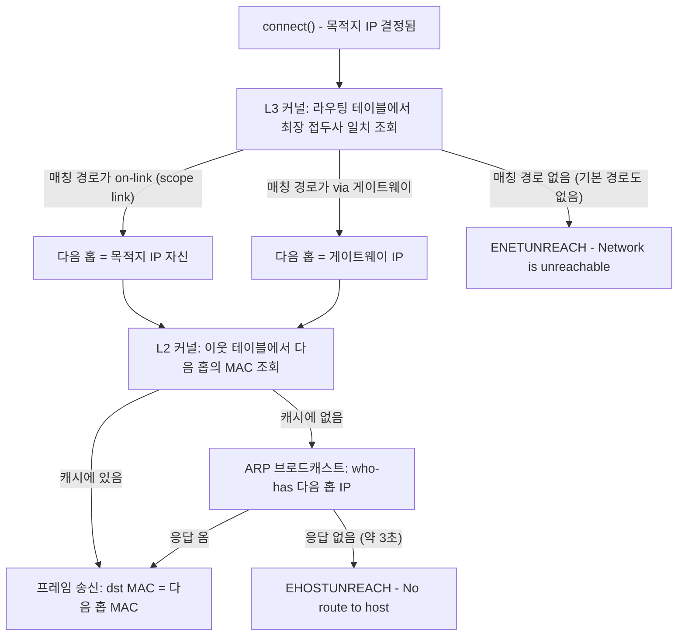
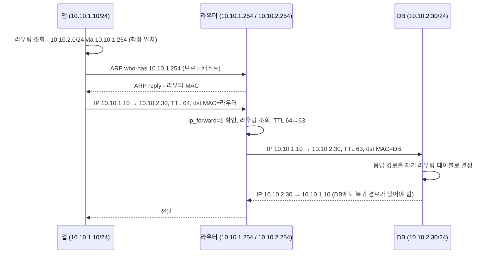

# 02. IP 주소, 서브넷, CIDR

> 관련 문서: [실습](./02-IP-서브넷-CIDR-실습.md) · 이전 장 [01. OSI 7계층과 TCP/IP 모델](./01-OSI-TCPIP-이론.md)

## 1. 한 줄 요약

IP 주소는 L3에서 네트워크 인터페이스를 식별하는 32비트(IPv4) 또는 128비트(IPv6) 값이고, 접두사 길이(CIDR 표기 `/n`)는 그중 앞 n비트를 네트워크 식별자로 정해 호스트가 "목적지에 직접 보낼지, 게이트웨이에 넘길지"를 판단하게 한다.

## 2. 왜 필요한가

**주소만으로는 경로를 정할 수 없다.** 전 세계 모든 IP를 라우터가 하나씩 기억할 수는 없으므로, 주소를 "네트워크 부분 + 호스트 부분"으로 나눠 라우터는 네트워크 단위로만 경로를 기억하게 했다. 우편번호로 지역까지 보내고, 번지는 그 지역에서 찾는 방식이다.

초기 방식과 그 한계:

1. **클래스풀 주소(Classful, 1981)**: 첫 비트 패턴으로 네트워크 크기가 고정됐다. A 클래스 /8(약 1,677만 호스트), B 클래스 /16(65,534), C 클래스 /24(254). 호스트 2,000대가 필요한 조직은 C로는 부족해 B를 받았고, 63,000개 이상이 낭비됐다.
2. **서브넷팅(Subnetting, RFC 950, 1985)**: 받은 네트워크를 조직 내부에서 마스크로 더 잘게 나눌 수 있게 했다. 외부에서는 여전히 클래스 단위로 보였다.
3. **라우팅 테이블 폭증(1990년대 초)**: C 클래스를 여러 개 받아 쓰는 조직이 늘면서 인터넷 백본 라우터의 경로 수가 감당하기 어려운 속도로 늘었다.
4. **CIDR(Classless Inter-Domain Routing, RFC 1519, 1993 → RFC 4632)**: 클래스를 없애고 접두사 길이를 임의로 정할 수 있게 했다. 크기를 필요한 만큼 할당하고(/22, /20 등), 인접한 여러 네트워크를 하나의 경로로 합쳐 광고(Route Aggregation)할 수 있게 됐다.
5. **사설 주소(RFC 1918, 1996) + NAT**: 내부망은 인터넷에서 라우팅되지 않는 주소를 재사용하고 경계에서 공인 IP로 바꾼다. IPv4 고갈을 늦춘 결정적 조치다. IANA의 IPv4 미할당 풀은 2011년 2월에 소진됐다.

백엔드 개발자에게 이 주제가 중요한 이유는 Docker 네트워크, VPC 서브넷, 쿠버네티스 Pod 대역, `pg_hba.conf`, 보안 그룹, IP 허용 목록이 **모두 CIDR로 적힌다**는 데 있다. CIDR 계산을 틀리면 "어떤 서버에서만 안 됨" 같은 재현하기 어려운 장애가 된다.

## 3. 핵심 개념

| 용어 | 정의 |
|---|---|
| IPv4 주소 (IPv4 Address) | 32비트 정수. 8비트씩 4개를 점으로 구분한 십진수(Dotted Decimal)로 표기. 예: `10.10.1.20` |
| 네트워크 부분 / 호스트 부분 (Network / Host Portion) | 주소 앞쪽 n비트는 어느 네트워크인지, 나머지 32−n비트는 그 안의 어느 호스트인지 |
| 접두사 길이 (Prefix Length) | 네트워크 부분의 비트 수 n. CIDR 표기에서 `/n` |
| 서브넷 마스크 (Subnet Mask) | 네트워크 부분을 1, 호스트 부분을 0으로 채운 32비트 값. `/24` = `255.255.255.0` |
| 네트워크 주소 (Network Address) | 호스트 비트가 모두 0인 주소. 그 서브넷 자체의 이름 |
| 브로드캐스트 주소 (Broadcast Address) | 호스트 비트가 모두 1인 주소. 서브넷 전체에 보내는 주소 |
| CIDR 블록 (CIDR Block) | `네트워크주소/접두사길이`로 표기한 주소 범위. 예: `10.10.1.0/24` |
| 온링크 (On-link) | 목적지가 내 인터페이스와 같은 서브넷에 있어 게이트웨이 없이 L2로 직접 보낼 수 있는 상태 |
| 기본 게이트웨이 (Default Gateway) | 더 구체적인 경로가 없는 모든 목적지(`0.0.0.0/0`)를 넘기는 라우터 |
| 라우팅 테이블 (Routing Table) | 목적지 CIDR → (다음 홉, 출력 인터페이스) 매핑 목록 |
| 최장 접두사 일치 (Longest Prefix Match) | 여러 경로가 목적지를 포함할 때 **접두사가 가장 긴(가장 구체적인) 경로**를 고르는 규칙 |
| 사설 주소 (Private Address) | 인터넷에서 라우팅되지 않는 재사용 가능 대역 (RFC 1918) |
| NAT (Network Address Translation) | 경계 장비가 IP 헤더의 주소를 바꿔 사설 주소를 공인 주소로 내보내는 기법 (19장) |

### 계산의 본질: AND 연산 한 번

주소와 마스크를 비트 AND 하면 네트워크 주소가 나온다. 이게 전부다.

```text
주소       10.10.1.20     = 00001010.00001010.00000001.00010100
마스크 /28 255.255.255.240 = 11111111.11111111.11111111.11110000
AND        10.10.1.16     = 00001010.00001010.00000001.00010000   ← 네트워크 주소
```

`10.10.1.20/28`은 `10.10.1.16/28` 서브넷에 속하고, 범위는 `.16`~`.31`(브로드캐스트 `.31`)이다. 반면 `10.10.1.0/28`은 `.0`~`.15`이므로 `.20`은 **들어가지 않는다**. 실습에서 `pg_hba.conf`로 이 차이를 직접 겪어본다.

### 자주 쓰는 접두사 길이

| 접두사 | 마스크 | 주소 수 | 일반 호스트 수 | 쓰임 |
|---|---|---|---|---|
| /32 | 255.255.255.255 | 1 | 1 (단일 호스트) | 특정 서버 하나 허용 (보안 그룹, `pg_hba.conf`) |
| /31 | 255.255.255.254 | 2 | 2 (RFC 3021, 점대점 링크 전용) | 라우터 간 링크 |
| /30 | 255.255.255.252 | 4 | 2 | 구형 점대점 링크 |
| /28 | 255.255.255.240 | 16 | 14 | AWS 서브넷 최소 크기 (AWS는 5개 예약 → 11개) |
| /24 | 255.255.255.0 | 256 | 254 | 가장 흔한 LAN, 실습용 네트워크 |
| /20 | 255.255.240.0 | 4,096 | 4,094 | 쿠버네티스 노드 서브넷 등 |
| /16 | 255.255.0.0 | 65,536 | 65,534 | Docker 기본 브리지, VPC 전체 |
| /0 | 0.0.0.0 | 전체 | – | 기본 경로(Default Route), "모든 곳" |

규칙: 접두사가 1 늘면 크기는 절반, 1 줄면 두 배. 주소 수 = 2^(32−n).

### 특수 목적 대역 (RFC 6890 레지스트리 중 실무에서 마주치는 것)

| 대역 | 용도 | 실무에서 만나는 곳 |
|---|---|---|
| `10.0.0.0/8` | 사설 (RFC 1918) | 기업망, AWS VPC 기본 예시 |
| `172.16.0.0/12` (172.16~172.31) | 사설 (RFC 1918) | **Docker 기본 네트워크 대역** |
| `192.168.0.0/16` | 사설 (RFC 1918) | 가정용 공유기, Docker 추가 대역 |
| `100.64.0.0/10` | 통신사 CGNAT 공유 주소 (RFC 6598) | 통신사 NAT, 일부 VPN(Tailscale 등), EKS 보조 대역 |
| `127.0.0.0/8` | 루프백 | `localhost` |
| `169.254.0.0/16` | 링크 로컬 (RFC 3927) | **클라우드 메타데이터 `169.254.169.254`**, DHCP 실패 시 자동 할당 |
| `0.0.0.0/8` | "이 네트워크" | 바인드 시 `0.0.0.0` = 모든 인터페이스 (INADDR_ANY) |
| `192.0.2.0/24`, `198.51.100.0/24`, `203.0.113.0/24` | 문서 예시용 (RFC 5737) | 문서에 실제 IP 대신 쓰는 주소 |

## 4. 동작 원리와 흐름

### 송신 호스트의 결정: 직접 보낼까, 게이트웨이에 넘길까

**서브넷 마스크는 패킷에 실리지 않는다.** IP 헤더에는 출발/목적 주소만 있고, 마스크는 각 호스트의 로컬 설정일 뿐이다. 그래서 같은 네트워크의 두 호스트가 서로 다른 마스크를 갖고 있으면 서로를 다르게 해석한다(9-2 함정).

Spring Boot 앱(10.10.1.10/24)이 DB로 연결할 때 커널이 하는 일:



1. **[L7→L4, JVM→커널]** HikariCP가 새 커넥션을 만들며 `connect(10.10.2.30:5432)`를 호출한다.
2. **[L3, 커널] 출발지 주소 선택**: 출력 인터페이스의 주소(여기선 10.10.1.10)를 출발지로 정한다. 인터페이스가 여러 개면 라우팅 결과에 따라 출발지 IP가 달라진다. 상대 측의 `pg_hba.conf`나 보안 그룹이 보는 IP가 바로 이것이다.
3. **[L3, 커널] 라우팅 조회**: 라우팅 테이블에 `default via 10.10.1.1`(/0), `10.10.1.0/24 dev eth0`(/24, 온링크), `10.10.2.0/24 via 10.10.1.254`(/24)가 있다. 10.10.2.30은 첫째(/0)와 셋째(/24)에 매칭되고, 더 긴 /24가 이긴다 → 다음 홉 = 10.10.1.254. 셋째 경로가 없었다면 /0만 매칭되어 10.10.1.1로 갔을 것이다.
4. **[L2, 커널] 이웃 조회**: ARP로 찾는 대상은 **다음 홉**(10.10.1.254)이지 최종 목적지(10.10.2.30)가 아니다. 목적지가 온링크일 때만 목적지 자신을 ARP로 찾는다.
5. **[L2→L1]** 프레임 송신. dst MAC = 라우터, dst IP = 10.10.2.30.
6. **[L3, 라우터]** 라우터(`net.ipv4.ip_forward=1`인 호스트)가 자신의 라우팅 테이블로 같은 과정을 반복한다. 10.10.2.0/24가 자기 인터페이스에 온링크이므로 10.10.2.30을 ARP로 찾아 전달한다. TTL을 1 줄인다.
7. **[L3, DB 서버]** 응답 패킷은 **DB 서버의 라우팅 테이블이 독립적으로** 경로를 정한다. 요청이 들어온 경로와 응답이 나가는 경로가 다를 수 있다(비대칭 라우팅, 9-3 함정).

### 경로 전체



이 흐름은 [실습](./02-IP-서브넷-CIDR-실습.md)에서 Docker 컨테이너 3개(앱 역할, 라우터, DB 역할)로 그대로 재현하고 tcpdump로 TTL과 MAC 변화를 확인한다.

### 상태는 어디에 생기는가

| 상태 | 위치 | 생성 | 유지·소멸 |
|---|---|---|---|
| 인터페이스 주소 + 온링크 경로 | 각 호스트 커널 | 주소 할당 시 **자동으로** `proto kernel scope link` 경로 생성 | 주소 삭제 시 함께 삭제 |
| 정적/기본 경로 | 각 호스트 커널 | DHCP, 설정 파일, `ip route add` | 재부팅·컨테이너 재생성 시 설정에 없으면 소멸 |
| 이웃 캐시 (IP→MAC) | 각 호스트·라우터 커널 | ARP 응답 | `REACHABLE` → 일정 시간 후 `STALE` → 재확인 또는 가비지 컬렉션 |
| conntrack (NAT, 방화벽) | NAT/방화벽 장비 커널 | 첫 패킷 | 타임아웃 후 삭제 (19장) |

## 5. 구현 레벨 들여다보기

### IP 헤더에는 마스크가 없다

IPv4 헤더(RFC 791)의 주소 관련 필드는 `Source Address`(32비트), `Destination Address`(32비트) 두 개뿐이다. 마스크, 게이트웨이, 서브넷 정보는 **어떤 패킷에도 실리지 않는다**. 모두 각 호스트의 로컬 설정이다. IPv6(RFC 8200)도 마찬가지로 128비트 주소 두 개만 있다.

### Linux에서 주소와 경로 읽기

```text
# ip -4 addr show eth0
2: eth0@if12: <BROADCAST,MULTICAST,UP,LOWER_UP> mtu 1500 ...
    inet 10.10.1.10/24 brd 10.10.1.255 scope global eth0
```

- `10.10.1.10/24` — 주소와 접두사 길이. 마스크는 이 한 숫자로 저장된다.
- `brd 10.10.1.255` — 브로드캐스트 주소 (호스트 비트 전부 1).

```text
# ip route
default via 10.10.1.1 dev eth0
10.10.1.0/24 dev eth0 proto kernel scope link src 10.10.1.10
```

- 두 번째 줄은 주소를 추가하는 순간 커널이 자동으로 만든 온링크 경로다. `proto kernel`(커널이 생성), `scope link`(게이트웨이 없이 직접 도달), `src`(이 경로로 나갈 때 쓸 출발지 IP).
- `ip route get <IP>`는 커널이 실제로 고를 경로를 보여준다. 추측하지 말고 이 명령으로 확정한다.

```text
# ip route get 1.1.1.1
1.1.1.1 via 10.10.1.1 dev eth0 src 10.10.1.10 uid 0
# ip route get 10.10.1.20
10.10.1.20 dev eth0 src 10.10.1.10 uid 0
```

`via`가 있으면 게이트웨이 경유, 없으면 온링크 직접 전달이다.

```text
# ip neigh
10.10.1.1 dev eth0 lladdr 02:42:xx:xx:xx:xx REACHABLE
10.10.1.99 dev eth0 FAILED
```

`FAILED`/`INCOMPLETE`는 ARP 응답이 없었다는 뜻이다. 온링크라고 판단한 주소에 실제로 아무도 없을 때 나타난다.

관련 파일·파라미터:

| 항목 | 경로 / 파라미터 | 설명 |
|---|---|---|
| 라우팅 테이블 원본 | `/proc/net/route` | 주소가 16진수 리틀엔디언으로 나옴. 사람이 읽을 땐 `ip route` |
| ARP 캐시 원본 | `/proc/net/arp` | |
| 패킷 전달 | `net.ipv4.ip_forward` | `1`이어야 라우터 역할. 컨테이너 네임스페이스마다 별도 |
| 역경로 필터 | `net.ipv4.conf.<if>.rp_filter` | `0` 끔, `1` 엄격(응답 경로가 들어온 인터페이스와 달라야 하면 폐기), `2` 느슨. 기본값은 배포판마다 다름(확인 필요) |
| 이웃 테이블 한도 | `net.ipv4.neigh.default.gc_thresh1/2/3` | 기본 128/512/1024. 초과 시 `neighbour table overflow` 커널 로그 — 큰 쿠버네티스 노드에서 발생 |
| 정책 라우팅 | `ip rule` | 목적지 외 조건(출발지 등)으로 다른 테이블을 쓰는 규칙. VPN·멀티 NIC 서버에서 등장 |

### Docker의 주소 할당

- 기본 브리지 `docker0`: `172.17.0.0/16`, 게이트웨이 `172.17.0.1`. `daemon.json`의 `bip`로 변경.
- 사용자 정의 네트워크(`docker network create`, Compose 기본 네트워크): `default-address-pools`에서 순서대로 할당. 기본값은 대략 `172.17.0.0/16`~`172.31.0.0/16`을 /16 단위로, 이후 `192.168.0.0/16`을 /20 단위로 쓴다 (Docker 버전별 확인 필요 — https://docs.docker.com/engine/network/).
- Compose에서 대역 고정:
  ```yaml
  networks:
    backend:
      ipam:
        config:
          - subnet: 10.10.1.0/24
            gateway: 10.10.1.1
  ```
- Linux 호스트에서는 네트워크마다 `br-<id>` 브리지가 생기고 호스트 라우팅 테이블에 `172.18.0.0/16 dev br-xxxx` 같은 온링크 경로가 추가된다. **이 경로가 회사망 대역과 겹치면 호스트의 트래픽이 브리지로 빨려 들어간다**(9-1 함정). Docker Desktop(Windows/macOS)에서는 브리지가 내부 VM 안에 있으므로 Windows 라우팅 테이블에는 나타나지 않지만, 컨테이너 → 외부 통신에서 같은 충돌이 생긴다.

### 클라우드·쿠버네티스에서 (예고)

- AWS VPC는 /16~/28 CIDR을 쓰고, **서브넷마다 5개 주소를 예약**한다(네트워크 주소, .1 VPC 라우터, .2 DNS, .3 예약, 브로드캐스트). /24 서브넷의 실사용 가능 IP는 251개. (18장)
- 쿠버네티스는 노드 대역, Pod 대역, Service 대역 세 가지 CIDR을 따로 가진다. kubeadm의 Service 기본 대역은 `10.96.0.0/12`. 이 셋과 사내망·VPC가 겹치면 안 된다. (23장)

### PostgreSQL의 CIDR 처리

- `postgresql.conf`의 `listen_addresses`: 어느 **내 인터페이스 주소**에서 리슨할지. 기본 `'localhost'`. 공식 Docker 이미지는 `'*'`.
- `pg_hba.conf`의 `ADDRESS` 열: 어느 **클라이언트 주소 대역**을 허용할지. CIDR 또는 `samenet`(서버 자신의 서브넷 전부), `samehost`, `all`.
  ```text
  # TYPE  DATABASE  USER  ADDRESS        METHOD
  host    app       app   10.10.1.0/24   scram-sha-256
  ```
  위에서 아래로 **첫 번째로 매칭되는 줄**만 적용된다. 이후 줄은 보지 않는다.
- `pg_hba_file_rules` 뷰(PostgreSQL 10+): 현재 파일을 서버가 어떻게 파싱했는지, 문법 오류가 있는지 SQL로 확인.
- `inet`/`cidr` 타입: IP 허용 목록을 DB에 저장할 때 문자열 대신 쓴다. `cidr`은 호스트 비트가 켜진 값(`10.10.1.5/24`)을 거부하고 `inet`은 허용한다.
  ```sql
  SELECT '10.10.1.20'::inet << '10.10.1.0/28'::cidr;   -- false: /28은 .0~.15
  SELECT '10.10.1.20'::inet << '10.10.1.0/24'::cidr;   -- true
  -- 많은 대역 중 매칭 검색은 GiST 인덱스: CREATE INDEX ON allowlist USING gist (cidr_col inet_ops);
  ```

## 6. 백엔드 코드와 만나는 지점

### 바인드 주소 — `server.address`, `management.server.address`

```yaml
server:
  address: 0.0.0.0          # 미설정 시 모든 인터페이스. 특정 IP로 지정하면 그 인터페이스로 온 연결만 받음
  port: 8080
management:
  server:
    port: 9090              # 별도 포트를 지정해야 아래 address가 적용됨
    address: 127.0.0.1      # Actuator를 루프백에만 노출 → 같은 호스트(또는 같은 Pod의 사이드카)만 접근
```

`0.0.0.0`은 "모든 인터페이스"라는 바인드 전용 의미의 주소(INADDR_ANY)다. 목적지 주소로 쓰는 값이 아니다.

### DB 접속 대역 — `pg_hba.conf`와 `PSQLException`

`pg_hba.conf`에 매칭되는 줄이 없으면 인증 단계 이전에 거부된다. Spring Boot 기동 로그:

```text
org.postgresql.util.PSQLException: FATAL: no pg_hba.conf entry for host "10.10.1.20", user "app", database "app", no encryption
```

- `host "10.10.1.20"`은 **DB 서버가 본 클라이언트 IP**다. 앱이 NAT·프록시(PgBouncer 등)를 거치면 앱 서버 IP가 아니라 중간 장비 IP가 찍힌다. 이 값으로 CIDR을 작성해야 한다.
- `no encryption`은 TLS 없이 접속했다는 뜻이다. `hostssl` 줄만 있는 서버라면 이 부분이 원인이다.
- 이 에러는 네트워크 연결(L4)이 **성공한 뒤** PostgreSQL이 거부한 것이다. `Connection refused`와 구분한다([1장 6절](./01-OSI-TCPIP-이론.md#6-백엔드-코드와-만나는-지점)).

### 경로 문제로 인한 예외

| 상황 | 커널 | Java 예외 |
|---|---|---|
| 목적지로 가는 경로 자체가 없음 | `ENETUNREACH` | `...: Network is unreachable` (JDK 버전에 따라 `SocketException`/`ConnectException`, 확인 필요) |
| 온링크라 판단했는데 ARP 응답 없음 | `EHOSTUNREACH` | `java.net.NoRouteToHostException: No route to host` |
| 게이트웨이 경유로 나갔지만 응답 없음 | 타임아웃 | `java.net.SocketTimeoutException: Connect timed out` |

`No route to host`가 같은 서브넷 목적지에서 나오면 대개 대상 호스트가 꺼졌거나 IP가 바뀐 것이고, 마스크 설정 오류로 "같은 서브넷이라고 착각"한 경우에도 나온다(9-2).

### IP 기반 접근 제어 — Spring Security `IpAddressMatcher`

관리자 API를 사내 대역에서만 허용하는 경우, 직접 문자열 비교하지 말고 `org.springframework.security.web.util.matcher.IpAddressMatcher`를 쓴다. 내부적으로 아래와 같은 비트 연산을 한다. 원리를 보기 위한 순수 Java 구현(Java 8 호환):

```java
import java.net.InetAddress;
import java.net.UnknownHostException;

public final class Ipv4Cidr {

    private final int network;
    private final int mask;

    public Ipv4Cidr(String cidr) throws UnknownHostException {
        String[] parts = cidr.split("/");
        int prefix = Integer.parseInt(parts[1]);
        // Java의 int 시프트는 32로 나눈 나머지만큼 이동한다: -1 << 32 == -1 (전부 1).
        // /0을 따로 처리하지 않으면 "모든 주소"가 "단일 주소"로 뒤집힌다.
        this.mask = prefix == 0 ? 0 : -1 << (32 - prefix);
        this.network = toInt(parts[0]) & mask;
    }

    public boolean contains(String ip) throws UnknownHostException {
        return (toInt(ip) & mask) == network;
    }

    private static int toInt(String literal) throws UnknownHostException {
        // 주의: 리터럴이 아닌 호스트명을 넣으면 getByName은 DNS 조회를 한다.
        byte[] b = InetAddress.getByName(literal).getAddress();
        if (b.length != 4) {
            throw new IllegalArgumentException("IPv4만 지원: " + literal);
        }
        return ((b[0] & 0xFF) << 24) | ((b[1] & 0xFF) << 16) | ((b[2] & 0xFF) << 8) | (b[3] & 0xFF);
    }

    public static void main(String[] args) throws UnknownHostException {
        Ipv4Cidr c = new Ipv4Cidr("10.10.1.0/28");
        System.out.println(c.contains("10.10.1.10")); // true  (.0 ~ .15)
        System.out.println(c.contains("10.10.1.20")); // false
        System.out.println(new Ipv4Cidr("0.0.0.0/0").contains("8.8.8.8")); // true
    }
}
```

주의점:

- IP 기반 허용은 **`getRemoteAddr()`가 무엇을 반환하는지**에 달려 있다. 프록시 뒤라면 `server.forward-headers-strategy` 설정과 신뢰 프록시 범위(`server.tomcat.remoteip.internal-proxies`)를 먼저 확정한다(9-5, [1장 9-5](./01-OSI-TCPIP-이론.md#9-5-프록시-뒤에서-클라이언트-ip가-전부-lb-ip로-찍힌다)).
- JWT + Spring Security 구성에서 IP 조건은 인증을 대체하지 않는 **추가 조건**으로만 쓴다. 같은 NAT 뒤의 모든 사용자는 같은 IP로 보인다.

### SSRF 방어 — 사용자 입력 URL로 서버가 요청을 보낼 때

웹훅 URL, 이미지 URL 미리보기처럼 서버가 사용자 지정 주소로 요청을 보내는 기능은 내부망·메타데이터 주소를 막아야 한다. 특히 `169.254.169.254`(클라우드 인스턴스 메타데이터)는 IAM 자격 증명이 노출되는 대표 경로다.

- `InetAddress`의 `isLoopbackAddress()`(127/8), `isSiteLocalAddress()`(10/8, 172.16/12, 192.168/16), `isLinkLocalAddress()`(169.254/16), `isAnyLocalAddress()`(0.0.0.0)로 1차 판별할 수 있다.
- `isSiteLocalAddress()`는 `100.64.0.0/10`(CGNAT)을 포함하지 않는다. 필요하면 CIDR 목록으로 직접 검사한다.
- 호스트명 검사 후 다시 DNS 조회해서 연결하면, 그 사이 다른 IP로 바뀌는 DNS 리바인딩(DNS Rebinding)에 뚫린다. **해석한 IP를 검사하고 그 IP로 연결**한다. (4장 DNS)

### Docker Compose 네트워크와 `application.yml`

Compose 안에서 앱은 DB를 IP가 아니라 서비스 이름(`jdbc:postgresql://db:5432/app`)으로 찾는다. 컨테이너 IP는 재생성할 때마다 바뀔 수 있기 때문이다. 하지만 **`pg_hba.conf`와 방화벽은 이름이 아니라 CIDR로 적는다**. 그래서 IP를 직접 쓰지 않더라도 Compose 네트워크의 대역은 알아야 하고, 고정해두는 편이 안전하다.

## 7. 유사 개념과의 비교

### 클래스풀 vs CIDR

| 항목 | 클래스풀 (Classful) | CIDR |
|---|---|---|
| 네트워크 크기 | 첫 비트로 고정 (/8, /16, /24) | 임의의 /n |
| 마스크 | 주소에서 추론 | 반드시 명시 |
| 경로 집약 | 불가 | 가능 (`10.10.0.0/23` = `10.10.0.0/24` + `10.10.1.0/24`) |
| 현재 | 용어만 잔존 ("C 클래스 대역" 같은 말) | 표준 |

"C 클래스 하나 주세요"는 오늘날 "/24 하나 주세요"라는 뜻으로만 통한다.

### 마스크 표기 세 가지

| 표기 | 예 | 어디서 쓰나 |
|---|---|---|
| 접두사 길이 | `/24` | Linux `ip`, Docker, AWS, 쿠버네티스, `pg_hba.conf` |
| 서브넷 마스크 | `255.255.255.0` | Windows `ipconfig`, 구형 설정, `pg_hba.conf`(주소+마스크 두 열로도 가능) |
| 와일드카드 마스크 | `0.0.0.255` | Cisco ACL, OSPF (마스크의 비트 반전) |

### IPv4 vs IPv6

| 항목 | IPv4 | IPv6 |
|---|---|---|
| 길이 | 32비트 | 128비트 |
| 표기 | `10.10.1.20/24` | `2001:db8::1/64` |
| 일반 서브넷 크기 | /24 등 다양 | LAN은 거의 항상 /64 |
| 주소 해석 | ARP (L2 브로드캐스트) | NDP (ICMPv6 멀티캐스트) |
| 사설 대역 | RFC 1918 | ULA `fc00::/7` (RFC 4193) |
| 링크 로컬 | `169.254.0.0/16` | `fe80::/10` (모든 인터페이스에 자동 부여) |
| NAT | 사실상 필수 | 원칙적으로 불필요 |

Java는 기본적으로 IPv4 주소를 먼저 반환한다(`java.net.preferIPv6Addresses` 기본 `false`). `localhost`가 `::1`로 해석되는 도구(일부 Node.js 버전, curl 설정 등)와 `127.0.0.1`에만 바인드한 서버가 만나면 "Java에선 되는데 다른 도구로는 refused"가 생긴다.

### 사설 대역 선택 기준

| 대역 | 크기 | 충돌 위험 | 권장 용도 |
|---|---|---|---|
| `10.0.0.0/8` | 가장 큼 | 기업망·VPN이 많이 씀 | 클라우드 VPC, 대규모 설계 (사내망과 겹치지 않는 부분 대역 선택) |
| `172.16.0.0/12` | 중간 | **Docker 기본값과 겹침** | Docker를 쓰는 개발 PC가 있는 망에서는 피하는 편이 안전 |
| `192.168.0.0/16` | 작음 | 가정용 공유기와 겹침 | 재택 VPN 사용자가 있으면 피할 것 |
| `100.64.0.0/10` | 중간 | 통신사 CGNAT, 일부 VPN과 겹침 | 사설 대역이 부족할 때 보조 (공식 용도는 통신사 전용) |

판단 기준: **나중에 연결될 수 있는 모든 네트워크(사내망, VPN, 다른 VPC, 파트너사, 개발자 PC의 Docker)와 겹치지 않을 것.** VPC 피어링·VPN·Transit Gateway는 대역이 겹치면 연결 자체가 안 되고, 이미 운영 중인 VPC의 CIDR은 바꾸기 매우 어렵다.

## 8. 표준·버전별 변천

| 시기 | 사건 | 실무 영향 |
|---|---|---|
| 1981 | RFC 791 IPv4, 클래스풀 주소 | 32비트 주소 체계 확정 |
| 1985 | RFC 950 서브넷팅 | 서브넷 마스크 도입 |
| 1993 | RFC 1518/1519 CIDR | 클래스 폐지, `/n` 표기, 경로 집약 |
| 1996 | RFC 1918 사설 주소 | 10/8, 172.16/12, 192.168/16 |
| 1998 → 2017 | RFC 2460 → RFC 8200 IPv6 | |
| 2000 | RFC 3021 /31 점대점 링크 | 라우터 간 링크 주소 절약 |
| 2006 | RFC 4632 (CIDR 개정) | 현행 CIDR 기준 문서 |
| 2011.02 | IANA IPv4 미할당 풀 소진 | 공인 IPv4는 시장 거래·임대 대상이 됨 |
| 2012 | RFC 6598 `100.64.0.0/10` | 통신사 CGNAT 전용 대역 |
| 2024.02 | AWS 공인 IPv4 과금 시작 | EC2·ALB·NAT GW 등 모든 공인 IPv4에 시간당 과금 (11절) |

## 9. 함정과 장애 패턴

### 9-1. Docker 네트워크 대역이 사내망·VPN과 겹친다

- **증상**: `docker compose up` 이후 개발 PC(Linux)에서 사내 GitLab, 사내 DB, VPN 너머 서버에 접속이 안 된다. `docker compose down` 하면 다시 된다. 또는 컨테이너 안의 앱이 특정 사내 서버(예: `172.20.5.10`)에만 접속을 못 한다.
- **원인**: Compose가 `172.20.0.0/16` 같은 대역으로 브리지를 만들면 커널에 `172.20.0.0/16 dev br-xxxx` 온링크 경로가 생긴다. 사내 서버 172.20.5.10은 VPN 경로(예: `172.16.0.0/12 via VPN`)보다 **더 긴 접두사(/16)** 에 매칭되므로, 최장 접두사 일치 규칙에 따라 Docker 브리지로 보내진다. 거기엔 그 서버가 없다. 컨테이너 안에서도 같은 이유로 172.20.5.10을 온링크로 판단해 ARP만 반복한다.
- **확인 방법**:
  - Linux 호스트: `ip route get 172.20.5.10` → `dev br-xxxx`가 나오면 확정.
  - Docker 네트워크 대역 전체 보기:
    ```text
    $ docker network ls -q | xargs docker network inspect -f '{{.Name}} {{range .IPAM.Config}}{{.Subnet}}{{end}}'
    ```
  - Windows: `route print -4`, `ipconfig`로 VPN 어댑터 대역과 비교.
  - 컨테이너 안: `ip route get 172.20.5.10`에 `via`가 없으면 온링크로 판단 중.
- **해결**: `daemon.json`의 `default-address-pools`를 사내망과 겹치지 않는 대역으로 지정하고 Docker를 재시작한다. 프로젝트 단위로는 Compose의 `ipam.config.subnet`을 명시한다. 팀 전체가 쓸 대역을 정해 문서화해두면 같은 사고가 반복되지 않는다.

### 9-2. 서브넷 마스크가 호스트마다 다르다

- **증상**: 같은 대역의 서버끼리 **한쪽 방향만** 연결되거나, 특정 서버 조합에서만 `No route to host`. 새로 증설한 서버에서만 일부 DB에 접속이 안 된다.
- **원인**: 마스크는 패킷에 실리지 않는 로컬 설정이다(5절). 예를 들어 앱 서버가 `10.10.1.10/16`으로 잘못 설정되면 10.10.2.30도 "같은 서브넷"이라고 판단해 게이트웨이를 거치지 않고 직접 ARP를 보낸다. 10.10.2.30은 다른 L2 구간에 있으므로 응답이 없고, 결과는 `No route to host`. 마스크를 너무 좁게 잡은 경우는 반대로 같은 서브넷 호스트를 게이트웨이로 보내는데, 게이트웨이가 되돌려주면 동작은 하지만 경로가 비대칭이 된다.
- **확인 방법**:
  - 양쪽에서 `ip -4 addr` → 접두사 길이 비교.
  - `ip route get <상대 IP>` → `via`가 있어야 할 곳에 없는지.
  - `ip neigh` → 상대 IP가 `FAILED`/`INCOMPLETE`.
  - `tcpdump -eni eth0 arp` → `who-has 10.10.2.30`만 반복되고 reply가 없음.
- **해결**: 마스크를 네트워크 설계와 일치시킨다. 설정 관리 도구(cloud-init, Ansible, 쿠버네티스 CNI)로 주소를 배포하고 손으로 설정하지 않는다. 실습에서 이 상황을 그대로 재현한다.

### 9-3. 비대칭 라우팅 — 요청은 도착하는데 응답이 사라진다

- **증상**: 대상 서버에서 `tcpdump`를 뜨면 SYN이 들어오고 SYN-ACK도 나가는데 클라이언트는 `Connect timed out`. 또는 서버가 두 개의 NIC를 가진 뒤부터 일부 클라이언트만 접속 불가.
- **원인**: 응답 경로는 응답하는 쪽의 라우팅 테이블이 정한다. 복귀 경로가 없거나 다른 게이트웨이로 나가면 ① 그 게이트웨이가 모르는 커넥션이라 상태 기반 방화벽·NAT가 버리거나, ② 수신 측의 `rp_filter=1`(엄격 모드)이 "들어온 인터페이스로 응답이 나가지 않는 패킷"을 버린다. 멀티 NIC 서버(관리망 + 서비스망), VPN, 수동 추가한 정적 경로에서 흔하다.
- **확인 방법**:
  - 서버 측: `tcpdump -ni any host <클라이언트 IP>` → 응답이 **어느 인터페이스로** 나가는지.
  - 서버 측: `ip route get <클라이언트 IP>` → 요청이 들어온 인터페이스와 같은지.
  - `sysctl net.ipv4.conf.all.rp_filter net.ipv4.conf.eth0.rp_filter` (실제 적용값은 all과 인터페이스 값 중 큰 값).
  - `nstat -az | grep -i rpfilter` → `TcpExtIPReversePathFilter` 카운터 증가 여부.
- **해결**: 복귀 경로를 추가하거나, 출발지 기반 정책 라우팅(`ip rule add from <서비스 IP> table 100`)으로 "들어온 인터페이스로 나가게" 만든다. `rp_filter`를 끄는 것은 원인을 이해한 뒤의 마지막 선택이다.

### 9-4. `pg_hba.conf` CIDR이 실제 클라이언트 IP를 덮지 못한다

- **증상**: 앱 인스턴스를 늘리거나 Docker 네트워크를 재생성한 뒤 일부 인스턴스만 `FATAL: no pg_hba.conf entry for host "10.10.1.20"...`. 또는 반대로 급하게 `0.0.0.0/0 trust`를 넣어 해결한 흔적이 남는다.
- **원인**: CIDR 경계를 잘못 계산했다(`10.10.1.0/28`이 .20을 포함한다고 착각), 새 인스턴스가 다른 서브넷에 배치됐다, Docker 네트워크 재생성으로 대역이 바뀌었다, PgBouncer·NAT를 거쳐 DB가 보는 출발지 IP가 달라졌다.
- **확인 방법**:
  - 에러 메시지의 `host "..."` 값 = DB가 본 실제 클라이언트 IP. 이 값을 기준으로 삼는다.
  - DB에서: `SELECT line_number, type, database, user_name, address, netmask, auth_method, error FROM pg_hba_file_rules;` → 파싱 결과와 오류.
  - DB에서: `SELECT '10.10.1.20'::inet << '10.10.1.0/28'::cidr;` → 포함 여부를 계산으로 확정.
  - 연결 중인 세션의 실제 출발지: `SELECT client_addr FROM pg_stat_activity;`
- **해결**: 실제 클라이언트 대역에 맞춰 CIDR을 수정하고 `SELECT pg_reload_conf();`로 반영(재시작 불필요). 줄 순서를 확인한다(첫 매칭만 적용). `trust`와 `0.0.0.0/0` 조합은 금지하고, 앱 서브넷 CIDR + `scram-sha-256`을 기본으로 한다.

### 9-5. 서브넷 IP 고갈 — 배포 도중 인스턴스·Pod가 뜨지 않는다

- **증상**: 블루/그린 배포나 오토스케일 중 새 인스턴스·Pod가 생성되지 않는다. EKS에서 Pod가 `ContainerCreating`에 머물고 이벤트에 `failed to assign an IP address to container`. ALB 생성·확장이 서브넷 IP 부족으로 실패.
- **원인**: /24 서브넷은 AWS 예약 5개를 빼면 251개다. AWS VPC CNI는 Pod마다 VPC IP를 쓰고, 노드마다 미리 여분 IP를 확보해두기 때문에 실제 Pod 수보다 훨씬 많은 IP를 소비한다. 블루/그린 배포는 순간적으로 두 배가 필요하다. ALB·RDS·Lambda(VPC 연결)의 ENI도 같은 서브넷 IP를 쓴다.
- **확인 방법**:
  - `aws ec2 describe-subnets --subnet-ids <id> --query 'Subnets[].AvailableIpAddressCount'`
  - EKS: `kubectl describe pod <pod>`의 Events, `aws-node` DaemonSet 로그.
- **해결**: 설계 단계에서 서브넷을 넉넉하게(/20 이상 등) 잡는다. 이미 부족하면 VPC에 보조 CIDR 추가, VPC CNI prefix delegation 활성화(설정·버전별 조건 확인 필요). 서브넷은 생성 후 크기를 바꿀 수 없다는 점이 핵심이다. (18장, 22장)

## 10. 실무 적용 시나리오

- **새 프로젝트 네트워크 설계**: VPC CIDR을 정하기 전에 사내망, VPN, 기존 VPC, 파트너사 연동 대역, 개발자 PC Docker 대역 목록을 먼저 모은다. 겹치지 않는 /16을 고르고, 가용 영역 × (퍼블릭/프라이빗 앱/프라이빗 DB) 서브넷을 /20~/24로 나눈다. 쿠버네티스를 쓸 예정이면 Pod IP 소비량을 먼저 계산한다.
- **외부 API 연동 시 IP 허용 요청**: 파트너사가 "호출하는 서버 IP를 알려달라"고 하면 알려줄 값은 앱 서버 사설 IP가 아니라 **NAT 게이트웨이의 공인 IP(/32)** 다. 인스턴스를 늘려도 변하지 않는지, 여러 개의 NAT가 있는지 확인한다. (19장)
- **DB 접근 통제 점검**: `pg_hba_file_rules`와 보안 그룹 인바운드 규칙의 CIDR을 나란히 놓고, 둘 다 앱 서브넷으로만 좁혀져 있는지 확인한다. `0.0.0.0/0`, `trust`가 보이면 우선순위 높은 개선 항목이다.
- **장애 대응**: "특정 서버에서만 안 됨"은 CIDR 문제일 확률이 높다. 해당 서버와 정상 서버에서 `ip -4 addr`, `ip route`, `ip route get <목적지>`를 나란히 비교한다.

## 11. 보안·비용 고려사항

- **`0.0.0.0/0`은 "인터넷 전체"다.** 보안 그룹, `pg_hba.conf`, Nginx `allow`에서 이 값은 의도한 것인지 반드시 확인한다. 흔한 실수는 "테스트용"으로 열어둔 5432·6379 포트다.
- **IP 허용 목록은 인증이 아니다.** 같은 NAT 뒤의 모든 사용자, 같은 클라우드 리전의 다른 고객이 같은 공인 IP 대역을 공유할 수 있다. `X-Forwarded-For`는 위조 가능하다. IP 조건은 인증 위에 얹는 보조 수단이다.
- **메타데이터 주소 `169.254.169.254`**: SSRF의 1순위 목표다. 애플리케이션 레벨 차단(6절)과 함께 AWS에서는 IMDSv2(토큰 필수)를 강제한다.
- **공인 IPv4 비용**: AWS는 2024년 2월 1일부터 사용 중인 공인 IPv4 주소마다 시간당 $0.005를 과금한다(작성 시점 기준, 리전·변경 여부 확인 필요 — https://aws.amazon.com/vpc/pricing/). 한 달 약 $3.6/IP로 작아 보이지만, 퍼블릭 IP를 자동 할당받은 EC2·NAT GW·ALB(가용 영역마다 IP)가 쌓이면 무시할 수 없다. 프라이빗 서브넷 + 필요한 곳만 공인 IP가 비용과 보안 모두에 유리하다.

## 12. 자가 점검 질문

**Q1.** `172.20.14.77/20`의 네트워크 주소, 브로드캐스트 주소, 사용 가능한 호스트 범위는?

<details><summary>답</summary>

/20이므로 셋째 옥텟의 상위 4비트까지가 네트워크 부분이다. 14 = `0000 1110` → 상위 4비트 `0000` → 0. 크기는 셋째 옥텟 기준 16칸(2^4).
- 네트워크 주소: `172.20.0.0`
- 브로드캐스트: `172.20.15.255`
- 호스트 범위: `172.20.0.1` ~ `172.20.15.254` (4,094개)

실습의 `calc.py`로 검증할 수 있다.
</details>

**Q2.** 라우팅 테이블에 `default via 10.0.0.1`, `10.20.0.0/16 via 10.0.0.2`, `10.20.5.0/24 via 10.0.0.3`이 있다. `10.20.5.7`, `10.20.9.1`, `8.8.8.8`로 가는 패킷의 다음 홉은?

<details><summary>답</summary>

최장 접두사 일치 규칙에 따라:
- `10.20.5.7` → /16과 /24 모두 매칭 → 더 긴 /24 → `10.0.0.3`
- `10.20.9.1` → /16만 매칭 → `10.0.0.2`
- `8.8.8.8` → /0만 매칭 → `10.0.0.1`

테이블에 적힌 순서는 결과에 영향이 없다.
</details>

**Q3.** 개발 PC에서 `docker compose up` 이후 VPN 너머 사내 서버(172.18.3.40)에 접속이 안 된다. 어디부터 보겠는가?

<details><summary>답</summary>

Docker 네트워크 대역 충돌을 먼저 의심한다. ① `ip route get 172.18.3.40`(Linux/WSL) 결과가 `br-xxxx`로 나오는지, ② `docker network inspect`로 172.18.0.0/16을 쓰는 네트워크가 있는지 확인한다. 확정되면 Compose의 `ipam.config.subnet`을 겹치지 않는 대역으로 지정하고, 장기적으로는 `daemon.json`의 `default-address-pools`를 팀 표준 대역으로 바꾼다.
</details>

**Q4.** `pg_hba.conf`에 `host all all 10.10.1.0/28 scram-sha-256`만 있다. 10.10.1.20에서 접속하면 어떤 에러가 나오고, 네트워크 연결(L4)은 성공한 것인가?

<details><summary>답</summary>

/28은 `.0`~`.15`이므로 `.20`은 포함되지 않는다. `FATAL: no pg_hba.conf entry for host "10.10.1.20", user "...", database "...", no encryption`이 나온다. TCP 연결은 성공했다. PostgreSQL이 연결을 받은 뒤 시작 패킷을 보고 거부한 것이므로 L4 문제(`Connection refused`, `Connect timed out`)와는 다르다. 수정 후 `SELECT pg_reload_conf();`로 재시작 없이 반영한다.
</details>

**Q5.** 두 서버 A(10.10.1.10), B(10.10.1.200)가 같은 스위치에 있다. A는 /24, B는 /25로 잘못 설정되어 있다. A→B 통신에서 무슨 일이 일어나는가?

<details><summary>답</summary>

A는 B를 온링크로 판단해 직접 ARP로 B의 MAC을 찾고 프레임을 보낸다. B는 /25로 자신의 서브넷을 `10.10.1.128/25`(.128~.255)로 보므로 A(.10)를 다른 서브넷으로 판단해 응답을 **게이트웨이로** 보낸다. 게이트웨이가 되돌려주면 통신은 되지만 경로가 비대칭이다. 게이트웨이가 상태 기반 방화벽이면 SYN을 본 적 없는 SYN-ACK로 판단해 버려 연결이 실패할 수 있고, ICMP Redirect가 섞여 간헐적인 증상이 되기도 한다. 마스크는 패킷에 실리지 않으므로 각 호스트가 자기 설정으로만 판단한다는 것이 핵심이다.
</details>

## 13. 참고 자료

- RFC 791 — Internet Protocol (IPv4)
- RFC 950 — Internet Standard Subnetting Procedure
- RFC 4632 — Classless Inter-domain Routing (CIDR): The Internet Address Assignment and Aggregation Plan
- RFC 1918 — Address Allocation for Private Internets
- RFC 6598 — IANA-Reserved IPv4 Prefix for Shared Address Space
- RFC 6890 — Special-Purpose IP Address Registries
- RFC 3021 — Using 31-Bit Prefixes on IPv4 Point-to-Point Links
- RFC 3927 — Dynamic Configuration of IPv4 Link-Local Addresses
- RFC 4291 — IP Version 6 Addressing Architecture, RFC 4193 — Unique Local IPv6 Unicast Addresses
- Linux man pages: `ip-address(8)`, `ip-route(8)`, `ip-neighbour(8)`, `arp(7)`
- Linux kernel 문서 `Documentation/networking/ip-sysctl.rst` (`rp_filter`, `gc_thresh`)
- Docker 문서 — Networking, `default-address-pools`: https://docs.docker.com/engine/network/
- PostgreSQL 문서 — 20.1 The pg_hba.conf File, 8.9 Network Address Types, 9.12 Network Address Functions and Operators
- Spring Security API — `IpAddressMatcher`
- AWS 문서 — VPC CIDR blocks, Subnet sizing (예약 주소 5개): https://docs.aws.amazon.com/vpc/latest/userguide/subnet-sizing.html
- W. Richard Stevens, Kevin Fall, *TCP/IP Illustrated, Volume 1* (2nd ed.) — 2장 The Internet Address Architecture

## 부록: 용어 정리

| 용어 | 영문 | 설명 |
|---|---|---|
| IP 주소 | IP (Internet Protocol) Address | L3에서 인터페이스를 식별하는 32비트(IPv4)/128비트(IPv6) 값 |
| 접두사 길이 | Prefix Length | 주소 앞쪽 몇 비트가 네트워크 부분인지 나타내는 수, `/n` |
| CIDR | Classless Inter-Domain Routing | 클래스 대신 임의의 접두사 길이로 주소를 할당·집약하는 방식 |
| 클래스풀 주소 | Classful Addressing | 첫 비트 패턴으로 네트워크 크기를 /8·/16·/24로 고정한 초기 방식 |
| 서브넷팅 | Subnetting | 받은 네트워크를 마스크로 더 작은 서브넷으로 나누는 것 |
| 경로 집약 | Route Aggregation | 인접한 여러 CIDR을 하나의 더 짧은 접두사로 합쳐 광고하는 것 |
| 사설 주소 | Private Address | 인터넷에서 라우팅되지 않아 조직 내부에서 재사용하는 대역(RFC 1918) |
| NAT | Network Address Translation | 경계 장비가 IP 헤더 주소를 바꿔 사설 주소를 공인 주소로 내보내는 기법 |
| 네트워크 부분 / 호스트 부분 | Network / Host Portion | 주소 중 서브넷을 식별하는 앞 비트 / 서브넷 내 호스트를 식별하는 뒤 비트 |
| 서브넷 마스크 | Subnet Mask | 네트워크 부분을 1로 채운 32비트 값, 주소와 AND 하면 네트워크 주소 |
| 네트워크 주소 | Network Address | 호스트 비트가 모두 0인, 서브넷 자체를 가리키는 주소 |
| 브로드캐스트 주소 | Broadcast Address | 호스트 비트가 모두 1인, 서브넷 전체에 보내는 주소 |
| 온링크 | On-link | 게이트웨이 없이 L2로 직접 도달 가능한 같은 서브넷 상태 |
| 기본 게이트웨이 | Default Gateway | 더 구체적 경로가 없는 목적지(`0.0.0.0/0`)를 넘기는 라우터 |
| 라우팅 테이블 | Routing Table | 목적지 CIDR을 다음 홉·출력 인터페이스로 매핑하는 커널 테이블 |
| 최장 접두사 일치 | Longest Prefix Match | 여러 경로가 매칭되면 접두사가 가장 긴 경로를 고르는 규칙 |
| 기본 경로 | Default Route (`0.0.0.0/0`) | 모든 주소에 매칭되는 가장 덜 구체적인 경로 |
| CGNAT 공유 주소 | Shared Address Space (`100.64.0.0/10`) | 통신사 대규모 NAT용으로 예약된 대역(RFC 6598) |
| 루프백 | Loopback (`127.0.0.0/8`) | 같은 네트워크 네임스페이스 안에서만 유효한 자기 자신 주소 |
| 링크 로컬 | Link-local (`169.254.0.0/16`) | 한 링크 안에서만 유효한 대역, 클라우드 메타데이터 주소가 여기 속함 |
| INADDR_ANY | INADDR_ANY (`0.0.0.0`) | 바인드 시 "모든 인터페이스"를 뜻하는 특수 주소 |
| 출발지 주소 선택 | Source Address Selection | 커널이 라우팅 결과에 따라 송신 패킷의 출발지 IP를 정하는 과정 |
| ARP | Address Resolution Protocol | 같은 링크에서 IP로 MAC을 알아내는 브로드캐스트 기반 프로토콜 |
| 다음 홉 | Next Hop | 패킷을 넘길 바로 다음 장비의 IP, 온링크면 목적지 자신 |
| 이웃 캐시 | Neighbor Cache | 커널의 IP→MAC 캐시, `REACHABLE`/`STALE`/`FAILED` 상태를 가짐 |
| 비대칭 라우팅 | Asymmetric Routing | 요청과 응답이 서로 다른 경로로 흐르는 상태 |
| 역경로 필터 | Reverse Path Filter (`rp_filter`) | 응답이 들어온 인터페이스로 나가지 않을 패킷을 버리는 커널 기능 |
| 정책 라우팅 | Policy Routing (`ip rule`) | 출발지 등 목적지 외 조건으로 다른 라우팅 테이블을 쓰는 기능 |
| conntrack | Connection Tracking | NAT·방화벽이 커넥션별 상태를 추적하는 커널 테이블 |
| `default-address-pools` | Docker Default Address Pools | Docker가 새 네트워크에 대역을 자동 할당할 때 쓰는 풀 설정 |
| `listen_addresses` | listen_addresses | PostgreSQL이 리슨할 서버 자신의 인터페이스 주소 |
| `pg_hba.conf` | Host-Based Authentication File | 클라이언트 주소·DB·사용자별 접속 허용과 인증 방식을 정하는 PostgreSQL 파일 |
| `samenet` | samenet | `pg_hba.conf`에서 서버 자신이 속한 모든 서브넷을 뜻하는 키워드 |
| `inet` / `cidr` 타입 | inet / cidr Types | PostgreSQL의 IP 주소·대역 타입, `cidr`은 호스트 비트가 켜진 값을 거부 |
| `IpAddressMatcher` | IpAddressMatcher | Spring Security의 IP·CIDR 매칭 유틸리티 |
| SSRF | Server-Side Request Forgery | 서버가 공격자가 지정한 내부 주소로 요청을 보내게 만드는 공격 |
| DNS 리바인딩 | DNS Rebinding | 검사 시점과 연결 시점의 DNS 결과를 바꿔 IP 검사를 우회하는 공격 |
| IMDSv2 | Instance Metadata Service Version 2 | 토큰을 요구해 SSRF로 메타데이터를 읽기 어렵게 한 AWS 메타데이터 서비스 |
| IPv6 | Internet Protocol version 6 | 128비트 주소를 쓰는 IP 버전, LAN 서브넷은 보통 /64 |
| NDP | Neighbor Discovery Protocol | IPv6에서 ARP 역할을 하는 ICMPv6 기반 프로토콜 |
| ULA | Unique Local Address (`fc00::/7`) | IPv6의 사설 주소 대역 |
| 와일드카드 마스크 | Wildcard Mask | 서브넷 마스크 비트를 반전한 표기, Cisco ACL에서 사용 |
| 가용 IP 수 | AvailableIpAddressCount | AWS 서브넷에서 아직 할당 가능한 IP 수 속성 |
| VPC CNI | Amazon VPC CNI | Pod에 VPC IP를 직접 할당하는 EKS 기본 네트워크 플러그인 |
