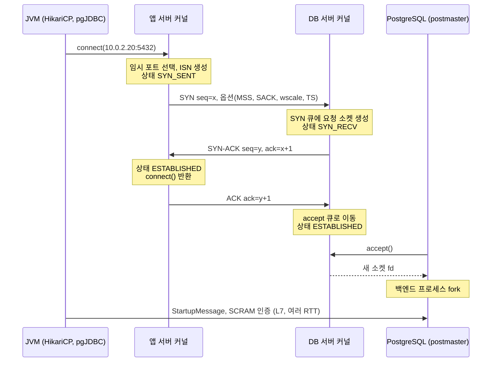
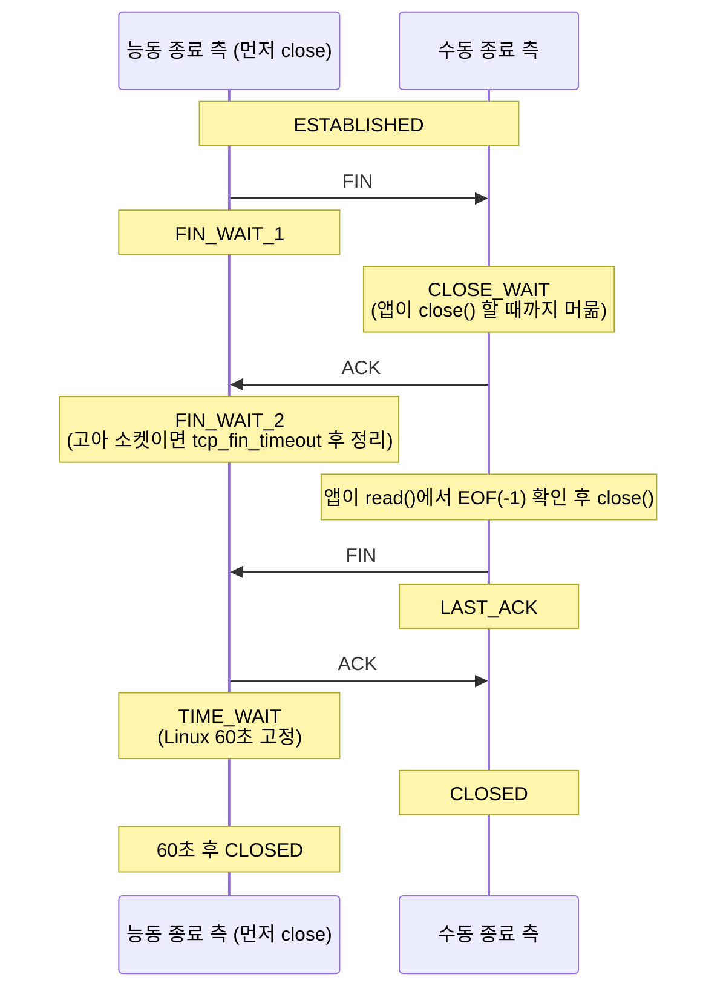
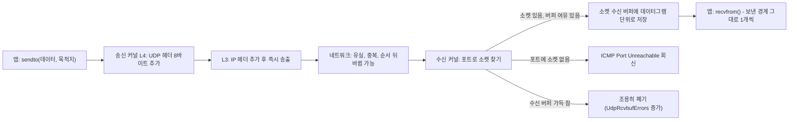

# 03. TCP와 UDP — 3-way handshake, TIME_WAIT, 커넥션 재사용

> 관련 문서: [실습](./03-TCP-실습.md) · 이전 장 [02. IP 주소, 서브넷, CIDR](./02-IP-서브넷-CIDR-이론.md)

## 1. 한 줄 요약

TCP는 IP 위에서 (출발 IP, 출발 포트, 목적 IP, 목적 포트) 네 값으로 식별되는 두 끝점 사이에 순서와 전달이 보장되는 바이트 스트림을 제공하는 연결 지향 전송 프로토콜이고, UDP는 IP에 포트 번호와 체크섬만 더한 비연결형 데이터그램 프로토콜이다.

## 2. 왜 필요한가

IP(L3)는 **최선형(Best-effort)** 전달만 약속한다. 패킷은 유실되고, 중복되고, 순서가 뒤바뀌고, 수신 측이 처리할 수 있는 속도를 고려하지 않고 도착한다. 이 위에서 애플리케이션이 직접 신뢰성을 구현하면 모든 프로그램이 재전송·순서 복원·속도 조절을 각자 다시 만들어야 한다.

TCP는 이 일을 **커널이 한 번 구현하고 모든 애플리케이션이 공유**하게 만들었다.

| IP의 문제 | TCP의 해결책 |
|---|---|
| 유실 | 시퀀스 번호 + 확인 응답(ACK) + 재전송 |
| 순서 뒤바뀜, 중복 | 시퀀스 번호로 재정렬, 중복 폐기 |
| 수신 측 과부하 | 흐름 제어 (수신 윈도우) |
| 네트워크 과부하 | 혼잡 제어 (혼잡 윈도우) |
| 누구의 데이터인지 모름 | 포트 번호로 프로세스 구분 |

대가도 있다. 연결 수립에 왕복 1회(1 RTT)가 필요하고, 양 끝 커널이 커넥션 상태를 유지해야 하며, 앞 패킷 하나가 유실되면 뒤 데이터가 도착해 있어도 애플리케이션에 넘기지 못한다(HOL 블로킹, Head-of-Line Blocking).

UDP는 이 대가를 치르지 않기 위해 존재한다. 요청 하나에 응답 하나로 끝나는 DNS 조회에 핸드셰이크 1 RTT는 낭비이고, 음성·게임처럼 늦게 온 데이터가 쓸모없는 통신에서 재전송은 오히려 해롭다. 그리고 QUIC(HTTP/3)처럼 **TCP의 기능을 사용자 공간에서 다르게 구현하고 싶은 프로토콜**의 바탕이 된다.

백엔드 개발자에게 이 장이 중요한 이유는 하나다. **HikariCP, RestClient, WebClient, Tomcat 커넥터가 다루는 "커넥션"이 바로 TCP 커넥션**이다. 커넥션 풀 설정값(`maxLifetime`, `keepaliveTime`, idle timeout)의 정답은 모두 TCP 커넥션의 생성 비용과 종료 방식에서 나온다.

## 3. 핵심 개념

| 용어 | 정의 |
|---|---|
| 4-튜플 (4-tuple) | (출발 IP, 출발 포트, 목적 IP, 목적 포트). TCP 커넥션의 식별자. 하나라도 다르면 다른 커넥션이다 |
| 포트 (Port) | 16비트 번호. 한 호스트 안에서 어떤 소켓(프로세스)에게 전달할지 구분 |
| 임시 포트 (Ephemeral Port) | 클라이언트가 `connect()` 할 때 커널이 자동으로 고르는 출발 포트. Linux 기본 범위 32768–60999 |
| 시퀀스 번호 (Sequence Number) | 이 세그먼트의 첫 바이트가 스트림에서 몇 번째 바이트인지. 초기값(ISN)은 무작위 |
| 확인 응답 번호 (Acknowledgment Number) | "다음에 받을 바이트 번호". 그 직전까지는 잘 받았다는 뜻 |
| 수신 윈도우 (Receive Window) | 수신 측이 지금 더 받을 수 있는 바이트 수. 흐름 제어(Flow Control)의 수단 |
| 혼잡 윈도우 (Congestion Window, cwnd) | 네트워크 상태를 추정해 송신 측이 스스로 제한하는 전송량. 혼잡 제어(Congestion Control)의 수단 |
| 재전송 타임아웃 (RTO, Retransmission Timeout) | ACK가 이 시간 안에 안 오면 재전송. 실패할 때마다 두 배로 늘어남(지수 백오프) |
| 3방향 핸드셰이크 (3-way Handshake) | SYN → SYN-ACK → ACK. 양쪽의 ISN을 교환하고 커넥션을 수립 |
| 능동 종료 / 수동 종료 (Active / Passive Close) | 먼저 FIN을 보내는 쪽 / FIN을 받는 쪽 |
| TIME_WAIT | 능동 종료한 쪽이 마지막 ACK 후 2MSL 동안 머무는 상태. Linux는 60초 |
| CLOSE_WAIT | 상대의 FIN을 받았지만 **내 애플리케이션이 아직 `close()`하지 않은** 상태 |
| RST (Reset) | 커넥션을 즉시 폐기하는 플래그. 정상 종료 절차(FIN)를 생략 |
| 리슨 백로그 (Listen Backlog) | 리슨 소켓의 대기열. SYN 큐(핸드셰이크 진행 중)와 accept 큐(완료, `accept()` 대기)로 나뉨 |
| 커넥션 재사용 (Connection Reuse) | 한 TCP 커넥션으로 여러 요청을 보내는 것. HTTP keep-alive, 커넥션 풀이 이것을 구현 |
| 데이터그램 (Datagram) | UDP의 전송 단위. 보낸 경계 그대로 받음. 순서·도착 보장 없음 |

## 4. 동작 원리와 흐름

Spring Boot 앱의 HikariCP가 PostgreSQL에 새 커넥션을 만들고, 쿼리를 보내고, 나중에 닫는 전 과정을 따라간다.

### 4-1. 연결 수립: 3-way handshake와 리슨 큐



1. **[L4, 앱 서버 커널]** pgJDBC가 `Socket.connect()`를 호출한다. 커널은 `net.ipv4.ip_local_port_range`에서 임시 포트를 고르고, 무작위 ISN(RFC 6528)을 만들어 SYN을 보낸다. SYN에는 MSS, SACK 허용, 윈도우 스케일, 타임스탬프 옵션이 실린다. 소켓 상태는 `SYN_SENT`.
2. **[L4, DB 서버 커널]** 5432 포트의 리슨 소켓이 SYN을 받아 **SYN 큐**에 요청 소켓을 만들고(`SYN_RECV`) SYN-ACK를 보낸다. PostgreSQL 프로세스는 아직 아무것도 모른다.
3. **[L4, 앱 서버 커널]** SYN-ACK를 받으면 `ESTABLISHED`가 되고 ACK를 보낸다. **이 시점에 `connect()`가 반환된다.** 여기까지 1 RTT.
4. **[L4, DB 서버 커널]** ACK를 받으면 커넥션을 **accept 큐**로 옮긴다. accept 큐가 가득 차 있으면 기본 설정(`tcp_abort_on_overflow=0`)에서는 이 ACK를 조용히 버린다. 클라이언트는 연결됐다고 믿고, 서버는 `SYN_RECV`에 머무는 불일치가 생긴다(9-5).
5. **[L4→L7, PostgreSQL]** postmaster가 `accept()`로 커넥션을 꺼내고 백엔드 프로세스를 fork한다. Tomcat이라면 Acceptor 스레드가 `accept()`하고 Poller에 등록한다.
6. **[L7]** PostgreSQL 시작 메시지, SCRAM-SHA-256 인증(여러 번 왕복), TLS를 쓰면 그 전에 TLS 핸드셰이크([6장](./06-TLS-이론.md)).

**새 커넥션 하나의 비용** = TCP 1 RTT + (TLS 1~2 RTT) + 인증 2~3 RTT + DB 서버의 프로세스 생성. 같은 데이터센터 안에서도 수 ms, 리전을 건너면 수십~수백 ms다. **커넥션 풀이 존재하는 이유가 이 비용**이다.

### 4-2. 데이터 전송

1. **[L7→L4]** `write()`한 바이트는 커널 송신 버퍼로 복사된다([1장](./01-OSI-TCPIP-이론.md)). TCP는 이를 MSS 단위로 나눠 시퀀스 번호를 붙인다.
2. **[L4]** 송신량은 min(상대의 수신 윈도우, 나의 혼잡 윈도우)로 제한된다. 새 커넥션은 혼잡 윈도우가 작게 시작해(초기값 10 MSS, RFC 6928) ACK가 올 때마다 커진다. 이를 슬로 스타트(Slow Start)라 한다. **새 커넥션은 처음 몇 RTT 동안 느리다.** 재사용하는 커넥션은 이미 윈도우가 커져 있다. 다만 Linux는 기본값(`tcp_slow_start_after_idle=1`)에서 일정 시간 쉰 커넥션의 윈도우를 다시 줄인다.
3. **[L4]** ACK가 RTO 안에 안 오면 재전송하고 RTO를 두 배로 늘린다. ACK가 전혀 안 오면 `net.ipv4.tcp_retries2`(기본 15회, 약 15분) 동안 시도한 뒤 커넥션을 포기한다. 애플리케이션 타임아웃이 없으면 그동안 스레드가 기다린다(9-4).

### 4-3. 연결 종료: 4-way와 TIME_WAIT



1. **[L7→L4, 능동 종료 측]** 애플리케이션이 `close()`하면 커널이 FIN을 보낸다. `FIN_WAIT_1` → ACK를 받으면 `FIN_WAIT_2`.
2. **[L4, 수동 종료 측 커널]** FIN을 받으면 ACK를 보내고 `CLOSE_WAIT`가 된다. 커널은 여기서 멈춘다. **다음 단계는 애플리케이션이 진행한다.**
3. **[L7, 수동 종료 측 앱]** `read()`가 -1(EOF)을 반환하면 애플리케이션이 상대가 닫았음을 알게 된다. 애플리케이션이 `close()`해야 FIN이 나간다. **`close()`를 안 하면 CLOSE_WAIT가 무한히 남는다**(9-2).
4. **[L4]** 수동 종료 측은 `LAST_ACK` → 마지막 ACK를 받고 `CLOSED`.
5. **[L4, 능동 종료 측]** 마지막 ACK를 보내고 **TIME_WAIT**. Linux는 60초(`TCP_TIMEWAIT_LEN`, 커널 코드에 고정) 뒤에 소켓을 완전히 제거한다.

**TIME_WAIT가 필요한 두 가지 이유** (RFC 9293):

- **마지막 ACK 유실 대비**: 마지막 ACK가 유실되면 상대가 FIN을 재전송한다. 능동 종료 측이 이미 소켓을 지웠다면 RST로 응답하게 되고, 상대는 정상 종료를 에러로 받는다.
- **지연 세그먼트 격리**: 같은 4-튜플로 새 커넥션이 바로 생기면, 네트워크에 떠돌던 이전 커넥션의 지연 세그먼트가 새 커넥션의 데이터로 섞일 수 있다. 세그먼트의 최대 수명(MSL, Maximum Segment Lifetime)의 두 배를 기다리면 옛 세그먼트는 모두 사라진다.

**핵심 규칙: TIME_WAIT는 먼저 닫은 쪽에 생긴다.** 서버든 클라이언트든 상관없다.

### 4-4. 상태는 어디에 생기는가

| 상태 | 위치 | 생성 | 소멸 | 자원 |
|---|---|---|---|---|
| 리슨 소켓 + SYN 큐 + accept 큐 | 서버 커널 | `listen()` | 프로세스 종료 | fd 1개 |
| ESTABLISHED 소켓 | 양 끝 커널 | 핸드셰이크 완료 | FIN/RST | fd 1개 + 송수신 버퍼 |
| CLOSE_WAIT | 수동 종료 측 커널 | FIN 수신 | **애플리케이션의 `close()`** | **fd 유지** + 버퍼 |
| FIN_WAIT_2 (고아) | 능동 종료 측 커널 | ACK 수신 | 상대 FIN 또는 `tcp_fin_timeout`(60초) | fd 없음 |
| TIME_WAIT | 능동 종료 측 커널 | 마지막 ACK 송신 | 60초 후 자동 | fd 없음, 수백 바이트. **클라이언트라면 임시 포트 1개 점유** |
| 커넥션 객체 | JVM 힙 (HikariCP 풀, HTTP 클라이언트 풀) | 풀 채우기 | `maxLifetime`, idle 제거, 검증 실패 | 소켓 fd 1개 |
| NAT·방화벽·LB 커넥션 엔트리 | 중간 장비 (conntrack, AWS NAT GW, NLB) | SYN 통과 | **장비의 idle timeout** | 중간 장비 메모리 |

마지막 줄이 가장 위험하다. 양 끝 커널과 커넥션 풀은 커넥션이 살아 있다고 믿는데, 중간 장비가 idle timeout으로 엔트리를 지우면 그 커넥션은 **아무도 모르게 죽는다**(9-3).

### 4-5. UDP의 흐름



1. **[L4, 커널]** 핸드셰이크 없이 첫 패킷부터 데이터다. 커넥션 상태가 없다.
2. **[L4]** 데이터그램 하나 = IP 패킷 하나(MTU를 넘으면 IP 단편화). 보낸 경계가 받는 쪽에서도 유지된다. TCP는 경계가 없는 바이트 스트림이라 애플리케이션이 메시지 경계를 직접 만들어야 한다(HTTP의 `Content-Length`, PostgreSQL 메시지의 길이 필드).
3. **[L4]** 유실되면 그걸로 끝이다. 재전송은 애플리케이션(DNS 리졸버의 재시도, QUIC의 자체 재전송)이 한다.
4. **상태**: 양 끝 커널에는 커넥션 상태가 없지만, **NAT와 상태 기반 방화벽은 UDP에도 conntrack 엔트리를 만든다.** 이 엔트리는 TCP보다 훨씬 짧은 idle timeout을 가진다(Linux conntrack 기본 수십 초 수준, 장비마다 다름 — 확인 필요).

## 5. 구현 레벨 들여다보기

### TCP 헤더 (RFC 9293)

```text
 0                   1                   2                   3
 0 1 2 3 4 5 6 7 8 9 0 1 2 3 4 5 6 7 8 9 0 1 2 3 4 5 6 7 8 9 0 1
+-------------------------------+-------------------------------+
|          Source Port          |       Destination Port        |
+-------------------------------+-------------------------------+
|                        Sequence Number                        |
+---------------------------------------------------------------+
|                    Acknowledgment Number                      |
+-------+-------+-+-+-+-+-+-+-+-+-------------------------------+
| Data  |       |C|E|U|A|P|R|S|F|                               |
| Offset| Rsrvd |W|C|R|C|S|S|Y|I|            Window             |
|       |       |R|E|G|K|H|T|N|N|                               |
+-------+-------+-+-+-+-+-+-+-+-+-------------------------------+
|           Checksum            |         Urgent Pointer        |
+-------------------------------+-------------------------------+
|                    Options (0~40 bytes)                       |
```

| 필드 | 크기 | 의미 |
|---|---|---|
| Source/Destination Port | 16비트씩 | 4-튜플의 포트 두 개. 포트가 16비트라 최대 65535 |
| Sequence / Acknowledgment Number | 32비트씩 | 바이트 단위 위치 |
| Data Offset | 4비트 | 헤더 길이(32비트 워드 단위). 최소 5 = 20바이트 |
| 플래그 | 8비트 | `SYN` 연결 요청, `ACK` 확인 응답 유효, `FIN` 송신 종료, `RST` 즉시 폐기, `PSH` 즉시 전달 권고, `URG` 긴급, `ECE`/`CWR` 명시적 혼잡 알림(ECN) |
| Window | 16비트 | 수신 윈도우. 16비트면 최대 64KB라 윈도우 스케일 옵션으로 확장 |

자주 보는 옵션:

| Kind | 옵션 | 표준 | 역할 |
|---|---|---|---|
| 2 | MSS | RFC 9293 | SYN에만. "나는 세그먼트 하나에 이만큼 받을 수 있다" (보통 1460) |
| 3 | Window Scale | RFC 7323 | SYN에만. Window 값을 2^n 배로 해석. 최대 n=14(약 1GB) |
| 4 / 5 | SACK Permitted / SACK | RFC 2018 | 중간이 빠진 경우 "이 구간은 받았다"를 알려 필요한 부분만 재전송 |
| 8 | Timestamps | RFC 7323 | RTT 측정, 시퀀스 번호 순환 방지(PAWS). `tcp_tw_reuse`의 전제 조건 |

### UDP 헤더 (RFC 768)

```text
+----------------+----------------+
|  Source Port   |  Dest Port     |   각 16비트
+----------------+----------------+
|  Length        |  Checksum      |   각 16비트
+----------------+----------------+
```

8바이트가 전부다. 시퀀스 번호도, ACK도, 윈도우도 없다. 신뢰성이 필요하면 페이로드 안에 애플리케이션이 직접 넣는다.

### Linux 커널 파라미터

| 파라미터 | 기본값 | 의미와 주의점 |
|---|---|---|
| `net.ipv4.ip_local_port_range` | `32768 60999` (28,232개) | 임시 포트 범위. 네트워크 네임스페이스(컨테이너)마다 따로 |
| `net.ipv4.tcp_fin_timeout` | 60 | **FIN_WAIT_2** 고아 소켓 유지 시간. 흔한 오해와 달리 **TIME_WAIT 시간이 아니다** |
| TIME_WAIT 시간 | 60초 | 커널 상수 `TCP_TIMEWAIT_LEN`. 일반적으로 sysctl로 바꿀 수 없다(최신 커널 변경 여부 확인 필요) |
| `net.ipv4.tcp_tw_reuse` | `2` (루프백만 허용) | `1`이면 **나가는 연결(클라이언트)**이 1초 이상 지난 TIME_WAIT 4-튜플을 재사용. 타임스탬프 옵션 필요. 서버 측 효과 없음 |
| `net.ipv4.tcp_tw_recycle` | – | **Linux 4.12에서 삭제.** NAT 뒤 클라이언트들의 연결을 무작위로 끊는 문제가 있었다. 옛 블로그의 튜닝 가이드에 남아 있으니 주의 |
| `net.ipv4.tcp_max_tw_buckets` | 메모리에 비례 | TIME_WAIT 소켓 상한. 넘으면 즉시 제거하고 `TCP: time wait bucket table overflow` 로그 |
| `net.ipv4.tcp_syn_retries` | 6 | SYN 재전송 횟수. 1+2+4+…+64초 ≈ **127초**. 애플리케이션 connect 타임아웃이 없으면 이만큼 기다림 |
| `net.ipv4.tcp_synack_retries` | 5 | 서버의 SYN-ACK 재전송 횟수 |
| `net.ipv4.tcp_retries2` | 15 | ESTABLISHED에서 ACK 없는 데이터를 포기하기까지 재전송 횟수. RTO 백오프로 약 15분 |
| `net.core.somaxconn` | 4096 (커널 5.4+, 이전 128) | accept 큐 상한. 실제 크기 = min(`listen()`의 backlog, somaxconn) |
| `net.ipv4.tcp_max_syn_backlog` | 메모리에 비례 | SYN 큐 크기 |
| `net.ipv4.tcp_syncookies` | 1 | SYN 큐가 넘치면 상태를 저장하지 않는 SYN 쿠키로 응답. SYN 플러드 방어 |
| `net.ipv4.tcp_abort_on_overflow` | 0 | accept 큐가 가득 찼을 때 `0`=최종 ACK를 조용히 버림, `1`=RST 전송 |
| `net.ipv4.tcp_keepalive_time` / `_intvl` / `_probes` | 7200 / 75 / 9 | TCP keepalive: 2시간 유휴 후 75초 간격 9번 탐침. **소켓에 `SO_KEEPALIVE`를 켠 경우에만** 동작 |
| `net.ipv4.tcp_slow_start_after_idle` | 1 | 유휴 후 혼잡 윈도우를 줄임 |

### 관찰 도구

```text
# ss -tan                               # 모든 TCP 소켓과 상태
# ss -tan state time-wait | wc -l       # TIME_WAIT 개수 (헤더 1줄 포함)
# ss -tano state time-wait              # 남은 시간: timer:(timewait,43sec,0)
# ss -tanp state close-wait             # CLOSE_WAIT와 소유 프로세스
# ss -ltn                               # LISTEN 소켓: Recv-Q=현재 accept 큐 길이, Send-Q=accept 큐 최대치
# ss -s                                 # 상태별 합계 요약
# nstat -az TcpExtListenOverflows TcpExtListenDrops   # accept 큐 넘침 누적 카운터
# ss -ti                                # 커넥션별 rtt, cwnd, retrans 같은 내부 값
```

`ss -ltn`의 `Recv-Q`/`Send-Q`는 LISTEN 소켓과 ESTABLISHED 소켓에서 의미가 다르다. LISTEN에서는 accept 큐의 현재 길이와 최대치, ESTABLISHED에서는 아직 앱이 읽지 않은 수신 바이트 수와 상대가 ACK하지 않은 송신 바이트 수다.

### 소켓 옵션

| 옵션 | 효과 | Java에서 |
|---|---|---|
| `SO_REUSEADDR` | TIME_WAIT가 남은 포트에도 리슨 소켓을 바인드할 수 있게 함 | `ServerSocket.setReuseAddress()`. JDK는 Linux에서 서버 소켓에 기본으로 켠다(확인 필요) |
| `SO_LINGER` = 0 | `close()` 시 FIN 대신 **RST**를 보내고 TIME_WAIT 생략 | `Socket.setSoLinger(true, 0)`. 전송 중 데이터 유실 위험. TIME_WAIT 회피용으로 쓰지 말 것 |
| `TCP_NODELAY` | Nagle 알고리즘 끔. 작은 쓰기를 모으지 않고 즉시 전송 | `Socket.setTcpNoDelay(true)`. Tomcat 커넥터는 기본 `tcpNoDelay=true` |
| `SO_KEEPALIVE` | 유휴 커넥션에 keepalive 탐침 | `Socket.setKeepAlive(true)`. 간격은 커널 기본값(2시간) |
| `TCP_KEEPIDLE` / `TCP_KEEPINTERVAL` / `TCP_KEEPCOUNT` | 소켓별 keepalive 간격 | JDK 11+ `jdk.net.ExtendedSocketOptions` (Linux, macOS) |
| `SO_TIMEOUT` | `read()` 블로킹 상한 | `Socket.setSoTimeout()`. 초과 시 `SocketTimeoutException: Read timed out` |

## 6. 백엔드 코드와 만나는 지점

### 6-1. 예외와 TCP 이벤트의 대응

| Java 예외 / 메시지 | TCP에서 일어난 일 | 전형적 원인 |
|---|---|---|
| `ConnectException: Connection refused` | SYN에 RST 응답 | 포트에 리슨 없음, 서버 재시작 중 |
| `SocketTimeoutException: Connect timed out` | SYN 재전송 중 connect 타임아웃 도달 | 방화벽 DROP, accept 큐 넘침(9-5), 호스트 다운 |
| `ConnectException: Connection timed out` | 타임아웃 없이 `tcp_syn_retries` 소진(약 127초) | 위와 같음 + **connect 타임아웃 미설정** |
| `SocketException: Connection reset` | ESTABLISHED에서 RST 수신 | 상대가 이미 닫은 커넥션에 요청, 중간 장비 idle timeout, `SO_LINGER=0` |
| `IOException: Broken pipe` | RST 받은 소켓에 `write()` → EPIPE | 위와 같음 (쓰기 쪽에서 발견) |
| `SocketTimeoutException: Read timed out` | `SO_TIMEOUT` 동안 수신 데이터 없음 | 상대 앱이 느림, 또는 커넥션이 중간에서 죽음 |
| `read()`가 -1 반환 (예외 아님) | FIN 수신 | 상대가 정상 종료. 이제 내가 `close()`할 차례 |
| `NoRouteToHostException` / `BindException: Cannot assign requested address` | `connect()`가 EADDRNOTAVAIL | **임시 포트 고갈**(9-1). JDK 버전에 따라 예외 클래스가 다름 |
| `BindException: Address already in use` | 같은 포트에 이미 LISTEN 중 | 이전 프로세스가 아직 살아 있음. Spring Boot는 `Web server failed to start. Port 8080 was already in use.` |
| `SocketException: Too many open files` | fd 한도 초과 | CLOSE_WAIT 누수(9-2), 풀 없는 대량 연결 (10장 ulimit) |

라이브러리가 이 예외를 감싸서 다른 이름으로 보여준다.

```text
# pgJDBC: 풀 안에서 죽은 커넥션을 썼을 때
org.postgresql.util.PSQLException: An I/O error occurred while sending to the backend.
Caused by: java.net.SocketException: Connection reset

# HikariCP: 빌려주기 전 검증에서 죽은 커넥션을 발견했을 때 (WARN 로그)
HikariPool-1 - Failed to validate connection org.postgresql.jdbc.PgConnection@6f1a2b3c (This connection has been closed.). Possibly consider using a shorter maxLifetime value.

# Apache HttpClient 5: 서버가 닫은 keep-alive 커넥션에 요청을 보냈을 때
org.apache.hc.core5.http.NoHttpResponseException: api.partner.com:443 failed to respond

# Reactor Netty (WebClient): 같은 원인
reactor.netty.http.client.PrematureCloseException: Connection prematurely closed BEFORE response
```

HikariCP 경고 메시지가 `maxLifetime`을 줄이라고 권하는 이유가 4-4의 마지막 줄이다. 풀은 커넥션이 살아 있다고 믿었는데 DB나 중간 장비가 먼저 닫았다.

### 6-2. HikariCP ↔ PostgreSQL: 커넥션 수명 설계

```yaml
spring:
  datasource:
    # connectTimeout: TCP connect 상한(초). 기본 10
    # socketTimeout: read() 상한(초). 기본 0 = 무한 → 설정하지 않으면 9-4 발생
    # tcpKeepAlive: SO_KEEPALIVE. 기본 false. 켜도 간격은 커널 기본 2시간
    url: jdbc:postgresql://db:5432/app?connectTimeout=5&socketTimeout=60&tcpKeepAlive=true
    hikari:
      maximum-pool-size: 10        # 기본 10
      minimum-idle: 10             # 기본 = maximum-pool-size (고정 크기 풀 권장)
      connection-timeout: 3000     # 풀에서 빌리는 대기(ms). 기본 30000. TCP connect 타임아웃이 아님
      max-lifetime: 1500000        # 커넥션 최대 수명(ms). 기본 1800000(30분). 아래 규칙 참고
      keepalive-time: 120000       # 유휴 커넥션에 주기적 검증 쿼리(ms). 기본값은 버전에 따라 0(끔) 또는 120000 — 확인 필요. 최소 30000
      idle-timeout: 600000         # minimum-idle < maximum-pool-size 일 때만 의미. 기본 600000
```

**규칙: 커넥션을 먼저 닫는 쪽은 풀(클라이언트)이어야 한다.** 설계 순서:

1. 경로상의 모든 idle timeout을 적는다. 방화벽, AWS NAT GW(350초), NLB(TCP idle 기본 350초, 변경 가능), PgBouncer, PostgreSQL `idle_session_timeout`(PG 14+, 기본 0=끔). 값은 작성 시점 기준이며 서비스 문서로 확인한다.
2. `keepalive-time` < 가장 짧은 idle timeout → 유휴 커넥션이 중간 장비에서 잊히지 않도록 트래픽을 흘린다.
3. `max-lifetime` < DB·인프라가 커넥션을 강제로 끊는 시간 → HikariCP가 먼저 정리한다. HikariCP 문서는 "인프라가 강제하는 한도보다 수 초 이상 짧게"를 권한다.
4. `socketTimeout` > 가장 긴 정상 쿼리 시간 → 죽은 커넥션에서의 무한 대기를 끊는다. 긴 배치 쿼리가 있다면 별도 DataSource로 분리한다.

**PostgreSQL 쪽 설정**: `tcp_keepalives_idle`, `tcp_keepalives_interval`, `tcp_keepalives_count`(0 = OS 기본값), `idle_in_transaction_session_timeout`(트랜잭션을 열어둔 채 방치된 세션 종료). 서버 쪽 keepalive는 **클라이언트가 사라진 커넥션**(앱 서버 강제 종료, 네트워크 단절)을 정리해서 PostgreSQL 백엔드 프로세스와 `max_connections` 슬롯을 회수한다.

### 6-3. Tomcat(인바운드): 누가 먼저 닫는가

```yaml
server:
  tomcat:
    accept-count: 100            # accept 큐 요청 크기. 기본 100. 실제 = min(이 값, somaxconn)
    max-connections: 8192        # Tomcat이 동시에 accept해서 들고 있는 커넥션 상한. 기본 8192. 넘으면 accept() 중단 → 커널 accept 큐에 쌓임
    threads:
      max: 200                   # 요청 처리 스레드. 기본 200
    connection-timeout: 20s      # 연결 후 요청 첫 줄을 기다리는 시간. 미설정 시 Tomcat 기본 60000ms
    keep-alive-timeout: 75s      # keep-alive 커넥션의 다음 요청 대기. 미설정 시 connection-timeout과 같음
    max-keep-alive-requests: 100 # 커넥션당 최대 요청 수. 기본 100. 도달하면 서버가 닫음(서버 측 TIME_WAIT)
```

앞단에 로드밸런서나 Nginx가 있으면 **백엔드(Tomcat)의 keep-alive 타임아웃 > 앞단의 idle timeout**이어야 한다. 반대면 앞단이 재사용하려고 요청을 보내는 순간 Tomcat이 막 닫는 경쟁 상태가 생겨 간헐적 502가 난다(9-3). AWS ALB 기본 idle timeout은 60초다(작성 시점 기준, 확인 필요). 위 예시의 75초는 그보다 길게 잡은 값이다. (11장 Nginx, 12장 로드밸런서)

### 6-4. 아웃바운드 HTTP 클라이언트: 풀을 쓰고, 먼저 닫아라

| 구성 | 커넥션 재사용 | 주의점 |
|---|---|---|
| `SimpleClientHttpRequestFactory` (`HttpURLConnection`) | JDK keep-alive 캐시. 목적지당 기본 5개(`http.maxConnections`) | 응답 바디를 끝까지 읽고 스트림을 닫아야 재사용됨 |
| `HttpComponentsClientHttpRequestFactory` (Apache HttpClient 5) | `PoolingHttpClientConnectionManager`. 기본 총 25, 라우트당 5(확인 필요) | 라우트당 5는 대부분의 서비스에 작다. idle 제거를 직접 켜야 함 |
| `JdkClientHttpRequestFactory` (`java.net.http.HttpClient`) | 내부 풀. idle 유지 시간은 `jdk.httpclient.keepalive.timeout` 시스템 속성 | JDK 버전별 기본값 확인 필요 |
| WebClient (Reactor Netty) | `ConnectionProvider`. 기본 max(CPU×2, 16) | 기본 `maxIdleTime`이 없음 → LB idle timeout과 충돌. 명시적으로 설정 |

Spring Boot 3.x는 클래스패스에 있는 라이브러리에 따라 `RestClient.Builder`·`RestTemplateBuilder`의 요청 팩토리를 자동으로 고른다. 감지 순서는 버전에 따라 다르므로(확인 필요) 운영에서는 명시적으로 정한다. **요청마다 `new RestTemplate()` 또는 새 `HttpClient`를 만들면 풀이 없는 것과 같다.** 호출마다 새 TCP 커넥션을 만들고 클라이언트 쪽에 TIME_WAIT가 쌓인다(9-1).

Apache HttpClient 5로 풀과 idle 정리를 명시한 `RestClient` 구성(Spring Boot 3.2+, Java 17+):

```java
import org.apache.hc.client5.http.config.ConnectionConfig;
import org.apache.hc.client5.http.impl.classic.CloseableHttpClient;
import org.apache.hc.client5.http.impl.classic.HttpClients;
import org.apache.hc.client5.http.impl.io.PoolingHttpClientConnectionManager;
import org.apache.hc.client5.http.impl.io.PoolingHttpClientConnectionManagerBuilder;
import org.apache.hc.core5.util.TimeValue;
import org.apache.hc.core5.util.Timeout;
import org.springframework.context.annotation.Bean;
import org.springframework.context.annotation.Configuration;
import org.springframework.http.client.HttpComponentsClientHttpRequestFactory;
import org.springframework.web.client.RestClient;

@Configuration
public class PartnerApiClientConfig {

    @Bean(destroyMethod = "close")
    public CloseableHttpClient partnerHttpClient() {
        PoolingHttpClientConnectionManager connectionManager =
                PoolingHttpClientConnectionManagerBuilder.create()
                        .setMaxConnTotal(100)          // 기본 25
                        .setMaxConnPerRoute(50)        // 기본 5: 한 대상 서버로의 동시 커넥션 상한
                        .setDefaultConnectionConfig(ConnectionConfig.custom()
                                .setConnectTimeout(Timeout.ofSeconds(3))       // SYN 무응답 대기 상한
                                .setSocketTimeout(Timeout.ofSeconds(10))       // read() 상한 (SO_TIMEOUT)
                                .setValidateAfterInactivity(TimeValue.ofSeconds(2)) // 2초 이상 쉰 커넥션은 빌려주기 전 확인
                                .setTimeToLive(TimeValue.ofMinutes(5))         // 커넥션 최대 수명 (HikariCP maxLifetime과 같은 역할)
                                .build())
                        .build();

        return HttpClients.custom()
                .setConnectionManager(connectionManager)
                // 서버·LB의 keep-alive(보통 60~75초)보다 짧게: 클라이언트가 먼저 닫아 경쟁 상태를 없앤다
                .evictIdleConnections(TimeValue.ofSeconds(30))
                .evictExpiredConnections()
                .build();
    }

    @Bean
    public RestClient partnerRestClient(RestClient.Builder builder, CloseableHttpClient partnerHttpClient) {
        return builder
                .baseUrl("https://api.partner.example")
                .requestFactory(new HttpComponentsClientHttpRequestFactory(partnerHttpClient))
                .build();
    }
}
```

Java 8 / Spring 4~5 환경에서는 Apache HttpClient 4.x의 `PoolingHttpClientConnectionManager` + `HttpClientBuilder.evictIdleConnections(30, TimeUnit.SECONDS)` + `RestTemplate(new HttpComponentsClientHttpRequestFactory(client))` 조합으로 같은 원칙을 적용한다. 4.x의 기본 풀은 총 20, 라우트당 2로 더 작다.

### 6-5. CLOSE_WAIT를 만드는 코드

CLOSE_WAIT는 "상대는 닫았는데 **내 코드가** 안 닫은" 상태다. 전형적인 코드:

```java
// 나쁜 예: 예외 경로에서 응답을 닫지 않음 → 커넥션이 풀로 반환되지도, 닫히지도 않음
CloseableHttpResponse response = httpClient.execute(request);
if (response.getCode() != 200) {
    throw new IllegalStateException("partner error");   // response.close() 누락
}
```

`try-with-resources`(Java 7+)로 응답·스트림·JDBC `Connection`/`Statement`/`ResultSet`을 닫는다. HikariCP에서 커넥션을 반환하지 않는 코드는 `leak-detection-threshold`(ms, 기본 0=끔)로 스택 트레이스를 남겨 찾을 수 있다.

### 6-6. 가상 스레드와 커넥션

Java 21 가상 스레드는 소켓 블로킹 I/O에서 캐리어 스레드를 놓아준다. 스레드가 수만 개로 늘어도 부담이 없어지면서 병목은 **TCP 커넥션 수**로 옮겨간다. HikariCP 풀 크기(기본 10), HTTP 클라이언트의 라우트당 커넥션 상한, 임시 포트 범위, 상대 서버의 `max_connections`가 새 상한이 된다. 가상 스레드를 도입하면서 풀 크기를 스레드 수에 맞춰 키우면 DB가 먼저 무너진다. 풀은 **DB가 감당할 수 있는 동시 처리량 기준**으로 정하고, 풀에서 빌리는 대기(`connection-timeout`)가 새로운 대기열이 된다는 점을 받아들인다. (13장)

### 6-7. 백엔드에서 만나는 UDP

- **DNS 조회**: `InetAddress.getByName()` → OS 리졸버 → UDP 53. 응답이 크면 TCP로 재시도. ([4장](./04-DNS-이론.md))
- **메트릭**: Micrometer StatsD 레지스트리(기본 UDP 8125). 유실돼도 애플리케이션은 모른다.
- **로그**: Logback `SyslogAppender`(UDP 514).
- **HTTP/3**: QUIC over UDP 443. ([5장](./05-HTTP-이론.md))

공통점: **실패해도 예외가 나지 않는다.** UDP `send()`는 커널 버퍼에 들어가면 성공이다.

### 6-8. 배포와 종료

- Spring Boot `server.shutdown=graceful`: 새 요청을 거부하고 처리 중인 요청을 `spring.lifecycle.timeout-per-shutdown-phase`(기본 30s)까지 기다린다. Spring Boot 3.4부터 기본값이 graceful로 바뀌었다(확인 필요).
- 종료 시 Tomcat이 keep-alive 커넥션을 닫으면 **서버가 능동 종료 측**이 되어 서버에 TIME_WAIT가 남는다. 서버의 TIME_WAIT는 포트를 소비하지 않으므로(서버 포트 8080 하나를 공유) 보통 문제가 아니다.
- 재시작 시 `Port 8080 was already in use`는 TIME_WAIT 때문이 아니다(JDK가 `SO_REUSEADDR`를 켜므로). **이전 프로세스가 아직 LISTEN 중**이라는 뜻이다. `ss -ltnp 'sport = :8080'`으로 PID를 확인한다.

## 7. 유사 개념과의 비교

### TCP vs UDP

| 항목 | TCP | UDP |
|---|---|---|
| 연결 | 핸드셰이크 필요(1 RTT) | 없음 |
| 신뢰성 | 재전송, 순서 보장, 중복 제거 | 없음 |
| 경계 | 바이트 스트림(경계 없음) | 데이터그램 경계 유지 |
| 흐름·혼잡 제어 | 있음 | 없음 (애플리케이션 책임) |
| 헤더 | 20~60바이트 | 8바이트 |
| 커널 상태 | 커넥션마다 | 없음 (단, NAT/방화벽은 만듦) |
| HOL 블로킹 | 있음 | 없음 |
| 대표 사용처 | HTTP/1.1·2, JDBC, gRPC, SSH | DNS, NTP, StatsD, 스트리밍, QUIC(HTTP/3) |

**판단 기준**: 데이터가 하나라도 빠지면 안 되고 순서가 중요하면 TCP. 요청·응답이 한 패킷에 들어가고 재시도가 쉬우면(DNS), 늦은 데이터가 쓸모없으면(실시간 미디어), 전송 계층을 직접 구현하려면(QUIC) UDP. 백엔드 API와 DB 통신은 사실상 항상 TCP다.

### 이름이 비슷한 "keep-alive" 세 가지

| 이름 | 계층 | 목적 | 설정 |
|---|---|---|---|
| TCP keepalive | L4 커널 | 유휴 커넥션에 빈 탐침을 보내 **상대 생존 확인** + 중간 장비 엔트리 유지 | `SO_KEEPALIVE`, `net.ipv4.tcp_keepalive_*`, pgJDBC `tcpKeepAlive` |
| HTTP keep-alive (persistent connection) | L7 | 응답 후에도 **커넥션을 닫지 않고 재사용** | Tomcat `keep-alive-timeout`, Nginx `keepalive_timeout` |
| HikariCP `keepaliveTime` | 애플리케이션 풀 | 유휴 커넥션에 **검증 쿼리**(`isValid()`)를 보내 죽은 커넥션 제거 + 중간 장비 엔트리 유지 | `spring.datasource.hikari.keepalive-time` |

"keep-alive를 켰다"는 말이 나오면 셋 중 무엇인지부터 확인한다.

### TIME_WAIT 대응 방법 비교

| 방법 | 효과 | 부작용 | 권장 |
|---|---|---|---|
| 커넥션 재사용 (풀, keep-alive) | TIME_WAIT 자체가 생기지 않음 | 없음. idle timeout 설계 필요 | **1순위** |
| `ip_local_port_range` 확장 | 포트 수 증가 (최대 약 6만) | 리슨 포트와 겹치지 않게 주의 | 보조 |
| `tcp_tw_reuse=1` | 클라이언트가 1초 지난 TIME_WAIT 재사용 | 타임스탬프 필요, NAT 환경에서 드물게 문제 | 보조 (클라이언트 측만 의미) |
| 목적지 IP·포트 다변화 | 4-튜플 공간 증가 | 구조 변경 필요 | 대규모 프록시 |
| `SO_LINGER=0` (RST 종료) | TIME_WAIT 없음 | 데이터 유실, 상대는 `Connection reset` | **사용 금지** |
| `tcp_tw_recycle` | – | 커널 4.12에서 삭제됨 | 불가 |

## 8. 표준·버전별 변천

| 시기 | 사건 | 실무 영향 |
|---|---|---|
| 1980 | UDP (RFC 768) | 지금까지 그대로 |
| 1981 | TCP (RFC 793) | 상태 머신, TIME_WAIT 정의 |
| 1989 | RFC 1122 호스트 요구사항 | TCP keepalive 기본 2시간 이상 권고의 출처 |
| 1996 | SACK (RFC 2018), SYN 쿠키 등장 | 손실 복구 효율화, SYN 플러드 방어 |
| 2006 | Linux 2.6.19 CUBIC 기본 혼잡 제어 | 고대역·장거리 성능 개선 (RFC 9438, 2023) |
| 2013 | 초기 혼잡 윈도우 10 MSS (RFC 6928) | 짧은 응답은 첫 RTT에 끝남 |
| 2014 | 윈도우 스케일·타임스탬프 재정리 (RFC 7323), TCP Fast Open (RFC 7413) | TFO는 미들박스 문제로 널리 쓰이지 못함 |
| 2016 | Linux 4.9 BBR 혼잡 제어 | 손실이 아닌 대역폭·RTT 기반. 선택 사항 |
| 2017 | Linux 4.12 `tcp_tw_recycle` 삭제 | 옛 튜닝 가이드 적용 시 sysctl 에러 |
| 2019 | Linux 5.4 `somaxconn` 128 → 4096 | 오래된 커널에서는 `accept-count`를 올려도 128로 잘림 |
| 2021 | QUIC (RFC 9000) | 신뢰성 전송을 UDP 위 사용자 공간에서 구현 |
| 2022 | TCP 표준 통합 개정 (RFC 9293) | RFC 793과 이후 수정 사항을 한 문서로 |

## 9. 함정과 장애 패턴

### 9-1. 임시 포트 고갈 — 클라이언트 측 TIME_WAIT 폭증

- **증상**: 트래픽이 몰릴 때 외부 API 호출이 대량으로 실패한다. 로그에 `java.net.NoRouteToHostException: Cannot assign requested address` 또는 `java.net.BindException: Cannot assign requested address`. 대상 서버는 멀쩡하고 CPU도 여유 있다.
- **원인**: 요청마다 새 TCP 커넥션을 만들고 클라이언트가 먼저 닫는다. 닫힌 커넥션마다 클라이언트에 TIME_WAIT가 60초 남고 임시 포트 하나를 점유한다. 같은 (목적지 IP, 목적지 포트)로 가는 커넥션은 포트 28,232개를 60초 동안 나눠 써야 하므로 **초당 약 470개**가 지속 가능한 상한이다. 원인 코드는 대개 요청마다 `new RestTemplate()`, 요청마다 새 `HttpClient`, `Connection: close` 헤더, 응답 바디를 안 읽어 재사용이 안 되는 경우다.
- **확인 방법**:
  - `ss -s` → `timewait` 수치.
  - `ss -tan state time-wait '( dport = :443 )' | wc -l` → 특정 목적지로 향한 TIME_WAIT 수. 2만 이상이면 고갈 직전.
  - `sysctl net.ipv4.ip_local_port_range`로 범위 확인.
  - 코드에서 HTTP 클라이언트 생성 위치 검색(`new RestTemplate`, `HttpClients.create`, `WebClient.create`가 메서드 안에 있는지).
- **해결**: 클라이언트 빈을 싱글턴으로 만들고 커넥션 풀을 쓴다(6-4). 응급 처치로 `tcp_tw_reuse=1`, 포트 범위 확장. 컨테이너에서는 이 sysctl들이 네트워크 네임스페이스별이라 Pod·컨테이너 단위로 설정해야 한다.

### 9-2. CLOSE_WAIT 누적 → `Too many open files`

- **증상**: 며칠에 걸쳐 서서히 나빠지다가 `java.net.SocketException: Too many open files`, Tomcat 로그에 `Socket accept failed`. 재시작하면 해결되고 며칠 뒤 재발한다.
- **원인**: 상대(외부 API, DB, 캐시)가 커넥션을 닫았는데(FIN) 우리 코드가 `close()`하지 않았다. 커널은 CLOSE_WAIT에서 애플리케이션을 기다리며 fd를 쥐고 있다. 원인은 예외 경로에서 응답 객체를 닫지 않는 코드(6-5), 응답 스트림을 끝까지 읽지 않은 풀, 스레드가 멈춰 소켓을 처리하지 못하는 경우다.
- **확인 방법**:
  - `ss -tanp state close-wait` → 상대 주소와 소유 프로세스. **상대 주소가 어디에 몰려 있는지**가 어떤 클라이언트 코드가 새는지 알려준다.
  - `ls /proc/<pid>/fd | wc -l` 추이, `cat /proc/<pid>/limits | grep 'open files'`.
  - `jcmd <pid> Thread.print` → 해당 커넥션을 쥔 스레드가 멈춰 있는지.
- **해결**: `try-with-resources`로 응답·스트림을 닫는다. HikariCP는 `leak-detection-threshold`로 누수 지점을 찾는다. fd 한도(`ulimit -n`)를 올리는 것은 증상을 늦출 뿐이다. **CLOSE_WAIT는 커널 튜닝으로 해결되지 않는다.** 커널은 애플리케이션을 기다릴 뿐이다.

### 9-3. 재사용한 커넥션이 이미 죽어 있다 — 간헐적 reset과 502

- **증상**: 한동안 조용하다가 첫 요청만 실패한다("아침 첫 요청만 에러"). `Connection reset`, `NoHttpResponseException ... failed to respond`, `PrematureCloseException`, HikariCP의 `Failed to validate connection ... Possibly consider using a shorter maxLifetime value.` 로드밸런서 뒤 서비스라면 LB가 간헐적으로 502를 반환한다.
- **원인**: 커넥션 풀은 커넥션이 살아 있다고 믿는데 다른 누군가가 먼저 닫았다.
  - **서버가 keep-alive 타임아웃으로 닫음**: 서버의 FIN이 도착하기 직전·직후에 클라이언트가 요청을 보내면 서버는 RST로 답한다. 서버 keep-alive ≤ 클라이언트 idle 유지 시간일 때 생기는 경쟁 상태다.
  - **중간 장비가 idle 엔트리를 지움**: NAT GW, 방화벽, NLB가 idle timeout 후 엔트리를 지운다. 장비가 RST를 보내면 즉시 `Connection reset`이 나고, 조용히 버리면 요청이 재전송만 반복하다 `socketTimeout`까지 멈춘다.
- **확인 방법**:
  - 실패가 **일정 시간 이상 유휴 후 첫 요청**에만 몰리는지 로그 타임스탬프로 확인한다. 유휴 시간이 특정 값(60초, 350초 등)을 넘을 때만 실패하면 그 값이 범인의 idle timeout이다.
  - 클라이언트에서 `tcpdump -nn host <대상>` → 요청 직후 RST가 오는지, 재전송만 반복되는지.
  - 경로상 장비의 idle timeout 설정값을 수집한다(ALB `idle_timeout.timeout_seconds`, Nginx `keepalive_timeout`, Tomcat `keep-alive-timeout`).
- **해결**: 커넥션 수명 계층을 **바깥(클라이언트)이 안쪽(서버)보다 짧게** 맞춘다. 클라이언트 idle 제거 < 프록시·LB idle timeout < 백엔드 keep-alive 타임아웃. HikariCP는 `keepalive-time`과 `max-lifetime`(6-2), HTTP 클라이언트는 `evictIdleConnections`(6-4), WebClient는 `maxIdleTime`. 멱등한 요청에 한해 재시도를 추가한다.

### 9-4. 타임아웃 없는 `read()` — 스레드가 영원히 멈춘다

- **증상**: 특정 시점 이후 일부 요청이 끝나지 않는다. Tomcat 스레드가 하나씩 줄어들다 결국 전체 응답 불가. 에러 로그는 없다.
- **원인**: 커넥션 반대편이 사라졌는데(서버 강제 종료, 케이블·VM 장애, 중간 장비의 조용한 드롭) FIN도 RST도 오지 않았다(반열림 커넥션, Half-open Connection). 우리 쪽이 보낼 데이터가 없으면 재전송도 일어나지 않아서 커널은 문제를 모르고, `read()`는 영원히 기다린다. pgJDBC `socketTimeout` 기본값 0(무한)이 대표적이다.
- **확인 방법**: 스레드 덤프(`jcmd <pid> Thread.print`, Actuator `/actuator/threaddump`)에서 `RUNNABLE` 상태로 다음 프레임에 멈춘 스레드를 찾는다.
  ```text
  Java 8~12:  java.net.SocketInputStream.socketRead0(Native Method)
  Java 13+:   sun.nio.ch.NioSocketImpl.park / sun.nio.ch.Net.poll
              ... org.postgresql.core.PGStream.receiveChar
  ```
  `ss -tnoi dst <DB IP>` 에서 해당 커넥션의 `timer`와 재전송 카운터도 본다.
- **해결**: 모든 소켓에 read 타임아웃을 건다(pgJDBC `socketTimeout`, HTTP 클라이언트 `setSocketTimeout`). DB 측에는 `statement_timeout`을 함께 둔다. TCP keepalive는 보조 수단이다(기본 2시간이라 커널 파라미터 조정이 함께 필요하다).

### 9-5. accept 큐 넘침 — 1초, 3초의 지연 스파이크

- **증상**: 응답 시간 분포에서 p99가 정확히 **약 1초, 3초** 근처에 몰린다. 부하가 높을 때 `Connect timed out`. 또는 클라이언트는 연결됐다고 믿는데 요청에 응답이 없다. 앱 로그에는 아무 흔적도 없다.
- **원인**: 애플리케이션이 `accept()`를 따라가지 못해 accept 큐가 찼다. 커널은 새 SYN이나 핸드셰이크의 마지막 ACK를 조용히 버리고, 클라이언트는 SYN을 1초, 이어서 2초 뒤(누적 3초)에 재전송한다(초기 RTO 1초 + 지수 백오프). 이 재전송이 지연 스파이크의 정체다. Tomcat은 `max-connections`(기본 8192)에 도달하면 `accept()`를 멈추므로 그 이후는 커널 accept 큐(`accept-count`, 기본 100)만 남는다.
- **확인 방법**:
  - `ss -ltn 'sport = :8080'` → `Recv-Q`(현재 대기)가 `Send-Q`(최대치)에 붙어 있는지.
  - `nstat -az TcpExtListenOverflows TcpExtListenDrops` → 누적 값이 증가하는지. 한 번 보고 몇 초 뒤 다시 본다.
  - 클라이언트에서 `tcpdump`로 같은 SYN이 1초, 3초 간격으로 재전송되는지.
- **해결**: 근본 원인은 앱이 느리게 accept하는 이유다(스레드 고갈, GC 정지, `max-connections` 도달). 그 원인을 해결하고, 순간 폭주를 흡수하도록 `accept-count`와 `somaxconn`을 적당히 늘린다. 큐를 무한정 키우면 대기 시간만 길어진다. 차라리 빨리 실패시키고 LB가 다른 인스턴스로 보내게 하는 편이 낫다. ([1장 9-3](./01-OSI-TCPIP-이론.md#9-3-l4-헬스체크는-통과하는데-서비스는-죽어-있다)과 같은 메커니즘이다)

### 9-6. 작은 요청마다 40ms 지연 — Nagle과 지연 ACK

- **증상**: 직접 구현한 소켓 프로토콜이나 오래된 클라이언트 라이브러리에서 요청당 정확히 약 40ms가 더해진다. 같은 LAN인데 RTT보다 훨씬 느리다.
- **원인**: Nagle 알고리즘은 ACK를 받지 못한 작은 세그먼트가 있으면 다음 작은 쓰기를 모아 둔다. 상대는 지연 ACK(Delayed ACK)로 ACK를 모아 보내며 Linux의 최소 지연은 약 40ms다. `write(헤더)` → `write(바디)` → `read(응답)` 패턴에서 두 번째 write가 첫 write의 ACK를 기다리고, 그 ACK는 40ms 뒤에 온다.
- **확인 방법**: `tcpdump -ttt`(패킷 간 간격)로 두 번째 작은 세그먼트 앞에 약 40ms 공백이 있는지 확인한다.
- **해결**: `setTcpNoDelay(true)`를 켜고, 한 요청을 여러 번이 아니라 한 번의 `write()`로 보내도록 버퍼링한다(`BufferedOutputStream` 후 `flush()`). Tomcat은 기본으로 `TCP_NODELAY`를 켠다. pgJDBC도 기본으로 켠다(확인 필요).

### 9-7. UDP 메트릭·로그가 조용히 사라진다

- **증상**: 부하가 높을 때만 StatsD 메트릭 그래프가 실제보다 낮게 나오거나 끊긴다. syslog로 보낸 로그 일부가 없다. 애플리케이션에는 에러가 없다.
- **원인**: 수신 측 소켓 버퍼가 넘치면 커널이 데이터그램을 버린다. 송신 측은 알 수 없다. NAT를 거친다면 UDP conntrack 엔트리가 짧은 idle timeout으로 사라져 응답이 버려지기도 한다.
- **확인 방법**: 수신 서버에서 `nstat -az UdpRcvbufErrors UdpInErrors` 또는 `netstat -su`의 `receive buffer errors` 증가 여부.
- **해결**: 수신 측 버퍼 확대(`SO_RCVBUF`, `net.core.rmem_max`), 에이전트를 같은 호스트에 배치(사이드카, DaemonSet), 유실이 허용되지 않는 데이터는 TCP 기반 전송으로 바꾼다.

## 10. 실무 적용 시나리오

- **부하 테스트 전 점검**: 테스트 중 앱 서버와 부하 발생기 양쪽에서 `ss -s`를 주기적으로 기록한다. 부하 발생기의 TIME_WAIT가 먼저 한계에 닿아 "서버가 느리다"는 잘못된 결론이 나는 경우가 흔하다. 부하 도구도 keep-alive를 켜야 실제 트래픽과 비슷해진다.
- **HikariCP 설정 리뷰**: `maxLifetime`, `keepaliveTime`, pgJDBC `socketTimeout`을 경로상의 idle timeout 목록과 나란히 놓고 6-2의 규칙을 만족하는지 확인한다. 클라우드 이전이나 PgBouncer 도입처럼 경로가 바뀌면 다시 확인한다.
- **외부 API 연동 코드 리뷰**: HTTP 클라이언트가 빈으로 한 번만 생성되는지, 라우트당 커넥션 상한이 기대 동시성보다 큰지, connect/read 타임아웃이 있는지, 응답을 닫는지 체크리스트로 본다.
- **장애 대응 첫 5분**: `ss -s`(상태별 합계) → `ss -tan state close-wait`/`time-wait`의 상대 주소 분포 → `ss -ltn`의 accept 큐 → `nstat`의 ListenOverflows. 이 네 가지로 "커넥션이 새는지, 고갈인지, 받지 못하는지"를 가른다.
- **배포**: LB의 대상 해제 지연(deregistration delay) 동안 기존 keep-alive 커넥션이 정리되도록 graceful shutdown 시간과 맞춘다. (12장)

## 11. 보안 고려사항

- **SYN 플러드**: 위조된 출발지로 SYN만 대량 전송해 SYN 큐를 채우는 공격. `tcp_syncookies=1`(기본값)이 1차 방어다. 클라우드에서는 LB와 DDoS 방어 서비스(AWS Shield 등)가 앞단에서 흡수한다.
- **포트 스캔과 응답 차이**: 닫힌 포트는 RST(`refused`)로, 방화벽 DROP은 무응답(`timeout`)으로 드러난다. 외부에 노출된 호스트는 DROP이 정보를 덜 준다. 내부망에서는 REJECT가 장애 진단을 빠르게 한다.
- **UDP 증폭 공격**: 작은 요청에 큰 응답을 주는 UDP 서비스(DNS, NTP, memcached)를 인터넷에 열어두면, 출발지를 위조한 요청으로 제3자를 공격하는 반사·증폭 공격에 이용된다. UDP 서비스는 인터넷에 노출하지 않는다.
- **RST 주입**: 경로상의 공격자는 위조 RST로 커넥션을 끊을 수 있다. TLS는 내용을 보호하지만 TCP 헤더는 보호하지 못한다.

## 12. 자가 점검 질문

**Q1.** `net.ipv4.tcp_fin_timeout`을 60에서 15로 줄이면 TIME_WAIT 소켓이 빨리 사라지는가?

<details><summary>답</summary>

아니다. `tcp_fin_timeout`은 **FIN_WAIT_2** 상태의 고아 소켓을 유지하는 시간이다. Linux의 TIME_WAIT 시간은 커널 상수 `TCP_TIMEWAIT_LEN`(60초)으로 고정되어 있다. TIME_WAIT를 줄이려면 커넥션을 재사용해 닫는 횟수 자체를 줄여야 한다.
</details>

**Q2.** 새벽 배치 이후 오전 첫 API 호출마다 `NoHttpResponseException: ... failed to respond`가 1건씩 난다. 어디부터 보겠는가?

<details><summary>답</summary>

재사용한 keep-alive 커넥션을 서버나 중간 장비가 이미 닫은 경우(9-3)를 먼저 의심한다. ① 실패가 유휴 시간 이후 첫 요청에만 나는지 로그로 확인한다. ② 상대 서버·LB의 keep-alive/idle timeout 값과 우리 HTTP 클라이언트의 idle 커넥션 유지 시간을 비교한다. ③ 클라이언트에 `evictIdleConnections`(상대 타임아웃보다 짧게)와 `validateAfterInactivity`를 설정하고, 멱등 요청에는 재시도를 붙인다. 가능하면 `tcpdump`로 요청 직후 RST가 오는지 확인해 확정한다.
</details>

**Q3.** 서버에서 `ss -s`를 보니 TIME_WAIT가 3만 개다. 위험한가?

<details><summary>답</summary>

그 서버가 **서버 역할로** 먼저 닫아서 생긴 TIME_WAIT라면(예: Tomcat이 `max-keep-alive-requests` 도달 후 닫음) 대개 위험하지 않다. 서버 쪽 TIME_WAIT는 모두 같은 리슨 포트를 공유하므로 임시 포트를 소비하지 않고, 소켓 하나에 수백 바이트 정도라 메모리 부담도 작다. 위험한 것은 그 서버가 **클라이언트 역할로** 특정 목적지(DB, 외부 API)에 연결하며 만든 TIME_WAIT다. `ss -tan state time-wait`에서 로컬 포트가 임시 포트 범위인지, 상대 주소가 한 곳에 몰려 있는지 보고 구분한다.
</details>

**Q4.** accept 큐가 가득 찬 서버에 클라이언트가 connect하면, 클라이언트의 `connect()`는 성공할 수도 있다. 어떤 경우인가? 그다음 무슨 일이 생기는가?

<details><summary>답</summary>

SYN이 도착했을 때는 큐에 여유가 있어 서버가 SYN-ACK를 보냈지만, 클라이언트의 마지막 ACK가 도착했을 때 accept 큐가 가득 찬 경우다. 기본값 `tcp_abort_on_overflow=0`에서 서버는 그 ACK를 버리고 `SYN_RECV`에 머문다. 클라이언트는 SYN-ACK를 받았으므로 이미 `ESTABLISHED`이고 `connect()`가 성공한다. 이후 클라이언트가 요청을 보내면 서버는 그 커넥션을 아직 완성하지 않았으므로 응답이 없다. 서버가 SYN-ACK를 재전송하는 사이 큐에 자리가 나면 연결이 완성되어 늦게 처리되고, 끝내 자리가 안 나면 결국 끊긴다. 클라이언트 쪽에서는 `Read timed out`으로 보인다.
</details>

**Q5.** HikariCP의 `keepaliveTime`, pgJDBC의 `tcpKeepAlive=true`, Tomcat의 `keep-alive-timeout`은 각각 무엇을 하는가?

<details><summary>답</summary>

- `keepaliveTime`: HikariCP가 유휴 커넥션에 주기적으로 검증(`isValid()`)을 보내 죽은 커넥션을 풀에서 제거하고, 중간 장비의 idle timeout이 지나지 않도록 트래픽을 흘린다. 애플리케이션 풀 수준.
- `tcpKeepAlive=true`: 소켓에 `SO_KEEPALIVE`를 켜서 커널이 L4 keepalive 탐침을 보낸다. 간격은 커널 기본(2시간)이라 조정 없이는 중간 장비 idle timeout보다 길다.
- `keep-alive-timeout`: Tomcat이 HTTP keep-alive 커넥션에서 다음 요청을 기다리는 시간. 지나면 Tomcat이 먼저 닫는다(서버 측 능동 종료). L7 커넥션 재사용 설정이다.
</details>

## 13. 참고 자료

- RFC 9293 — Transmission Control Protocol (TCP)
- RFC 768 — User Datagram Protocol
- RFC 1122 — 4.2.3.6 TCP Keep-Alives
- RFC 7323 — TCP Extensions for High Performance (Window Scale, Timestamps)
- RFC 2018 — TCP Selective Acknowledgment Options
- RFC 6528 — Defending against Sequence Number Attacks
- RFC 5681 — TCP Congestion Control, RFC 6928 — Increasing TCP's Initial Window, RFC 9438 — CUBIC
- RFC 6056 — Recommendations for Transport-Protocol Port Randomization
- RFC 7413 — TCP Fast Open
- Linux man pages: `tcp(7)`, `udp(7)`, `socket(7)`, `ss(8)`, `nstat(8)`, `listen(2)`
- Linux kernel 문서 `Documentation/networking/ip-sysctl.rst`
- HikariCP README (Configuration), Wiki "About Pool Sizing": https://github.com/brettwooldridge/HikariCP
- pgJDBC Connection Parameters: https://jdbc.postgresql.org/documentation/use/
- PostgreSQL 문서 — 19.3 Connections and Authentication (`tcp_keepalives_*`), 19.11 Client Connection Defaults (`idle_session_timeout`)
- Apache Tomcat 10.1 HTTP Connector 설정: https://tomcat.apache.org/tomcat-10.1-doc/config/http.html
- Spring Boot 문서 — Common Application Properties (`server.tomcat.*`), HTTP Clients
- AWS 문서 — ALB idle timeout, NLB TCP idle timeout, NAT Gateway 연결 타임아웃
- W. Richard Stevens, Kevin Fall, *TCP/IP Illustrated, Volume 1* (2nd ed.) — 10장 UDP, 13장 TCP Connection Management, 14장 Timeout and Retransmission, 15장 Data Flow and Window Management, 17장 TCP Keepalive

## 부록: 용어 정리

| 용어 | 영문 | 설명 |
|---|---|---|
| TCP | Transmission Control Protocol | 순서·전달이 보장되는 바이트 스트림을 제공하는 연결 지향 전송 프로토콜 |
| UDP | User Datagram Protocol | IP에 포트와 체크섬만 더한 비연결형 데이터그램 프로토콜 |
| 4-튜플 | 4-tuple | 출발 IP·포트, 목적 IP·포트. TCP 커넥션의 식별자 |
| 최선형 전달 | Best-effort Delivery | 유실·중복·순서를 보장하지 않는 IP의 전달 방식 |
| 흐름 제어 | Flow Control | 수신 윈도우로 수신 측 처리 속도에 송신량을 맞추는 것 |
| 혼잡 제어 | Congestion Control | 혼잡 윈도우로 네트워크 상태에 송신량을 맞추는 것 |
| HOL 블로킹 | Head-of-Line Blocking | 앞 데이터 유실 때문에 뒤에 도착한 데이터도 전달되지 못하는 현상 |
| QUIC | QUIC | UDP 위 사용자 공간에서 신뢰성 전송과 TLS를 구현한 프로토콜 |
| 포트 | Port | 호스트 안에서 소켓을 구분하는 16비트 번호 |
| 임시 포트 | Ephemeral Port | `connect()` 시 커널이 자동 할당하는 출발 포트, Linux 기본 32768–60999 |
| 시퀀스 번호 | Sequence Number | 세그먼트 첫 바이트의 스트림 내 위치 |
| ISN | Initial Sequence Number | 커넥션마다 무작위로 정하는 시퀀스 번호 시작값 |
| 확인 응답 번호 | Acknowledgment Number | 다음에 받기를 기대하는 바이트 번호 |
| 수신 윈도우 | Receive Window | 수신 측이 지금 더 받을 수 있는 바이트 수 |
| 혼잡 윈도우 | Congestion Window (cwnd) | 송신 측이 네트워크 추정에 따라 스스로 제한하는 전송량 |
| RTO | Retransmission Timeout | ACK 대기 한도, 초과 시 재전송하고 두 배로 증가 |
| RTT | Round-Trip Time | 패킷이 갔다가 응답이 돌아오는 데 걸리는 시간 |
| 3방향 핸드셰이크 | 3-way Handshake | SYN, SYN-ACK, ACK 교환으로 커넥션을 수립하는 절차 |
| 능동 종료 / 수동 종료 | Active / Passive Close | 먼저 FIN을 보내는 쪽 / FIN을 받는 쪽 |
| TIME_WAIT | TIME_WAIT | 능동 종료 측이 마지막 ACK 후 60초(Linux) 머무는 상태 |
| CLOSE_WAIT | CLOSE_WAIT | FIN을 받았으나 애플리케이션이 아직 `close()`하지 않은 상태 |
| FIN_WAIT_2 | FIN_WAIT_2 | 내 FIN의 ACK는 받았고 상대 FIN을 기다리는 상태 |
| LAST_ACK | LAST_ACK | 수동 종료 측이 자기 FIN의 ACK를 기다리는 상태 |
| MSL | Maximum Segment Lifetime | 세그먼트가 네트워크에 머물 수 있는 최대 시간, TIME_WAIT = 2MSL |
| RST | Reset | 커넥션을 즉시 폐기하는 TCP 플래그 |
| 리슨 백로그 | Listen Backlog | 리슨 소켓의 SYN 큐와 accept 큐를 합친 대기열 |
| SYN 큐 | SYN Queue | 핸드셰이크 진행 중(`SYN_RECV`) 요청을 담는 큐 |
| accept 큐 | Accept Queue | 핸드셰이크가 끝나 `accept()`를 기다리는 커넥션 큐 |
| 커넥션 재사용 | Connection Reuse | 한 TCP 커넥션으로 여러 요청을 보내는 것 |
| 데이터그램 | Datagram | 경계가 유지되는 UDP 전송 단위 |
| 슬로 스타트 | Slow Start | 새 커넥션의 혼잡 윈도우를 작게 시작해 키워 나가는 단계 |
| conntrack | Connection Tracking | NAT·방화벽이 커넥션별 상태를 추적하는 테이블 |
| idle timeout | Idle Timeout | 트래픽이 없는 커넥션을 장비·서버가 정리하기까지의 시간 |
| MSS | Maximum Segment Size | 세그먼트 하나의 최대 페이로드, SYN 옵션으로 교환 |
| 윈도우 스케일 | Window Scale | 16비트 Window 값을 2^n 배로 해석하게 하는 옵션 |
| SACK | Selective Acknowledgment | 받은 구간을 알려 빠진 부분만 재전송하게 하는 옵션 |
| 타임스탬프 옵션 | TCP Timestamps | RTT 측정과 시퀀스 순환 방지(PAWS)용 옵션 |
| PAWS | Protection Against Wrapped Sequences | 타임스탬프로 오래된 중복 세그먼트를 거르는 기법 |
| ECN | Explicit Congestion Notification | 패킷을 버리지 않고 혼잡을 표시로 알리는 기법 |
| `tcp_tw_reuse` | tcp_tw_reuse | 나가는 연결이 1초 지난 TIME_WAIT 4-튜플을 재사용하게 하는 sysctl |
| `tcp_tw_recycle` | tcp_tw_recycle | NAT 문제로 Linux 4.12에서 삭제된 TIME_WAIT 재활용 sysctl |
| SYN 쿠키 | SYN Cookies | SYN 큐가 넘칠 때 상태 저장 없이 응답하는 SYN 플러드 방어 기법 |
| TCP keepalive | TCP Keepalive | 유휴 커넥션에 탐침을 보내 상대 생존을 확인하는 커널 기능 |
| `SO_REUSEADDR` | SO_REUSEADDR | TIME_WAIT가 남은 포트에 리슨 소켓 바인드를 허용하는 옵션 |
| `SO_LINGER` | SO_LINGER | `close()` 동작 제어, 0이면 RST로 즉시 종료 |
| `TCP_NODELAY` | TCP_NODELAY | Nagle 알고리즘을 끄는 소켓 옵션 |
| `SO_TIMEOUT` | SO_TIMEOUT | Java 소켓 `read()`의 블로킹 상한 |
| EADDRNOTAVAIL | EADDRNOTAVAIL | 할당할 로컬 주소·포트가 없다는 커널 에러, 임시 포트 고갈 신호 |
| 반열림 커넥션 | Half-open Connection | 한쪽이 사라졌는데 다른 쪽은 살아 있다고 믿는 커넥션 |
| HTTP keep-alive | Persistent Connection | 응답 후 커넥션을 닫지 않고 다음 요청에 재사용하는 HTTP 기능 |
| `keepaliveTime` | HikariCP keepaliveTime | 유휴 풀 커넥션에 주기적 검증을 보내는 HikariCP 설정 |
| `maxLifetime` | HikariCP maxLifetime | 풀 커넥션의 최대 수명, 인프라 한도보다 짧게 설정 |
| 커넥션 누수 탐지 | Leak Detection Threshold | 반환되지 않은 커넥션의 획득 위치를 로그로 남기는 HikariCP 기능 |
| 가상 스레드 | Virtual Thread | 블로킹 I/O 시 캐리어 스레드를 놓아주는 Java 21 경량 스레드 |
| 우아한 종료 | Graceful Shutdown | 새 요청을 거부하고 처리 중인 요청을 끝낸 뒤 종료하는 방식 |
| Nagle 알고리즘 | Nagle's Algorithm | 미확인 데이터가 있으면 작은 쓰기를 모아 보내는 TCP 기법 |
| 지연 ACK | Delayed ACK | ACK를 잠시 모아 보내는 기법, Linux 최소 약 40ms |
| 대상 해제 지연 | Deregistration Delay | LB가 대상 제거 전 기존 커넥션을 유지하는 시간 |
| SYN 플러드 | SYN Flood | 위조 SYN으로 SYN 큐를 채우는 서비스 거부 공격 |
| 증폭 공격 | Amplification Attack | 작은 위조 요청으로 큰 UDP 응답을 제3자에게 보내게 하는 공격 |
