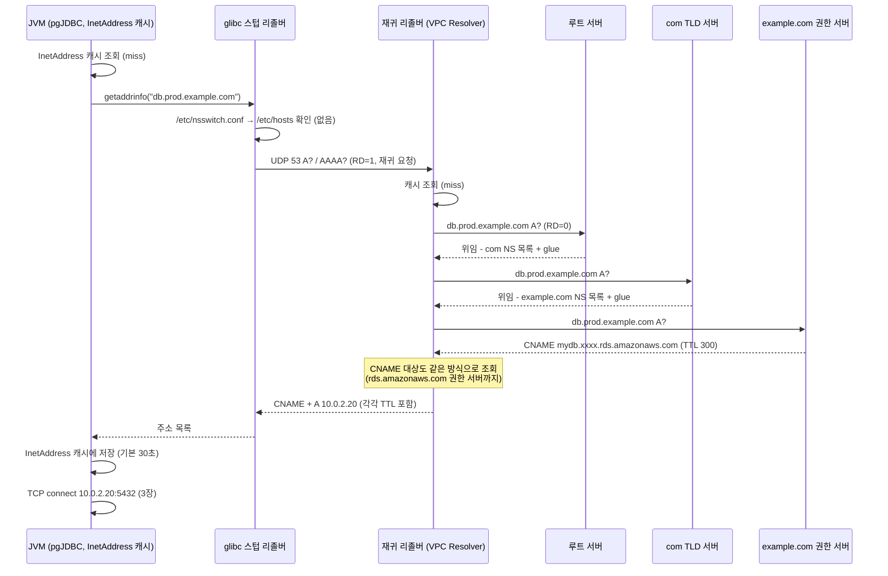
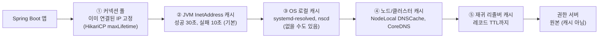

# 04. DNS — 조회 과정, TTL, 캐싱

> 관련 문서: [실습](./04-DNS-실습.md) · 이전 장 [03. TCP와 UDP](./03-TCP-이론.md)

## 1. 한 줄 요약

DNS는 도메인 이름을 IP 주소 같은 리소스 레코드로 변환하는 계층적·분산 데이터베이스이자 그 조회 프로토콜(주로 UDP/TCP 53)이며, 모든 응답은 레코드에 붙은 TTL(Time To Live) 동안 경로상의 여러 계층에 캐시된다.

## 2. 왜 필요한가

1980년대 초 ARPANET은 이름↔주소 대응을 SRI-NIC가 관리하는 파일 하나(`HOSTS.TXT`)로 해결했다. 모든 호스트가 이 파일을 FTP로 주기적으로 받아 갔다. 호스트가 늘자 세 가지가 무너졌다.

- **규모**: 파일 배포 트래픽과 갱신 지연이 호스트 수에 비례해 커졌다.
- **이름 충돌**: 중앙 관리자 한 명이 전 세계 이름의 중복을 막아야 했다.
- **일관성**: 파일을 받은 시점마다 호스트들이 서로 다른 세계를 보고 있었다.

DNS(1983년 RFC 882/883, 1987년 RFC 1034/1035)는 이름 공간을 트리로 나누고 **각 가지(zone)의 관리를 그 소유자에게 위임**했다. `example.com`의 레코드는 `example.com`의 소유자가 관리하고, 나머지 세계는 "누구에게 물어보면 되는지"만 안다. 그리고 한 번 받은 답은 TTL 동안 재사용해서 트리의 윗부분(루트, TLD)에 부하가 몰리지 않게 했다.

백엔드 개발자에게 DNS의 진짜 의미는 **간접 참조(indirection)**다. `jdbc:postgresql://db.prod.internal:5432/app`에 IP 대신 이름을 쓰는 순간, DB 장애 조치(failover), 블루/그린 전환, 리전 이전을 애플리케이션 설정 변경 없이 할 수 있다. 대신 대가가 있다. 그 전환은 **TTL과 캐시가 허락하는 속도로만** 반영된다. 이 장의 장애 대부분이 여기서 나온다.

## 3. 핵심 개념

| 용어 | 정의 |
|---|---|
| 도메인 이름 (Domain Name) | 점으로 구분된 레이블의 나열. 오른쪽이 트리의 위쪽. `api.example.com.` |
| FQDN (Fully Qualified Domain Name) | 루트까지 완전히 적은 이름. 끝의 점(`.`)이 루트를 뜻한다. `api.example.com.` |
| 존 (Zone) | 한 관리 주체가 책임지는 이름 공간의 구간. `example.com` 존은 하위 존을 다른 서버에 위임할 수 있다 |
| 위임 (Delegation) | 상위 존이 NS 레코드로 "이 하위 이름은 저 서버들에게 물어라"라고 알려주는 것 |
| 루트 서버 (Root Server) | 트리의 꼭대기. 이름은 13개(a~m.root-servers.net)지만 애니캐스트(Anycast)로 전 세계 수천 곳에서 응답 |
| TLD (Top-Level Domain) | `com`, `net`, `kr`, `io` 같은 최상위 존 |
| 권한 서버 (Authoritative Name Server) | 어떤 존의 원본 데이터를 가진 서버. 응답에 `aa`(Authoritative Answer) 플래그를 켠다. 예: Route 53 호스팅 존 |
| 재귀 리졸버 (Recursive Resolver) | 클라이언트 대신 루트부터 권한 서버까지 **반복 조회(Iterative Query)**를 수행하고 결과를 캐시하는 서버. 예: ISP DNS, 8.8.8.8, AWS Route 53 Resolver |
| 스텁 리졸버 (Stub Resolver) | 애플리케이션 쪽의 최소 리졸버. `/etc/resolv.conf`의 서버에 **재귀 질의(Recursive Query)**를 한 번 던지고 답을 기다린다. glibc·musl의 `getaddrinfo()` |
| 포워더 (Forwarder) | 스스로 반복 조회하지 않고 다른 리졸버에 질의를 넘기는 서버. 캐시는 할 수 있다. 예: systemd-resolved, CoreDNS의 `forward`, Docker 내장 DNS |
| 리소스 레코드 (RR, Resource Record) | DNS 데이터의 단위. (이름, 타입, 클래스, TTL, 데이터) |
| TTL (Time To Live) | 이 레코드를 캐시해도 되는 **초 단위** 시간. 캐시에 들어간 순간부터 줄어든다 |
| 부정 캐싱 (Negative Caching) | "그런 이름 없음(NXDOMAIN)", "그런 타입 없음(NODATA)"도 캐시하는 것. 시간은 SOA 레코드가 정한다(RFC 2308) |
| 검색 도메인 (Search Domain) | 짧은 이름에 자동으로 붙여 시도하는 접미사 목록. `/etc/resolv.conf`의 `search` |
| ndots | 이름에 점이 이 개수보다 **적으면** 검색 도메인부터 붙여 본다. 기본 1, 쿠버네티스 Pod는 5 |

### 주요 레코드 타입

| 타입 | 데이터 | 백엔드에서 만나는 곳 |
|---|---|---|
| A / AAAA | IPv4 / IPv6 주소 | 모든 접속의 최종 결과 |
| CNAME | 다른 이름(별칭) | RDS 엔드포인트, CDN, SaaS 연동 (`db.prod.internal` → `xxx.rds.amazonaws.com`) |
| NS | 이 존의 권한 서버 이름 | 위임, 도메인 이전 |
| SOA (Start of Authority) | 존의 메타데이터(시리얼, 갱신 주기, **부정 캐시 시간**) | NXDOMAIN 캐시 시간 계산 |
| MX | 메일 서버 | 메일 발송 기능 |
| TXT | 임의 문자열 | 도메인 소유 검증, SPF/DKIM, ACME DNS-01 인증서 발급([6장](./06-TLS-이론.md)) |
| SRV | 서비스의 호스트·포트·우선순위 | 쿠버네티스 헤드리스 서비스, 일부 DB 클라이언트(MongoDB `mongodb+srv://`) |
| PTR | IP → 이름 (역방향 조회) | PostgreSQL `log_hostname`, Tomcat `enableLookups` |

## 4. 동작 원리와 흐름

Spring Boot 앱이 `jdbc:postgresql://db.prod.example.com:5432/app`로 첫 커넥션을 만드는 순간을 따라간다. 앱은 Linux VM 위에 있고, 리졸버는 VPC가 제공하는 재귀 리졸버라고 가정한다.



1. **[L7, JVM]** pgJDBC가 `new InetSocketAddress(host, port)`를 만들며 `InetAddress.getAllByName()`을 호출한다. JVM은 먼저 **JVM 내부 캐시**를 본다. 여기서 hit이면 OS에 묻지도 않는다.
2. **[L7, glibc]** 캐시 miss면 JDK가 네이티브 `getaddrinfo()`를 부른다. glibc는 `/etc/nsswitch.conf`의 `hosts:` 줄 순서(보통 `files dns`)대로 **`/etc/hosts`를 먼저** 보고, 없으면 DNS로 간다. **glibc 자체는 캐시하지 않는다.**
3. **[L7 over L4 UDP, glibc]** `/etc/resolv.conf`의 첫 번째 `nameserver`로 A와 AAAA 질의를 **동시에** 보낸다(glibc 기본). 질의에는 RD(Recursion Desired) 플래그가 켜져 있다. "끝까지 알아서 찾아서 답만 달라"는 뜻이다. 응답이 안 오면 `timeout`(기본 5초) 뒤 다음 서버로 넘어간다.
4. **[L7, 로컬 캐시 계층 — 있을 수도, 없을 수도]** 배포판·환경에 따라 중간에 캐시가 끼어 있다. Ubuntu의 systemd-resolved(127.0.0.53), 쿠버네티스의 NodeLocal DNSCache와 CoreDNS, Docker 내장 DNS(127.0.0.11)가 그런 예다.
5. **[L7, 재귀 리졸버]** 캐시에 없으면 **반복 조회**를 한다. 루트에 물으면 루트는 답 대신 "com은 이 서버들에게 물어라"(위임, NS + 글루 A 레코드)를 준다. TLD도 같은 식으로 example.com 권한 서버를 알려준다. 마지막 권한 서버가 실제 레코드를 준다. **중간 단계의 NS 응답도 모두 캐시**되므로 두 번째부터는 루트·TLD를 건너뛴다.
6. **[L7, 재귀 리졸버]** 답이 CNAME이면 그 대상 이름을 처음부터 다시 조회한다. CNAME 체인의 **각 레코드는 각자의 TTL**로 캐시된다.
7. **[L7, JVM]** 주소 목록을 JVM 캐시에 넣고 pgJDBC가 첫 주소로 TCP 연결을 시도한다. 이후 이 TCP 커넥션은 HikariCP 풀에 들어가 **DNS와 무관하게** `maxLifetime`까지 같은 IP를 쓴다.

### 캐시는 어디에 몇 겹으로 생기는가



| 계층 | 상태 위치 | 생성 | 소멸 | 레코드 TTL 준수 |
|---|---|---|---|---|
| ① 커넥션 풀 | JVM 힙 (TCP 소켓) | 커넥션 생성 시 1회 조회 | 커넥션 종료 | **무관**. DNS가 바뀌어도 기존 커넥션은 옛 IP |
| ② JVM `InetAddress` 캐시 | JVM 힙 | 조회 성공/실패 | `networkaddress.cache.ttl`(기본 30초), 실패는 `.negative.ttl`(기본 10초) | **무시**. 레코드 TTL이 5초여도 30초 캐시 |
| ③ OS 캐시 | systemd-resolved / nscd 프로세스 | 조회 | 레코드 TTL | 준수 |
| ④ CoreDNS 등 | 클러스터 DNS Pod 메모리 | 조회 | min(레코드 TTL, 설정 최대치) | 상한을 둠 |
| ⑤ 재귀 리졸버 | 리졸버 서버 메모리 | 조회 | 레코드 TTL (일부는 최소·최대 강제) | 대체로 준수 |

**DNS 변경이 반영되기까지 걸리는 최악의 시간 ≈ 각 계층 캐시 시간의 합 + 커넥션 수명.** 레코드 TTL만 보면 과소평가한다.

### TTL의 의미

- TTL은 권한 서버가 정한 **"최대 이 시간까지 캐시해도 된다"**는 허가다. 캐시한 쪽은 남은 시간을 줄여가며 답한다. 리졸버에 두 번 물으면 두 번째 응답의 TTL이 더 작다(실습 3-2).
- TTL을 바꿔도 **이미 캐시된 레코드는 옛 TTL로 만료된다.** TTL 86400(1일)이던 레코드를 60으로 바꾸면, 효과는 최대 하루 뒤부터 난다. 그래서 이전 작업 전 **옛 TTL만큼 미리** TTL을 낮춰 둔다(10절).
- 부정 응답(NXDOMAIN)의 캐시 시간은 레코드가 없으니 레코드 TTL이 아니라 **존 SOA 레코드의 MINIMUM 필드와 SOA 자신의 TTL 중 작은 값**이다(RFC 2308). "없는 이름을 먼저 조회해 버리면, 만든 뒤에도 한동안 없다고 나온다"(9-4).

## 5. 구현 레벨 들여다보기

### DNS 메시지 구조 (RFC 1035 4.1)

```text
+---------------------+
|       Header        |  12바이트
+---------------------+
|      Question       |  질의: 이름, 타입, 클래스
+---------------------+
|       Answer        |  답 레코드들
+---------------------+
|      Authority      |  권한 정보: 위임 시 NS, 부정 응답 시 SOA
+---------------------+
|      Additional     |  부가 정보: 글루 A 레코드, EDNS OPT
+---------------------+
```

헤더 필드:

| 필드 | 크기 | 의미 |
|---|---|---|
| ID | 16비트 | 질의·응답 짝을 맞추는 식별자. 출발 포트 무작위화와 함께 위조 응답 방어 수단 |
| QR | 1비트 | 0 질의, 1 응답 |
| AA | 1비트 | Authoritative Answer. 권한 서버의 원본 응답 |
| TC | 1비트 | Truncated. UDP 크기 제한으로 잘림 → **TCP로 재질의** |
| RD / RA | 1비트씩 | Recursion Desired(클라이언트 요청) / Recursion Available(서버 지원) |
| AD / CD | 1비트씩 | DNSSEC 검증 결과 / 검증 생략 요청 |
| RCODE | 4비트 | `0` NOERROR, `2` SERVFAIL(리졸버가 답을 못 얻음), `3` NXDOMAIN(이름 없음), `5` REFUSED |
| QDCOUNT, ANCOUNT, NSCOUNT, ARCOUNT | 16비트씩 | 각 섹션의 레코드 수 |

리소스 레코드: `NAME`, `TYPE`, `CLASS`(거의 항상 `IN`), `TTL`(**32비트 초**), `RDLENGTH`, `RDATA`.

**NOERROR인데 답이 비어 있는 응답(NODATA)**은 "이름은 있지만 그 타입 레코드가 없다"는 뜻이다. IPv4만 있는 서비스에 AAAA를 물으면 이렇게 온다. NXDOMAIN과 구분해야 한다.

### 전송: UDP가 기본, TCP는 필수

- 원래 UDP 응답은 512바이트로 제한됐다. **EDNS(0)**(RFC 6891)는 Additional 섹션의 OPT 의사 레코드로 "나는 이만큼 큰 UDP 응답을 받을 수 있다"고 알린다. DNS Flag Day 2020 이후 권장값은 1232바이트다(IPv6 최소 MTU에서 단편화를 피하는 크기).
- 응답이 그보다 크면 서버는 TC=1로 잘라 보내고, 클라이언트는 **TCP 53으로 다시 묻는다**. RFC 7766은 TCP 지원을 필수로 정했다. 방화벽·보안 그룹에서 **TCP 53을 막으면 A 레코드가 많은 이름이나 DNSSEC 응답이 간헐적으로 실패**한다.
- UDP라서 질의 하나는 핸드셰이크 없이 1 RTT에 끝난다([3장](./03-TCP-이론.md) 4-5). 유실되면 재시도는 스텁 리졸버의 몫이다.

### `/etc/resolv.conf` (man `resolv.conf(5)`, glibc 기준)

```text
nameserver 10.0.0.2
nameserver 10.0.0.3
search prod.svc.cluster.local svc.cluster.local cluster.local
options ndots:5 timeout:2 attempts:2
```

| 항목 | glibc 기본 | 의미와 주의점 |
|---|---|---|
| `nameserver` | – | **최대 3개**만 사용(`MAXNS`). 앞에서부터 순서대로 시도 |
| `search` | 호스트 도메인 | 짧은 이름에 붙여 시도할 접미사 목록 |
| `options ndots:n` | 1 | 점이 n개 미만이면 검색 도메인부터 시도, n개 이상이면 절대 이름부터 시도 |
| `options timeout:n` | 5 (초) | 한 서버의 응답 대기. **"정확히 5초 지연"의 출처**(9-3) |
| `options attempts:n` | 2 | 전체 서버 목록을 몇 바퀴 도는지 |
| `options rotate` | 꺼짐 | 서버를 순서대로가 아니라 돌아가며 사용 |
| `options single-request` / `single-request-reopen` | 꺼짐 | A·AAAA 동시 질의를 순차로 / 소켓을 새로 열어 순차로. conntrack 경쟁 회피용 |
| `options use-vc` | 꺼짐 | 항상 TCP 사용 |

- **최악의 조회 시간** = timeout × attempts × nameserver 수. 기본값에 서버 3개면 30초다.
- `/etc/nsswitch.conf`의 `hosts: files dns`가 `/etc/hosts` 우선을 결정한다. Ubuntu는 `hosts: files mdns4_minimal [NOTFOUND=return] dns` 같은 변형을 쓰기도 한다.
- **`dig`와 `nslookup`은 NSS와 `/etc/hosts`를 거치지 않고 DNS 서버에 직접 묻는다.** 애플리케이션과 같은 경로로 확인하려면 `getent ahosts <이름>`(glibc)을 쓴다(9-5).

### musl(Alpine)과 glibc의 차이

Alpine 기반 이미지(`*-alpine`)는 musl libc의 리졸버를 쓴다. 동작이 다르다.

| 항목 | glibc | musl |
|---|---|---|
| 여러 nameserver | 순서대로, 하나씩 | **모두에 동시에** 묻고 먼저 온 답 사용 |
| `single-request*`, `rotate` | 지원 | 무시 |
| TC 응답 시 TCP 재질의 | 지원 | musl 1.2.4(2023) 이전에는 **미지원** |
| `search`/`ndots` | 지원 | 지원(1.1.13+) |

"Alpine 이미지로 바꿨더니 특정 도메인만 간헐적으로 `UnknownHostException`"은 이 차이에서 나온다(9-6).

### 서버·플랫폼별 구현

- **systemd-resolved** (Ubuntu 18.04+): `127.0.0.53`에서 스텁 리스너로 동작하며 캐시한다. `resolvectl status`, `resolvectl statistics`(캐시 hit/miss), `resolvectl flush-caches`.
- **Docker 내장 DNS**: 사용자 정의 네트워크의 컨테이너는 `nameserver 127.0.0.11`을 받는다. Docker 데몬이 이 주소로 컨테이너·서비스 이름을 답하고, 나머지는 호스트 리졸버나 `--dns`로 지정한 서버로 넘긴다. 기본 bridge 네트워크는 호스트의 `resolv.conf`를 복사한다. (16장에서 다룸)
- **쿠버네티스**: kubelet이 Pod의 `resolv.conf`를 만든다. `nameserver`는 kube-dns Service의 ClusterIP(kubeadm 기본 `10.96.0.10`), `search <ns>.svc.cluster.local svc.cluster.local cluster.local`, `options ndots:5`. CoreDNS의 기본 Corefile은 `cache 30`(최대 30초 캐시)과 `forward . /etc/resolv.conf`를 포함한다. Pod의 `dnsConfig`로 `ndots`를 바꿀 수 있다. (23장)
- **AWS Route 53 Resolver**: VPC마다 `VPC CIDR 기준 주소 + 2`(예: `10.0.0.2`)와 `169.254.169.253`에서 응답하는 재귀 리졸버. **ENI(네트워크 인터페이스)당 초당 1024 패킷** 한도가 있다(작성 시점 기준, https://docs.aws.amazon.com/vpc/latest/userguide/AmazonDNS-concepts.html 확인 필요). VPC 속성 `enableDnsSupport`, `enableDnsHostnames`가 이 리졸버와 퍼블릭 DNS 호스트 이름을 제어한다. (18장)
- **Route 53 호스팅 존**: 권한 서버. 별칭(Alias) 레코드는 존의 최상위(apex, `example.com` 자체)에도 AWS 리소스(ALB, CloudFront)를 가리킬 수 있게 하는 Route 53 전용 기능이며, 응답에는 A 레코드로 나간다.

### 관찰 도구

```text
$ dig api.example.com                    # 기본 리졸버에 A 질의
$ dig @10.0.0.2 api.example.com +noall +answer   # 특정 서버에, 답 섹션만
$ dig +trace api.example.com             # 캐시 없이 루트부터 직접 반복 조회
$ dig +norecurse @ns1.example.com api.example.com  # 권한 서버에 직접(재귀 요청 없이)
$ getent ahosts api.example.com          # 애플리케이션과 같은 경로(NSS, /etc/hosts, search)
$ resolvectl query api.example.com       # systemd-resolved 경유
```

## 6. 백엔드 코드와 만나는 지점

### 6-1. JVM DNS 캐시 — 가장 먼저 확인할 곳

| 설정 | 위치 | 기본값 | 의미 |
|---|---|---|---|
| `networkaddress.cache.ttl` | 보안 속성 (`$JAVA_HOME/conf/security/java.security`, Java 8은 `jre/lib/security/java.security`) | 미설정 → **30초**. SecurityManager가 설치된 경우 **영구(-1)** | 성공한 조회를 캐시하는 시간 |
| `networkaddress.cache.negative.ttl` | 보안 속성 | **10초** | 실패(`UnknownHostException`)를 캐시하는 시간 |
| `networkaddress.cache.stale.ttl` | 보안 속성 | 0 | 조회 실패 시 만료된 항목을 계속 쓰는 시간. JDK 21에서 추가(확인 필요) |
| `-Dsun.net.inetaddr.ttl`, `-Dsun.net.inetaddr.negative.ttl` | 시스템 속성 | – | 위 보안 속성이 없을 때만 적용되는 옛 방식 |

- **JVM은 레코드 TTL을 보지 않는다.** 레코드 TTL이 5초여도 30초 캐시하고, 3600초여도 30초 뒤 다시 묻는다.
- 오래된 WAS(SecurityManager를 켜고 도는 Java 7/8 환경)는 **영구 캐시**라서 DNS가 바뀌어도 재시작 전까지 옛 IP를 쓴다.
- 보안 속성은 **첫 조회 전에** 설정해야 한다. 가장 확실한 곳은 `main()`의 첫 줄이다.

```java
import java.security.Security;

import org.springframework.boot.SpringApplication;
import org.springframework.boot.autoconfigure.SpringBootApplication;

@SpringBootApplication
public class OrderApplication {

    public static void main(String[] args) {
        // 첫 DNS 조회보다 먼저 실행되어야 한다. 이후 변경은 이미 캐시된 항목에 영향 없음.
        // 30초(기본)를 명시해 두는 것만으로도 "SecurityManager 환경의 영구 캐시"를 막는다.
        Security.setProperty("networkaddress.cache.ttl", "30");
        // 실패 캐시는 짧게: DNS 일시 장애 후 빠르게 회복하되 0으로 두어 리졸버를 두드리지는 않는다.
        Security.setProperty("networkaddress.cache.negative.ttl", "5");
        SpringApplication.run(OrderApplication.class, args);
    }
}
```

코드를 바꿀 수 없으면 컨테이너 환경 변수로 `JAVA_TOOL_OPTIONS=-Dsun.net.inetaddr.ttl=30`을 주거나, `-Djava.security.properties=/app/dns.security`로 보안 속성 파일을 덧붙인다.

**TTL을 0으로 두지 않는 이유**: 요청마다 DNS 조회가 일어나 리졸버 부하와 지연이 늘고, 리졸버가 잠깐만 장애를 일으켜도 모든 요청이 실패한다. 커넥션 풀을 쓰는 JDBC는 조회 빈도가 낮아 영향이 작지만, 요청마다 새 커넥션을 만드는 HTTP 클라이언트에는 치명적이다(9-7).

### 6-2. 예외와 로그 — 원인을 가르는 메시지

| 메시지 | 리졸버 에러 | 의미 | 다음 확인 |
|---|---|---|---|
| `java.net.UnknownHostException: db.prod.example.com: Name or service not known` | `EAI_NONAME` | 리졸버가 **답을 받았고**, 그 답이 "없음"(NXDOMAIN 또는 A/AAAA 없음) | 이름 오타, 검색 도메인, 레코드 존재 여부(`dig`) |
| `java.net.UnknownHostException: db.prod.example.com: Temporary failure in name resolution` | `EAI_AGAIN` | 리졸버가 **답을 못 받음**(타임아웃, SERVFAIL) | 리졸버 도달성, `resolv.conf`, 보안 그룹의 UDP/TCP 53, 리졸버 부하 |
| `UnknownHostException: ...: Try again` / `Name does not resolve` | musl의 표현 | 위 두 경우의 Alpine 버전 | 같음 |
| `UnknownHostException: Failed to resolve 'api.x.com' [A(1)] after 2 queries` | Netty 자체 리졸버 | Reactor Netty(WebClient)가 JDK가 아닌 **Netty DNS 리졸버**를 쓴 경우(기본값 여부는 버전별 확인 필요) | Netty 리졸버 설정, `resolv.conf` 해석 차이 |

라이브러리별 포장:

```text
# pgJDBC / HikariCP 기동 실패
com.zaxxer.hikari.pool.HikariPool : HikariPool-1 - Exception during pool initialization.
org.postgresql.util.PSQLException: The connection attempt failed.
Caused by: java.net.UnknownHostException: db.prod.example.com

# RestClient / RestTemplate
org.springframework.web.client.ResourceAccessException: I/O error on GET request for "https://api.partner.com/v1/orders": api.partner.com
Caused by: java.net.UnknownHostException: api.partner.com
```

`UnknownHostException`의 메시지가 호스트 이름만 있고 원인 문구가 없으면 JVM 부정 캐시(10초)에서 나온 것일 수 있다. 첫 실패의 로그를 찾아야 진짜 원인이 보인다.

### 6-3. 타임아웃 예산에 DNS가 빠져 있다

- pgJDBC `connectTimeout`, Apache HttpClient의 connect 타임아웃은 대체로 **TCP 연결 시간만** 잰다. DNS 조회는 그 전에 블로킹 호출로 일어난다(라이브러리별 확인 필요).
- 리졸버가 죽으면 조회 한 번에 `timeout 5초 × attempts 2 × nameserver 수`까지 걸리고, 이 시간은 어떤 애플리케이션 타임아웃에도 잡히지 않는다. "connect 타임아웃 3초인데 요청이 10초 걸렸다"면 DNS를 의심한다.
- 가상 스레드: JDK 21 기준 `InetAddress` 조회는 네이티브 `getaddrinfo()` 블로킹이라 캐리어 스레드를 점유한다(스케줄러가 병렬성을 일시 확장해 보상한다고 알려져 있음 — 확인 필요). DNS 지연이 가상 스레드 환경에서도 공짜가 아니다. JDK 18+의 `InetAddressResolver` SPI(JEP 418)로 리졸버를 교체할 수 있다.

### 6-4. 커넥션 풀은 DNS 변경을 모른다

HikariCP 커넥션은 생성 시 한 번 조회한 IP에 TCP로 붙어 있다([3장](./03-TCP-이론.md)). DNS를 바꿔도 **기존 커넥션은 `maxLifetime`(기본 30분)까지 옛 IP를 계속 쓴다.**

- **Aurora/RDS 장애 조치**: 클러스터 엔드포인트(CNAME)가 새 writer를 가리키도록 바뀐다. 옛 writer가 reader로 강등된 뒤에도 풀의 커넥션이 그쪽에 붙어 있으면 이렇게 된다.
  ```text
  org.postgresql.util.PSQLException: ERROR: cannot execute UPDATE in a read-only transaction
  ```
  해결 방향: `maxLifetime` 단축, 쓰기 실패 시 커넥션 폐기, AWS Advanced JDBC Wrapper의 failover 플러그인, pgJDBC 다중 호스트 URL + `targetServerType=primary`(9-1).
- **HTTP 클라이언트 풀**: DNS 기반 블루/그린 전환 후에도 keep-alive 커넥션은 옛 대상에 붙어 있다. 3장 6-4의 `setTimeToLive`(커넥션 최대 수명)가 여기서도 필요하다.

### 6-5. 역방향 조회를 켜는 설정

| 설정 | 기본 | 켜면 |
|---|---|---|
| PostgreSQL `log_hostname` | off | 접속마다 클라이언트 IP의 PTR 조회. 리졸버가 느리면 **접속 자체가 느려진다** |
| `pg_hba.conf` ADDRESS에 호스트 이름 사용 | – | 접속마다 역방향 + 정방향 조회로 검증 |
| Tomcat `enableLookups` | false | `request.getRemoteHost()`가 PTR 조회. 요청마다 지연 |
| Nginx `resolver`가 없는 `proxy_pass http://$var` | – | 변수에 든 이름을 해석하지 못함 (11장) |

셋 다 기본값을 유지하는 것이 원칙이다.

### 6-6. Docker Compose·쿠버네티스에서의 이름

- Compose: `jdbc:postgresql://db:5432/app`의 `db`는 Docker 내장 DNS(127.0.0.11)가 서비스 컨테이너 IP로 답한다. 컨테이너를 재생성하면 IP가 바뀔 수 있으므로 JVM 캐시와 풀이 옛 IP를 쥐고 있을 수 있다.
- 쿠버네티스: `http://order-service`(같은 네임스페이스), `http://order-service.prod`, `http://order-service.prod.svc.cluster.local.`(FQDN). 짧을수록 검색 도메인을 많이 거친다(9-2).

## 7. 유사 개념과의 비교

### DNS 서버의 역할

| 역할 | 하는 일 | 캐시 | 예시 | 장애 시 증상 |
|---|---|---|---|---|
| 스텁 리졸버 | 재귀 질의 1회 | 없음(glibc) | glibc, musl | – |
| 로컬 캐시·포워더 | 넘기고 캐시 | 있음 | systemd-resolved, NodeLocal DNSCache, Docker 127.0.0.11 | 한 호스트/노드만 조회 실패 |
| 재귀 리졸버 | 루트부터 반복 조회 | 있음 | Route 53 Resolver, 8.8.8.8, CoreDNS(`forward` 뒤의 상위) | 해당 리졸버를 쓰는 모든 호스트가 `Temporary failure` |
| 권한 서버 | 원본 데이터로 응답 | 없음 | Route 53 호스팅 존, BIND 마스터 | 캐시가 만료되는 순서대로 전 세계에서 NXDOMAIN/SERVFAIL |

### CNAME vs Route 53 Alias vs A

| 항목 | A | CNAME | Route 53 Alias |
|---|---|---|---|
| 가리키는 것 | IP | 다른 이름 | AWS 리소스(ALB, CloudFront, 다른 레코드) |
| 존 최상위(apex) 사용 | 가능 | **불가**(RFC 규칙) | 가능 |
| 추가 조회 | 없음 | CNAME 대상 조회 필요 | 없음(Route 53이 풀어서 A로 응답) |
| TTL | 레코드 값 | 각 단계 TTL | 대상 리소스가 결정(ALB는 60초 — 확인 필요) |
| 언제 | 고정 IP | 외부 SaaS·RDS 엔드포인트 연결 | AWS 리소스를 도메인에 연결할 때 |

### DNS 기반 부하 분산 vs 로드밸런서

| 항목 | DNS 라운드 로빈 / 가중치 | L4/L7 로드밸런서 (12장) |
|---|---|---|
| 분배 단위 | **조회 단위** (캐시 동안 같은 IP) | 커넥션 또는 요청 단위 |
| 장애 반영 속도 | TTL + 모든 계층 캐시 + 커넥션 수명 | 헬스체크 주기(수 초) |
| 헬스 인지 | 기본 없음 (Route 53 헬스체크로 보완) | 있음 |
| 쏠림 | JVM 캐시·풀 때문에 한 인스턴스에 몰리기 쉬움 | 균등 |
| 비용·복잡도 | 낮음 | LB 비용 |
| 판단 | 리전 간 전환, 대략적 분산 | 인스턴스 간 분산, 빠른 장애 조치 |

## 8. 표준·버전별 변천

| 시기 | 사건 | 실무 영향 |
|---|---|---|
| 1983 / 1987 | RFC 882/883 → RFC 1034/1035 | 현재 메시지 형식과 계층 구조 |
| 1997 | RFC 2181 | TTL을 32비트 부호 없는 값으로 명확화, CNAME 규칙 정리 |
| 1998 | RFC 2308 부정 캐싱 | NXDOMAIN 캐시 시간 = SOA 기반 |
| 1999 / 2013 | EDNS0 RFC 2671 → RFC 6891 | 512바이트 이상 UDP 응답 |
| 2005 / 2010 | DNSSEC RFC 4033~4035 / 루트 존 서명 | 응답 위조 검증 가능 (도입률은 제한적) |
| 2008 | Kaminsky 캐시 오염 공격 공개 | 출발 포트 무작위화가 필수가 됨 (RFC 5452) |
| 2016 | RFC 7766 TCP 필수, RFC 7858 DNS over TLS | TCP 53 차단은 표준 위반 |
| 2018 | RFC 8484 DNS over HTTPS, 쿠버네티스 1.13 CoreDNS 기본 채택 | kube-dns → CoreDNS |
| 2020 | DNS Flag Day 2020 | EDNS UDP 크기 1232 권장 |
| 2020 | RFC 8767 serve-stale | 권한 서버 장애 시 만료된 캐시로 응답하는 리졸버 동작 |
| 2022 | JDK 18 JEP 418 `InetAddressResolver` SPI | JVM 리졸버 교체 가능 |
| 2023 | musl 1.2.4 TCP 폴백 | Alpine 이미지의 큰 응답 실패 해소 |

## 9. 함정과 장애 패턴

### 9-1. DNS를 바꿨는데 일부 서버가 계속 옛 IP로 간다

- **증상**: DB 이전, 블루/그린 전환, Aurora 장애 조치 후 일부 인스턴스만 옛 대상에 계속 붙는다. `Connection refused`/`Connect timed out`(옛 서버 종료 시), `cannot execute UPDATE in a read-only transaction`(옛 writer가 reader가 된 경우). 몇 분~몇십 분 뒤 저절로 사라지거나 재시작하면 사라진다.
- **원인**: 4절의 캐시 계층 중 하나 이상이 아직 옛 값을 쥐고 있다. 레코드 TTL(권한 서버), 리졸버 캐시, JVM 캐시(30초 또는 영구), **커넥션 풀의 기존 커넥션(`maxLifetime`까지)**.
- **확인 방법**: 계층을 위에서 아래로 좁힌다.
  - 권한 서버: `dig +norecurse @<권한 서버> db.prod.example.com` → 새 값인가, TTL은?
  - 앱이 쓰는 리졸버: `dig @<resolv.conf의 서버> db.prod.example.com +noall +answer` → 남은 TTL.
  - 앱과 같은 경로: 앱 컨테이너에서 `getent ahosts db.prod.example.com`.
  - JVM 캐시 설정: `jcmd <pid> VM.system_properties | grep inetaddr`, 기동 스크립트의 `java.security.properties`, SecurityManager 사용 여부.
  - 기존 커넥션: `ss -tnp dst <옛 IP>` → 옛 IP로 향한 ESTABLISHED가 남아 있는지. **이게 남아 있으면 DNS는 이미 무관하다.**
- **해결**: 전환 전 TTL 사전 인하(10절), JVM TTL 명시(6-1), 커넥션 수명 단축 또는 전환 시점의 풀 재생성(HikariCP `softEvictConnections()`는 JMX/`HikariPoolMXBean`으로 호출 가능). Aurora는 클러스터 엔드포인트를 쓰고, 장애 조치를 인지하는 드라이버를 검토한다.

### 9-2. 쿠버네티스 `ndots:5`의 질의 증폭

- **증상**: 쿠버네티스로 옮긴 뒤 외부 API 호출의 첫 요청 지연이 늘었다. CoreDNS CPU와 질의 수가 Pod 수에 비해 과도하다. CoreDNS 메트릭에서 NXDOMAIN 비율이 매우 높다.
- **원인**: `api.partner.com`은 점이 2개로 `ndots:5`보다 적다. glibc는 검색 도메인부터 붙여 본다. `api.partner.com.prod.svc.cluster.local`, `api.partner.com.svc.cluster.local`, `api.partner.com.cluster.local`(모두 NXDOMAIN) 다음에야 `api.partner.com`을 묻는다. A와 AAAA를 각각 물으므로 **실제 조회 1번에 질의 8번**이다. 노드 쪽 검색 도메인까지 상속되면 더 늘어난다. 여기에 JVM 캐시 만료가 겹치면 30초마다 반복된다.
- **확인 방법**:
  - Pod에서 `cat /etc/resolv.conf` → `search`, `ndots`.
  - Pod에서 `tcpdump -nn -i any port 53` 후 호출 → 검색 도메인이 붙은 질의가 보이는지.
  - CoreDNS: `log` 플러그인 로그 또는 메트릭 `coredns_dns_responses_total{rcode="NXDOMAIN"}`.
- **해결**: 외부 도메인은 FQDN(끝에 점: `api.partner.com.`)으로 호출한다. 단, HTTP `Host` 헤더와 TLS SNI에 점이 붙어 가상 호스트 매칭이 깨질 수 있어 라이브러리별 확인이 필요하다. 가장 무난한 해결은 Pod `dnsConfig.options`로 `ndots:2` 설정, 여기에 NodeLocal DNSCache를 더하는 것이다. 클러스터 내부 서비스는 `svc.namespace` 형태로 부르면 된다. 실습 4-3에서 질의 8번을 직접 센다.

### 9-3. 정확히 5초(또는 10초) 늦어지는 요청

- **증상**: 대부분의 요청은 빠른데 일부가 **정확히 5.0x초** 또는 10초 더 걸린다. 트레이싱에서 연결 전 구간이 비어 있다.
- **원인**: glibc `timeout` 기본값 5초가 그대로 드러난 것이다.
  - `resolv.conf`의 **첫 번째 nameserver가 응답하지 않음**(서버 폐기, 방화벽). 매 조회가 5초 기다린 뒤 두 번째 서버로 넘어간다.
  - 쿠버네티스에서 A·AAAA 동시 질의가 같은 출발 포트로 나가며 커널 conntrack 삽입 경쟁(race)으로 한쪽이 버려지는 문제. 버려진 쪽을 5초 기다린다(커널 버전별로 수정 이력 있음 — 확인 필요).
  - UDP 패킷 유실.
- **확인 방법**:
  - `time getent ahosts <이름>`을 여러 번 → 5초 근처 값이 섞이는지.
  - `tcpdump -nn -i any port 53` → 응답 없는 질의가 있고 5초 뒤 재질의 또는 다른 서버로 질의하는지.
  - `cat /etc/resolv.conf` → nameserver 목록 중 죽은 서버가 있는지 `dig @<각 서버>`로 하나씩 확인.
- **해결**: 죽은 nameserver 제거. `options timeout:1 attempts:2`로 대기 단축. conntrack 문제는 `single-request-reopen`(glibc 전용, musl은 무시), NodeLocal DNSCache(TCP로 상위 질의), 커널 업데이트. 실습 4-4에서 5초 지연을 직접 만든다.

### 9-4. 방금 만든 레코드가 "없다"고 나온다 — 부정 캐싱

- **증상**: 배포 파이프라인이 새 서비스 도메인 레코드를 만든 직후 헬스체크가 `UnknownHostException: ...: Name or service not known`으로 실패한다. `dig @권한서버`로는 레코드가 보인다. 몇 분 뒤 저절로 된다.
- **원인**: 레코드를 만들기 **전에** 누군가(배포 스크립트의 사전 확인, 모니터링, 앱의 기동 시도) 그 이름을 조회했다. 리졸버가 NXDOMAIN을 SOA MINIMUM 동안 캐시했다. JVM도 부정 캐시 10초를 갖는다.
- **확인 방법**:
  - `dig @<리졸버> new.example.com` → `status: NXDOMAIN`이고 AUTHORITY 섹션의 SOA 레코드 TTL이 줄어드는 중이면 부정 캐시다.
  - `dig +norecurse @<권한 서버> new.example.com` → `NOERROR`와 답이 있으면 확정.
  - 존의 SOA 마지막 필드: `dig example.com SOA +short` → 마지막 숫자가 MINIMUM.
- **해결**: 레코드를 먼저 만들고 그 뒤에 조회하도록 순서를 바꾼다. 급하면 리졸버 캐시를 비운다(`resolvectl flush-caches`, CoreDNS 재시작). 자주 레코드를 만드는 존은 SOA MINIMUM을 작게(예: 60초) 둔다. 실습 4-1에서 재현한다.

### 9-5. `dig`는 되는데 앱은 안 된다 (또는 그 반대)

- **증상**: "제 PC에서 `dig`하면 나오는데요?" 앱은 `UnknownHostException`이거나 다른 IP로 붙는다.
- **원인**: `dig`는 앱과 다른 경로로 조회한다. `dig`는 `/etc/hosts`와 NSS를 무시하고, 기본으로 검색 도메인을 붙이지 않으며(`+search` 필요), JVM 캐시도 없다. 앱이 도는 컨테이너의 `resolv.conf`는 개발자 PC와 다르다. `/etc/hosts`에 누군가 넣어둔 옛 항목(테스트용 고정)이 우선한다.
- **확인 방법**:
  - **앱이 도는 바로 그 컨테이너 안에서** `getent ahosts <이름>`(NSS 경로 전체). `dig`와 결과가 다르면 `/etc/hosts`나 검색 도메인 차이다.
  - `cat /etc/hosts`, `cat /etc/nsswitch.conf`, `cat /etc/resolv.conf`.
  - JVM 경로 확인: `jshell` 또는 Actuator 엔드포인트에서 `InetAddress.getAllByName("<이름>")`.
- **해결**: 조회 확인은 항상 앱과 같은 위치·같은 경로로 한다. `/etc/hosts` 고정은 컨테이너 이미지나 Compose `extra_hosts`에 남기지 말고 쓴 뒤 반드시 지운다. 실습 3-5에서 재현한다.

### 9-6. Alpine 이미지로 바꾼 뒤 특정 도메인만 간헐 실패

- **증상**: 베이스 이미지를 `eclipse-temurin:21-jre-alpine`처럼 Alpine 계열로 바꾼 뒤, A 레코드가 많은 도메인이나 내부/외부 DNS가 섞인 환경에서만 `UnknownHostException: ...: Try again` 또는 엉뚱한 응답이 나온다.
- **원인**: musl 리졸버는 ① 1.2.4 이전에는 TC 응답을 받아도 TCP로 재질의하지 않았고, ② 여러 nameserver에 동시에 묻고 **먼저 온 답**을 쓴다. 내부 전용 DNS와 공용 DNS를 함께 적어두면 어떤 요청은 내부 레코드를, 어떤 요청은 NXDOMAIN을 받는다. ③ `single-request-reopen` 같은 glibc 옵션은 무시된다.
- **확인 방법**: 같은 이름을 glibc 이미지(`debian`, `ubuntu`)와 Alpine 이미지에서 번갈아 조회한다. `apk info musl`로 버전 확인. `dig +bufsize=512 <이름>`으로 응답이 잘리는지(TC 플래그) 본다.
- **해결**: musl 1.2.4 이상 이미지로 올리거나 glibc 기반 이미지(Temurin의 `-jammy`/`-noble` 등)를 쓴다. 한 `resolv.conf`에 성격이 다른 nameserver를 섞지 않는다. 변형 실습 V2에서 musl의 동시 질의를 관찰한다.

### 9-7. 리졸버 질의 한도 초과 — AWS에서 간헐적 `Temporary failure`

- **증상**: 트래픽이 높을 때만 EC2·EKS 노드에서 `UnknownHostException: ...: Temporary failure in name resolution`이 간헐적으로 난다. 리졸버 자체는 멀쩡하다.
- **원인**: Route 53 Resolver는 ENI당 초당 1024 패킷 한도가 있다. JVM 캐시를 0으로 두었거나 요청마다 새 커넥션을 만드는 코드(3장 9-1), `ndots:5` 증폭(9-2)이 겹치면 한 노드에서 쉽게 넘는다. 넘친 패킷은 조용히 버려진다.
- **확인 방법**: 인스턴스에서 `ethtool -S eth0 | grep linklocal_allowance_exceeded`(ENA 드라이버 카운터, 증가하면 확정). `tcpdump -nn port 53 | wc -l`로 초당 질의 수 추정.
- **해결**: 노드 로컬 캐시(NodeLocal DNSCache, systemd-resolved, dnsmasq)를 둔다. JVM 캐시 TTL을 0이 아닌 값으로 둔다. `ndots`를 줄이고 커넥션을 재사용한다.

## 10. 실무 적용 시나리오

- **DB·서비스 이전(컷오버) 절차**:
  1. 현재 TTL 확인(`dig +noall +answer`). 예: 3600초.
  2. **이전 최소 1 TTL 전**(여유 있게 1~2일 전)에 TTL을 60초로 낮춘다. 옛 TTL로 캐시된 항목이 모두 만료되어야 효과가 난다.
  3. 전환 시각에 레코드를 바꾼다. 커넥션 풀의 기존 커넥션은 DNS와 무관하므로 앱을 롤링 재시작하거나 풀을 비운다.
  4. 옛 대상에 커넥션이 남아 있는지 `ss`/DB의 `pg_stat_activity`로 확인한 뒤 옛 대상을 내린다.
  5. 안정화 후 TTL을 원래대로 올린다.
- **장애 1차 분류**: `UnknownHostException`의 문구로 가른다. `Name or service not known`은 "답은 왔는데 없다"(이름·레코드 문제), `Temporary failure`는 "답이 안 왔다"(리졸버·네트워크 문제). 담당이 완전히 다르다.
- **쿠버네티스 온보딩 체크리스트**: 외부 도메인 호출 서비스는 `dnsConfig`로 `ndots` 조정, JVM TTL 명시, NodeLocal DNSCache 사용 여부 확인.
- **컨테이너 이미지 선택**: DNS 동작까지 고려해 glibc/musl을 결정한다. 이미지 크기만 보고 Alpine을 고르면 9-6을 만날 수 있다.

## 11. 보안·비용 고려사항

- **캐시 오염(Cache Poisoning)**: 위조 응답을 리졸버에 심어 사용자를 가짜 서버로 보내는 공격. 질의 ID와 출발 포트 무작위화로 방어하며, DNSSEC가 근본 해결이다. 공격이 성공해도 TLS 인증서 검증이 마지막 방어선이다([6장](./06-TLS-이론.md)). 인증서 검증을 끄는 코드는 이 방어선을 스스로 없앤다.
- **DNS 리바인딩**: 검사 시점과 연결 시점의 조회 결과를 바꿔 내부 IP 차단을 우회한다. 해석한 IP로 검사하고 그 IP로 연결한다([2장 6절](./02-IP-서브넷-CIDR-이론.md#ssrf-방어--사용자-입력-url로-서버가-요청을-보낼-때)).
- **서브도메인 탈취(Subdomain Takeover)**: `promo.example.com CNAME old-bucket.s3.amazonaws.com`처럼 삭제된 외부 리소스를 가리키는 CNAME이 남아 있으면, 제3자가 같은 이름의 리소스를 만들어 우리 도메인으로 콘텐츠를 서비스할 수 있다. 리소스를 지울 때 레코드도 같이 지운다.
- **DNS 터널링·데이터 유출**: DNS 질의 이름에 데이터를 실어 방화벽을 우회한다. 아웃바운드 53은 지정된 리졸버로만 허용한다.
- **비용**: Route 53 호스팅 존은 월 단위, 표준 질의는 100만 건 단위로 과금되며, AWS 리소스를 가리키는 별칭 레코드 질의는 무료다(작성 시점 기준 — https://aws.amazon.com/route53/pricing/ 확인 필요). JVM TTL 0 + 높은 트래픽은 퍼블릭 호스팅 존 질의 비용도 키운다.

## 12. 자가 점검 질문

**Q1.** 레코드 TTL을 3600에서 60으로 바꾸고 5분 뒤 IP를 변경했다. 사용자 대부분이 새 IP로 가는 데 최대 얼마나 걸릴 수 있는가?

<details><summary>답</summary>

TTL을 60으로 바꾸기 직전에 캐시된 항목은 **옛 TTL 3600초**를 들고 있다. TTL 변경 후 5분밖에 안 지났으므로 그런 캐시는 최대 약 55분 더 옛 IP를 준다. 그 위에 JVM 캐시(기본 30초)와 **기존 커넥션의 수명**이 더해진다. TTL 인하는 옛 TTL만큼 미리 해야 한다.
</details>

**Q2.** 쿠버네티스 Pod에서 `http://api.partner.com`을 호출하면 조회 한 번에 DNS 질의가 몇 번 나가는가? (`search`는 `prod.svc.cluster.local svc.cluster.local cluster.local`, `ndots:5`, IPv4/IPv6 동시 질의)

<details><summary>답</summary>

점이 2개로 5보다 적으므로 검색 도메인 3개를 먼저 붙인다. 3번 NXDOMAIN 뒤 절대 이름을 조회하므로 이름 4개 × (A + AAAA) = **8번**이다. 노드의 검색 도메인이 상속되어 목록이 더 길면 그만큼 늘어난다. `ndots:2`로 바꾸거나 FQDN(`api.partner.com.`)을 쓰면 2번이 된다.
</details>

**Q3.** 운영 로그에 `java.net.UnknownHostException: db.prod.internal: Temporary failure in name resolution`이 간헐적으로 찍힌다. 어디부터 보겠는가?

<details><summary>답</summary>

`Temporary failure`(EAI_AGAIN)는 리졸버에게서 **답을 못 받았다**는 뜻이므로 레코드 존재 여부보다 경로를 먼저 본다. ① 해당 인스턴스의 `/etc/resolv.conf`에서 nameserver 목록 확인, 각 서버에 `dig @서버`로 응답하는지. ② `tcpdump -nn port 53`으로 응답 없는 질의가 있는지. ③ 보안 그룹·NACL이 UDP/TCP 53을 허용하는지. ④ AWS라면 `linklocal_allowance_exceeded` 카운터로 리졸버 한도 초과 여부. ⑤ 질의량을 키우는 요인(JVM TTL 0, `ndots:5`, 커넥션 미재사용)이 있는지.
</details>

**Q4.** Aurora 장애 조치 후 DNS는 이미 새 writer를 가리키는데 앱은 계속 `cannot execute UPDATE in a read-only transaction`을 낸다. 왜인가?

<details><summary>답</summary>

HikariCP 풀의 **기존 TCP 커넥션**이 옛 writer(이제 reader로 강등된 인스턴스)에 붙어 있기 때문이다. 커넥션 풀은 커넥션 생성 시점에만 DNS를 조회하고, 이후에는 `maxLifetime`(기본 30분)까지 같은 IP를 쓴다. DNS 캐시를 아무리 줄여도 기존 커넥션에는 효과가 없다. 풀 재생성(롤링 재시작, `softEvictConnections()`), 짧은 `maxLifetime`, 장애 조치를 인지하는 드라이버로 해결한다.
</details>

**Q5.** 개발자 PC에서 `dig api.internal.example`은 새 IP를 주는데, 같은 PC의 Spring Boot 앱은 옛 IP로 접속한다. 가능한 원인 세 가지는?

<details><summary>답</summary>

① `/etc/hosts`(Windows는 `C:\Windows\System32\drivers\etc\hosts`)에 옛 IP 고정 항목이 있다. `dig`는 hosts 파일을 보지 않는다. ② JVM `InetAddress` 캐시(기본 30초, SecurityManager 환경이면 영구)에 옛 값이 남아 있다. ③ 앱이 이미 옛 IP로 맺은 커넥션을 풀에서 재사용 중이다. 이 밖에도 OS 로컬 캐시(Windows DNS Client 서비스, systemd-resolved)나 VPN이 바꿔 놓은 리졸버 차이가 있을 수 있다. 앱과 같은 경로(`getent ahosts`, 또는 JVM 안에서 `InetAddress.getAllByName`)로 확인해야 한다.
</details>

## 13. 참고 자료

- RFC 1034 — Domain Names: Concepts and Facilities
- RFC 1035 — Domain Names: Implementation and Specification (4.1 메시지 형식)
- RFC 2181 — Clarifications to the DNS Specification (TTL, CNAME)
- RFC 2308 — Negative Caching of DNS Queries
- RFC 6891 — Extension Mechanisms for DNS (EDNS(0))
- RFC 7766 — DNS Transport over TCP
- RFC 8499 — DNS Terminology
- RFC 4033~4035 — DNSSEC, RFC 5452 — Measures for Making DNS More Resilient against Forged Answers
- RFC 7858 — DNS over TLS, RFC 8484 — DNS over HTTPS, RFC 8767 — Serving Stale Data
- Linux man pages: `resolv.conf(5)`, `nsswitch.conf(5)`, `getaddrinfo(3)`, `hosts(5)`
- Java: `java.security` 파일의 `networkaddress.*` 주석, `java.net.InetAddress` Javadoc(“InetAddress Caching”), JEP 418
- Kubernetes 문서 — DNS for Services and Pods, Using NodeLocal DNSCache in Kubernetes Clusters
- CoreDNS 플러그인 문서 — `cache`, `forward`, `file`, `log`
- AWS 문서 — Amazon DNS server (Route 53 Resolver), VPC DNS attributes, Route 53 pricing
- musl libc — Functional differences from glibc (Name Resolver/DNS)
- Cricket Liu, Paul Albitz, *DNS and BIND* (5th ed.) — 2장 How Does DNS Work?
- W. Richard Stevens, Kevin Fall, *TCP/IP Illustrated, Volume 1* (2nd ed.) — 11장 Name Resolution and the Domain Name System

## 부록: 용어 정리

| 용어 | 영문 | 설명 |
|---|---|---|
| DNS | Domain Name System | 이름을 리소스 레코드로 변환하는 계층적·분산 데이터베이스와 조회 프로토콜 |
| TTL | Time To Live | 레코드를 캐시해도 되는 초 단위 시간 |
| HOSTS.TXT | HOSTS.TXT | DNS 이전 ARPANET이 쓰던 중앙 관리 이름 파일 |
| 존 | Zone | 한 관리 주체가 책임지는 이름 공간 구간 |
| 간접 참조 | Indirection | IP 대신 이름을 써서 대상 변경을 설정 변경 없이 가능하게 하는 것 |
| 도메인 이름 | Domain Name | 점으로 구분된 레이블의 나열, 오른쪽이 상위 |
| FQDN | Fully Qualified Domain Name | 끝의 점까지 포함해 루트부터 완전히 적은 이름 |
| 위임 | Delegation | 상위 존이 NS 레코드로 하위 존의 권한 서버를 알려주는 것 |
| 루트 서버 | Root Server | 이름 트리의 최상위, 13개 이름을 애니캐스트로 운영 |
| 애니캐스트 | Anycast | 같은 IP를 여러 위치에서 광고해 가까운 곳이 응답하게 하는 방식 |
| TLD | Top-Level Domain | com, kr 같은 최상위 존 |
| 권한 서버 | Authoritative Name Server | 존의 원본 데이터로 응답하는 서버, 응답에 AA 플래그 |
| 재귀 리졸버 | Recursive Resolver | 클라이언트 대신 반복 조회하고 결과를 캐시하는 서버 |
| 반복 조회 | Iterative Query | 루트→TLD→권한 서버 순으로 위임을 따라가며 묻는 방식 |
| 스텁 리졸버 | Stub Resolver | 재귀 질의 1회만 하는 애플리케이션 쪽 최소 리졸버(glibc, musl) |
| 재귀 질의 | Recursive Query | RD 플래그로 "끝까지 찾아서 답만 달라"고 요청하는 질의 |
| 포워더 | Forwarder | 반복 조회 없이 상위 리졸버로 질의를 넘기는 서버 |
| 리소스 레코드 | RR (Resource Record) | 이름, 타입, 클래스, TTL, 데이터로 된 DNS 데이터 단위 |
| 부정 캐싱 | Negative Caching | NXDOMAIN·NODATA 응답을 SOA 기준 시간 동안 캐시하는 것 |
| 검색 도메인 | Search Domain | 짧은 이름에 자동으로 붙여 시도하는 접미사 목록 |
| ndots | ndots | 이름의 점 개수가 이보다 적으면 검색 도메인부터 시도하게 하는 옵션 |
| A / AAAA 레코드 | A / AAAA Record | IPv4 / IPv6 주소 레코드 |
| CNAME | Canonical Name | 다른 이름을 가리키는 별칭 레코드 |
| NS 레코드 | Name Server Record | 존의 권한 서버 이름 레코드 |
| SOA | Start of Authority | 존의 시리얼, 갱신 주기, 부정 캐시 시간(MINIMUM)을 담은 레코드 |
| MX / TXT / SRV / PTR | MX / TXT / SRV / PTR | 메일 서버 / 임의 문자열 / 서비스 위치 / 역방향 조회 레코드 |
| 글루 레코드 | Glue Record | 위임 응답에 함께 실리는 NS 서버의 A 레코드 |
| NSS | Name Service Switch | `/etc/nsswitch.conf`로 hosts 파일·DNS 조회 순서를 정하는 glibc 기능 |
| systemd-resolved | systemd-resolved | 127.0.0.53에서 캐시·포워딩하는 Ubuntu 등의 로컬 리졸버 |
| NodeLocal DNSCache | NodeLocal DNSCache | 쿠버네티스 노드마다 두는 DNS 캐시 DaemonSet |
| CoreDNS | CoreDNS | 쿠버네티스 기본 클러스터 DNS 서버 |
| Docker 내장 DNS | Docker Embedded DNS | 사용자 정의 네트워크에서 127.0.0.11로 컨테이너 이름을 해석하는 Docker 기능 |
| NXDOMAIN | Non-Existent Domain | 이름 자체가 없다는 RCODE 3 응답 |
| NODATA | NODATA | 이름은 있으나 요청 타입 레코드가 없는 NOERROR 빈 응답 |
| SERVFAIL | Server Failure | 리졸버가 답을 얻지 못했다는 RCODE 2 응답 |
| AA / TC / RD / RA 플래그 | Authoritative Answer / Truncated / Recursion Desired / Recursion Available | DNS 헤더의 권한 응답·잘림·재귀 요청·재귀 지원 표시 |
| RCODE | Response Code | DNS 응답의 결과 코드 필드 |
| EDNS(0) | Extension Mechanisms for DNS | OPT 레코드로 512바이트 이상 UDP 응답 등을 협상하는 확장 |
| DNS Flag Day | DNS Flag Day | EDNS 호환성 정리(2019), UDP 1232바이트 권장(2020)을 합의한 날 |
| glibc / musl | GNU C Library / musl libc | Debian·Ubuntu / Alpine이 쓰는 C 라이브러리, 리졸버 동작이 다름 |
| `timeout` / `attempts` | resolv.conf options | 서버별 응답 대기(기본 5초) / 서버 목록 반복 횟수(기본 2) |
| `single-request-reopen` | single-request-reopen | A·AAAA 질의를 새 소켓으로 순차 전송하는 glibc 옵션 |
| Route 53 Resolver | Amazon Route 53 Resolver | VPC 주소+2에서 동작하는 AWS 재귀 리졸버 |
| ENI | Elastic Network Interface | AWS 가상 네트워크 인터페이스, 리졸버 질의 한도의 단위 |
| 별칭 레코드 | Alias Record | 존 최상위에서도 AWS 리소스를 가리킬 수 있는 Route 53 전용 레코드 |
| `networkaddress.cache.ttl` | networkaddress.cache.ttl | JVM 성공 조회 캐시 시간 보안 속성, 기본 30초 |
| `networkaddress.cache.negative.ttl` | networkaddress.cache.negative.ttl | JVM 실패 조회 캐시 시간 보안 속성, 기본 10초 |
| SecurityManager | SecurityManager | 설치 시 JVM DNS 캐시를 영구로 만드는 Java 보안 관리자(폐기 예정) |
| EAI_NONAME / EAI_AGAIN | getaddrinfo error codes | "이름 없음" / "일시적 실패"를 뜻하는 리졸버 에러 |
| `InetAddressResolver` SPI | InetAddressResolver SPI | JVM 리졸버를 교체하는 JDK 18+ 확장 지점(JEP 418) |
| 장애 조치 | Failover | 주 인스턴스 장애 시 대기 인스턴스로 역할을 넘기는 것 |
| 역방향 조회 | Reverse Lookup | IP로 PTR 레코드를 조회해 이름을 얻는 것 |
| DNS 라운드 로빈 | DNS Round Robin | 여러 A 레코드로 조회 단위 부하 분산을 하는 방식 |
| 캐시 오염 | Cache Poisoning | 위조 응답을 리졸버 캐시에 심는 공격 |
| DNSSEC | DNS Security Extensions | 서명으로 DNS 응답의 위조를 검증하는 확장 |
| DNS 리바인딩 | DNS Rebinding | 조회 결과를 바꿔 IP 기반 검사를 우회하는 공격 |
| 서브도메인 탈취 | Subdomain Takeover | 삭제된 외부 리소스를 가리키는 CNAME을 제3자가 가로채는 공격 |
| DNS 터널링 | DNS Tunneling | DNS 질의 이름에 데이터를 실어 방화벽을 우회하는 기법 |
