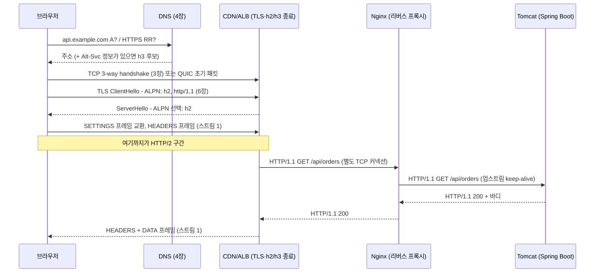

# 05. HTTP/1.1, HTTP/2, HTTP/3

> 관련 문서: [실습](./05-HTTP-실습.md) · 이전 장 [04. DNS](./04-DNS-이론.md)

## 1. 한 줄 요약

HTTP는 요청·응답 메시지의 의미(메서드, 상태 코드, 헤더 필드)를 정의하는 응용 계층 프로토콜이며, HTTP/1.1·HTTP/2·HTTP/3은 **같은 의미를 서로 다른 방식으로 전송**한다. 각각 TCP 위의 텍스트 메시지, TCP 위의 바이너리 프레임 다중화, UDP 기반 QUIC 위의 다중화다.

## 2. 왜 필요한가

HTTP 버전의 역사는 **"의미는 그대로 두고 전송만 고친 역사"**다. 2022년 RFC 재정리가 이 구조를 명문화했다. RFC 9110이 의미(Semantics)를, 9112/9113/9114가 각 버전의 전송을 정의한다.

| 시기 | 문제 | 해결 |
|---|---|---|
| HTTP/1.0 (1996) | 요청 하나마다 TCP 연결을 새로 맺고 끊었다. 요청마다 핸드셰이크 1 RTT + 슬로 스타트([3장](./03-TCP-이론.md)) | HTTP/1.1이 **keep-alive를 기본**으로 삼고, `Host` 헤더로 IP 하나에 여러 도메인(가상 호스팅)을 올릴 수 있게 함 |
| HTTP/1.1 (1997~) | 한 커넥션에서 요청·응답이 **순서대로** 처리된다. 앞 응답이 끝나야 다음 응답을 보낼 수 있다(응용 계층 HOL 블로킹). 파이프라이닝은 중간 장비 호환성 문제로 사실상 폐기 | 브라우저가 도메인당 커넥션 6개를 열고, 개발자는 스프라이트·번들링·도메인 샤딩으로 우회 |
| 우회책의 한계 | 커넥션 6개 × 도메인 수만큼 핸드셰이크·슬로 스타트·서버 메모리가 든다. 헤더(특히 쿠키)가 요청마다 반복된다 | HTTP/2(2015): 커넥션 하나에 **스트림 다중화**, HPACK **헤더 압축** |
| HTTP/2의 한계 | 다중화는 HTTP 레벨일 뿐, 아래 TCP는 바이트 스트림 하나다. 패킷 하나가 유실되면 **모든 스트림이 함께 멈춘다**(전송 계층 HOL 블로킹). 손실률이 있는 모바일 환경에서 h1보다 느려지기도 한다 | HTTP/3(2022): 전송을 **QUIC**으로 바꿔 스트림별로 독립 손실 복구. TLS 1.3을 통합해 연결 수립도 단축 |

백엔드 개발자에게 중요한 사실 하나. **우리 Spring Boot 앱이 직접 HTTP/2나 HTTP/3을 말하는 경우는 드물다.** 대부분 CDN이나 로드밸런서가 h3/h2로 클라이언트와 통신하고, 백엔드로는 HTTP/1.1로 다시 말한다. 그래서 이 장의 실무 질문은 "무엇을 켤까"가 아니라 **"어느 구간에서 어떤 버전이 쓰이고, 그 경계에서 무엇이 달라지는가"**다.

## 3. 핵심 개념

| 용어 | 정의 |
|---|---|
| 의미 (Semantics) | 메서드·상태 코드·헤더 필드의 뜻. 버전과 무관하게 동일 (RFC 9110) |
| 메시지 (Message) | 요청 또는 응답 한 건. 제어 데이터(시작 줄), 헤더 필드, 바디로 구성 |
| 안전한 메서드 (Safe Method) | 서버 상태를 바꾸지 않는 메서드. GET, HEAD, OPTIONS |
| 멱등 메서드 (Idempotent Method) | 여러 번 보내도 결과가 같은 메서드. GET, HEAD, PUT, DELETE. **재시도 설계의 기준** |
| 표현 (Representation) | 리소스의 특정 형식·인코딩 사본. `Content-Type`, `Content-Encoding`으로 기술 |
| 지속 커넥션 (Persistent Connection) | 응답 후에도 닫지 않고 재사용하는 TCP 커넥션. HTTP/1.1 기본 |
| 파이프라이닝 (Pipelining) | 응답을 기다리지 않고 요청을 연달아 보내는 HTTP/1.1 기능. 응답은 요청 순서대로만 와야 해서 HOL이 남고, 중간 장비 호환성 문제로 폐기됨 |
| 스트림 (Stream) | HTTP/2·3에서 한 커넥션 안의 독립된 요청·응답 흐름. 스트림 ID로 구분 |
| 프레임 (Frame) | HTTP/2의 전송 단위. HEADERS, DATA, SETTINGS, WINDOW_UPDATE, RST_STREAM, GOAWAY 등 |
| 다중화 (Multiplexing) | 커넥션 하나에서 여러 스트림을 동시에 주고받는 것 |
| HOL 블로킹 (Head-of-Line Blocking) | 앞의 것 때문에 뒤의 것이 막히는 현상. **응용 계층**(h1의 순차 응답)과 **전송 계층**(TCP 유실 시 h2 전체 정지)을 구분해야 한다 |
| HPACK / QPACK | HTTP/2 / HTTP/3의 헤더 압축 방식. 정적·동적 테이블로 반복 헤더를 인덱스로 치환 (RFC 7541 / RFC 9204) |
| 흐름 제어 (Flow Control) | HTTP/2·3이 **스트림별·커넥션별**로 따로 두는 수신 윈도우. TCP의 흐름 제어와 별개 |
| ALPN (Application-Layer Protocol Negotiation) | TLS 핸드셰이크에서 `h2`, `http/1.1`, `h3` 중 무엇을 쓸지 정하는 확장 (RFC 7301) |
| h2c | TLS 없는 평문 HTTP/2. 브라우저는 지원하지 않는다. 내부 통신·gRPC에서 사용 |
| Alt-Svc | "같은 서비스를 다른 프로토콜·포트로도 제공한다"고 알리는 응답 헤더. HTTP/3 발견의 표준 경로 |
| QUIC | UDP 위에서 신뢰성 전송·혼잡 제어·TLS 1.3을 통합해 사용자 공간에서 구현한 전송 프로토콜 (RFC 9000) |
| 커넥션 ID (Connection ID) | QUIC이 IP·포트가 아니라 이 식별자로 커넥션을 식별하는 값. Wi-Fi ↔ LTE 전환에도 커넥션이 유지된다 |

## 4. 동작 원리와 흐름

### 4-1. 브라우저 요청 하나가 거치는 경로



1. **[L7, 브라우저]** URL의 호스트명을 DNS로 해석한다([4장](./04-DNS-이론.md)). HTTPS 리소스 레코드(RR, DNS 타입 65)가 있으면 여기서 HTTP/3 지원 여부와 ALPN 목록을 미리 알 수 있다.
2. **[L4, 커널]** TCP 3-way handshake. HTTP/3이면 이 단계가 없고 QUIC 초기 패킷이 UDP로 바로 나간다.
3. **[L6, TLS 라이브러리]** TLS 핸드셰이크에서 **ALPN**으로 프로토콜을 정한다. 클라이언트가 `h2, http/1.1`을 제시하고 서버가 하나를 고른다. **브라우저는 평문 HTTP/2(h2c)를 쓰지 않으므로, TLS가 없으면 무조건 HTTP/1.1이다**(9-1).
4. **[L7, 양쪽]** HTTP/2면 클라이언트가 커넥션 프리페이스(`PRI * HTTP/2.0\r\n\r\nSM\r\n\r\n`)를 보내고 양쪽이 SETTINGS 프레임을 교환한다. 이때 동시 스트림 상한과 초기 윈도우 크기가 정해진다.
5. **[L7, 프록시]** ALB·Nginx는 클라이언트 커넥션을 **종료**하고 백엔드로 **새 커넥션**을 연다([1장](./01-OSI-TCPIP-이론.md) L7 프록시). 이 구간의 프로토콜은 보통 HTTP/1.1이다. 클라이언트가 h2로 동시에 100개를 보내도 백엔드에는 HTTP/1.1 커넥션 여러 개로 펼쳐진다.
6. **[L7, Tomcat]** 서블릿 컨테이너가 요청을 파싱해 스레드에 할당한다. Spring MVC가 컨트롤러를 호출한다.

### 4-2. 같은 요청 10개를 보낼 때의 차이


- **HTTP/1.1**: 커넥션 하나로는 동시에 요청 하나다. 브라우저는 그래서 6개까지 커넥션을 연다. 서버 응답이 100ms면 커넥션 1개로 10개 요청은 약 1초다(실습 4-1에서 측정한다).
- **HTTP/2**: 커넥션 하나에 스트림 10개를 동시에 띄운다. 같은 조건에서 약 100ms다. 단, 동시 스트림 수는 서버가 SETTINGS로 알린 `MAX_CONCURRENT_STREAMS`로 제한된다(9-2).
- **HTTP/3**: h2와 같은 다중화에 더해, 패킷 유실이 다른 스트림을 막지 않는다. 손실이 없는 사내망에서는 h2와 차이가 거의 없다. **이점은 손실·지연이 있는 네트워크에서 나온다.**

### 4-3. 상태는 어디에 생기는가

| 상태 | 위치 | 생성 | 소멸 | 주의점 |
|---|---|---|---|---|
| TCP/QUIC 커넥션 | 양 끝 (QUIC은 사용자 공간) | 핸드셰이크 | FIN/RST, QUIC은 idle timeout | 3장 전체 |
| HTTP/1.1 요청 처리 상태 | 커넥션마다 하나 | 요청 수신 | 응답 완료 | 커넥션 = 동시성 1 |
| 스트림 상태 | 커넥션 안, 스트림마다 | HEADERS | END_STREAM 또는 RST_STREAM | 스트림 수가 곧 동시성 |
| HPACK/QPACK 동적 테이블 | **커넥션 단위**, 양쪽 각각 | 헤더 전송 | 커넥션 종료 | 커넥션을 오래 쓸수록 압축률이 좋아진다 |
| 흐름 제어 윈도우 | 커넥션·스트림마다 | 커넥션 수립 | 커넥션 종료 | 기본 64KB라 큰 응답에서 병목이 될 수 있다 |
| 세션·인증 상태 | 애플리케이션 (JSESSIONID, JWT) | 로그인 | 만료 | HTTP 자체는 무상태(Stateless) |
| 캐시 엔트리 | 브라우저, CDN, 프록시 | 응답 수신 | `Cache-Control`, TTL (14장) | |

**HTTP는 무상태(Stateless) 프로토콜**이라는 말은 "프로토콜이 요청 간 상태를 정의하지 않는다"는 뜻이지, 커넥션이나 스트림에 상태가 없다는 뜻이 아니다. 위 표의 앞 다섯 줄은 모두 커넥션 수명에 묶인 상태다.

## 5. 구현 레벨 들여다보기

### HTTP/1.1 메시지 (RFC 9112)

```text
GET /api/orders?page=2 HTTP/1.1\r\n      ← 요청 줄: 메서드 SP 타깃 SP 버전
Host: api.example.com\r\n                ← 헤더 필드 (필수: Host)
Authorization: Bearer eyJhbGciOi...\r\n
Accept: application/json\r\n
\r\n                                      ← 빈 줄: 헤더 끝
(바디)
```

- 바디 길이는 **`Content-Length`** 또는 **`Transfer-Encoding: chunked`**로 정한다. 둘 다 있거나 모순되면 프록시와 서버가 다르게 해석해 요청 스머글링(Request Smuggling)이 생긴다(9-4).
- 청크 인코딩은 길이를 모른 채 스트리밍할 때 쓴다. `5\r\nhello\r\n0\r\n\r\n` 형태이고, 마지막 0 청크가 끝을 알린다.
- 한 줄이 텍스트라서 `nc`나 `openssl s_client`로 손으로 칠 수 있다(실습 3-1). 사람이 읽기 쉬운 대신 파싱 비용과 모호함이 크다.

### HTTP/2 프레임 (RFC 9113)

프레임 헤더는 9바이트 고정이다.

```text
+-----------------------------------------------+
|                 Length (24비트)                |   페이로드 길이, 기본 최대 16384
+---------------+---------------+---------------+
|   Type (8)    |   Flags (8)   |
+-+-------------+---------------+---------------+
|R|                 Stream Identifier (31)       |   0 = 커넥션 전체, 홀수 = 클라이언트가 연 스트림
+=+=============================================+
|                   Frame Payload                |
```

| 프레임 | 역할 | 실무에서 보이는 순간 |
|---|---|---|
| SETTINGS | 파라미터 교환 | 커넥션 시작. `MAX_CONCURRENT_STREAMS`, `INITIAL_WINDOW_SIZE` |
| HEADERS / CONTINUATION | 헤더 블록(HPACK) | 요청·응답 시작 |
| DATA | 바디 | |
| WINDOW_UPDATE | 흐름 제어 창 증가 | 큰 바디 전송 시 다수 발생 |
| RST_STREAM | 스트림만 취소 | 클라이언트가 요청 취소. 커넥션은 유지 |
| GOAWAY | 커넥션 종료 예고 | 서버 재시작·graceful shutdown |
| PING | 왕복 확인 | keep-alive, RTT 측정 |

주요 SETTINGS 기본값: `HEADER_TABLE_SIZE` 4096, `INITIAL_WINDOW_SIZE` 65535, `MAX_FRAME_SIZE` 16384. `MAX_CONCURRENT_STREAMS`는 구현마다 다르다(Nginx `http2_max_concurrent_streams` 기본 128, Tomcat `maxConcurrentStreams` 기본 100 — 버전별 확인 필요).

### HTTP/3과 QUIC (RFC 9114, RFC 9000)

- 스트림은 **QUIC이 제공**한다. HTTP/3은 그 위의 프레임 형식과 QPACK만 정의한다. 그래서 RST_STREAM·WINDOW_UPDATE에 해당하는 기능이 QUIC 계층으로 내려갔다.
- TLS 1.3이 QUIC에 내장되어 있다. 연결 수립이 **1-RTT**, 재방문 시 **0-RTT**까지 가능하다(0-RTT 데이터는 재전송 공격 위험이 있어 멱등 요청에만 쓴다).
- QPACK은 헤더 테이블 갱신을 별도의 단방향 스트림으로 보내서, HPACK을 그대로 쓸 때 생기는 순서 의존(HOL) 문제를 피한다.
- 발견 경로는 두 가지다. 응답 헤더 `alt-svc: h3=":443"; ma=86400`을 보고 다음 요청부터 h3을 시도하거나, DNS의 HTTPS RR(RFC 9460)로 첫 요청부터 h3을 시도한다.

### 서버 설정 (실제 지시어와 기본값)

| 대상 | 설정 | 기본값·주의 |
|---|---|---|
| Nginx | `http2 on;` | **1.25.1부터 별도 지시어**. 이전에는 `listen 443 ssl http2;` (혼용하면 경고·무시) |
| Nginx | `listen 443 quic reuseport; http3 on;` | 1.25.0+ (QUIC). 빌드에 `--with-http_v3_module`이 있어야 한다. `nginx -V`로 확인 |
| Nginx | `http2_max_concurrent_streams 128;` | 동시 스트림 상한 |
| Nginx | `large_client_header_buffers 4 8k;` | 요청 헤더 한 줄이 8k를 넘으면 400 (9-3) |
| Nginx | `proxy_buffer_size 4k\|8k;` | **업스트림 응답 헤더**가 이보다 크면 502 (9-3) |
| Nginx | `client_max_body_size 1m;` | 초과 시 413 |
| Nginx | `proxy_http_version 1.0;` | **기본값이 1.0이라 업스트림 keep-alive가 꺼진다.** 1.1 + `proxy_set_header Connection "";`로 켠다 |
| Tomcat | `server.http2.enabled` | Spring Boot 기본 `false` |
| Tomcat | `server.max-http-request-header-size` | 8KB. 초과 시 400/431 |
| Tomcat | `server.tomcat.max-keep-alive-requests` | 100 (3장 6-3) |
| ALB | `routing.http2.enabled` | 기본 활성. 백엔드로는 HTTP/1.1로 전달(대상 그룹 프로토콜 버전 설정으로 HTTP/2·gRPC 선택 가능) |
| CloudFront | HTTP/3 지원 | 배포 설정에서 활성화 (작성 시점 기준, 확인 필요) |

### 클라이언트 라이브러리

| 클라이언트 | 기본 버전 | 프로토콜 지정 |
|---|---|---|
| `java.net.http.HttpClient` (JDK 11+) | HTTP/2 시도 후 폴백 | `.version(HttpClient.Version.HTTP_1_1)` |
| Apache HttpClient 5 | HTTP/1.1 (정책에 따름) | `setVersionPolicy(HttpVersionPolicy.NEGOTIATE)` |
| Reactor Netty (WebClient) | HTTP/1.1 | `HttpClient.create().protocol(HttpProtocol.H2, HttpProtocol.HTTP11)` |
| curl | 협상 | `--http1.1`, `--http2`, `--http2-prior-knowledge`, `--http3` |

JDK의 HttpClient는 작성 시점 기준 HTTP/3을 지원하지 않는다(JDK 25에 관련 JEP가 포함됐다는 이야기가 있어 사용 전 확인 필요).

## 6. 백엔드 코드와 만나는 지점

### 6-1. Spring Boot 설정

```yaml
server:
  http2:
    enabled: true              # 기본 false. Tomcat에서 켜려면 TLS가 함께 필요(브라우저는 h2c 미지원)
  compression:
    enabled: false             # 기본 false. 앞단 Nginx/CDN이 압축하면 중복 압축이 된다
  max-http-request-header-size: 8KB    # Tomcat maxHttpRequestHeaderSize. 쿠키·JWT가 크면 400/431
  tomcat:
    max-http-response-header-size: 8KB # 응답 헤더 상한
    max-keep-alive-requests: 100       # HTTP/1.1 커넥션 하나로 처리할 최대 요청 수 (3장)
    keep-alive-timeout: 75s            # 앞단 LB의 idle timeout보다 길게 (3장 9-3)
    accesslog:
      enabled: true
      pattern: '%h %l %u %t "%r" %s %b %D %{X-Forwarded-For}i %H'   # %H = 프로토콜(HTTP/1.1, HTTP/2.0)
spring:
  servlet:
    multipart:
      max-file-size: 1MB       # 기본 1MB. 초과 시 MaxUploadSizeExceededException
      max-request-size: 10MB   # 기본 10MB
  mvc:
    async:
      request-timeout: 30s     # 비동기(SseEmitter, DeferredResult) 응답 상한
```

액세스 로그의 `%H`를 켜두면 "우리 앱에 실제로 도달하는 프로토콜"을 확인할 수 있다. 대부분 `HTTP/1.1`로 찍히며, 이는 앞단이 h2/h3을 종료한다는 뜻이다(4-1 단계 5).

### 6-2. 예외와 로그

| 상황 | 로그·예외 | 해석 |
|---|---|---|
| 클라이언트가 응답 도중 끊음 | `org.apache.catalina.connector.ClientAbortException: java.io.IOException: Broken pipe` | 사용자가 새로고침·취소, 또는 앞단 타임아웃. h2에서는 RST_STREAM으로 나타난다 |
| 응답을 이미 보낸 뒤 에러 처리 시도 | `java.lang.IllegalStateException: Cannot call sendError() after the response has been committed` | 스트리밍·비동기 응답에서 흔하다 |
| 요청 헤더 초과 | Tomcat 400/431, 로그에 `Request header is too large` | 쿠키·JWT 누적 (9-3) |
| 업로드 초과 | `org.springframework.web.multipart.MaxUploadSizeExceededException` | `spring.servlet.multipart.*`와 Nginx `client_max_body_size`를 같이 본다 |
| 비동기 타임아웃 | `org.springframework.web.context.request.async.AsyncRequestTimeoutException` (503) | `spring.mvc.async.request-timeout` |
| Nginx가 업스트림 헤더를 못 받음 | Nginx error.log `upstream sent too big header while reading response header from upstream` → 클라이언트에는 502 | `proxy_buffer_size` (9-3) |
| Nginx 액세스 로그 상태 499 | 클라이언트가 응답 전에 끊음 | Nginx 고유 코드. 앱의 `Broken pipe`와 짝을 이룬다 |
| HTTP/2 프로토콜 오류 | `io.netty.handler.codec.http2.Http2Exception`, `StreamResetException` | h2를 직접 말하는 클라이언트·게이트웨이에서 |

### 6-3. HTTP/2에서는 "커넥션 풀"의 의미가 바뀐다

[3장 6-4](./03-TCP-이론.md)에서 HTTP 클라이언트의 라우트당 커넥션 수를 늘리라고 했다. HTTP/2를 쓰면 기준이 달라진다.

- h1.1: 동시 요청 수 = 커넥션 수. 그래서 풀 크기가 곧 동시성이다.
- h2: 커넥션 하나로 여러 요청을 처리한다. 동시성 상한은 **서버가 SETTINGS로 알린 `MAX_CONCURRENT_STREAMS`**다. 커넥션을 많이 열어도 소용없고, 오히려 서버가 GOAWAY로 정리할 수 있다.
- 따라서 h2 클라이언트에서 조정할 값은 "풀 크기"가 아니라 "동시 요청 허용치"이며, 상대 서버의 스트림 상한을 먼저 확인해야 한다.

가상 스레드(Java 21)와의 관계도 같은 맥락이다. 스레드를 수만 개 만들어도 실제 동시성 상한은 **상대 서버의 스트림 수 또는 우리 쪽 커넥션 수**에서 정해진다.

### 6-4. 스트리밍·SSE가 HTTP/2에서 편해지는 이유

`SseEmitter`, `ResponseBodyEmitter`, `StreamingResponseBody`는 응답을 열어둔 채 데이터를 흘린다. HTTP/1.1에서는 **커넥션 하나를 계속 점유**하므로, 브라우저의 도메인당 6커넥션 제한에 걸려 탭 몇 개만 열어도 나머지 요청이 막힌다. HTTP/2에서는 스트림 하나만 쓰므로 이 제약이 사라진다.

다만 서버 쪽에서는 그만큼 요청이 오래 살아 있으므로 Tomcat 스레드·비동기 설정과 타임아웃 정렬이 필요하다(13장).

### 6-5. gRPC는 HTTP/2 전용이다

gRPC는 h2의 스트림·트레일러(Trailer)에 직접 의존한다. 그래서 중간 경로가 하나라도 h2를 h1으로 바꾸면 동작하지 않는다.

- ALB: 대상 그룹의 프로토콜 버전을 `gRPC` 또는 `HTTP2`로 설정해야 한다.
- Nginx: `grpc_pass`를 쓰고 백엔드는 h2c로 받는다.
- Spring: `grpc-spring-boot-starter`나 Netty 기반 서버가 h2c로 리슨한다.

### 6-6. 재시도와 멱등성

HTTP/2·3의 다중화는 실패도 함께 다중화한다. 커넥션 하나가 끊기면 그 위의 모든 스트림이 한꺼번에 실패한다(GOAWAY 또는 QUIC 커넥션 종료). 클라이언트 재시도 정책은 **멱등 메서드에만** 적용하고, POST는 멱등 키(Idempotency-Key)를 두거나 재시도하지 않는다. 이 구분은 h1.1에서도 같지만, h2에서는 한 번에 실패하는 요청 수가 많아 영향이 커진다.

## 7. 유사 개념과의 비교

| 항목 | HTTP/1.1 | HTTP/2 | HTTP/3 |
|---|---|---|---|
| 전송 | TCP | TCP | QUIC (UDP) |
| 직렬화 | 텍스트 | 바이너리 프레임 | 바이너리 프레임 |
| 동시 요청 | 커넥션당 1 | 스트림 다중화 | 스트림 다중화 |
| 헤더 압축 | 없음 | HPACK | QPACK |
| HOL 블로킹 | 응용 계층에 있음 | 전송 계층에 남음 | 스트림 단위로 해소 |
| TLS | 선택 | 브라우저는 사실상 필수(h2c는 내부용) | **필수**(QUIC에 내장) |
| 연결 수립 | TCP 1 RTT + TLS 1~2 RTT | 같음 | QUIC 1 RTT, 재방문 0-RTT |
| 네트워크 전환 | 커넥션 끊김 | 커넥션 끊김 | 커넥션 ID로 유지 |
| 중간 장비 통과 | 문제 없음 | 문제 없음 | **UDP 443 차단 시 불가**(9-7) |
| 디버깅 | `nc`, `curl -v`로 평문 확인 | `nghttp`, `curl --http2` 등 도구 필요 | 도구·캡처 난이도 가장 높음 |

**선택 기준**

| 상황 | 권장 | 이유 |
|---|---|---|
| 공개 웹·모바일 앱 대상 | CDN/LB에서 h2, 가능하면 h3도 | 다중화·헤더 압축 이득이 크고, 모바일에서 h3이 유리 |
| 서버 간 내부 API | h1.1 keep-alive면 충분 | 커넥션 재사용만 해도 대부분의 이득을 얻는다. 운영 복잡도가 낮다 |
| gRPC·양방향 스트리밍 | h2(h2c) 필수 | 프로토콜 요구사항 |
| 대용량 파일 전송 | h1.1 또는 h2(윈도우 조정) | h2 기본 윈도우 64KB가 병목이 될 수 있다 |
| 사내망(손실 거의 없음) | h3의 이득 작음 | h3은 손실·이동성 환경에서 빛난다 |

## 8. 표준·버전별 변천

| 시기 | 사건 | 실무 영향 |
|---|---|---|
| 1996 / 1997 | HTTP/1.0 (RFC 1945) / HTTP/1.1 (RFC 2068) | keep-alive, `Host` 헤더 |
| 1999 | RFC 2616 | 오랫동안 "HTTP 표준"으로 인용됨 |
| 2014 | RFC 7230~7235로 분리 | 메시지 문법과 의미 분리의 시작 |
| 2015 | HTTP/2 (RFC 7540), SPDY 종료 | 다중화·HPACK. 서버 푸시 도입 |
| 2020~ | 서버 푸시 사실상 폐기 | 주요 브라우저가 기본 비활성화. 대안은 103 Early Hints·preload |
| 2021 | QUIC (RFC 9000) | 전송 계층이 사용자 공간으로 |
| 2022 | RFC 9110~9114 재정리 | 의미(9110)와 전송(9112/9113/9114) 분리 |
| 2022 | 확장 가능한 우선순위 (RFC 9218) | h2의 복잡한 우선순위 트리를 대체 |
| 2023 | HTTP/2 Rapid Reset (CVE-2023-44487) | 스트림 생성·즉시 취소 반복 DDoS. 서버·프록시 패치 필요(11절) |
| 2023 | HTTPS RR (RFC 9460) | DNS로 h3 지원을 미리 알림 |

## 9. 함정과 장애 패턴

### 9-1. "HTTP/2를 켰는데 브라우저는 여전히 HTTP/1.1"

- **증상**: 서버 설정에 h2를 켰는데 브라우저 개발자도구 Network 탭의 Protocol 열이 `http/1.1`이다. 기대한 성능 개선이 없다.
- **원인**: 대부분 협상 단계에서 h2가 선택되지 않았다.
  - TLS가 아니다. 브라우저는 h2c(평문 h2)를 지원하지 않는다.
  - ALPN이 동작하지 않는다. 오래된 OpenSSL·JDK 조합, 또는 TLS 종료 지점이 h2를 모른다.
  - Nginx 1.25.1+에서 `listen 443 ssl http2;`만 쓰고 `http2 on;`을 넣지 않았다(구 문법은 경고와 함께 무시될 수 있다).
  - 앞단 CDN·LB가 h2로 받고 **백엔드로는 h1.1**로 보내는데, 백엔드 로그만 보고 판단했다. 이건 정상이다.
- **확인 방법**:
  - `curl -vk --http2 https://host/ 2>&1 | grep -i -E 'ALPN|HTTP/2'` → `ALPN: server accepted h2`가 있는지.
  - `nghttp -nv https://host/` → SETTINGS 프레임이 오가면 h2다.
  - 브라우저 개발자도구 Network 탭에서 Protocol 열 표시(열이 없으면 헤더 우클릭으로 추가).
  - Nginx: `nginx -T | grep -E 'listen|http2'`로 실제 적용 설정 확인.
- **해결**: TLS + ALPN 경로를 먼저 확정한 뒤, 프로토콜이 **어느 구간에서** 필요한지 정한다. 브라우저↔CDN 구간만 h2면 충분한 경우가 대부분이다.

### 9-2. HTTP/2인데 빠르지 않다

- **증상**: h2 협상은 됐는데 동시 요청이 몰리면 응답이 줄줄이 밀린다. 또는 대용량 다운로드가 h1.1보다 느리다.
- **원인**:
  - **동시 스트림 상한**이 낮다. 서버가 SETTINGS로 `MAX_CONCURRENT_STREAMS`를 작게 알리면 클라이언트는 그 수만큼만 동시에 보낸다. 나머지는 대기한다(실습 4-3에서 2로 낮춰 재현한다).
  - **흐름 제어 윈도우**가 기본 64KB다. 큰 응답에서 WINDOW_UPDATE를 주고받느라 RTT에 묶인다.
  - **TCP 레벨 HOL**. 유실이 있는 경로에서는 스트림 전부가 함께 멈춘다. h2가 h1보다 느려질 수 있는 유일하고 대표적인 경우다.
  - 프록시가 h2를 h1.1로 변환하면서 백엔드 커넥션이 부족해 병목이 앞당겨졌다.
- **확인 방법**:
  - `nghttp -nv https://host/path`로 SETTINGS의 `MAX_CONCURRENT_STREAMS` 값 확인.
  - `h2load -n 100 -c 1 -m 10 https://host/path`와 `h2load --h1 ...` 비교(실습 3-3, 4-1).
  - 손실 의심 시 `ss -ti`의 재전송 카운터([3장](./03-TCP-이론.md) 5절).
  - 프록시 쪽 업스트림 커넥션 수: `ss -tan | wc -l`, Nginx `upstream` 설정의 `keepalive`.
- **해결**: 서버의 스트림 상한과 초기 윈도우를 조정하고, 프록시 업스트림 keep-alive를 켠다. 손실이 잦은 경로면 h3을 검토한다.

### 9-3. 헤더 하나 때문에 400·431·502

- **증상**: 특정 사용자만 로그인 후 400(`Request Header Or Cookie Too Large`) 또는 431을 받는다. 또는 어떤 API만 502가 나고 Nginx error.log에 `upstream sent too big header`가 찍힌다.
- **원인**: 요청·응답 헤더 크기 제한이 경로마다 다르고, 가장 작은 값이 전체를 좌우한다.
  - 요청 방향: 쿠키 누적, 큰 JWT(권한 클레임을 잔뜩 넣은 경우), `X-Forwarded-*` 중첩. Nginx `large_client_header_buffers`(기본 8k), Tomcat `max-http-request-header-size`(기본 8KB), ALB·CloudFront의 자체 한도.
  - 응답 방향: 앱이 큰 헤더(긴 `Set-Cookie`, 커스텀 헤더)를 보내는데 Nginx `proxy_buffer_size`(기본 4k/8k)가 작으면 **502**가 난다. 앱은 200을 보냈으므로 앱 로그만 보면 원인을 못 찾는다.
- **확인 방법**:
  - 재현: `curl -v -k https://host/api -H "Authorization: Bearer $(head -c 9000 /dev/zero | tr '\0' 'x')"`.
  - Nginx error.log에서 `client sent too long header line`(요청) vs `upstream sent too big header`(응답) 구분.
  - 실제 헤더 크기 측정: 앱에 헤더를 그대로 돌려주는 디버그 엔드포인트를 두거나 액세스 로그에 `$request_length` 기록.
- **해결**: 한도를 올리기 전에 **헤더를 줄이는 쪽**을 먼저 본다(JWT에서 불필요한 클레임 제거, 쿠키 정리). 그다음 경로상 모든 구간의 한도를 같은 값으로 맞춘다. 한 곳만 올리면 다음 구간에서 같은 증상이 난다.

### 9-4. `Content-Length`와 `Transfer-Encoding` 불일치 (요청 스머글링)

- **증상**: 평소엔 정상인데 특정 요청에서 502가 나거나, 보안 점검에서 요청 스머글링 취약점으로 보고된다. 다른 사용자의 요청에 이상한 바디가 섞이는 현상이 보고되기도 한다.
- **원인**: 프록시와 백엔드가 같은 요청의 바디 길이를 **다르게 해석**한다. `Content-Length`와 `Transfer-Encoding: chunked`가 함께 있거나, `Transfer-Encoding: chunked`를 변형해(`chunked ,`, 대소문자 혼용) 한쪽만 인식하게 만드는 공격이다. 프록시가 요청 하나로 본 바이트를 백엔드가 두 요청으로 보면, 뒤쪽 조각이 다음 사용자의 요청 앞에 붙는다.
- **확인 방법**: 프록시·서버 버전과 CVE 확인. 액세스 로그에서 동일 커넥션에 비정상적으로 이어지는 요청 패턴 확인. 보안 도구로 재현(권한이 있는 환경에서만).
- **해결**: RFC 9112는 두 헤더가 함께 오면 `Transfer-Encoding`을 우선하고 모호한 요청은 거부하도록 정한다. Nginx·Tomcat을 최신 패치로 올리고, 모호한 요청을 거부하는 기본 설정을 끄지 않는다. 앞단에서 요청을 정규화한다.

### 9-5. `Broken pipe` 로그가 쏟아진다

- **증상**: 앱 로그에 `ClientAbortException: java.io.IOException: Broken pipe`가 대량으로 찍힌다. 에러 알림이 계속 울린다.
- **원인**: 클라이언트가 응답을 다 받기 전에 끊었다. 사용자가 새로고침·페이지 이동한 경우가 가장 많고, 앞단 LB·Nginx의 타임아웃이 앱 처리 시간보다 짧아 프록시가 먼저 끊는 경우도 있다(13장). HTTP/2에서는 RST_STREAM으로 나타나며, 프레임워크가 같은 예외로 변환한다.
- **확인 방법**:
  - Nginx 액세스 로그 상태 코드 **499** 비율. 499가 많으면 클라이언트 중단이다.
  - 앱 로그의 `Broken pipe` 발생 시각과 Nginx `proxy_read_timeout` 초과 시각 비교.
  - 특정 엔드포인트에 몰리는지(느린 API인지) 확인.
- **해결**: 사용자 취소가 원인이면 로그 레벨을 낮춘다(정상 동작이다). 프록시 타임아웃이 원인이면 타임아웃 순서를 정렬한다(앱 < 프록시 < LB). 긴 작업은 비동기 처리 후 폴링·SSE로 바꾼다.

### 9-6. gRPC·h2 백엔드를 프록시했더니 깨진다

- **증상**: gRPC 호출이 `UNAVAILABLE`, `RST_STREAM`, 502로 실패한다. 단순 REST는 잘 된다.
- **원인**: 경로 중 한 구간이 h2를 h1.1로 변환한다. ALB 대상 그룹 프로토콜 버전이 `HTTP1`이거나, Nginx가 `proxy_pass`(h1)로 전달하고 있다. h1.1에는 트레일러 지원과 양방향 스트리밍이 없다.
- **확인 방법**: `grpcurl -plaintext host:port list`로 구간별 테스트(LB 앞/뒤). ALB 대상 그룹의 프로토콜 버전 확인. Nginx 설정에서 `grpc_pass` 사용 여부 확인.
- **해결**: 전 구간 h2 유지. ALB는 대상 그룹 프로토콜 버전을 gRPC로, Nginx는 `grpc_pass grpc://backend;`로 설정한다.

### 9-7. HTTP/3이 켜졌는데 오히려 느려졌다

- **증상**: h3을 켠 뒤 일부 사내 사용자만 첫 요청이 눈에 띄게 느리다. 브라우저 Protocol 열에는 결국 `h2`가 찍힌다.
- **원인**: 방화벽이 **UDP 443**을 막는다. 브라우저는 `Alt-Svc`를 보고 h3을 시도하다가 실패한 뒤 h2로 폴백한다. 이 시도·실패에 시간이 든다. 기업망에서 흔하다.
- **확인 방법**: 해당 네트워크에서 `curl --http3 https://host/`(h3 지원 curl 필요) 또는 UDP 443 도달 여부 확인. 브라우저 `chrome://net-export` 캡처. 서버 쪽 QUIC 연결 성공률 지표.
- **해결**: 대상 사용자가 UDP 443을 쓸 수 없으면 `Alt-Svc` 광고를 끄거나 `ma`(max-age)를 짧게 둔다. 사내 환경은 방화벽에서 UDP 443을 허용한다.

## 10. 실무 적용 시나리오

- **프로토콜 종단 설계**: "브라우저 ↔ CDN: h3/h2", "CDN ↔ ALB: h2 또는 h1.1", "ALB ↔ Tomcat: h1.1"처럼 구간별로 적는다. 그다음 각 구간의 keep-alive·타임아웃·헤더 한도를 같은 표에 채운다. 장애 대응 시 이 표가 가장 빨리 쓰인다.
- **성능 테스트**: 부하 도구의 프로토콜을 고정한다(`h2load --h1` vs 기본). 도구가 h1.1로 커넥션을 무제한 여는 바람에 실제보다 좋은 수치가 나오거나, 반대로 임시 포트가 고갈되는 일이 흔하다([3장 9-1](./03-TCP-이론.md)).
- **업로드 크기 변경 요청**: 413이 나면 Nginx `client_max_body_size`, Spring `spring.servlet.multipart.max-file-size`, ALB·CloudFront 한도를 **한 번에** 조정한다. 한 군데만 바꾸면 다음 구간에서 막힌다.
- **JWT 설계 리뷰**: 권한 목록을 토큰에 넣을수록 모든 요청의 헤더가 커진다. h2의 HPACK이 반복 헤더를 압축해주지만, 커넥션 첫 요청과 h1.1 구간에서는 그대로 전송된다(9-3).
- **장애 대응**: 502를 보면 먼저 "앱이 응답을 못 준 것"과 "프록시가 응답을 처리 못 한 것"을 가른다. 후자의 대표가 응답 헤더 크기 초과다.

## 11. 보안·비용 고려사항

- **HTTP/2 Rapid Reset (CVE-2023-44487)**: 스트림을 만들고 즉시 RST_STREAM으로 취소하기를 반복해 서버 자원을 소진시키는 DDoS다. 다중화 자체가 공격 표면이 됐다. 대응은 서버·프록시 패치와 커넥션당 스트림 생성률 제한이다.
- **요청 스머글링**: 9-4. 프록시 체인이 길수록 위험이 커진다.
- **헤더에 담기는 비밀**: `Authorization` 헤더와 쿠키는 로그·APM에 그대로 남기 쉽다. 액세스 로그 패턴에서 민감 헤더를 제외한다.
- **TLS 의무화**: h2·h3을 쓰려면 사실상 TLS가 필요하다. 인증서 발급·갱신 자동화가 전제 조건이다([6장](./06-TLS-이론.md)).
- **비용**: CDN·ALB 요금은 대개 요청 수와 전송량 기준이라 프로토콜 버전 자체로 달라지지 않는다. 다만 헤더 압축과 커넥션 재사용은 모바일 데이터 사용량과 TLS 핸드셰이크 CPU를 줄인다.

## 12. 자가 점검 질문

**Q1.** HTTP/2를 켰는데 Tomcat 액세스 로그의 `%H`가 계속 `HTTP/1.1`이다. 잘못된 설정인가?

<details><summary>답</summary>

대개 정상이다. 앞단 CDN·ALB·Nginx가 h2를 종료하고 백엔드로는 HTTP/1.1로 새 커넥션을 맺기 때문이다(4-1 단계 5). 브라우저 개발자도구의 Protocol 열이나 `curl -v --http2`로 **클라이언트↔앞단 구간**을 확인해야 한다. 백엔드까지 h2가 필요한 경우는 gRPC처럼 프로토콜이 요구할 때다.
</details>

**Q2.** HTTP/1.1의 HOL 블로킹과 HTTP/2의 HOL 블로킹은 어떻게 다른가?

<details><summary>답</summary>

HTTP/1.1은 **응용 계층**에서 막힌다. 커넥션 하나에서 응답이 순서대로 나와야 하므로 앞 응답이 느리면 뒤 요청이 기다린다. 커넥션을 늘리면 완화된다. HTTP/2는 응용 계층 HOL은 없지만 **전송 계층**에 남는다. 모든 스트림이 TCP 바이트 스트림 하나를 공유하므로 패킷 하나가 유실되면 재전송될 때까지 모든 스트림의 데이터 전달이 멈춘다. 이것은 커넥션을 늘려도 완전히 해결되지 않으며, HTTP/3(QUIC)이 스트림별 독립 복구로 해결한다.
</details>

**Q3.** 로그인한 사용자만 간헐적으로 400 `Request Header Or Cookie Too Large`를 받는다. 어디부터 보겠는가?

<details><summary>답</summary>

헤더 크기 한도 체인을 본다. ① 실패한 요청의 쿠키·`Authorization` 크기를 확인한다(브라우저 개발자도구 또는 `$request_length` 로깅). ② 경로상 각 구간의 한도를 수집한다. Nginx `large_client_header_buffers`(기본 4 8k), Tomcat `server.max-http-request-header-size`(기본 8KB), 앞단 LB·CDN 한도. ③ `curl -H`로 큰 헤더를 만들어 어느 구간에서 거부되는지 이분 탐색한다(Nginx error.log의 `client sent too long header line`이 결정적 단서). ④ 한도를 올리기 전에 쿠키·JWT 크기를 줄일 수 있는지 먼저 검토한다.
</details>

**Q4.** 내부 서비스 간 REST 호출을 HTTP/2로 바꾸면 성능이 좋아질까?

<details><summary>답</summary>

대개 큰 차이가 없다. 내부망은 손실이 거의 없고 RTT가 짧아서 h2의 이득(다중화·헤더 압축)이 작다. 반면 **커넥션 재사용을 안 하고 있었다면** h1.1 keep-alive만 켜도 대부분의 이득을 얻는다([3장 6-4](./03-TCP-이론.md)). h2가 확실히 필요한 경우는 gRPC, 양방향 스트리밍, 헤더가 매우 큰 호출, 클라이언트가 커넥션을 많이 못 여는 환경이다. 바꾸기 전에 현재 커넥션 재사용률부터 측정한다.
</details>

**Q5.** HTTP/3을 켜려면 최소한 무엇이 필요하고, 어떤 환경에서 이득이 큰가?

<details><summary>답</summary>

필요한 것은 ① QUIC을 지원하는 서버·CDN, ② **UDP 443 개방**, ③ TLS 1.3 인증서, ④ 클라이언트에게 알리는 경로(`Alt-Svc` 응답 헤더 또는 DNS HTTPS RR)다. 이득이 큰 환경은 패킷 손실과 지연이 있는 모바일·원거리 네트워크, 그리고 네트워크 전환이 잦은 클라이언트다(커넥션 ID로 세션 유지). 손실이 거의 없는 사내망에서는 이득이 작고, UDP가 막힌 기업망에서는 폴백 때문에 오히려 느려질 수 있다(9-7).
</details>

## 13. 참고 자료

- RFC 9110 — HTTP Semantics
- RFC 9111 — HTTP Caching (14장에서 다룸)
- RFC 9112 — HTTP/1.1
- RFC 9113 — HTTP/2, RFC 7541 — HPACK
- RFC 9114 — HTTP/3, RFC 9204 — QPACK, RFC 9000 — QUIC
- RFC 9218 — Extensible Prioritization Scheme for HTTP
- RFC 9460 — Service Binding and Parameter Specification via the DNS (HTTPS RR)
- RFC 7301 — TLS Application-Layer Protocol Negotiation (ALPN)
- RFC 9457 — Problem Details for HTTP APIs (Spring 6 `ProblemDetail`)
- Nginx 문서 — `ngx_http_v2_module`, `ngx_http_v3_module`, `ngx_http_proxy_module`(`proxy_http_version`, `proxy_buffer_size`)
- Apache Tomcat 10.1 문서 — HTTP/2 Upgrade Protocol, HTTP Connector
- Spring Boot 문서 — Common Application Properties(`server.http2.*`, `server.tomcat.*`), Web on Servlet Stack(비동기 요청)
- AWS 문서 — ALB 프로토콜 버전(gRPC 지원), CloudFront HTTP/3
- Daniel Stenberg, *HTTP/2 explained*, *HTTP/3 explained* (무료 온라인 서적)
- W. Richard Stevens, Kevin Fall, *TCP/IP Illustrated, Volume 1* (2nd ed.) — 부록 성격의 HTTP 설명은 얇으므로 위 RFC를 우선한다

## 부록: 용어 정리

| 용어 | 영문 | 설명 |
|---|---|---|
| HTTP | Hypertext Transfer Protocol | 요청·응답 메시지의 의미를 정의하는 응용 계층 프로토콜 |
| 의미 | Semantics | 메서드·상태 코드·헤더의 뜻, 버전과 무관하게 동일 (RFC 9110) |
| 메시지 | Message | 시작 줄, 헤더 필드, 바디로 구성된 요청 또는 응답 한 건 |
| 안전한 메서드 | Safe Method | 서버 상태를 바꾸지 않는 메서드 (GET, HEAD, OPTIONS) |
| 멱등 메서드 | Idempotent Method | 여러 번 보내도 결과가 같은 메서드, 재시도 가능 여부의 기준 |
| 표현 | Representation | 리소스의 특정 형식·인코딩 사본 |
| 가상 호스팅 | Virtual Hosting | `Host` 헤더로 IP 하나에 여러 도메인을 서비스하는 방식 |
| 지속 커넥션 | Persistent Connection | 응답 후에도 재사용하는 커넥션, HTTP/1.1 기본 |
| 파이프라이닝 | Pipelining | 응답을 기다리지 않고 요청을 연달아 보내는 HTTP/1.1 기능, 사실상 폐기 |
| HOL 블로킹 | Head-of-Line Blocking | 앞의 것 때문에 뒤가 막히는 현상, 응용 계층과 전송 계층을 구분해야 함 |
| 스트림 | Stream | HTTP/2·3에서 커넥션 안의 독립된 요청·응답 흐름 |
| 스트림 ID | Stream Identifier | 스트림을 구분하는 번호, 클라이언트가 연 것은 홀수 |
| 프레임 | Frame | HTTP/2의 전송 단위, 9바이트 헤더 + 페이로드 |
| 다중화 | Multiplexing | 커넥션 하나에서 여러 스트림을 동시에 처리하는 것 |
| 커넥션 프리페이스 | Connection Preface | HTTP/2 시작 시 클라이언트가 보내는 고정 바이트열 |
| SETTINGS | SETTINGS Frame | 동시 스트림 수, 초기 윈도우 등 파라미터를 교환하는 프레임 |
| MAX_CONCURRENT_STREAMS | MAX_CONCURRENT_STREAMS | 한 커넥션에서 동시에 열 수 있는 스트림 수 상한 |
| WINDOW_UPDATE | WINDOW_UPDATE Frame | HTTP/2 흐름 제어 창을 늘리는 프레임 |
| RST_STREAM | RST_STREAM Frame | 커넥션은 두고 스트림 하나만 취소하는 프레임 |
| GOAWAY | GOAWAY Frame | 커넥션 종료를 예고하는 프레임 |
| HPACK | HPACK | 정적·동적 테이블과 허프만 부호화를 쓰는 HTTP/2 헤더 압축 |
| QPACK | QPACK | 별도 스트림으로 테이블을 갱신하는 HTTP/3 헤더 압축 |
| 흐름 제어 | Flow Control | HTTP/2·3이 스트림·커넥션별로 두는 수신 윈도우, 기본 64KB |
| ALPN | Application-Layer Protocol Negotiation | TLS 핸드셰이크에서 h2·http/1.1·h3을 고르는 확장 |
| h2c | HTTP/2 Cleartext | TLS 없는 평문 HTTP/2, 브라우저 미지원 |
| Alt-Svc | Alternative Services | 다른 프로토콜·포트로도 제공됨을 알리는 응답 헤더 |
| HTTPS RR | HTTPS Resource Record | DNS로 h3 지원과 ALPN을 미리 알리는 레코드 타입 (RFC 9460) |
| QUIC | QUIC | UDP 위에서 신뢰성 전송과 TLS 1.3을 통합한 전송 프로토콜 |
| 커넥션 ID | Connection ID | IP·포트 대신 QUIC 커넥션을 식별하는 값, 네트워크 전환에도 유지 |
| 0-RTT | Zero Round Trip Time Resumption | 재방문 시 핸드셰이크 없이 데이터를 먼저 보내는 기능, 재전송 위험 존재 |
| 청크 전송 인코딩 | Chunked Transfer Encoding | 길이를 모른 채 조각 단위로 바디를 보내는 HTTP/1.1 방식 |
| 요청 스머글링 | Request Smuggling | 프록시와 서버가 바디 길이를 다르게 해석하게 만드는 공격 |
| 서버 푸시 | Server Push | 요청 전에 서버가 리소스를 보내던 HTTP/2 기능, 사실상 폐기 |
| 103 Early Hints | 103 Early Hints | 본 응답 전에 미리 리소스 힌트를 주는 상태 코드 |
| 트레일러 | Trailer | 바디 뒤에 오는 헤더 필드, gRPC가 상태 전달에 사용 |
| gRPC | gRPC | HTTP/2의 스트림·트레일러에 의존하는 RPC 프레임워크 |
| `ClientAbortException` | ClientAbortException | 클라이언트가 응답 도중 끊었을 때 Tomcat이 던지는 예외 |
| 499 | Nginx 499 | 클라이언트가 응답 전에 끊었음을 나타내는 Nginx 고유 상태 코드 |
| `large_client_header_buffers` | large_client_header_buffers | Nginx 요청 헤더 버퍼 설정, 기본 4개 8k |
| `proxy_buffer_size` | proxy_buffer_size | Nginx가 업스트림 **응답 헤더**를 담는 버퍼, 초과 시 502 |
| `proxy_http_version` | proxy_http_version | Nginx가 업스트림에 쓰는 HTTP 버전, 기본 1.0이라 keep-alive가 꺼짐 |
| Rapid Reset | HTTP/2 Rapid Reset (CVE-2023-44487) | 스트림 생성·즉시 취소를 반복하는 HTTP/2 DDoS 기법 |
| 멱등 키 | Idempotency-Key | 비멱등 요청을 안전하게 재시도하기 위해 클라이언트가 붙이는 식별자 |
