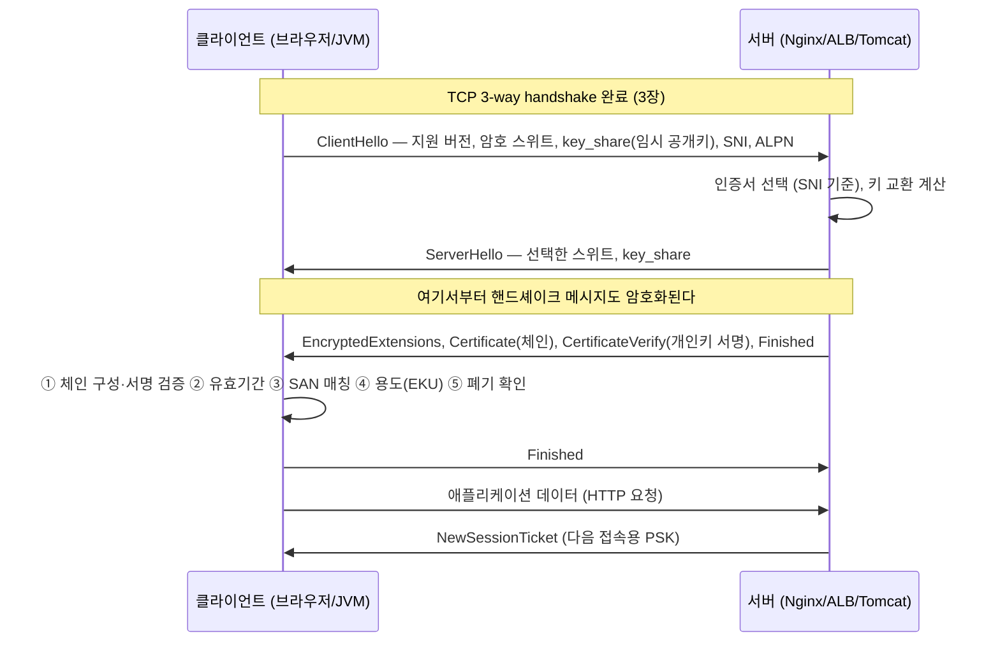
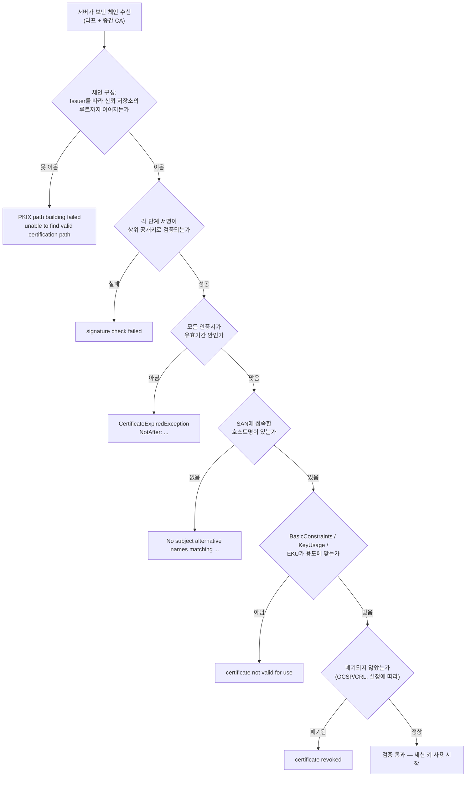

# 06. TLS/HTTPS — 인증서, 핸드셰이크, 인증서 체인

> 관련 문서: [실습](./06-TLS-실습.md) · 이전 장 [05. HTTP](./05-HTTP-이론.md)

## 1. 한 줄 요약

TLS는 TCP 위에서 ① 서버(필요하면 클라이언트)의 신원을 X.509 인증서로 검증하고, ② 키 교환으로 세션 키를 합의한 뒤, ③ 레코드 단위로 기밀성과 무결성을 제공하는 프로토콜이며, HTTPS는 그 위에 HTTP 메시지를 실어 나르는 것이다.

## 2. 왜 필요한가

평문 HTTP는 경로상의 모든 장비가 세 가지를 할 수 있다.

| 위협 | 내용 | TLS의 대응 |
|---|---|---|
| 도청 (Eavesdropping) | 요청·응답 전체를 읽는다. 쿠키, `Authorization` 헤더, 비밀번호 포함 | 대칭키 암호화로 **기밀성** |
| 변조 (Tampering) | 응답 본문이나 헤더를 바꿔치기한다. 스크립트 삽입, 리다이렉트 | AEAD 인증 태그로 **무결성** |
| 위장 (Impersonation) | 서버인 척하고 응답한다 | 인증서로 **신원 인증(Authentication)** |

**암호화만으로는 부족하다.** 상대가 누구인지 모른 채 키를 교환하면, 중간자가 양쪽과 각각 키를 교환해서 그대로 중계할 수 있다. 그래서 "이 공개키가 정말 `api.example.com`의 것인가"를 확인할 수단이 필요하고, 그것이 **공개키 기반구조(PKI)와 인증서**다. 신뢰의 출발점은 운영체제·브라우저·JVM이 미리 갖고 있는 **신뢰 저장소(Trust Store)**의 루트 CA 목록이다.

정리하면 TLS의 안전성은 암호 알고리즘보다 **"누구의 서명을 믿기로 했는가"**에 달려 있다. 백엔드에서 마주치는 TLS 문제의 대부분(`PKIX path building failed`, 인증서 만료, 이름 불일치)도 암호가 아니라 **신뢰 경로 구성**의 문제다.

## 3. 핵심 개념

| 용어 | 정의 |
|---|---|
| 대칭키 암호 (Symmetric Encryption) | 같은 키로 암·복호화. 빠르다. 실제 데이터 암호화에 사용 (AES-GCM, ChaCha20-Poly1305) |
| 공개키 암호 (Asymmetric Cryptography) | 공개키·개인키 쌍. 느리다. 키 교환과 서명에만 사용 (RSA, ECDSA, X25519) |
| 키 교환 (Key Exchange) | 도청당하는 채널에서 공통 세션 키를 만드는 절차. 현재는 (EC)DHE가 표준 |
| 전방향 비밀성 (PFS, Perfect Forward Secrecy) | 나중에 서버 개인키가 유출돼도 **과거 트래픽은 복호화되지 않는** 성질. ECDHE가 제공 |
| AEAD (Authenticated Encryption with Associated Data) | 암호화와 무결성 검증을 한 번에 하는 방식. TLS 1.3은 AEAD만 허용 |
| 세션 키 (Session Key) | 핸드셰이크로 합의한 대칭키. 커넥션 단위로 존재 |
| X.509 인증서 (Certificate) | 「이 공개키는 이 이름(Subject)의 것」이라는 **CA의 서명이 붙은 문서** |
| 주체 / 발급자 (Subject / Issuer) | 인증서의 대상 / 서명한 CA. 체인은 Issuer를 따라 위로 올라간다 |
| SAN (Subject Alternative Name) | 이 인증서가 유효한 호스트명·IP 목록. **현재 호스트명 검증은 SAN만 본다**(CN은 사용하지 않음, RFC 6125) |
| CA (Certificate Authority) | 인증서를 발급·서명하는 주체. 루트 CA와 중간 CA로 나뉜다 |
| 인증서 체인 (Certificate Chain) | 서버 인증서 → 중간 CA → 루트 CA로 이어지는 서명 경로 |
| 신뢰 저장소 (Trust Store) | 내가 신뢰하기로 한 루트 CA 모음. JVM은 `cacerts`, OS는 시스템 저장소 |
| 키 저장소 (Key Store) | **내 개인키와 내 인증서**를 담는 저장소. 서버가 갖는다 |
| CSR (Certificate Signing Request) | 공개키와 신원 정보를 담아 CA에 서명을 요청하는 파일. 개인키는 절대 담기지 않는다 |
| SNI (Server Name Indication) | ClientHello에 담는 접속 대상 호스트명. 서버가 어떤 인증서를 줄지 고르는 근거 |
| 세션 재개 (Session Resumption) | 이전 핸드셰이크 결과를 재사용해 왕복을 줄이는 것. TLS 1.3은 PSK 기반 티켓 사용 |
| 폐기 (Revocation) | 유출·오발급된 인증서를 무효화. CRL, OCSP, OCSP Stapling |
| mTLS (Mutual TLS) | 서버뿐 아니라 클라이언트도 인증서를 제시해 서로 인증하는 방식 |
| HSTS (HTTP Strict Transport Security) | "이 도메인은 항상 HTTPS로만 접속하라"고 브라우저에 지시하는 응답 헤더 |

## 4. 동작 원리와 흐름

### 4-1. TLS 1.3 핸드셰이크 (1-RTT)



1. **[L4, 커널]** TCP 연결이 먼저 맺어진다([3장](./03-TCP-이론.md)). TLS는 그 위의 바이트 스트림을 쓴다.
2. **[L6, 사용자 공간]** 클라이언트가 ClientHello를 보낸다. 여기에 **SNI**(접속 대상 호스트명)와 **ALPN**(`h2`, `http/1.1` — [5장](./05-HTTP-이론.md))이 함께 들어간다. TLS 1.3은 키 교환용 임시 공개키(`key_share`)를 처음부터 같이 보내 왕복을 줄인다.
3. **[L6, 서버]** 서버는 **SNI를 보고 인증서를 고른다**. 한 IP에 여러 도메인을 서비스할 수 있는 이유다(9-7).
4. **[L6, 서버]** 서버가 `Certificate`로 **체인**(서버 인증서 + 중간 CA)을 보낸다. 루트 CA는 보내지 않는다. 클라이언트가 이미 갖고 있어야 한다.
5. **[L6, 서버]** `CertificateVerify`는 지금까지의 핸드셰이크 내용을 **서버 개인키로 서명**한 것이다. "인증서에 적힌 공개키에 대응하는 개인키를 실제로 갖고 있다"는 증명이며, 인증서만 복사해 온 공격자를 막는다.
6. **[L6, 클라이언트]** 검증을 수행한다(4-2). 하나라도 실패하면 경고(Alert)를 보내고 연결을 끊는다.
7. **[L7]** 이후 애플리케이션 데이터가 흐른다. HTTPS라면 여기서부터 HTTP 메시지다.
8. **[L6]** 서버가 `NewSessionTicket`을 준다. 다음 접속 때 이 티켓으로 핸드셰이크를 줄인다(세션 재개).

TLS 1.2는 여기에 왕복이 한 번 더 있다. ClientHello → ServerHello + Certificate → ClientKeyExchange → Finished 순이라 **2-RTT**다. 인증서도 평문으로 오간다.

### 4-2. 클라이언트가 인증서를 검증하는 순서



**이 순서를 외우면 TLS 오류 메시지를 보고 어디서 걸렸는지 바로 안다.** 9절의 함정은 모두 이 흐름의 특정 분기다.

### 4-3. 상태는 어디에 생기는가

| 상태 | 위치 | 생성 | 소멸 | 주의 |
|---|---|---|---|---|
| 세션 키 | 양쪽 **사용자 공간** (JSSE, OpenSSL) | 핸드셰이크 완료 | 커넥션 종료 | 커널이 아니다([1장](./01-OSI-TCPIP-이론.md)) |
| 세션 티켓/PSK | 클라이언트가 보관, 서버는 키로 복호 | `NewSessionTicket` | 티켓 수명(Nginx `ssl_session_timeout` 기본 5m) | 재개 성공률이 지연에 직결 |
| 서버 세션 캐시 | 서버 메모리 (`ssl_session_cache`) | 핸드셰이크 | 캐시 만료 | 서버가 여러 대면 공유되지 않아 재개율이 떨어진다 |
| OCSP 응답 | 서버 (스테이플링 캐시) | 주기적 갱신 | 응답 만료 | 갱신 실패 시 경고·지연 |
| 인증서·개인키 | 서버 디스크/Secret, LB 설정 | 발급 | 만료·교체 | **개인키 유출은 전부를 무효화한다** |
| 신뢰 저장소 | 클라이언트 (JVM `cacerts`, OS 저장소) | 설치·배포 | 이미지 교체 시 초기화 | 컨테이너 이미지 바꾸면 사설 CA가 사라진다(9-4) |

**TLS 종료(Termination) 지점이 곧 평문이 되는 지점**이다. CDN에서 종료하면 CDN↔원본 구간은 별도 TLS(또는 평문)다. 이 경계를 그려두지 않으면 "HTTPS인데 왜 평문이 보이냐"는 오해가 생긴다.

## 5. 구현 레벨 들여다보기

### TLS 레코드와 Alert

레코드 헤더는 5바이트다. `ContentType(1) + LegacyVersion(2) + Length(2)`.

| ContentType | 의미 |
|---|---|
| 20 | ChangeCipherSpec (TLS 1.3에서는 호환용) |
| 21 | **Alert** |
| 22 | Handshake |
| 23 | Application Data |

자주 보는 Alert 코드와 대응하는 상황:

| 코드 | 이름 | 흔한 원인 |
|---|---|---|
| 40 | `handshake_failure` | 프로토콜 버전·암호 스위트 불일치 (9-6) |
| 42 | `bad_certificate` | 인증서 파싱·형식 문제 |
| 45 | `certificate_expired` | 만료 (9-2) |
| 46 | `certificate_unknown` | 기타 인증서 오류 |
| 48 | `unknown_ca` | 체인을 신뢰 저장소까지 잇지 못함 (9-1, 9-4) |
| 112 | `unrecognized_name` | SNI로 온 이름을 서버가 모름 (9-7) |

Java 예외 메시지에 `Received fatal alert: unknown_ca`가 찍히면 **상대가 내 인증서를 믿지 못한 것**이고, 내가 상대를 못 믿으면 `PKIX path building failed`가 난다. 방향을 구분해야 한다.

### X.509 인증서의 주요 필드 (RFC 5280)

| 필드 | 의미 | 실무에서 보는 이유 |
|---|---|---|
| Serial Number | CA가 부여한 일련번호 | 폐기 목록 조회 키 |
| Signature Algorithm | 서명 알고리즘 (`sha256WithRSAEncryption`, `ecdsa-with-SHA256`) | SHA-1 서명은 현재 거부됨 |
| Issuer | 서명한 CA의 이름 | 체인 구성의 연결 고리 |
| Validity (Not Before / Not After) | 유효기간 | 만료 장애 (9-2) |
| Subject | 대상 이름 | 표시용. **검증에는 쓰지 않는다** |
| Subject Public Key Info | 공개키 | |
| **SAN** | 유효한 호스트명·IP 목록 | 호스트명 검증의 유일한 근거 (9-3) |
| BasicConstraints | `CA:TRUE/FALSE`, `pathlen` | 리프 인증서로 다른 인증서를 서명하지 못하게 막는다 |
| KeyUsage / ExtendedKeyUsage | 용도 (`digitalSignature`, `serverAuth`) | 용도가 안 맞으면 거부 |
| SKI / AKI | 주체·발급자 키 식별자 | 체인 구성 힌트 |
| AIA (Authority Information Access) | 발급자 인증서 URL, OCSP URL | **브라우저가 중간 CA를 대신 내려받는 근거** (9-1) |
| SCT | Certificate Transparency 서명 | 공개 CA 인증서의 CT 로그 등재 증명 |

### 파일 포맷

| 포맷 | 확장자 | 내용 |
|---|---|---|
| PEM | `.crt`, `.pem`, `.key` | Base64 텍스트. `-----BEGIN CERTIFICATE-----`. 여러 개를 이어 붙이면 체인 파일 |
| DER | `.der`, `.cer` | 바이너리 |
| PKCS#12 | `.p12`, `.pfx` | 개인키 + 인증서 체인을 하나로 묶은 컨테이너. **JDK 9+의 기본 키 저장소 형식** |
| JKS | `.jks` | Java 고유 레거시 형식 |

JVM의 기본 신뢰 저장소는 `$JAVA_HOME/lib/security/cacerts`이고 기본 비밀번호는 `changeit`이다.

### 서버 설정 (실제 지시어)

```nginx
# 리프 인증서 → 중간 CA 순으로 이어 붙인 "풀체인"을 지정한다. 루트는 넣지 않아도 된다
ssl_certificate     /etc/nginx/certs/fullchain.crt;
ssl_certificate_key /etc/nginx/certs/server.key;

ssl_protocols TLSv1.2 TLSv1.3;         # 기본값은 버전에 따라 다르다. 명시하는 편이 안전
ssl_prefer_server_ciphers off;         # TLS 1.3에서는 의미 없음
ssl_session_cache   shared:SSL:10m;    # 서버 측 세션 캐시. 기본 none
ssl_session_timeout 1h;                # 기본 5m
ssl_session_tickets on;                # 기본 on. 여러 대면 티켓 키 공유 필요

ssl_stapling on;                       # OCSP 응답을 서버가 대신 첨부 (기본 off)
ssl_stapling_verify on;
ssl_trusted_certificate /etc/nginx/certs/chain.crt;

add_header Strict-Transport-Security "max-age=31536000" always;   # HSTS

# mTLS가 필요할 때만
# ssl_client_certificate /etc/nginx/certs/client-ca.crt;
# ssl_verify_client on;
```

Spring Boot(Tomcat)에서 직접 TLS를 종료할 때:

```yaml
server:
  port: 8443
  ssl:
    enabled: true
    key-store: classpath:keystore.p12       # 내 개인키 + 인증서 체인 (KeyStore)
    key-store-type: PKCS12
    key-store-password: ${KEYSTORE_PASSWORD}
    key-alias: app
    enabled-protocols: TLSv1.2,TLSv1.3
    client-auth: none                        # mTLS면 need
```

Spring Boot 3.1+에서는 **SSL 번들**로 인증서를 선언하고 서버·클라이언트가 함께 참조할 수 있다.

```yaml
spring:
  ssl:
    bundle:
      pem:
        internal-ca:                          # 사설 CA를 신뢰하는 번들 (클라이언트용)
          truststore:
            certificate: classpath:ca.crt
server:
  ssl:
    bundle: server-cert                       # 서버 인증서 번들 이름
```

### JVM 관련 시스템 속성·보안 설정

| 항목 | 의미 |
|---|---|
| `-Djavax.net.ssl.trustStore`, `...trustStorePassword`, `...trustStoreType` | 신뢰 저장소 교체 |
| `-Djavax.net.ssl.keyStore...` | 클라이언트 인증서(mTLS) 지정 |
| `-Djavax.net.debug=ssl:handshake` | 핸드셰이크 로그 출력. **TLS 장애 1순위 진단 도구** |
| `-Dhttps.protocols`, `-Djdk.tls.client.protocols` | 클라이언트가 제안할 프로토콜 버전 |
| `java.security`의 `jdk.tls.disabledAlgorithms` | TLSv1, TLSv1.1은 최신 JDK에서 기본 비활성 |
| `java.security`의 `jdk.certpath.disabledAlgorithms` | SHA-1 서명, 1024비트 미만 RSA 등 거부 |
| `keytool -importcert -keystore ... -storetype PKCS12` | 사설 CA를 신뢰 저장소에 추가 |

### 인증서 발급 자동화

| 방식 | 대상 | 갱신 |
|---|---|---|
| ACME (Let's Encrypt, certbot, cert-manager) | 공개 도메인 | 자동. 유효기간 90일이라 자동화가 사실상 필수 |
| AWS ACM | ALB·CloudFront·API Gateway | 관리형. DNS 검증(CNAME) 후 자동 갱신 |
| 사내 CA (openssl, step-ca, Vault PKI) | 내부 서비스·mTLS | 직접 구축 |

ACME의 도메인 검증은 HTTP-01(특정 경로 응답)이나 DNS-01(TXT 레코드, [4장](./04-DNS-이론.md))로 한다.

## 6. 백엔드 코드와 만나는 지점

### 6-1. 예외 사전 — 메시지로 원인 확정하기

| 예외·메시지 | 검증 단계(4-2) | 원인 |
|---|---|---|
| `javax.net.ssl.SSLHandshakeException: PKIX path building failed: sun.security.provider.certpath.SunCertPathBuilderException: unable to find valid certification path to requested target` | 체인 구성 | 신뢰 저장소에 루트가 없거나(사설 CA), **서버가 중간 CA를 안 보냈다**(9-1, 9-4) |
| `java.security.cert.CertificateExpiredException: NotAfter: Mon Sep 01 ...` | 유효기간 | 만료 (9-2) |
| `java.security.cert.CertificateException: No subject alternative names matching IP address 10.0.2.20 found` | SAN | IP로 접속했는데 IP SAN이 없다 (9-3) |
| `java.security.cert.CertificateException: No name matching db.internal found` | SAN | 이름이 SAN에 없다 (9-3) |
| `javax.net.ssl.SSLPeerUnverifiedException: Hostname api.example.com not verified` | SAN | 위와 같음. 라이브러리에 따라 다른 예외 |
| `javax.net.ssl.SSLHandshakeException: Received fatal alert: handshake_failure` | 핸드셰이크 | 프로토콜·암호 스위트 불일치 (9-6) |
| `javax.net.ssl.SSLHandshakeException: Received fatal alert: unknown_ca` | 상대편 검증 | **상대가 내 인증서를 못 믿는다.** mTLS에서 흔하다 |
| `javax.net.ssl.SSLException: Unsupported or unrecognized SSL message` | – | 평문 포트에 TLS로 접속했다(또는 그 반대) |
| `javax.net.ssl.SSLHandshakeException: No appropriate protocol (protocol is disabled or cipher suites are inappropriate)` | – | JDK에서 해당 TLS 버전이 비활성 (9-6) |
| `org.postgresql.util.PSQLException: SSL error: PKIX path building failed...` | 체인 구성 | JDBC에서 `sslmode=verify-full` + 루트 미등록 |
| curl `(60) SSL certificate problem: unable to get local issuer certificate` | 체인 구성 | Java의 PKIX 오류와 같은 원인 |

**진단 명령 하나**: `-Djavax.net.debug=ssl:handshake`를 켜면 어떤 인증서를 받았고 어디서 끊겼는지 로그로 나온다. 운영에서는 임시로만 켠다(로그량이 많다).

### 6-2. 사설 CA를 신뢰하게 만들기 (금지 사항 포함)

내부 서비스가 사내 CA 인증서를 쓰면 JVM이 모른다. 해결 방법은 세 가지이고, **네 번째(검증 끄기)는 금지**다.

```java
import java.net.URI;
import java.net.http.HttpClient;
import java.net.http.HttpRequest;
import java.net.http.HttpResponse;
import java.time.Duration;

import org.springframework.boot.ssl.SslBundles;
import org.springframework.context.annotation.Bean;
import org.springframework.context.annotation.Configuration;
import org.springframework.http.client.JdkClientHttpRequestFactory;
import org.springframework.web.client.RestClient;

/**
 * 사내 CA로 발급한 인증서를 쓰는 내부 API를 호출하는 클라이언트.
 * Spring Boot 3.1+의 SSL 번들(spring.ssl.bundle.pem.internal-ca)을 사용한다.
 * (Java 8 / Spring 5 환경이면 Apache HttpClient의 SSLContextBuilder.loadTrustMaterial(trustStoreFile, password)로 같은 일을 한다)
 */
@Configuration
public class InternalApiClientConfig {

    @Bean
    public RestClient internalApiClient(RestClient.Builder builder, SslBundles sslBundles) {
        HttpClient httpClient = HttpClient.newBuilder()
                // 신뢰 저장소만 교체한다. 검증 자체는 그대로 수행된다
                .sslContext(sslBundles.getBundle("internal-ca").createSslContext())
                .connectTimeout(Duration.ofSeconds(3))
                .build();

        return builder
                .baseUrl("https://internal-api.corp.example")
                .requestFactory(new JdkClientHttpRequestFactory(httpClient))
                .build();
    }
}
```

| 방법 | 적용 범위 | 비고 |
|---|---|---|
| SSL 번들 / 커스텀 `SSLContext` | 해당 클라이언트만 | 가장 범위가 좁아 안전하다 |
| `-Djavax.net.ssl.trustStore=/etc/pki/truststore.p12` | JVM 전체 | 공개 CA도 함께 담아야 외부 호출이 깨지지 않는다 |
| 컨테이너 이미지에서 `keytool -importcert`로 `cacerts`에 추가 | JVM 전체 | 베이스 이미지 교체 시 사라진다(9-4) |
| ~~`TrustManager`에서 모든 인증서 허용~~ | – | **금지.** MITM을 스스로 허용하는 코드다. 테스트 코드에도 남기지 않는다 |

### 6-3. PostgreSQL과 TLS

```yaml
spring:
  datasource:
    # sslmode 기본값은 prefer: 암호화는 하지만 인증서를 검증하지 않는다 → MITM 방어가 안 된다
    # verify-full: 체인 검증 + 호스트명 검증까지 (운영 권장)
    url: jdbc:postgresql://db.internal:5432/app?sslmode=verify-full&sslrootcert=/etc/pki/rds-ca.pem
```

| `sslmode` | 암호화 | 인증서 검증 | 호스트명 검증 |
|---|---|---|---|
| `disable` | 없음 | – | – |
| `prefer`(기본), `require` | 있음 | 없음 | 없음 |
| `verify-ca` | 있음 | 있음 | 없음 |
| `verify-full` | 있음 | 있음 | 있음 |

AWS RDS를 쓰면 리전별 루트 인증서 번들을 받아 `sslrootcert`로 지정한다. **RDS 루트 인증서에도 만료가 있다**(과거 rds-ca-2019 → rds-ca-rsa2048-g1 교체 때 대규모 갱신이 필요했다). 만료 일정은 AWS 공지를 확인한다(확인 필요).

### 6-4. TLS 종료 위치와 애플리케이션 설정

ALB·Nginx가 TLS를 종료하면 앱은 평문 HTTP를 받는다. 이때 세 가지가 어긋나기 쉽다.

```yaml
server:
  forward-headers-strategy: native     # X-Forwarded-Proto를 반영해 request.isSecure()가 올바르게 동작
server:
  servlet:
    session:
      cookie:
        secure: true                   # HTTPS 전용 쿠키. 앱이 평문으로 보이면 판단을 못 한다
```

- `X-Forwarded-Proto`를 반영하지 않으면 앱이 "나는 HTTP다"라고 판단해 HTTPS로 리다이렉트하고, LB는 다시 HTTP로 전달해 **리다이렉트 루프**가 생긴다(9-5).
- Spring Security의 `requiresChannel().anyRequest().requiresSecure()`도 같은 헤더에 의존한다.
- JWT를 쓰더라도 전송 보안은 TLS의 몫이다. 토큰은 탈취되면 그대로 재사용되므로, 평문 구간이 있으면 인증 체계 전체가 무력화된다.

### 6-5. 성능에 드러나는 TLS

- 핸드셰이크는 **CPU(서명·키 교환)와 RTT**를 함께 쓴다. `curl -w '%{time_connect} %{time_appconnect}'`로 TCP 연결 시간과 TLS 완료 시간을 나눠 볼 수 있다.
- 커넥션을 재사용하면 핸드셰이크가 없다. [3장 6-4](./03-TCP-이론.md)의 커넥션 풀이 TLS에서 더 중요해지는 이유다.
- 세션 재개가 되면 1-RTT가 0-RTT 수준으로 줄어든다. 서버가 여러 대인데 세션 캐시·티켓 키가 공유되지 않으면 재개가 실패한다.

## 7. 유사 개념과의 비교

### TLS 1.2 vs TLS 1.3

| 항목 | TLS 1.2 | TLS 1.3 |
|---|---|---|
| 핸드셰이크 왕복 | 2-RTT | **1-RTT**, 재개 시 0-RTT |
| 암호 스위트 | 키교환+인증+암호+해시 조합 (수십 가지) | AEAD 조합만 (5가지) |
| PFS | 선택 (RSA 키 교환 가능) | **필수** (ECDHE만) |
| 인증서 전송 | 평문 | 암호화 |
| 취약 알고리즘 | RC4, CBC, SHA-1 등 존재 | 제거 |

### 인증서 종류

| 종류 | 신뢰 근거 | 용도 | 주의 |
|---|---|---|---|
| 자체 서명 (Self-signed) | 없음 (자기가 자기를 서명) | 로컬 개발, 테스트 | 클라이언트마다 예외 등록이 필요해 확장성이 없다 |
| 사설 CA 발급 | 조직이 배포한 루트 | 내부 서비스, mTLS | **CA 개인키 보관이 전부**다. 유출되면 모든 내부 통신이 위조 가능 |
| 공개 CA 발급 (DV) | 브라우저·OS 기본 신뢰 | 공개 웹 | ACME로 자동 갱신 |

### TLS 종료 위치

| 위치 | 장점 | 단점 | 선택 기준 |
|---|---|---|---|
| CDN | 사용자와 가까워 핸드셰이크 RTT 최소, h3 지원 | 원본 구간 보호를 따로 설계해야 함 | 공개 웹 |
| ALB / Nginx | 인증서 한곳 관리, 앱은 평문 처리로 단순 | LB↔앱 구간이 평문이면 내부 도청에 노출 | 대부분의 서비스 |
| 애플리케이션(Tomcat) | 종단 간 암호화 | 인스턴스마다 인증서 배포·갱신 필요, CPU 부담 | 규제 요구, mTLS |

## 8. 표준·버전별 변천

| 시기 | 사건 | 실무 영향 |
|---|---|---|
| 1995~1996 | SSL 2.0 / 3.0 | 현재 모두 폐기. "SSL 인증서"라는 말만 관용적으로 남음 |
| 1999 / 2006 / 2008 | TLS 1.0 / 1.1 / 1.2 (RFC 5246) | 1.2가 오랫동안 주력 |
| 2014 | Heartbleed (OpenSSL), POODLE (SSL 3.0) | 긴급 패치와 키 교체 경험. 개인키 유출 대응 절차의 계기 |
| 2015~ | Let's Encrypt, ACME | 무료·자동 발급. 유효기간 90일이 표준이 됨 |
| 2017 | SHA-1 서명 인증서 거부 | 구형 인증서 일괄 교체 |
| 2018 | **TLS 1.3 (RFC 8446)**, CT 로그 의무화 | 1-RTT, PFS 필수 |
| 2020 | 공개 인증서 최대 유효기간 398일로 단축 | 수동 갱신은 사실상 불가능해짐 |
| 2021 | JDK에서 TLS 1.0/1.1 기본 비활성 (8u291, 11.0.11 등) | 레거시 서버 연동 시 `handshake_failure` |
| 2023~ | 공개 인증서 수명을 단계적으로 더 줄이는 방향 논의·결정 | 자동 갱신 체계가 없는 조직은 반복적으로 장애를 겪는다 (확인 필요 — CA/Browser Forum 최신 결정 확인) |

## 9. 함정과 장애 패턴

### 9-1. 중간 인증서 누락 — "브라우저는 되는데 서버에서만 실패"

- **증상**: 브라우저로 열면 정상인데, Spring Boot 앱이나 `curl`에서만 `PKIX path building failed` / `unable to get local issuer certificate`. 특정 클라이언트에서만 실패한다.
- **원인**: 서버가 **리프 인증서만** 보내고 중간 CA를 빼먹었다. 브라우저는 인증서의 **AIA 확장에 적힌 URL로 중간 CA를 대신 내려받거나 캐시에 갖고 있어서** 성공한다. Java·curl은 그런 보완을 하지 않는다(Java는 기본적으로 AIA 조회를 하지 않는다).
- **확인 방법**:
  - `openssl s_client -connect host:443 -servername host -showcerts </dev/null` → `Certificate chain` 아래 인증서가 **몇 개** 오는지 센다. 1개면 체인 누락이다.
  - `openssl s_client ... </dev/null 2>/dev/null | openssl x509 -noout -issuer -subject`로 리프의 Issuer와 받은 체인을 비교한다.
  - 공개 서비스라면 SSL Labs 같은 검사 도구가 "Chain issues: Incomplete"로 알려준다.
- **해결**: `ssl_certificate`에 **리프 + 중간**을 이어 붙인 풀체인 파일을 지정한다(순서 중요: 리프가 먼저). ACME 도구는 보통 `fullchain.pem`을 만들어 준다. 루트는 넣을 필요가 없다.

### 9-2. 인증서 만료

- **증상**: 어느 시각부터 **모든** 클라이언트가 동시에 실패한다. `CertificateExpiredException`, 브라우저 경고 화면. 배포한 것도 없는데 장애가 난다.
- **원인**: 갱신 자동화가 없거나, 자동 갱신은 됐는데 **서비스가 새 인증서를 읽지 않았다**(Nginx reload 누락, 컨테이너에 옛 파일이 그대로, LB에 적용 안 됨). 중간 CA나 클라이언트 인증서(mTLS)가 만료되는 경우도 있다.
- **확인 방법**:
  - `openssl s_client -connect host:443 -servername host </dev/null 2>/dev/null | openssl x509 -noout -dates -subject`
  - 파일로: `openssl x509 -in cert.crt -noout -enddate`
  - 만료 임박 점검(스크립트용): `openssl x509 -in cert.crt -checkend 2592000` → 30일 내 만료면 종료 코드 1.
  - 실제 서비스가 **어떤** 인증서를 쓰는지 확인한다. 디스크의 파일과 서버가 제시하는 인증서가 다를 수 있다.
- **해결**: ACM·cert-manager·certbot으로 자동 갱신하고, 갱신 후 reload까지 자동화한다. 만료 30일·7일 알림을 모니터링에 넣는다. 인증서 인벤토리(도메인, 만료일, 갱신 주체)를 문서로 유지한다.

### 9-3. 호스트명 불일치

- **증상**: `No subject alternative names matching IP address 10.0.2.20 found` 또는 `No name matching db.internal found`. 같은 서버에 도메인으로 접속하면 되는데 IP로는 안 된다.
- **원인**: 검증은 **SAN 목록**만 본다. IP로 접속하려면 IP SAN이 있어야 하고, 내부 DNS 이름(`db.internal`)으로 접속하려면 그 이름이 SAN에 있어야 한다. CN에만 이름이 있는 옛 인증서는 현재 클라이언트에서 거부된다.
- **확인 방법**: `openssl x509 -in cert.crt -noout -text | grep -A1 'Subject Alternative Name'`, 또는 서버에서 직접 `openssl s_client ... | openssl x509 -noout -ext subjectAltName`.
- **해결**: 접속에 쓰는 **모든 이름**을 SAN에 넣어 재발급한다. 쿠버네티스라면 Service 이름·FQDN·클러스터 도메인까지 포함한다. IP 접속이 꼭 필요하면 IP SAN을 넣되, IP가 바뀌는 환경에서는 이름 접속으로 바꾸는 편이 낫다.

### 9-4. 컨테이너 이미지를 바꿨더니 사설 CA를 잃어버렸다

- **증상**: 코드 변경이 없는데 배포 후 내부 API 호출이 전부 `PKIX path building failed`. 이전 이미지로 롤백하면 정상.
- **원인**: 사설 CA를 베이스 이미지의 `cacerts`에 `keytool`로 주입해 뒀는데, 베이스 이미지(또는 JDK 버전)를 올리면서 그 단계가 빠졌다. 또는 OS 신뢰 저장소에만 넣고 JVM에는 반영하지 않았다(**JVM은 OS 저장소를 쓰지 않는다**).
- **확인 방법**:
  - 컨테이너 안에서 `keytool -list -cacerts -storepass changeit | grep -i <별칭>`
  - `-Djavax.net.debug=ssl:handshake`로 받은 체인과 신뢰 여부 확인.
  - 이미지 빌드 로그에서 CA 주입 단계가 실행됐는지.
- **해결**: CA 신뢰를 **이미지 빌드에 의존하지 않게** 만든다. 신뢰 저장소를 Secret·ConfigMap으로 마운트하고 `-Djavax.net.ssl.trustStore`로 가리키거나, Spring Boot SSL 번들로 애플리케이션 설정에 둔다(6-2). 이미지 빌드에서 주입한다면 그 단계에 테스트를 붙인다.

### 9-5. TLS 종료 뒤의 리다이렉트 루프

- **증상**: ALB 뒤에 앱을 두자 브라우저가 `ERR_TOO_MANY_REDIRECTS`. 또는 로그인 쿠키가 저장되지 않는다.
- **원인**: 앱이 자기 요청을 평문 HTTP로 인식해 HTTPS로 리다이렉트하는데, LB는 그 리다이렉트를 받은 클라이언트를 다시 평문으로 앱에 전달한다. `X-Forwarded-Proto`를 반영하지 않아서다. 쿠키의 `Secure` 속성 판단도 같은 이유로 틀어진다.
- **확인 방법**:
  - `curl -I https://host/` → `Location` 헤더가 같은 URL로 반복되는지.
  - 앱에 도달한 요청의 헤더 확인(`X-Forwarded-Proto: https`가 오는가).
  - Spring이라면 `request.isSecure()`, `request.getScheme()` 로깅.
- **해결**: `server.forward-headers-strategy: native`(또는 `framework`)를 켜고, 신뢰할 프록시 대역을 좁힌다([1장 9-5](./01-OSI-TCPIP-이론.md)). LB에서 HTTP→HTTPS 리다이렉트를 처리하고 앱에서는 하지 않는 방법도 명확하다.

### 9-6. 프로토콜·암호 스위트 불일치

- **증상**: `Received fatal alert: handshake_failure` 또는 `No appropriate protocol (protocol is disabled or cipher suites are inappropriate)`. 특정 레거시 시스템 연동에서만 발생하거나, JDK를 올린 뒤 발생한다.
- **원인**: 양쪽이 공통으로 쓸 수 있는 버전·스위트가 없다. 최신 JDK는 TLS 1.0/1.1을 기본 비활성화했고, 최신 서버는 구식 스위트를 제거했다. 반대로 상대가 TLS 1.0만 지원하는 옛 장비일 수도 있다.
- **확인 방법**:
  - `openssl s_client -connect host:443 -tls1_2` / `-tls1_3`로 어떤 버전이 되는지 하나씩.
  - `-Djavax.net.debug=ssl:handshake`에서 제안한 스위트와 서버 응답 확인.
  - `nmap --script ssl-enum-ciphers -p 443 host`로 서버 지원 목록 확인(권한 있는 대상에만).
- **해결**: 가능하면 상대를 TLS 1.2 이상으로 올린다. 불가피하게 레거시와 연동해야 하면 그 호출 전용으로 프로토콜을 낮춘 클라이언트를 분리하고, 전역 JVM 설정은 건드리지 않는다.

### 9-7. SNI 문제 — 엉뚱한 인증서를 받는다

- **증상**: 같은 IP에 여러 도메인이 올라간 서버에서 이름 불일치 오류가 난다. 브라우저는 정상인데 특정 클라이언트에서만 실패한다.
- **원인**: 클라이언트가 SNI를 보내지 않으면 서버는 **기본 서버 블록의 인증서**를 준다. IP로 접속할 때, 아주 오래된 클라이언트, 또는 프록시가 SNI를 재작성하는 경우에 생긴다.
- **확인 방법**: `openssl s_client -connect host:443` (SNI 없음)과 `-servername api.example.com` (SNI 있음)을 비교해 서로 다른 인증서가 오는지 본다.
- **해결**: 이름으로 접속하게 한다. 프록시·게이트웨이가 업스트림으로 갈 때 SNI를 보내도록 설정한다(Nginx `proxy_ssl_server_name on;`, 기본 off).

### 9-8. 핸드셰이크 비용이 그대로 지연·CPU가 된다

- **증상**: 트래픽이 늘자 TLS 종단(Nginx·ALB·앱)의 CPU가 먼저 포화된다. 외부 API 호출의 p99가 유난히 크다.
- **원인**: 커넥션을 재사용하지 않아 요청마다 핸드셰이크를 한다([3장 9-1](./03-TCP-이론.md)). 세션 재개가 동작하지 않는다(서버가 여러 대인데 세션 캐시·티켓 키 미공유). OCSP 스테이플링이 꺼져 있어 클라이언트가 매번 OCSP 응답자에 질의한다.
- **확인 방법**:
  - `curl -w 'connect=%{time_connect} tls=%{time_appconnect} total=%{time_total}\n' -o /dev/null -s https://host/`를 반복해 `tls` 구간 비중을 본다.
  - `openssl s_client -connect host:443 -reconnect`의 출력에서 `Reused` 여부 확인.
  - 서버 CPU 프로파일에서 서명·키 교환 비중.
- **해결**: 커넥션 풀·keep-alive를 먼저 확인한다. 세션 캐시와 티켓 키를 인스턴스 간 공유하고, OCSP 스테이플링을 켠다. ECDSA 인증서는 RSA보다 서명 연산이 가볍다.

## 10. 실무 적용 시나리오

- **인증서 인벤토리 만들기**: 도메인, 발급 CA, 만료일, 갱신 주체(ACM/cert-manager/수동), 적용 지점(CDN·LB·앱·DB)을 표로 유지한다. 장애의 대부분은 "아무도 자기 것이라고 생각하지 않은 인증서"에서 난다.
- **신규 서비스 TLS 설계**: 어디서 종료할지(7절 표) → 인증서 발급 경로 → 갱신 자동화 → 내부 구간 암호화 여부(mTLS) 순으로 정한다.
- **내부 서비스 사설 CA 운영**: CA 개인키는 오프라인·HSM·Vault에 두고, 중간 CA로만 발급한다. 신뢰 저장소 배포 방법(이미지·Secret·설정)을 표준화한다.
- **보안 점검 대응**: TLS 1.0/1.1 비활성, 취약 스위트 제거, HSTS 적용 여부가 단골 항목이다. 변경 전에 레거시 클라이언트 영향도를 확인한다(9-6).
- **장애 대응 순서**: ① 만료인가(`-dates`) → ② 체인이 완전한가(`-showcerts`) → ③ 이름이 맞는가(SAN) → ④ 신뢰 저장소에 CA가 있는가 → ⑤ 프로토콜·스위트가 맞는가. 이 순서가 4-2 흐름도와 같다.

## 11. 보안·비용 고려사항

- **개인키 관리**: 파일 권한 최소화(600), 저장소에 커밋 금지, Secret·KMS·Vault 사용. 유출이 의심되면 **폐기(revoke) + 재발급 + 키 교체**를 함께 해야 한다. 폐기는 즉시 전파되지 않으므로(CRL·OCSP 캐시), 짧은 수명의 인증서가 실질적인 방어다.
- **검증 비활성화 금지**: `TrustAllCerts`, `curl -k`, `verify=False`는 "암호화는 되지만 누구와 통신하는지 모르는" 상태다. 2절의 위협 중 위장·변조가 그대로 살아난다. 테스트 편의로 넣은 코드가 운영에 남는 사고가 반복된다.
- **HSTS**: 적용하면 브라우저가 해당 도메인을 HTTPS로만 접속한다. `max-age`를 길게 잡고 인증서가 만료되면 사용자가 우회할 방법이 없다. 서브도메인 포함(`includeSubDomains`)과 preload는 되돌리기 어려우므로 단계적으로 적용한다.
- **인증서 고정(Pinning)**: 특정 인증서·공개키만 허용해 MITM을 막지만, 갱신 시 앱을 함께 배포하지 않으면 전면 장애가 된다. 모바일 앱처럼 통제된 환경에서만 신중하게 쓴다.
- **Certificate Transparency**: 공개 CA가 발급한 인증서는 CT 로그에 기록된다. 우리 도메인에 대해 의도하지 않은 인증서가 발급되면 감시 서비스로 탐지할 수 있다.
- **비용**: AWS ACM은 ALB·CloudFront에 쓰는 공개 인증서를 무료로 발급·갱신한다(사설 CA 서비스는 유료, 작성 시점 기준 — https://aws.amazon.com/certificate-manager/pricing/ 확인 필요). Let's Encrypt는 무료다. 실제 비용은 인증서 값보다 **갱신 실패로 인한 장애**와 그 대응에 드는 시간이다.

## 12. 자가 점검 질문

**Q1.** 브라우저에서는 자물쇠가 정상인데 Spring Boot 앱에서만 `PKIX path building failed`가 난다. 가장 먼저 무엇을 확인하겠는가?

<details><summary>답</summary>

서버가 보내는 **체인이 완전한지** 확인한다. `openssl s_client -connect host:443 -servername host -showcerts </dev/null`로 받은 인증서 개수를 세어 리프만 오는지 본다. 브라우저는 AIA 확장으로 중간 CA를 보완하지만 Java는 그러지 않기 때문에 이 차이가 생긴다(9-1). 체인이 완전하다면 다음으로 JVM 신뢰 저장소에 루트 CA가 있는지(사설 CA인 경우) 확인한다(9-4).
</details>

**Q2.** `CertificateVerify` 메시지는 왜 필요한가? 인증서만으로는 왜 부족한가?

<details><summary>답</summary>

인증서는 공개된 정보라 누구나 복사할 수 있다. `CertificateVerify`는 지금까지의 핸드셰이크 기록을 **서버 개인키로 서명**한 것이라, 인증서에 적힌 공개키에 대응하는 개인키를 실제로 보유하고 있음을 증명한다. 이것이 없으면 남의 인증서를 그대로 제시하는 공격이 가능하다.
</details>

**Q3.** 사설 CA로 발급한 인증서를 쓰는 내부 API를 호출해야 한다. 선택지 세 가지와 각각의 범위는?

<details><summary>답</summary>

① 해당 클라이언트에만 커스텀 `SSLContext`/SSL 번들 적용 — 범위가 가장 좁아 안전하다. ② `-Djavax.net.ssl.trustStore`로 JVM 전체 신뢰 저장소 교체 — 공개 CA도 함께 담아야 외부 호출이 깨지지 않는다. ③ 이미지 빌드 시 `cacerts`에 `keytool`로 주입 — 베이스 이미지 교체 시 사라질 수 있다(9-4). 검증을 끄는 네 번째 선택지는 금지다(11절).
</details>

**Q4.** TLS 1.3이 TLS 1.2보다 빠른 이유를 두 가지 말하라.

<details><summary>답</summary>

① 핸드셰이크가 1-RTT다. 클라이언트가 ClientHello에 키 교환용 공개키(`key_share`)를 미리 담아 보내서 왕복이 한 번 줄었다. ② 재방문 시 PSK 기반 세션 재개로 0-RTT 데이터 전송까지 가능하다(다만 0-RTT는 재전송 공격 위험이 있어 멱등 요청에만 써야 한다). 부수적으로 취약한 알고리즘을 제거해 협상 과정 자체가 단순해졌다.
</details>

**Q5.** 어느 날 갑자기 모든 클라이언트에서 HTTPS 접속이 실패한다. 배포는 없었다. 확인 순서는?

<details><summary>답</summary>

4-2의 검증 흐름을 따라간다. ① `openssl s_client ... | openssl x509 -noout -dates`로 **만료**부터 확인한다(배포 없이 동시에 전부 실패하는 가장 흔한 원인이다). ② `-showcerts`로 체인 구성 확인 — 갱신 과정에서 중간 CA가 빠졌을 수 있다. ③ 서버가 실제로 새 파일을 읽었는지(`reload` 여부) 확인한다. 디스크 파일과 제시되는 인증서가 다를 수 있다. ④ 클라이언트 쪽 변화(신뢰 저장소 갱신, JDK 업데이트로 인한 알고리즘 비활성)도 함께 본다. ⑤ 중간 CA·루트 CA 자체의 만료도 드물지만 실제로 일어난다.
</details>

## 13. 참고 자료

- RFC 8446 — The Transport Layer Security (TLS) Protocol Version 1.3
- RFC 5246 — TLS 1.2 (역사적 참고)
- RFC 5280 — X.509 Certificate and CRL Profile
- RFC 6125 — Representation and Verification of Domain-Based Application Service Identity (호스트명 검증 규칙)
- RFC 6960 — OCSP, RFC 6961/RFC 8446 — OCSP Stapling
- RFC 6797 — HTTP Strict Transport Security (HSTS)
- RFC 7301 — ALPN, RFC 6066 — TLS Extensions (SNI)
- RFC 8555 — Automatic Certificate Management Environment (ACME)
- OpenSSL 문서 — `s_client(1)`, `x509(1)`, `verify(1)`, `req(1)`, `ca(1)`
- Oracle JDK 문서 — JSSE Reference Guide, `keytool` 매뉴얼, `java.security` 파일 주석
- Nginx 문서 — `ngx_http_ssl_module`(`ssl_certificate`, `ssl_stapling`, `ssl_session_cache`)
- Spring Boot 문서 — SSL Bundles, Common Application Properties(`server.ssl.*`)
- PostgreSQL 문서 — 34.19 SSL Support (`sslmode`, `sslrootcert`)
- AWS 문서 — ACM, ALB HTTPS 리스너, RDS 인증서 번들 갱신 공지
- Ivan Ristić, *Bulletproof TLS and PKI* (2nd ed.) — 1~3장(프로토콜), 4장(PKI), 8~9장(운영·성능)

## 부록: 용어 정리

| 용어 | 영문 | 설명 |
|---|---|---|
| TLS | Transport Layer Security | TCP 위에서 인증·기밀성·무결성을 제공하는 프로토콜 |
| HTTPS | HTTP over TLS | TLS 위로 HTTP 메시지를 주고받는 것 |
| 도청 | Eavesdropping | 경로상에서 평문 트래픽을 읽는 행위 |
| 변조 | Tampering | 전송 중 데이터를 바꾸는 행위 |
| 위장 | Impersonation | 서버인 척 응답하는 행위 |
| PKI | Public Key Infrastructure | 인증서와 CA로 공개키의 소유자를 보증하는 체계 |
| 대칭키 암호 | Symmetric Encryption | 같은 키로 암·복호화하는 빠른 암호, 실제 데이터에 사용 |
| 공개키 암호 | Asymmetric Cryptography | 공개키·개인키 쌍을 쓰는 암호, 키 교환과 서명에 사용 |
| 키 교환 | Key Exchange | 도청 가능한 채널에서 공통 세션 키를 만드는 절차 |
| ECDHE | Elliptic Curve Diffie-Hellman Ephemeral | 임시 키를 쓰는 타원곡선 키 교환, PFS를 제공 |
| 전방향 비밀성 | PFS (Perfect Forward Secrecy) | 개인키가 나중에 유출돼도 과거 트래픽이 지켜지는 성질 |
| AEAD | Authenticated Encryption with Associated Data | 암호화와 무결성 검증을 함께 수행하는 방식 |
| 세션 키 | Session Key | 핸드셰이크로 합의한 커넥션 단위 대칭키 |
| X.509 인증서 | X.509 Certificate | 공개키와 이름을 CA 서명으로 묶은 문서 |
| 주체 / 발급자 | Subject / Issuer | 인증서의 대상 / 서명한 CA |
| SAN | Subject Alternative Name | 인증서가 유효한 호스트명·IP 목록, 호스트명 검증의 근거 |
| CA | Certificate Authority | 인증서를 발급·서명하는 주체 |
| 루트 CA / 중간 CA | Root CA / Intermediate CA | 신뢰의 최상위 / 실제 발급을 담당하는 하위 CA |
| 인증서 체인 | Certificate Chain | 리프에서 루트까지 이어지는 서명 경로 |
| 신뢰 저장소 | Trust Store | 신뢰하는 루트 CA 모음, JVM은 `cacerts` |
| 키 저장소 | Key Store | 내 개인키와 인증서를 담는 저장소 |
| CSR | Certificate Signing Request | 공개키와 신원 정보를 담아 서명을 요청하는 파일 |
| SNI | Server Name Indication | ClientHello에 담기는 접속 대상 호스트명 |
| ALPN | Application-Layer Protocol Negotiation | TLS 핸드셰이크에서 HTTP 버전을 고르는 확장 |
| ClientHello / ServerHello | ClientHello / ServerHello | 핸드셰이크 시작 시 능력과 선택을 교환하는 메시지 |
| CertificateVerify | CertificateVerify | 개인키로 핸드셰이크를 서명해 키 소유를 증명하는 메시지 |
| Finished | Finished | 핸드셰이크 무결성을 확인하는 마지막 메시지 |
| 세션 재개 | Session Resumption | 이전 핸드셰이크 결과를 재사용해 왕복을 줄이는 것 |
| 세션 티켓 | Session Ticket | 서버가 암호화해 클라이언트에 맡기는 재개용 상태 |
| 0-RTT | Zero Round Trip Time | 재개 시 첫 왕복 없이 데이터를 보내는 기능, 재전송 위험 존재 |
| Alert | TLS Alert | 오류·종료를 알리는 TLS 레코드, `unknown_ca` 등 |
| BasicConstraints | BasicConstraints | CA 여부와 하위 경로 길이를 제한하는 인증서 확장 |
| KeyUsage / EKU | Key Usage / Extended Key Usage | 키의 허용 용도(`serverAuth` 등)를 지정하는 확장 |
| AIA | Authority Information Access | 발급자 인증서·OCSP 위치를 알려주는 확장 |
| CT | Certificate Transparency | 발급된 인증서를 공개 로그에 기록해 감시 가능하게 하는 체계 |
| 폐기 | Revocation | 유출·오발급 인증서를 무효화하는 절차 |
| CRL / OCSP | Certificate Revocation List / Online Certificate Status Protocol | 폐기 목록 배포 / 실시간 폐기 상태 조회 |
| OCSP 스테이플링 | OCSP Stapling | 서버가 OCSP 응답을 미리 받아 핸드셰이크에 첨부하는 기법 |
| PEM / DER | PEM / DER | Base64 텍스트 / 바이너리 인증서 인코딩 |
| PKCS#12 | PKCS#12 | 개인키와 체인을 함께 담는 컨테이너 형식(`.p12`) |
| JKS | Java KeyStore | Java 고유의 레거시 키 저장소 형식 |
| `cacerts` | cacerts | JVM 기본 신뢰 저장소 파일, 기본 비밀번호 `changeit` |
| `keytool` | keytool | JDK의 키·인증서 관리 명령 |
| PKIX | Public-Key Infrastructure (X.509) | Java의 인증 경로 검증 구현 이름, 오류 메시지에 등장 |
| mTLS | Mutual TLS | 클라이언트도 인증서를 제시해 서로 인증하는 방식 |
| TLS 종료 | TLS Termination | 암호화를 푸는 지점, 그 뒤 구간은 평문이 될 수 있음 |
| HSTS | HTTP Strict Transport Security | 항상 HTTPS로만 접속하도록 브라우저에 지시하는 헤더 |
| 인증서 고정 | Certificate Pinning | 특정 인증서·공개키만 허용해 MITM을 막는 기법, 갱신 시 위험 |
| ACME | Automatic Certificate Management Environment | 인증서 발급·갱신 자동화 프로토콜(Let's Encrypt 등) |
| `sslmode` | sslmode | PostgreSQL 클라이언트의 TLS 사용·검증 수준 옵션 |
| `javax.net.debug` | javax.net.debug | JVM TLS 핸드셰이크 디버그 로그를 켜는 시스템 속성 |
